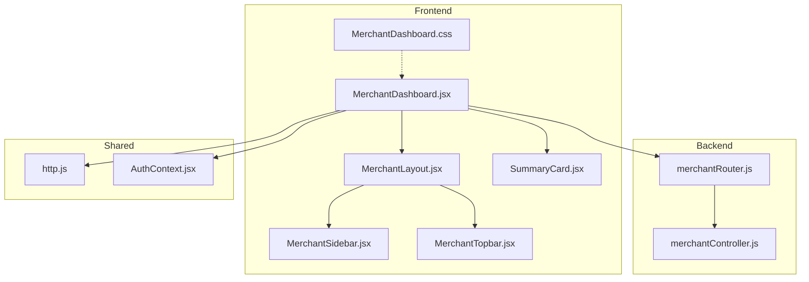
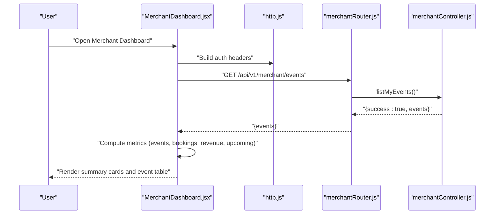
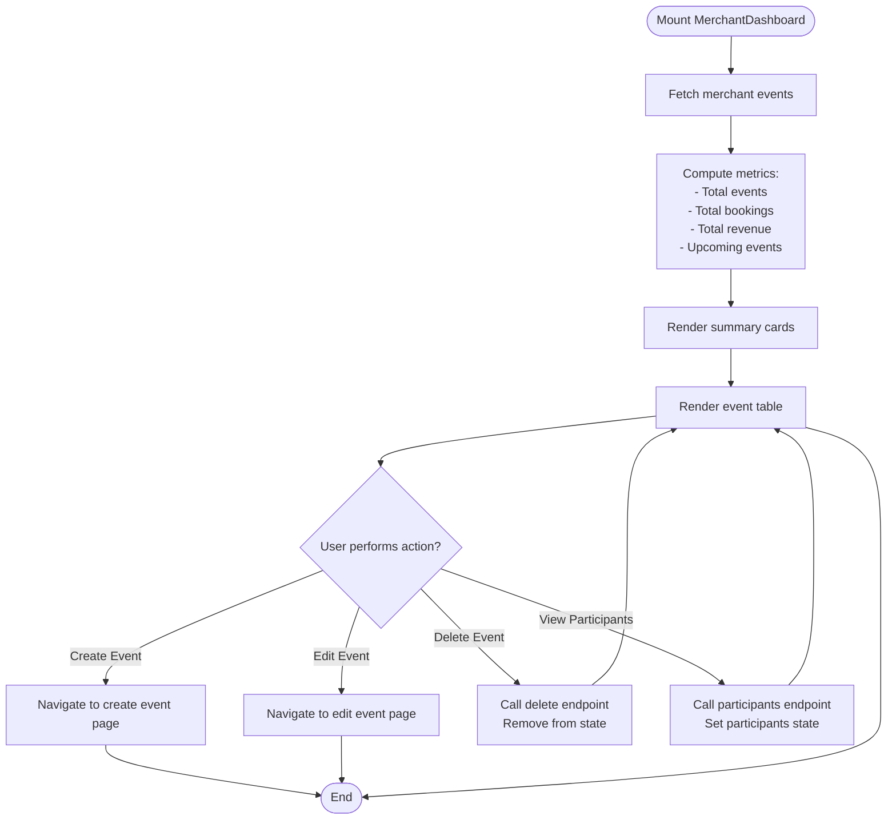
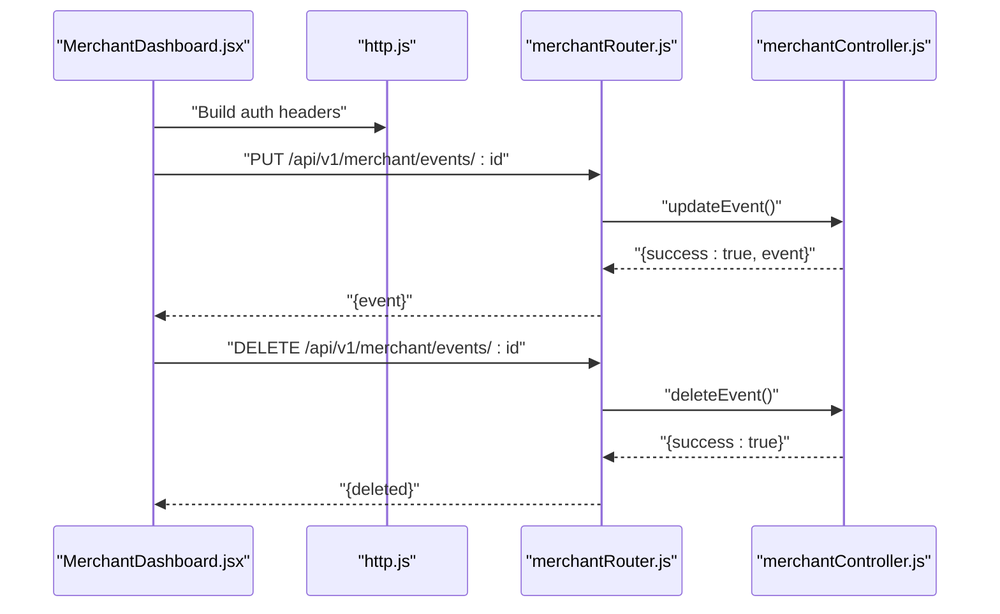
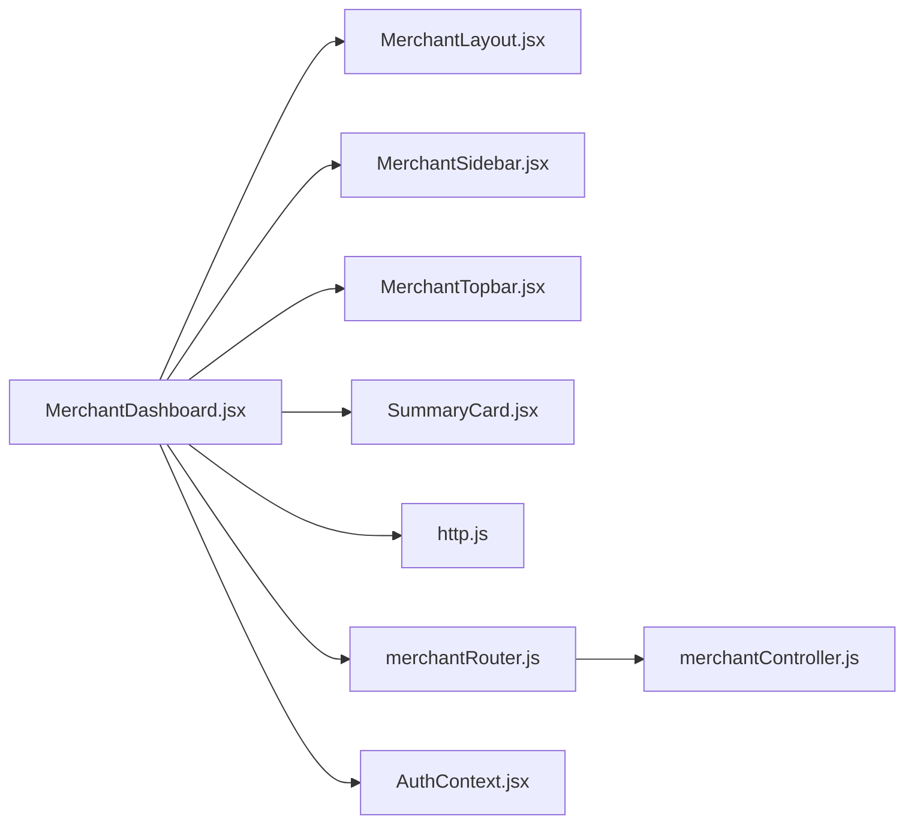

# Merchant Dashboard Overview

<cite>
**Referenced Files in This Document**
- [MerchantDashboard.jsx](file://frontend/src/pages/dashboards/MerchantDashboard.jsx)
- [MerchantLayout.jsx](file://frontend/src/components/merchant/MerchantLayout.jsx)
- [MerchantSidebar.jsx](file://frontend/src/components/merchant/MerchantSidebar.jsx)
- [MerchantTopbar.jsx](file://frontend/src/components/merchant/MerchantTopbar.jsx)
- [SummaryCard.jsx](file://frontend/src/components/admin/SummaryCard.jsx)
- [MerchantDashboard.css](file://frontend/src/pages/dashboards/MerchantDashboard.css)
- [merchantController.js](file://backend/controller/merchantController.js)
- [merchantRouter.js](file://backend/router/merchantRouter.js)
- [http.js](file://frontend/src/lib/http.js)
- [AuthContext.jsx](file://frontend/src/context/AuthContext.jsx)
</cite>

## Table of Contents
1. [Introduction](#introduction)
2. [Project Structure](#project-structure)
3. [Core Components](#core-components)
4. [Architecture Overview](#architecture-overview)
5. [Detailed Component Analysis](#detailed-component-analysis)
6. [Dependency Analysis](#dependency-analysis)
7. [Performance Considerations](#performance-considerations)
8. [Troubleshooting Guide](#troubleshooting-guide)
9. [Conclusion](#conclusion)

## Introduction
This document provides comprehensive documentation for the Merchant Dashboard Overview component. It explains the dashboard layout structure, sidebar navigation, and topbar functionality. It details the summary cards system that displays total events, bookings, revenue, and upcoming events, and documents the dashboard data visualization components, event listing table, and action buttons for event management. It also covers merchant welcome messaging, navigation patterns, responsive design considerations, examples of dashboard metrics calculation, and real-time data update strategies.

## Project Structure
The Merchant Dashboard Overview is implemented in the frontend under the dashboards pages and integrates with merchant-specific layout components. The backend provides merchant event management endpoints consumed by the dashboard.

**Diagram sources**
- [MerchantDashboard.jsx:1-133](file://frontend/src/pages/dashboards/MerchantDashboard.jsx#L1-L133)
- [MerchantLayout.jsx:1-29](file://frontend/src/components/merchant/MerchantLayout.jsx#L1-L29)
- [MerchantSidebar.jsx:1-58](file://frontend/src/components/merchant/MerchantSidebar.jsx#L1-L58)
- [MerchantTopbar.jsx:1-68](file://frontend/src/components/merchant/MerchantTopbar.jsx#L1-L68)
- [SummaryCard.jsx:1-25](file://frontend/src/components/admin/SummaryCard.jsx#L1-L25)
- [MerchantDashboard.css:1-49](file://frontend/src/pages/dashboards/MerchantDashboard.css#L1-L49)
- [merchantRouter.js:1-16](file://backend/router/merchantRouter.js#L1-L16)
- [merchantController.js:1-199](file://backend/controller/merchantController.js#L1-L199)
- [http.js:1-5](file://frontend/src/lib/http.js#L1-L5)
- [AuthContext.jsx:1-3](file://frontend/src/context/AuthContext.jsx#L1-L3)

**Section sources**
- [MerchantDashboard.jsx:1-133](file://frontend/src/pages/dashboards/MerchantDashboard.jsx#L1-L133)
- [MerchantLayout.jsx:1-29](file://frontend/src/components/merchant/MerchantLayout.jsx#L1-L29)
- [MerchantSidebar.jsx:1-58](file://frontend/src/components/merchant/MerchantSidebar.jsx#L1-L58)
- [MerchantTopbar.jsx:1-68](file://frontend/src/components/merchant/MerchantTopbar.jsx#L1-L68)
- [SummaryCard.jsx:1-25](file://frontend/src/components/admin/SummaryCard.jsx#L1-L25)
- [MerchantDashboard.css:1-49](file://frontend/src/pages/dashboards/MerchantDashboard.css#L1-L49)
- [merchantRouter.js:1-16](file://backend/router/merchantRouter.js#L1-L16)
- [merchantController.js:1-199](file://backend/controller/merchantController.js#L1-L199)
- [http.js:1-5](file://frontend/src/lib/http.js#L1-L5)
- [AuthContext.jsx:1-3](file://frontend/src/context/AuthContext.jsx#L1-L3)

## Core Components
- MerchantDashboard: Orchestrates data fetching, metrics computation, and renders summary cards and the event listing table. It handles event creation, updates, removal, and participant viewing.
- MerchantLayout: Provides the container layout with fixed sidebar and topbar, and manages logout redirection.
- MerchantSidebar: Renders merchant navigation links and a logout button.
- MerchantTopbar: Implements the top navigation bar with branding, search, notifications, and user dropdown menu.
- SummaryCard: Reusable card component for displaying metrics with icons and colors.
- MerchantDashboard.css: Applies merchant-specific styling overrides for summary cards and buttons.

Key responsibilities:
- Layout: MerchantLayout sets up the page scaffold with sidebar width and topbar placement.
- Navigation: MerchantSidebar defines merchant-centric routes and logout handling.
- Topbar: MerchantTopbar provides branding, search, notifications, and user profile/logout actions.
- Metrics: MerchantDashboard computes totals for events, bookings, revenue, and upcoming events.
- Data: MerchantDashboard fetches merchant events and participants via HTTP utilities and backend routes.

**Section sources**
- [MerchantDashboard.jsx:12-133](file://frontend/src/pages/dashboards/MerchantDashboard.jsx#L12-L133)
- [MerchantLayout.jsx:7-23](file://frontend/src/components/merchant/MerchantLayout.jsx#L7-L23)
- [MerchantSidebar.jsx:21-46](file://frontend/src/components/merchant/MerchantSidebar.jsx#L21-L46)
- [MerchantTopbar.jsx:9-61](file://frontend/src/components/merchant/MerchantTopbar.jsx#L9-L61)
- [SummaryCard.jsx:2-16](file://frontend/src/components/admin/SummaryCard.jsx#L2-L16)
- [MerchantDashboard.css:1-49](file://frontend/src/pages/dashboards/MerchantDashboard.css#L1-L49)

## Architecture Overview
The Merchant Dashboard follows a layered architecture:
- Frontend pages (React): MerchantDashboard orchestrates UI rendering and state.
- Shared utilities: HTTP helpers define API base URL and auth headers.
- Backend routes: merchantRouter.js exposes endpoints for merchant operations.
- Backend controllers: merchantController.js implements business logic for events and participants.
- Authentication context: AuthContext provides user session and logout capabilities.

**Diagram sources**
- [MerchantDashboard.jsx:19-25](file://frontend/src/pages/dashboards/MerchantDashboard.jsx#L19-L25)
- [http.js:1-5](file://frontend/src/lib/http.js#L1-L5)
- [merchantRouter.js:11](file://backend/router/merchantRouter.js#L11)
- [merchantController.js:160-169](file://backend/controller/merchantController.js#L160-L169)

## Detailed Component Analysis

### MerchantDashboard Component
Responsibilities:
- Fetch merchant events on mount.
- Compute dashboard metrics:
  - Total events: length of events array.
  - Total bookings: sum of bookingsCount or participantsCount per event.
  - Total revenue: sum of revenue per event.
  - Upcoming events: count of events with date greater than or equal to current date.
- Render summary cards using SummaryCard with appropriate icons and colors.
- Display an event listing table with columns for name, date, location, status, and action buttons (Edit, Delete).
- Provide Create Event action that navigates to the create event page.
- Support participant viewing for a selected event.
- Support event deletion and immediate UI refresh.

Metrics calculation examples:
- Total bookings aggregation uses either bookingsCount or participantsCount fallback.
- Revenue aggregation uses event revenue field.
- Upcoming events filter compares event date to current date.

Real-time update strategies:
- Event deletion removes the item from the local state immediately after successful API response.
- Event update replaces the matching event in the state with the updated payload.
- Participants list is fetched on demand when the view participants action is triggered.

**Diagram sources**
- [MerchantDashboard.jsx:19-51](file://frontend/src/pages/dashboards/MerchantDashboard.jsx#L19-L51)

**Section sources**
- [MerchantDashboard.jsx:12-133](file://frontend/src/pages/dashboards/MerchantDashboard.jsx#L12-L133)

### MerchantLayout Component
Responsibilities:
- Provide a min-height page container with a fixed sidebar width.
- Embed MerchantSidebar and MerchantTopbar.
- Manage logout by invoking AuthContext logout and redirecting to login.

Layout behavior:
- Sidebar is fixed on the left; main content area occupies remaining width.
- Topbar is sticky at the top of the main content area.

**Section sources**
- [MerchantLayout.jsx:7-23](file://frontend/src/components/merchant/MerchantLayout.jsx#L7-L23)

### MerchantSidebar Component
Responsibilities:
- Render merchant navigation items with icons and labels.
- Apply active state styling for the current route.
- Provide a logout button bound to onLogout prop.

Navigation items:
- Dashboard, My Events, Create Event, Bookings / Registrations, Payments, Profile, Settings.

**Section sources**
- [MerchantSidebar.jsx:21-46](file://frontend/src/components/merchant/MerchantSidebar.jsx#L21-L46)

### MerchantTopbar Component
Responsibilities:
- Display branding with site name.
- Provide mobile-friendly hamburger menu toggle placeholder.
- Offer search input and notification bell.
- Present user avatar with initial and dropdown menu for Profile and Logout.

Dropdown menu:
- Navigates to profile page.
- Triggers logout and redirects to login.

**Section sources**
- [MerchantTopbar.jsx:9-61](file://frontend/src/components/merchant/MerchantTopbar.jsx#L9-L61)

### SummaryCard Component
Responsibilities:
- Display metric title, value, and icon with a colored background.
- Support optional color customization.
- Render fallback value of zero when value is undefined or null.

Usage in dashboard:
- Used four times to show Total Events, Total Bookings, Total Revenue, and Upcoming Events.

**Section sources**
- [SummaryCard.jsx:2-16](file://frontend/src/components/admin/SummaryCard.jsx#L2-L16)

### MerchantDashboard.css
Responsibilities:
- Override text color to white for summary card elements.
- Ensure icon colors remain white within summary cards.
- Define merchant-specific button styles for consistent branding.

**Section sources**
- [MerchantDashboard.css:1-49](file://frontend/src/pages/dashboards/MerchantDashboard.css#L1-L49)

### Backend Integration
Endpoints used by the dashboard:
- GET /api/v1/merchant/events: List merchant’s events.
- PUT /api/v1/merchant/events/:id: Update an event.
- DELETE /api/v1/merchant/events/:id: Remove an event.
- GET /api/v1/merchant/events/:id/participants: Retrieve participants for an event.

Controller responsibilities:
- listMyEvents: Returns events owned by the authenticated merchant.
- participantsForEvent: Returns registrations for an event owned by the merchant.

**Diagram sources**
- [MerchantDashboard.jsx:33-51](file://frontend/src/pages/dashboards/MerchantDashboard.jsx#L33-L51)
- [merchantRouter.js:10-13](file://backend/router/merchantRouter.js#L10-L13)
- [merchantController.js:111-158](file://backend/controller/merchantController.js#L111-L158)

**Section sources**
- [merchantRouter.js:9-13](file://backend/router/merchantRouter.js#L9-L13)
- [merchantController.js:160-199](file://backend/controller/merchantController.js#L160-L199)

## Dependency Analysis
The Merchant Dashboard depends on:
- Layout and navigation components for structure and routing.
- HTTP utilities for API base URL and auth headers.
- Backend routes and controllers for data operations.
- Authentication context for user session and logout.

**Diagram sources**
- [MerchantDashboard.jsx:1-10](file://frontend/src/pages/dashboards/MerchantDashboard.jsx#L1-L10)
- [MerchantLayout.jsx:1-6](file://frontend/src/components/merchant/MerchantLayout.jsx#L1-L6)
- [merchantRouter.js:1-6](file://backend/router/merchantRouter.js#L1-L6)
- [AuthContext.jsx:1-3](file://frontend/src/context/AuthContext.jsx#L1-L3)

**Section sources**
- [MerchantDashboard.jsx:1-10](file://frontend/src/pages/dashboards/MerchantDashboard.jsx#L1-L10)
- [merchantRouter.js:1-6](file://backend/router/merchantRouter.js#L1-L6)
- [AuthContext.jsx:1-3](file://frontend/src/context/AuthContext.jsx#L1-L3)

## Performance Considerations
- Efficient filtering and aggregation: The dashboard computes metrics client-side using reduce and filter operations. For large datasets, consider server-side aggregation to minimize payload size and improve responsiveness.
- Memoization: Use memoized selectors or callbacks to prevent unnecessary re-renders when props do not change.
- Lazy loading: For paginated event lists, implement pagination to limit DOM nodes and improve scrolling performance.
- Icon rendering: Icons are lightweight, but avoid rendering thousands of instances unnecessarily.
- Network optimization: Batch requests where possible and leverage caching for static assets.

## Troubleshooting Guide
Common issues and resolutions:
- Authentication failures: Ensure the auth token is present and valid. Verify Authorization header construction and token refresh logic.
- Empty or stale data: Confirm that the merchant owns the events returned by the list endpoint. Check network tab for 403/404 responses indicating ownership or missing resources.
- Metrics discrepancies: Validate that bookingsCount, participantsCount, and revenue fields are populated on the backend and match the expected schema.
- Participant view errors: Ensure the event ID is correct and the user has permission to view participants for that event.
- Real-time updates: After delete/update operations, confirm that the state update logic runs and the UI reflects the latest data.

**Section sources**
- [MerchantDashboard.jsx:19-51](file://frontend/src/pages/dashboards/MerchantDashboard.jsx#L19-L51)
- [merchantController.js:160-199](file://backend/controller/merchantController.js#L160-L199)

## Conclusion
The Merchant Dashboard Overview provides a comprehensive view of merchant activity through a structured layout, summary metrics, and actionable event management. Its modular design leverages reusable components and clear backend integration, enabling maintainable enhancements. By focusing on efficient data handling, responsive UI patterns, and robust error management, the dashboard supports effective merchant operations and future scalability.