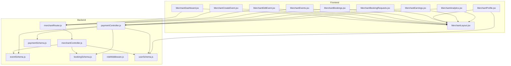
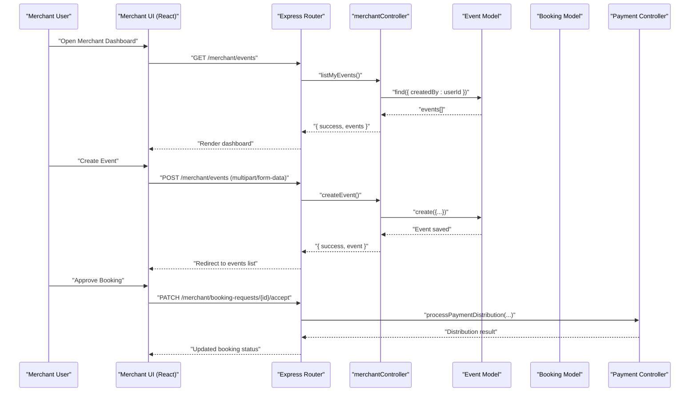
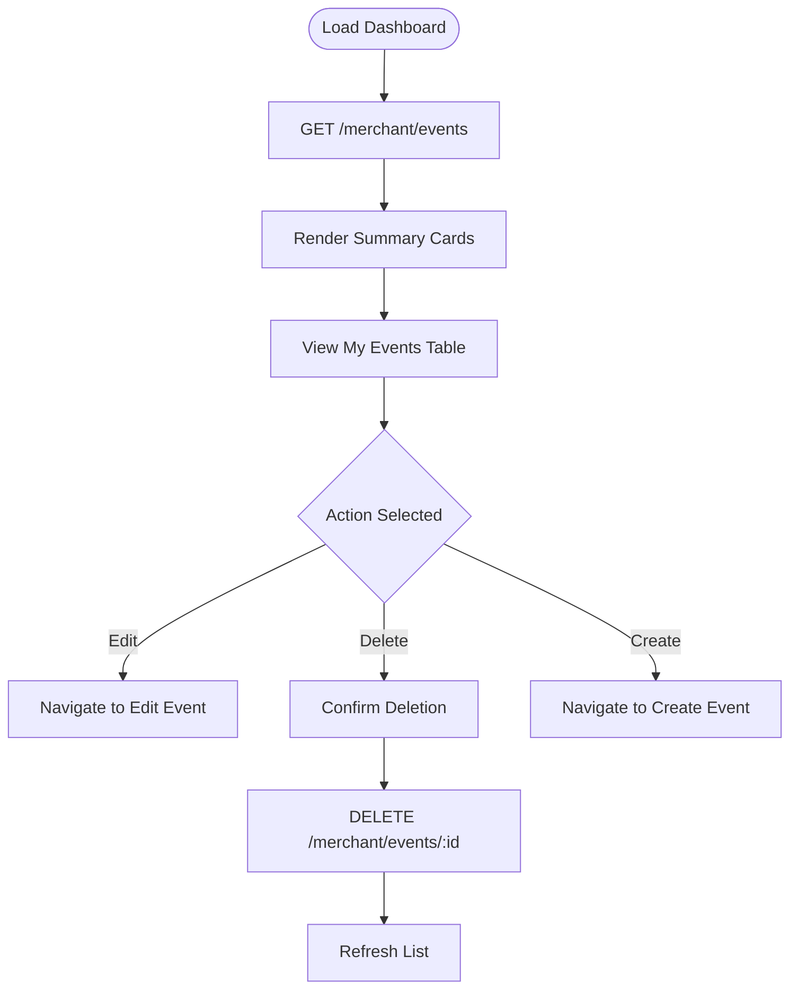
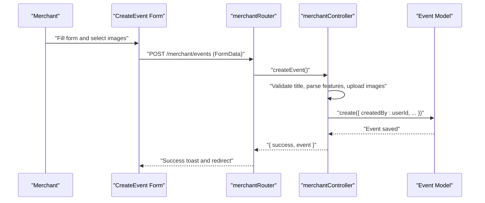
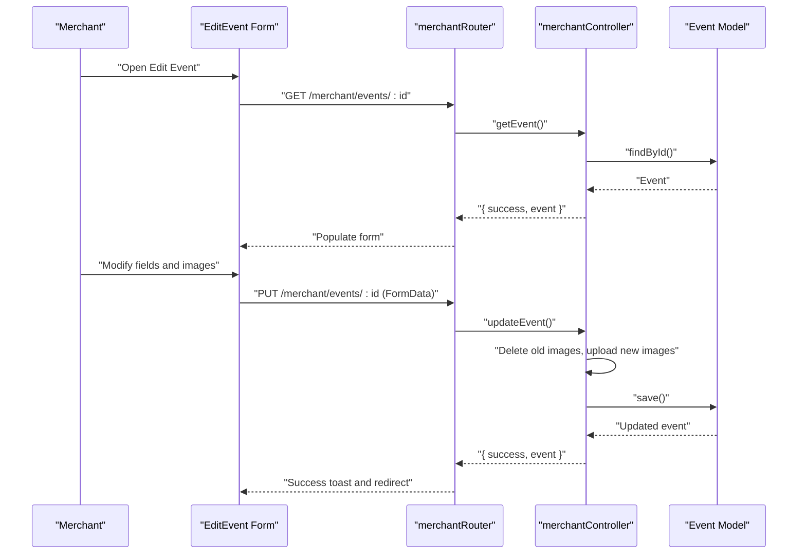
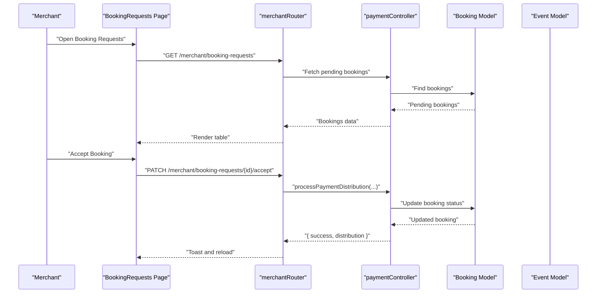
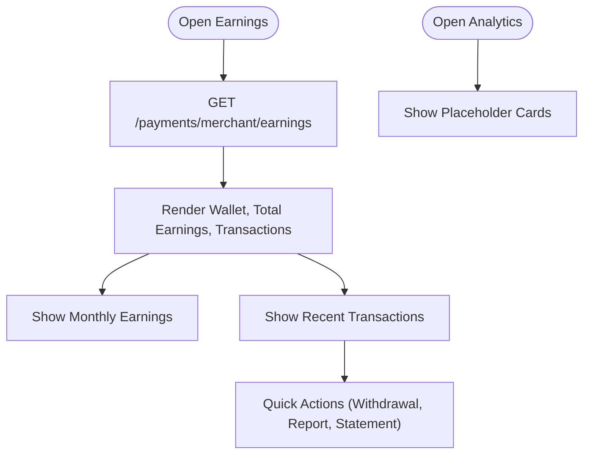
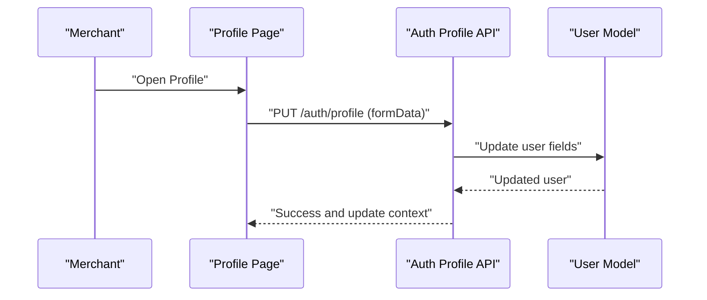
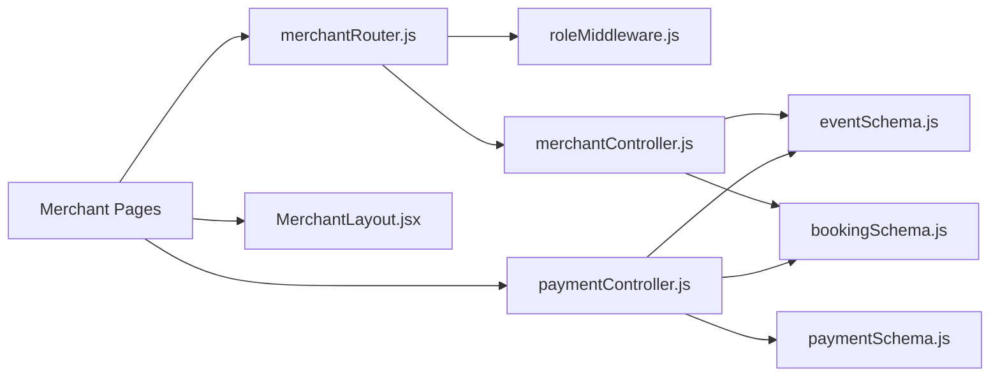

# Merchant Features

<cite>
**Referenced Files in This Document**
- [merchantController.js](file://backend/controller/merchantController.js)
- [merchantRouter.js](file://backend/router/merchantRouter.js)
- [eventSchema.js](file://backend/models/eventSchema.js)
- [bookingSchema.js](file://backend/models/bookingSchema.js)
- [MerchantDashboard.jsx](file://frontend/src/pages/dashboards/MerchantDashboard.jsx)
- [MerchantCreateEvent.jsx](file://frontend/src/pages/dashboards/MerchantCreateEvent.jsx)
- [MerchantEditEvent.jsx](file://frontend/src/pages/dashboards/MerchantEditEvent.jsx)
- [MerchantEvents.jsx](file://frontend/src/pages/dashboards/MerchantEvents.jsx)
- [MerchantBookings.jsx](file://frontend/src/pages/dashboards/MerchantBookings.jsx)
- [MerchantBookingRequests.jsx](file://frontend/src/pages/dashboards/MerchantBookingRequests.jsx)
- [MerchantProfile.jsx](file://frontend/src/pages/dashboards/MerchantProfile.jsx)
- [MerchantAnalytics.jsx](file://frontend/src/pages/dashboards/MerchantAnalytics.jsx)
- [MerchantEarnings.jsx](file://frontend/src/pages/dashboards/MerchantEarnings.jsx)
- [MerchantLayout.jsx](file://frontend/src/components/merchant/MerchantLayout.jsx)
- [roleMiddleware.js](file://backend/middleware/roleMiddleware.js)
- [userSchema.js](file://backend/models/userSchema.js)
- [paymentController.js](file://backend/controller/paymentController.js)
- [paymentSchema.js](file://backend/models/paymentSchema.js)
</cite>

## Table of Contents
1. [Introduction](#introduction)
2. [Project Structure](#project-structure)
3. [Core Components](#core-components)
4. [Architecture Overview](#architecture-overview)
5. [Detailed Component Analysis](#detailed-component-analysis)
6. [Dependency Analysis](#dependency-analysis)
7. [Performance Considerations](#performance-considerations)
8. [Troubleshooting Guide](#troubleshooting-guide)
9. [Conclusion](#conclusion)

## Introduction
This document describes the merchant feature set for the Event Management Platform. It covers the merchant dashboard, event creation and management, booking request handling, analytics and earnings tracking, and merchant profile management. It also explains merchant workflow patterns, approval systems, and merchant-user interactions, including onboarding, verification, and account management.

## Project Structure
The merchant feature spans both frontend and backend:
- Backend: Controllers, routers, middleware, and models for merchant operations and payments
- Frontend: Merchant dashboards, forms, and UI components for event and booking management

**Diagram sources**
- [merchantController.js:1-199](file://backend/controller/merchantController.js#L1-L199)
- [merchantRouter.js:1-16](file://backend/router/merchantRouter.js#L1-L16)
- [eventSchema.js:1-23](file://backend/models/eventSchema.js#L1-L23)
- [bookingSchema.js:1-53](file://backend/models/bookingSchema.js#L1-L53)
- [roleMiddleware.js:1-9](file://backend/middleware/roleMiddleware.js#L1-L9)
- [userSchema.js:1-55](file://backend/models/userSchema.js#L1-L55)
- [paymentController.js:1-577](file://backend/controller/paymentController.js#L1-L577)
- [paymentSchema.js:1-142](file://backend/models/paymentSchema.js#L1-L142)
- [MerchantDashboard.jsx:1-133](file://frontend/src/pages/dashboards/MerchantDashboard.jsx#L1-L133)
- [MerchantCreateEvent.jsx:1-362](file://frontend/src/pages/dashboards/MerchantCreateEvent.jsx#L1-L362)
- [MerchantEditEvent.jsx:1-413](file://frontend/src/pages/dashboards/MerchantEditEvent.jsx#L1-L413)
- [MerchantEvents.jsx:1-150](file://frontend/src/pages/dashboards/MerchantEvents.jsx#L1-L150)
- [MerchantBookings.jsx:1-86](file://frontend/src/pages/dashboards/MerchantBookings.jsx#L1-L86)
- [MerchantBookingRequests.jsx:1-294](file://frontend/src/pages/dashboards/MerchantBookingRequests.jsx#L1-L294)
- [MerchantProfile.jsx:1-214](file://frontend/src/pages/dashboards/MerchantProfile.jsx#L1-L214)
- [MerchantAnalytics.jsx:1-43](file://frontend/src/pages/dashboards/MerchantAnalytics.jsx#L1-L43)
- [MerchantEarnings.jsx:1-318](file://frontend/src/pages/dashboards/MerchantEarnings.jsx#L1-L318)
- [MerchantLayout.jsx:1-29](file://frontend/src/components/merchant/MerchantLayout.jsx#L1-L29)

**Section sources**
- [merchantController.js:1-199](file://backend/controller/merchantController.js#L1-L199)
- [merchantRouter.js:1-16](file://backend/router/merchantRouter.js#L1-L16)
- [MerchantDashboard.jsx:1-133](file://frontend/src/pages/dashboards/MerchantDashboard.jsx#L1-L133)
- [MerchantCreateEvent.jsx:1-362](file://frontend/src/pages/dashboards/MerchantCreateEvent.jsx#L1-L362)
- [MerchantEditEvent.jsx:1-413](file://frontend/src/pages/dashboards/MerchantEditEvent.jsx#L1-L413)
- [MerchantEvents.jsx:1-150](file://frontend/src/pages/dashboards/MerchantEvents.jsx#L1-L150)
- [MerchantBookings.jsx:1-86](file://frontend/src/pages/dashboards/MerchantBookings.jsx#L1-L86)
- [MerchantBookingRequests.jsx:1-294](file://frontend/src/pages/dashboards/MerchantBookingRequests.jsx#L1-L294)
- [MerchantProfile.jsx:1-214](file://frontend/src/pages/dashboards/MerchantProfile.jsx#L1-L214)
- [MerchantAnalytics.jsx:1-43](file://frontend/src/pages/dashboards/MerchantAnalytics.jsx#L1-L43)
- [MerchantEarnings.jsx:1-318](file://frontend/src/pages/dashboards/MerchantEarnings.jsx#L1-L318)
- [MerchantLayout.jsx:1-29](file://frontend/src/components/merchant/MerchantLayout.jsx#L1-L29)

## Core Components
- Merchant dashboard: Overview cards, event listing, and navigation
- Event management: Create, edit, list, and delete events with image uploads
- Booking request handling: Approve/reject booking requests
- Earnings and analytics: Wallet, revenue, transactions, and charts
- Merchant profile: Personal and business information updates

**Section sources**
- [MerchantDashboard.jsx:12-133](file://frontend/src/pages/dashboards/MerchantDashboard.jsx#L12-L133)
- [MerchantCreateEvent.jsx:10-362](file://frontend/src/pages/dashboards/MerchantCreateEvent.jsx#L10-L362)
- [MerchantEditEvent.jsx:10-413](file://frontend/src/pages/dashboards/MerchantEditEvent.jsx#L10-L413)
- [MerchantEvents.jsx:11-150](file://frontend/src/pages/dashboards/MerchantEvents.jsx#L11-L150)
- [MerchantBookingRequests.jsx:9-294](file://frontend/src/pages/dashboards/MerchantBookingRequests.jsx#L9-L294)
- [MerchantEarnings.jsx:18-318](file://frontend/src/pages/dashboards/MerchantEarnings.jsx#L18-L318)
- [MerchantAnalytics.jsx:5-43](file://frontend/src/pages/dashboards/MerchantAnalytics.jsx#L5-L43)
- [MerchantProfile.jsx:9-214](file://frontend/src/pages/dashboards/MerchantProfile.jsx#L9-L214)

## Architecture Overview
The merchant feature follows a layered architecture:
- Frontend dashboards and forms communicate with backend routes via authenticated HTTP requests
- Merchant routes are protected by authentication and role middleware
- Controllers orchestrate model interactions and external integrations (e.g., Cloudinary for images)
- Payment controller handles payment distribution and notifications

**Diagram sources**
- [merchantRouter.js:9-13](file://backend/router/merchantRouter.js#L9-L13)
- [merchantController.js:160-199](file://backend/controller/merchantController.js#L160-L199)
- [eventSchema.js:3-20](file://backend/models/eventSchema.js#L3-L20)
- [bookingSchema.js:3-50](file://backend/models/bookingSchema.js#L3-L50)
- [paymentController.js:11-141](file://backend/controller/paymentController.js#L11-L141)

## Detailed Component Analysis

### Merchant Dashboard
- Loads merchant’s events and calculates summary metrics (total events, bookings, revenue, upcoming)
- Provides quick actions to create and manage events
- Integrates with backend merchant routes for listing and participant counts

**Diagram sources**
- [MerchantDashboard.jsx:19-51](file://frontend/src/pages/dashboards/MerchantDashboard.jsx#L19-L51)
- [merchantRouter.js:11-13](file://backend/router/merchantRouter.js#L11-L13)

**Section sources**
- [MerchantDashboard.jsx:12-133](file://frontend/src/pages/dashboards/MerchantDashboard.jsx#L12-L133)

### Event Creation Workflow
- Form collects title, description, category, price, rating, and features
- Supports multiple image uploads with client-side validation (count and size)
- Submits FormData to backend with image files and parsed features
- Backend validates inputs, parses features, uploads images to Cloudinary, and persists event

**Diagram sources**
- [MerchantCreateEvent.jsx:91-162](file://frontend/src/pages/dashboards/MerchantCreateEvent.jsx#L91-L162)
- [merchantRouter.js:9-9](file://backend/router/merchantRouter.js#L9-L9)
- [merchantController.js:5-109](file://backend/controller/merchantController.js#L5-L109)
- [eventSchema.js:3-20](file://backend/models/eventSchema.js#L3-L20)

**Section sources**
- [MerchantCreateEvent.jsx:10-362](file://frontend/src/pages/dashboards/MerchantCreateEvent.jsx#L10-L362)
- [merchantController.js:5-109](file://backend/controller/merchantController.js#L5-L109)

### Event Editing Workflow
- Preloads event data and allows replacing or adding images while maintaining existing ones
- Validates inputs and submits updates via PUT to backend
- Backend deletes old Cloudinary images and replaces with new ones when provided

**Diagram sources**
- [MerchantEditEvent.jsx:29-180](file://frontend/src/pages/dashboards/MerchantEditEvent.jsx#L29-L180)
- [merchantRouter.js:10-10](file://backend/router/merchantRouter.js#L10-L10)
- [merchantController.js:111-158](file://backend/controller/merchantController.js#L111-L158)
- [eventSchema.js:3-20](file://backend/models/eventSchema.js#L3-L20)

**Section sources**
- [MerchantEditEvent.jsx:10-413](file://frontend/src/pages/dashboards/MerchantEditEvent.jsx#L10-L413)
- [merchantController.js:111-158](file://backend/controller/merchantController.js#L111-L158)

### Booking Request Handling
- Merchant views pending booking requests and accepts or rejects them
- Accepting triggers payment distribution and notifications
- Rejecting updates the booking status accordingly

**Diagram sources**
- [MerchantBookingRequests.jsx:31-96](file://frontend/src/pages/dashboards/MerchantBookingRequests.jsx#L31-L96)
- [paymentController.js:11-141](file://backend/controller/paymentController.js#L11-L141)
- [bookingSchema.js:3-50](file://backend/models/bookingSchema.js#L3-L50)

**Section sources**
- [MerchantBookingRequests.jsx:9-294](file://frontend/src/pages/dashboards/MerchantBookingRequests.jsx#L9-L294)
- [paymentController.js:11-141](file://backend/controller/paymentController.js#L11-L141)

### Earnings and Analytics
- Earnings page fetches merchant earnings, wallet balance, transactions, and monthly trends
- Analytics page currently shows placeholders for future metrics
- Payments controller aggregates merchant earnings and recent transactions

**Diagram sources**
- [MerchantEarnings.jsx:24-44](file://frontend/src/pages/dashboards/MerchantEarnings.jsx#L24-L44)
- [MerchantAnalytics.jsx:5-43](file://frontend/src/pages/dashboards/MerchantAnalytics.jsx#L5-L43)
- [paymentController.js:402-517](file://backend/controller/paymentController.js#L402-L517)
- [paymentSchema.js:3-142](file://backend/models/paymentSchema.js#L3-L142)

**Section sources**
- [MerchantEarnings.jsx:18-318](file://frontend/src/pages/dashboards/MerchantEarnings.jsx#L18-L318)
- [MerchantAnalytics.jsx:5-43](file://frontend/src/pages/dashboards/MerchantAnalytics.jsx#L5-L43)
- [paymentController.js:402-517](file://backend/controller/paymentController.js#L402-L517)

### Merchant Profile Management
- Merchant can view and edit personal and business information
- Updates are persisted via PUT to the authentication profile endpoint
- UI supports inline editing mode with save/cancel controls

**Diagram sources**
- [MerchantProfile.jsx:40-60](file://frontend/src/pages/dashboards/MerchantProfile.jsx#L40-L60)
- [userSchema.js:4-55](file://backend/models/userSchema.js#L4-L55)

**Section sources**
- [MerchantProfile.jsx:9-214](file://frontend/src/pages/dashboards/MerchantProfile.jsx#L9-L214)
- [userSchema.js:1-55](file://backend/models/userSchema.js#L1-L55)

### Merchant Layout and Navigation
- Shared layout component integrates sidebar and topbar for merchant dashboards
- Handles logout and navigation to merchant routes

**Section sources**
- [MerchantLayout.jsx:7-29](file://frontend/src/components/merchant/MerchantLayout.jsx#L7-L29)

## Dependency Analysis
- Merchant routes depend on authentication and role middleware to enforce merchant-only access
- Controllers depend on models for events, bookings, and payments
- Frontend dashboards depend on backend endpoints and shared layout components

**Diagram sources**
- [merchantRouter.js:1-16](file://backend/router/merchantRouter.js#L1-L16)
- [roleMiddleware.js:1-9](file://backend/middleware/roleMiddleware.js#L1-L9)
- [merchantController.js:1-199](file://backend/controller/merchantController.js#L1-L199)
- [eventSchema.js:1-23](file://backend/models/eventSchema.js#L1-L23)
- [bookingSchema.js:1-53](file://backend/models/bookingSchema.js#L1-L53)
- [paymentController.js:1-577](file://backend/controller/paymentController.js#L1-L577)
- [paymentSchema.js:1-142](file://backend/models/paymentSchema.js#L1-L142)
- [MerchantLayout.jsx:1-29](file://frontend/src/components/merchant/MerchantLayout.jsx#L1-L29)

**Section sources**
- [merchantRouter.js:1-16](file://backend/router/merchantRouter.js#L1-L16)
- [roleMiddleware.js:1-9](file://backend/middleware/roleMiddleware.js#L1-L9)
- [merchantController.js:1-199](file://backend/controller/merchantController.js#L1-L199)
- [paymentController.js:1-577](file://backend/controller/paymentController.js#L1-L577)

## Performance Considerations
- Image upload validation occurs on both client and server to reduce unnecessary uploads
- Pagination and filtering are supported in payment listings for admin use
- Use of virtual fields and indexes in payment schema improves reporting performance
- Client-side loading states and toast feedback improve perceived responsiveness

## Troubleshooting Guide
- Authentication failures: Ensure the merchant route middleware is applied and the token is included in headers
- Forbidden access: Verify the user role is merchant or admin as required
- Validation errors during event creation: Check title presence, image count limits, and feature parsing
- Payment processing errors: Confirm booking status, payment amount validity, and distribution service availability
- Image upload issues: Validate file size and count constraints and Cloudinary service health

**Section sources**
- [roleMiddleware.js:1-9](file://backend/middleware/roleMiddleware.js#L1-L9)
- [merchantController.js:32-108](file://backend/controller/merchantController.js#L32-L108)
- [paymentController.js:11-141](file://backend/controller/paymentController.js#L11-L141)
- [MerchantCreateEvent.jsx:108-113](file://frontend/src/pages/dashboards/MerchantCreateEvent.jsx#L108-L113)

## Conclusion
The merchant feature suite provides a comprehensive toolkit for merchants to manage events, handle bookings, track earnings, and maintain profiles. The architecture cleanly separates concerns between frontend dashboards and backend controllers, with robust middleware and model validations ensuring secure and reliable operations.