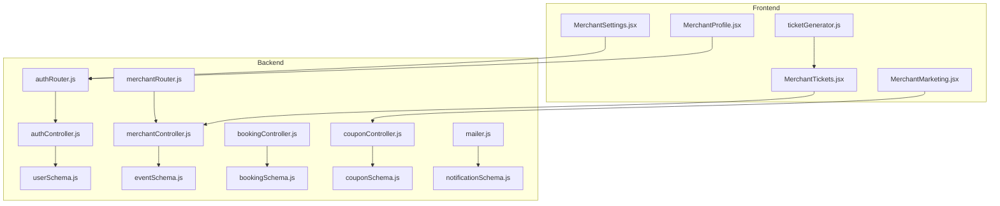
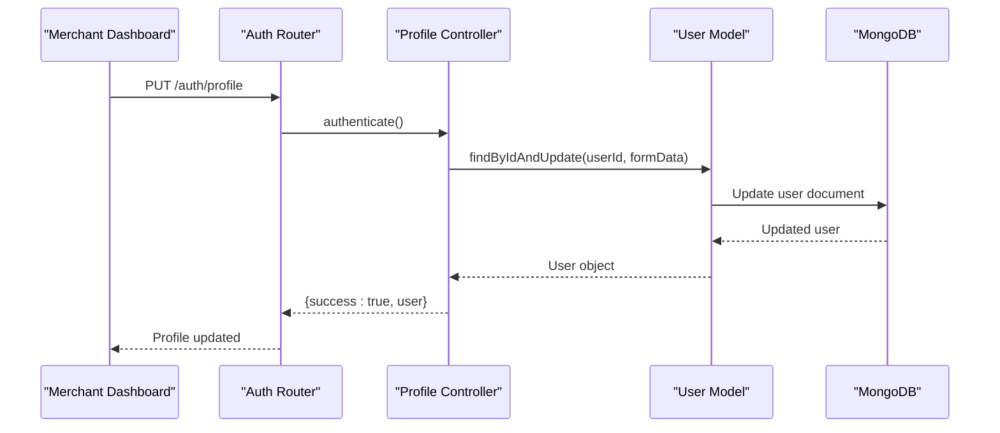
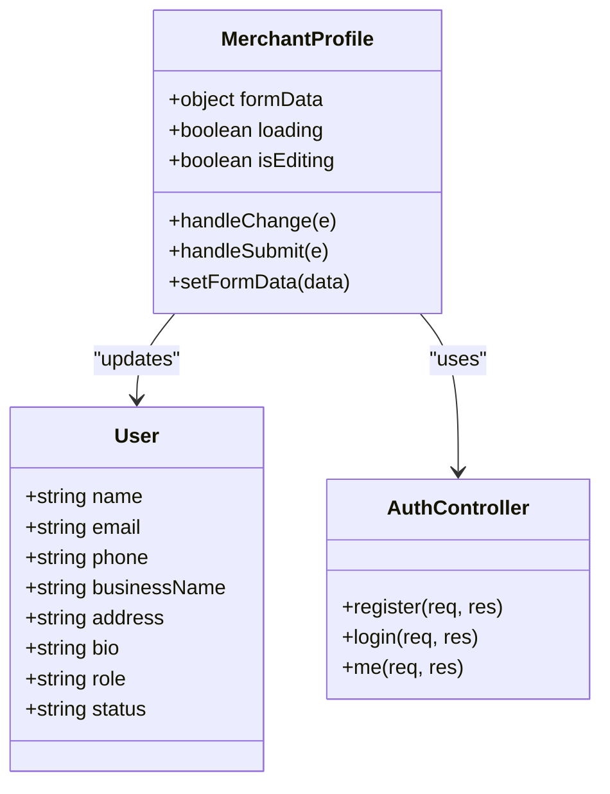
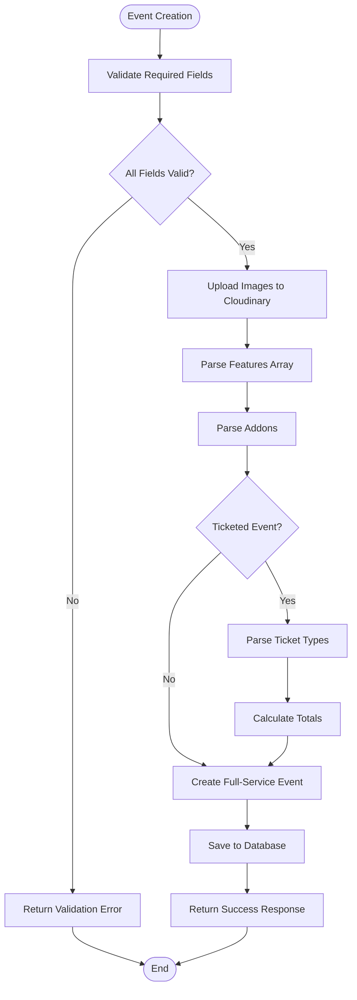
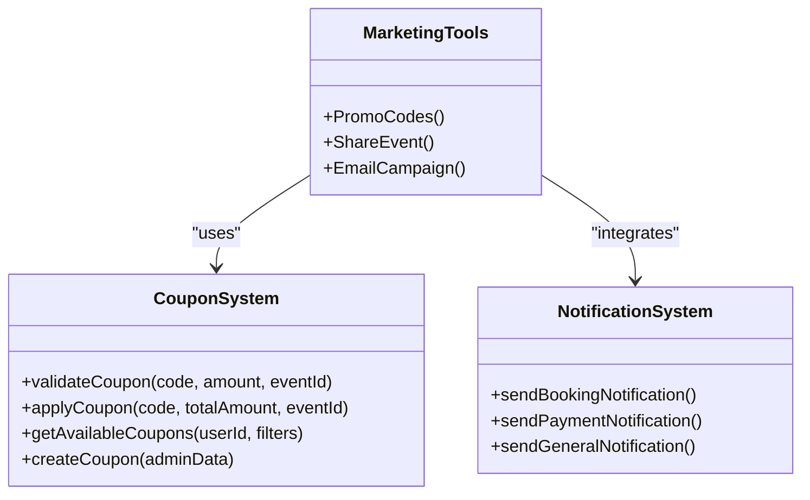
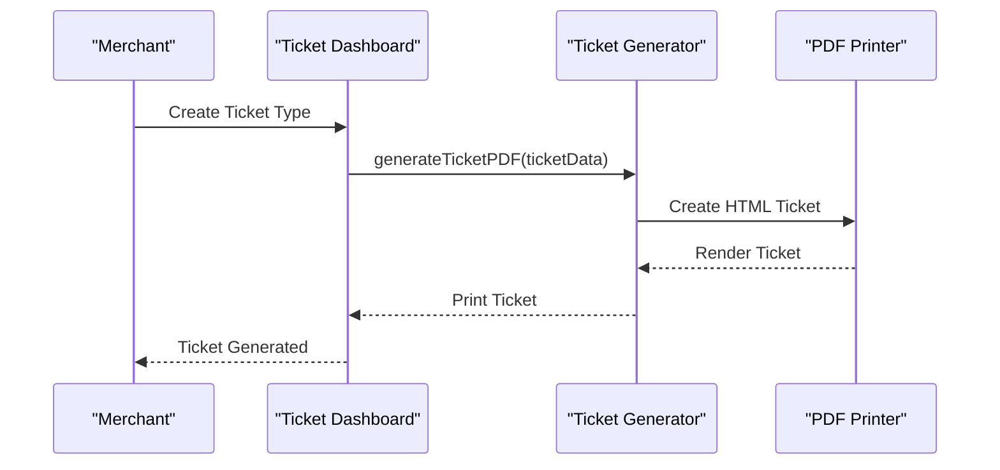
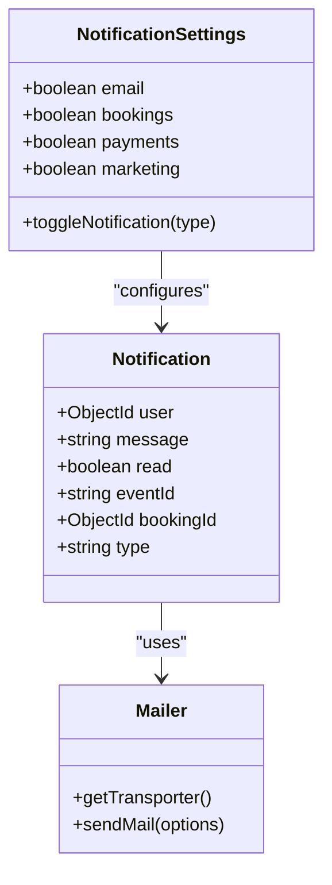
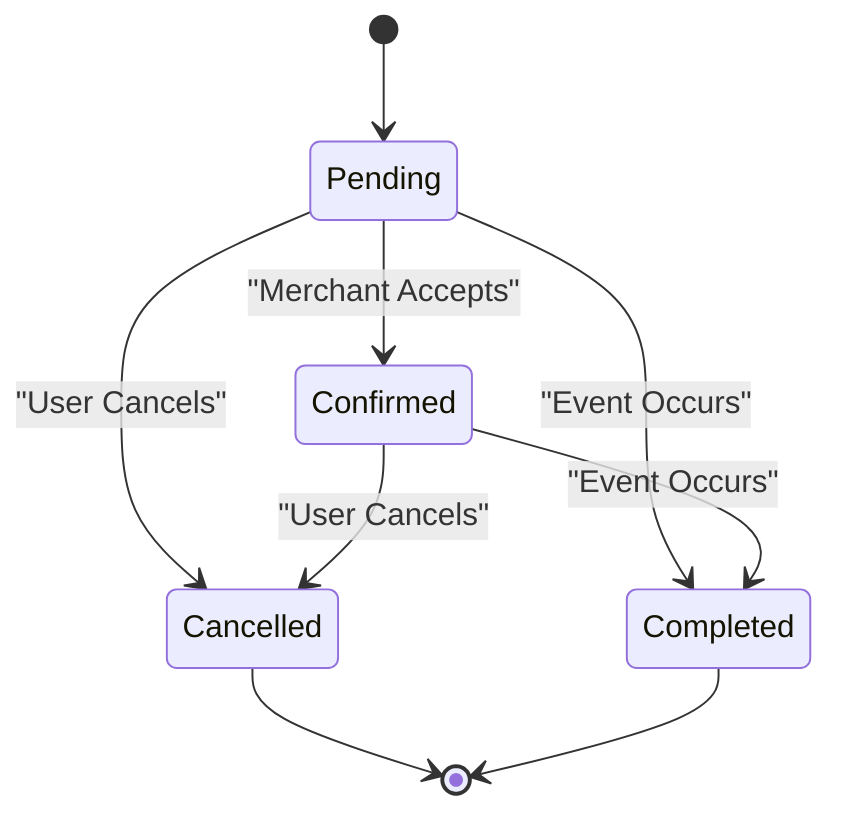
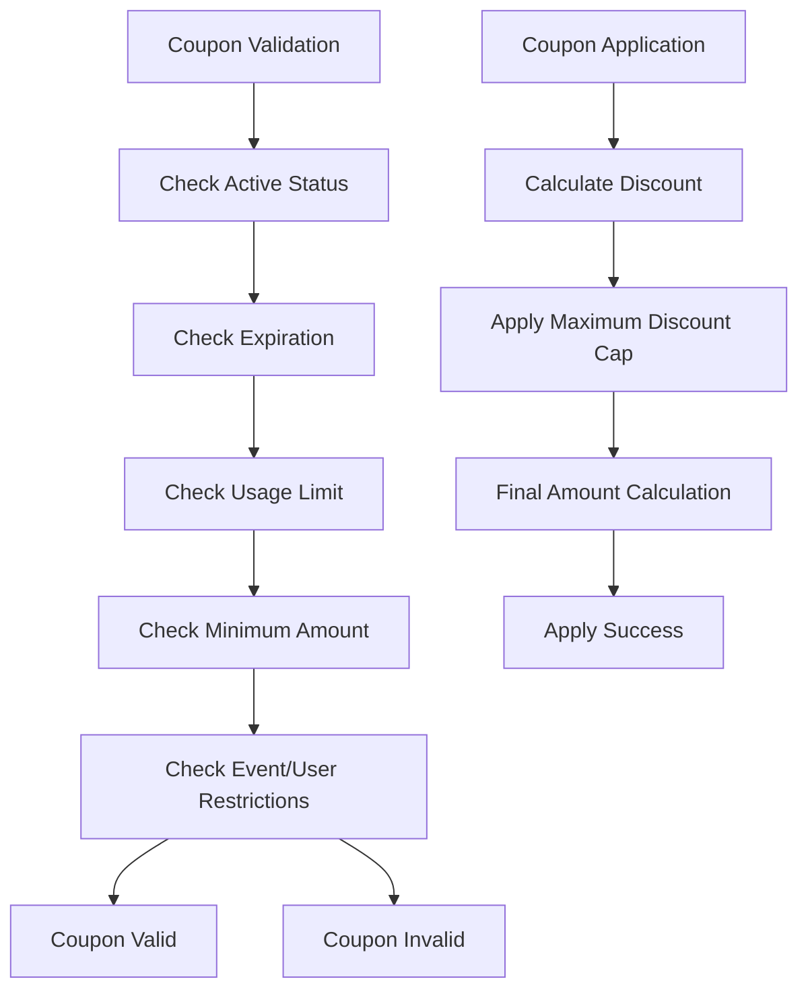
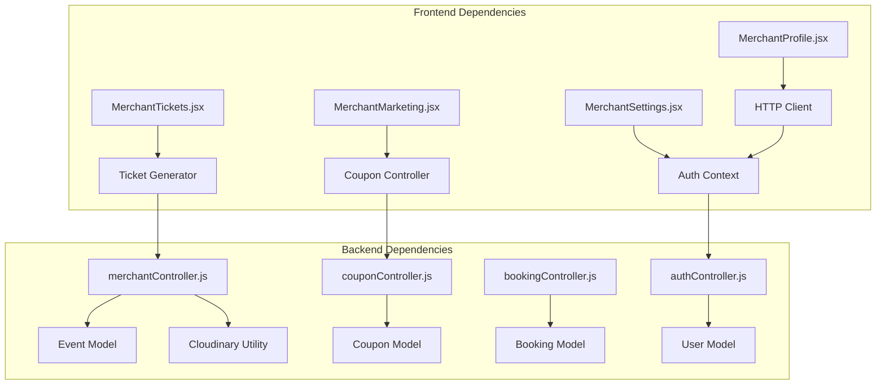

# Merchant Profile and Settings

<cite>
**Referenced Files in This Document**
- [merchantController.js](file://backend/controller/merchantController.js)
- [merchantRouter.js](file://backend/router/merchantRouter.js)
- [userSchema.js](file://backend/models/userSchema.js)
- [MerchantProfile.jsx](file://frontend/src/pages/dashboards/MerchantProfile.jsx)
- [MerchantSettings.jsx](file://frontend/src/pages/dashboards/MerchantSettings.jsx)
- [eventSchema.js](file://backend/models/eventSchema.js)
- [authController.js](file://backend/controller/authController.js)
- [notificationSchema.js](file://backend/models/notificationSchema.js)
- [authRouter.js](file://backend/router/authRouter.js)
- [MerchantMarketing.jsx](file://frontend/src/pages/dashboards/MerchantMarketing.jsx)
- [MerchantTickets.jsx](file://frontend/src/pages/dashboards/MerchantTickets.jsx)
- [mailer.js](file://backend/util/mailer.js)
- [bookingController.js](file://backend/controller/bookingController.js)
- [couponController.js](file://backend/controller/couponController.js)
- [bookingSchema.js](file://backend/models/bookingSchema.js)
- [couponSchema.js](file://backend/models/couponSchema.js)
- [ticketGenerator.js](file://frontend/src/utils/ticketGenerator.js)
</cite>

## Table of Contents
1. [Introduction](#introduction)
2. [Project Structure](#project-structure)
3. [Core Components](#core-components)
4. [Architecture Overview](#architecture-overview)
5. [Detailed Component Analysis](#detailed-component-analysis)
6. [Dependency Analysis](#dependency-analysis)
7. [Performance Considerations](#performance-considerations)
8. [Troubleshooting Guide](#troubleshooting-guide)
9. [Conclusion](#conclusion)
10. [Appendices](#appendices)

## Introduction
This document provides comprehensive documentation for merchant profile management and settings within the event management platform. It covers merchant profile editing, business information management, verification processes, marketing tools, promotional features, customer engagement options, ticket management systems, QR code generation, event promotion features, notification preferences, communication channels, account security, merchant onboarding requirements, verification workflows, and account activation processes.

## Project Structure
The system follows a MERN stack architecture with clear separation between backend controllers, routers, models, and frontend dashboards. Merchant-related functionality spans both backend APIs and frontend dashboards, enabling merchants to manage profiles, events, bookings, coupons, and marketing activities.

**Diagram sources**
- [MerchantProfile.jsx](file://frontend/src/pages/dashboards/MerchantProfile.jsx)
- [MerchantSettings.jsx](file://frontend/src/pages/dashboards/MerchantSettings.jsx)
- [MerchantMarketing.jsx](file://frontend/src/pages/dashboards/MerchantMarketing.jsx)
- [MerchantTickets.jsx](file://frontend/src/pages/dashboards/MerchantTickets.jsx)
- [ticketGenerator.js](file://frontend/src/utils/ticketGenerator.js)
- [merchantController.js](file://backend/controller/merchantController.js)
- [merchantRouter.js](file://backend/router/merchantRouter.js)
- [authController.js](file://backend/controller/authController.js)
- [authRouter.js](file://backend/router/authRouter.js)
- [userSchema.js](file://backend/models/userSchema.js)
- [eventSchema.js](file://backend/models/eventSchema.js)
- [bookingController.js](file://backend/controller/bookingController.js)
- [bookingSchema.js](file://backend/models/bookingSchema.js)
- [couponController.js](file://backend/controller/couponController.js)
- [couponSchema.js](file://backend/models/couponSchema.js)
- [notificationSchema.js](file://backend/models/notificationSchema.js)
- [mailer.js](file://backend/util/mailer.js)

**Section sources**
- [merchantController.js](file://backend/controller/merchantController.js)
- [merchantRouter.js](file://backend/router/merchantRouter.js)
- [userSchema.js](file://backend/models/userSchema.js)
- [MerchantProfile.jsx](file://frontend/src/pages/dashboards/MerchantProfile.jsx)
- [MerchantSettings.jsx](file://frontend/src/pages/dashboards/MerchantSettings.jsx)
- [eventSchema.js](file://backend/models/eventSchema.js)
- [authController.js](file://backend/controller/authController.js)
- [notificationSchema.js](file://backend/models/notificationSchema.js)
- [authRouter.js](file://backend/router/authRouter.js)
- [MerchantMarketing.jsx](file://frontend/src/pages/dashboards/MerchantMarketing.jsx)
- [MerchantTickets.jsx](file://frontend/src/pages/dashboards/MerchantTickets.jsx)
- [mailer.js](file://backend/util/mailer.js)
- [bookingController.js](file://backend/controller/bookingController.js)
- [couponController.js](file://backend/controller/couponController.js)
- [bookingSchema.js](file://backend/models/bookingSchema.js)
- [couponSchema.js](file://backend/models/couponSchema.js)
- [ticketGenerator.js](file://frontend/src/utils/ticketGenerator.js)

## Core Components
- Merchant Profile Management: Frontend dashboard for editing personal and business information, integrated with backend authentication and user model.
- Event Management: Backend controllers and routes for creating, updating, listing, retrieving, and managing event details including ticket types and images.
- Marketing Tools: Frontend dashboards for promo codes, sharing events, and email campaigns.
- Ticket Management: Frontend interface for creating and managing ticket types, with backend support for ticketed events.
- Notification System: Backend models and utilities for managing notifications and email communications.
- Coupon System: Comprehensive backend controllers and models for coupon validation, application, and administration.
- Booking Management: Backend controllers for user bookings, status updates, and cancellation workflows.

**Section sources**
- [MerchantProfile.jsx](file://frontend/src/pages/dashboards/MerchantProfile.jsx)
- [merchantController.js](file://backend/controller/merchantController.js)
- [merchantRouter.js](file://backend/router/merchantRouter.js)
- [MerchantMarketing.jsx](file://frontend/src/pages/dashboards/MerchantMarketing.jsx)
- [MerchantTickets.jsx](file://frontend/src/pages/dashboards/MerchantTickets.jsx)
- [notificationSchema.js](file://backend/models/notificationSchema.js)
- [mailer.js](file://backend/util/mailer.js)
- [couponController.js](file://backend/controller/couponController.js)
- [bookingController.js](file://backend/controller/bookingController.js)

## Architecture Overview
The merchant profile and settings system integrates frontend dashboards with backend APIs through authentication middleware and role-based access control. The architecture supports merchant-specific operations while maintaining separation of concerns between user roles.

**Diagram sources**
- [authRouter.js](file://backend/router/authRouter.js)
- [authController.js](file://backend/controller/authController.js)
- [userSchema.js](file://backend/models/userSchema.js)

**Section sources**
- [authRouter.js](file://backend/router/authRouter.js)
- [authController.js](file://backend/controller/authController.js)
- [userSchema.js](file://backend/models/userSchema.js)

## Detailed Component Analysis

### Merchant Profile Management
The merchant profile system enables comprehensive editing of personal and business information with real-time validation and secure updates.

**Diagram sources**
- [userSchema.js](file://backend/models/userSchema.js)
- [MerchantProfile.jsx](file://frontend/src/pages/dashboards/MerchantProfile.jsx)
- [authController.js](file://backend/controller/authController.js)

Key features include:
- Real-time form validation with field-specific error handling
- Secure password change workflow with current password verification
- Business information management with dedicated fields
- Responsive UI with edit/cancel functionality
- Toast notifications for user feedback

**Section sources**
- [MerchantProfile.jsx](file://frontend/src/pages/dashboards/MerchantProfile.jsx)
- [userSchema.js](file://backend/models/userSchema.js)
- [authController.js](file://backend/controller/authController.js)

### Event Management System
The event management system provides comprehensive functionality for creating, updating, and managing events with support for both full-service and ticketed events.

**Diagram sources**
- [merchantController.js](file://backend/controller/merchantController.js)
- [eventSchema.js](file://backend/models/eventSchema.js)

Event management capabilities:
- Support for both full-service and ticketed event types
- Dynamic ticket type management with pricing and availability
- Feature and addon management for enhanced event offerings
- Multi-image upload with Cloudinary integration
- Comprehensive event metadata including location, date, and duration

**Section sources**
- [merchantController.js](file://backend/controller/merchantController.js)
- [merchantRouter.js](file://backend/router/merchantRouter.js)
- [eventSchema.js](file://backend/models/eventSchema.js)

### Marketing Tools and Promotions
The marketing system provides integrated tools for promotional activities and customer engagement.

**Diagram sources**
- [MerchantMarketing.jsx](file://frontend/src/pages/dashboards/MerchantMarketing.jsx)
- [couponController.js](file://backend/controller/couponController.js)
- [notificationSchema.js](file://backend/models/notificationSchema.js)

Marketing features include:
- Promo code generation and management
- Social sharing integration for event promotion
- Email campaign capabilities
- Coupon validation and application workflows
- Notification templates for booking and payment updates

**Section sources**
- [MerchantMarketing.jsx](file://frontend/src/pages/dashboards/MerchantMarketing.jsx)
- [couponController.js](file://backend/controller/couponController.js)
- [notificationSchema.js](file://backend/models/notificationSchema.js)

### Ticket Management System
The ticket management system provides comprehensive functionality for creating and managing ticket types with QR code generation capabilities.

**Diagram sources**
- [MerchantTickets.jsx](file://frontend/src/pages/dashboards/MerchantTickets.jsx)
- [ticketGenerator.js](file://frontend/src/utils/ticketGenerator.js)

Ticket management features:
- Dynamic ticket type creation with pricing tiers
- QR code placeholder integration for digital tickets
- PDF generation for printable tickets
- Ticket count and attendee management
- Event-specific ticket configurations

**Section sources**
- [MerchantTickets.jsx](file://frontend/src/pages/dashboards/MerchantTickets.jsx)
- [ticketGenerator.js](file://frontend/src/utils/ticketGenerator.js)
- [eventSchema.js](file://backend/models/eventSchema.js)

### Notification Preferences and Communication Channels
The notification system provides comprehensive communication management with multiple channel support.

**Diagram sources**
- [notificationSchema.js](file://backend/models/notificationSchema.js)
- [mailer.js](file://backend/util/mailer.js)
- [MerchantSettings.jsx](file://frontend/src/pages/dashboards/MerchantSettings.jsx)

Communication features include:
- Multi-channel notification preferences (email, in-app)
- Booking and payment alert systems
- Marketing email subscription management
- Configurable notification types and frequencies
- Email transport configuration with fallback logging

**Section sources**
- [notificationSchema.js](file://backend/models/notificationSchema.js)
- [mailer.js](file://backend/util/mailer.js)
- [MerchantSettings.jsx](file://frontend/src/pages/dashboards/MerchantSettings.jsx)

### Booking Management Workflow
The booking management system handles comprehensive booking lifecycle management with status tracking and user interactions.

**Diagram sources**
- [bookingController.js](file://backend/controller/bookingController.js)
- [bookingSchema.js](file://backend/models/bookingSchema.js)

Booking management capabilities:
- User booking creation with validation
- Status tracking (pending, confirmed, cancelled, completed)
- Booking cancellation with validation rules
- Merchant access to booking requests
- Comprehensive booking history and reporting

**Section sources**
- [bookingController.js](file://backend/controller/bookingController.js)
- [bookingSchema.js](file://backend/models/bookingSchema.js)

### Coupon System Implementation
The coupon system provides advanced promotional functionality with comprehensive validation and usage tracking.

**Diagram sources**
- [couponController.js](file://backend/controller/couponController.js)
- [couponSchema.js](file://backend/models/couponSchema.js)

Coupon system features:
- Advanced validation with multiple restriction types
- Support for percentage and flat discount types
- Usage tracking and history logging
- Event-specific and user-restricted coupons
- Comprehensive administrative controls

**Section sources**
- [couponController.js](file://backend/controller/couponController.js)
- [couponSchema.js](file://backend/models/couponSchema.js)

## Dependency Analysis
The merchant profile and settings system exhibits strong modularity with clear separation of concerns and well-defined interfaces between frontend and backend components.

**Diagram sources**
- [MerchantProfile.jsx](file://frontend/src/pages/dashboards/MerchantProfile.jsx)
- [MerchantSettings.jsx](file://frontend/src/pages/dashboards/MerchantSettings.jsx)
- [MerchantMarketing.jsx](file://frontend/src/pages/dashboards/MerchantMarketing.jsx)
- [MerchantTickets.jsx](file://frontend/src/pages/dashboards/MerchantTickets.jsx)
- [merchantController.js](file://backend/controller/merchantController.js)
- [couponController.js](file://backend/controller/couponController.js)
- [bookingController.js](file://backend/controller/bookingController.js)
- [authController.js](file://backend/controller/authController.js)

Key dependency characteristics:
- Frontend components maintain loose coupling through HTTP client abstraction
- Backend controllers encapsulate business logic with clear model boundaries
- Authentication middleware ensures consistent access control across endpoints
- Utility modules provide reusable functionality across different controllers

**Section sources**
- [merchantController.js](file://backend/controller/merchantController.js)
- [couponController.js](file://backend/controller/couponController.js)
- [bookingController.js](file://backend/controller/bookingController.js)
- [authController.js](file://backend/controller/authController.js)

## Performance Considerations
The system implements several performance optimization strategies:

- **Database Indexing**: Coupons utilize composite indexes for efficient querying by active status and expiration dates
- **Image Optimization**: Cloudinary integration provides scalable image storage and delivery
- **Pagination Support**: Coupon retrieval supports pagination for large datasets
- **Validation Middleware**: Input validation prevents unnecessary database operations
- **Selective Field Loading**: User queries exclude password fields by default

## Troubleshooting Guide
Common issues and resolution strategies:

**Authentication Issues**
- Verify JWT token validity and expiration
- Check role-based access permissions
- Validate user credentials against hashed passwords

**Event Management Problems**
- Ensure proper file upload handling for images
- Validate ticket type configurations
- Check MongoDB connection for data persistence

**Notification Delivery Failures**
- Verify SMTP configuration settings
- Check email transport initialization
- Monitor fallback logging for development environments

**Coupon Validation Errors**
- Confirm coupon code uniqueness and formatting
- Verify expiration date and usage limits
- Check applicable events and user restrictions

**Section sources**
- [authController.js](file://backend/controller/authController.js)
- [merchantController.js](file://backend/controller/merchantController.js)
- [mailer.js](file://backend/util/mailer.js)
- [couponController.js](file://backend/controller/couponController.js)

## Conclusion
The merchant profile and settings system provides a comprehensive solution for merchant operations within the event management platform. The architecture demonstrates strong separation of concerns, robust security measures, and extensive functionality for business management. Key strengths include modular design, comprehensive validation, flexible notification systems, and scalable coupon management. The system successfully balances user experience with technical robustness, providing merchants with powerful tools for profile management, event promotion, and operational efficiency.

## Appendices

### API Endpoint Reference
- Profile Management: `PUT /auth/profile` - Updates merchant profile information
- Password Management: `PUT /auth/change-password` - Changes account password
- Event Operations: `POST/PUT /merchant/events` - Creates and updates events
- Booking Management: `GET/PUT /bookings` - Manages booking lifecycle
- Coupon Operations: `POST/PUT /coupons` - Handles coupon validation and application

### Security Considerations
- JWT-based authentication with role-based access control
- Password hashing with bcrypt encryption
- Input validation and sanitization
- File upload security with Cloudinary integration
- Email transport security with configurable SMTP settings