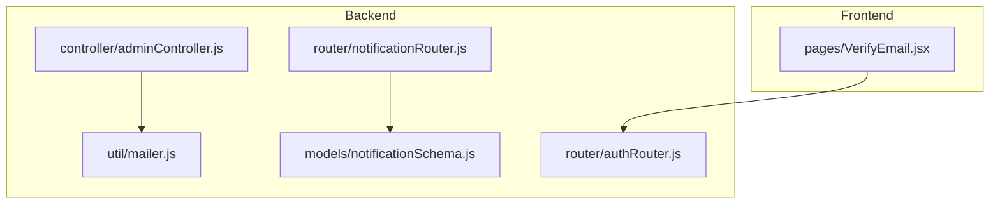
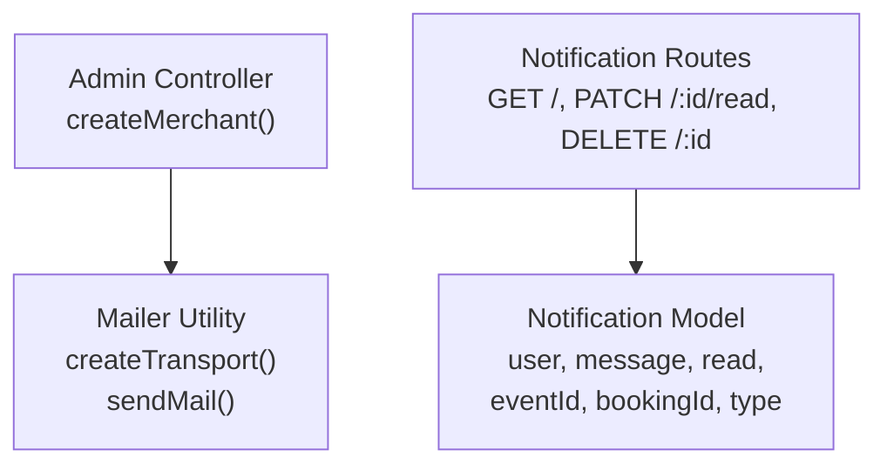
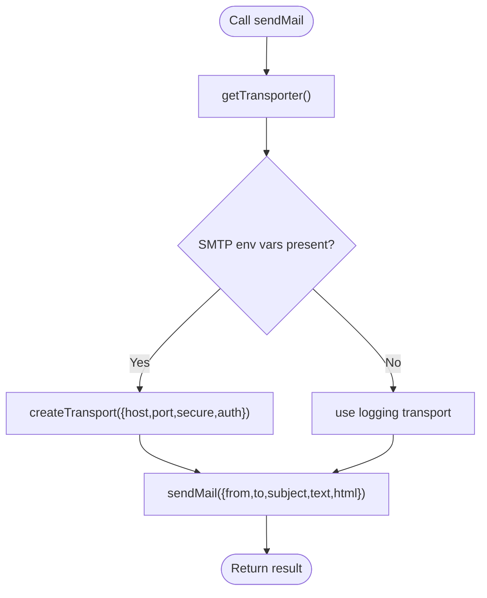
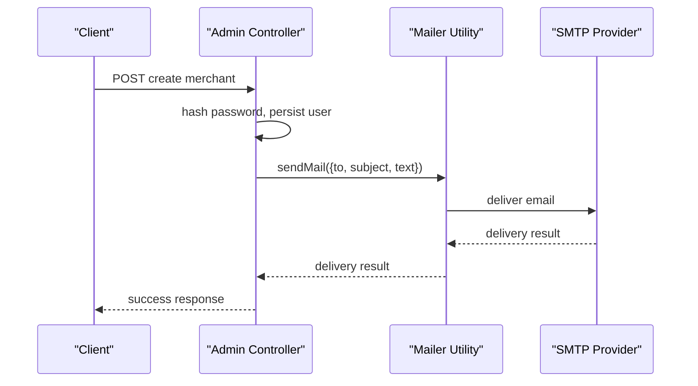
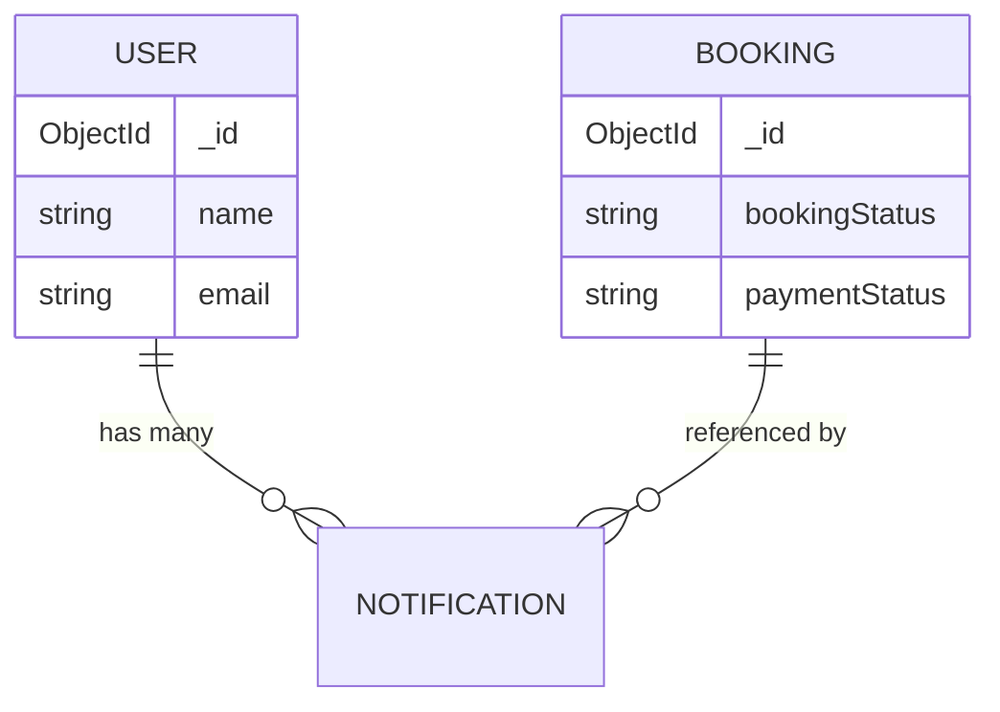
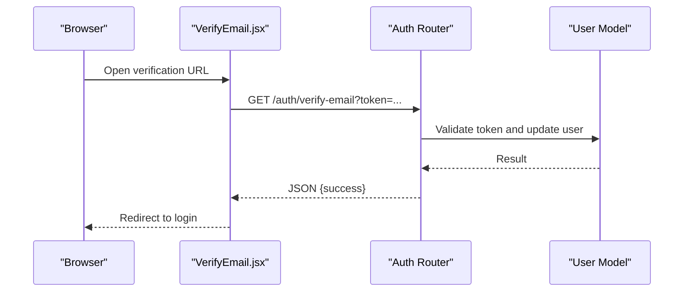
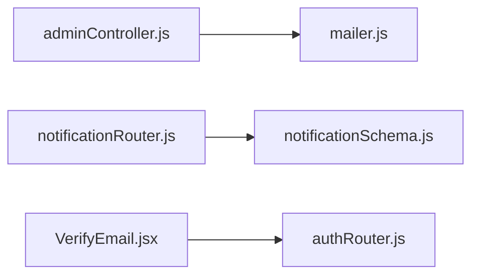

# Email Notifications

<cite>
**Referenced Files in This Document**
- [mailer.js](file://backend/util/mailer.js)
- [adminController.js](file://backend/controller/adminController.js)
- [notificationSchema.js](file://backend/models/notificationSchema.js)
- [notificationRouter.js](file://backend/router/notificationRouter.js)
- [authRouter.js](file://backend/router/authRouter.js)
- [VerifyEmail.jsx](file://frontend/src/pages/VerifyEmail.jsx)
</cite>

## Table of Contents
1. [Introduction](#introduction)
2. [Project Structure](#project-structure)
3. [Core Components](#core-components)
4. [Architecture Overview](#architecture-overview)
5. [Detailed Component Analysis](#detailed-component-analysis)
6. [Dependency Analysis](#dependency-analysis)
7. [Performance Considerations](#performance-considerations)
8. [Troubleshooting Guide](#troubleshooting-guide)
9. [Conclusion](#conclusion)

## Introduction
This document explains the email notification system in the MERN stack event project. It covers the Nodemailer configuration, SMTP settings, fallback logging mode, email sending interface, and how emails are triggered within the backend. It also documents the notification model and routes, and clarifies the current state of email verification and booking confirmation flows. Where applicable, it provides diagrams and guidance for extending the system with templates and HTML formatting.

## Project Structure
The email system spans a small set of backend modules:
- A reusable mail utility that encapsulates Nodemailer transport creation and a unified send function
- Controllers that orchestrate email triggers for administrative tasks
- A notification model and route module for storing and retrieving user notifications
- Frontend page for email verification flow

**Diagram sources**
- [mailer.js](file://backend/util/mailer.js)
- [adminController.js](file://backend/controller/adminController.js)
- [notificationSchema.js](file://backend/models/notificationSchema.js)
- [notificationRouter.js](file://backend/router/notificationRouter.js)
- [authRouter.js](file://backend/router/authRouter.js)
- [VerifyEmail.jsx](file://frontend/src/pages/VerifyEmail.jsx)

**Section sources**
- [mailer.js](file://backend/util/mailer.js)
- [adminController.js](file://backend/controller/adminController.js)
- [notificationSchema.js](file://backend/models/notificationSchema.js)
- [notificationRouter.js](file://backend/router/notificationRouter.js)
- [authRouter.js](file://backend/router/authRouter.js)
- [VerifyEmail.jsx](file://frontend/src/pages/VerifyEmail.jsx)

## Core Components
- Mail utility
  - Creates a Nodemailer transport using environment variables for SMTP configuration
  - Falls back to a logging transport when SMTP is not configured
  - Exposes a single sendMail function with a unified interface
- Administrative email trigger
  - Sends merchant credentials via the mail utility after creating a merchant account
- Notification model and routes
  - Stores user-specific notifications with optional booking and event linkage
  - Provides endpoints to list, mark as read, and delete notifications

Key implementation references:
- Transport creation and fallback: [mailer.js](file://backend/util/mailer.js)
- Unified sendMail interface: [mailer.js](file://backend/util/mailer.js)
- Merchant credentials email trigger: [adminController.js](file://backend/controller/adminController.js)
- Notification schema: [notificationSchema.js](file://backend/models/notificationSchema.js)
- Notification routes: [notificationRouter.js](file://backend/router/notificationRouter.js)

**Section sources**
- [mailer.js](file://backend/util/mailer.js)
- [adminController.js](file://backend/controller/adminController.js)
- [notificationSchema.js](file://backend/models/notificationSchema.js)
- [notificationRouter.js](file://backend/router/notificationRouter.js)

## Architecture Overview
The email architecture centers on a single mail utility that abstracts transport creation and delivery. Controllers call this utility to send transactional messages. Notifications are stored in MongoDB and surfaced via dedicated routes.

**Diagram sources**
- [mailer.js](file://backend/util/mailer.js)
- [adminController.js](file://backend/controller/adminController.js)
- [notificationRouter.js](file://backend/router/notificationRouter.js)
- [notificationSchema.js](file://backend/models/notificationSchema.js)

## Detailed Component Analysis

### Mail Utility (Nodemailer)
Responsibilities:
- Initialize a persistent transport instance using environment variables
- Support two modes:
  - SMTP transport when required environment variables are present
  - Logging transport that prints email content to the console when SMTP is missing
- Provide a single sendMail method with consistent parameters

Environment variables:
- SMTP_HOST, SMTP_PORT, SMTP_USER, SMTP_PASS, SMTP_EMAIL, SMTP_PASSWORD
- MAIL_FROM (sender address fallback)

Behavior highlights:
- Transport reuse via a cached singleton
- Automatic secure flag when port equals 465
- Unified from address resolution using MAIL_FROM or a default

**Diagram sources**
- [mailer.js](file://backend/util/mailer.js)

**Section sources**
- [mailer.js](file://backend/util/mailer.js)

### Administrative Email Trigger (Merchant Credentials)
What it does:
- On merchant creation, generates a temporary password and hashes it
- Composes a plaintext message containing login credentials and a login URL
- Sends the message via the mail utility

Trigger conditions:
- Successful merchant creation endpoint execution

Recipient handling:
- Uses the merchant’s email address

**Diagram sources**
- [adminController.js](file://backend/controller/adminController.js)
- [mailer.js](file://backend/util/mailer.js)

**Section sources**
- [adminController.js](file://backend/controller/adminController.js)
- [mailer.js](file://backend/util/mailer.js)

### Notification Model and Routes
Purpose:
- Persist user-specific notifications with optional associations to events and bookings
- Allow clients to list, mark as read, and delete notifications

Data model highlights:
- Fields: user (ref), message, read, eventId, bookingId (ref), type, timestamps
- Type enum supports categorization (booking, payment, general)

Routes:
- GET /api/v1/notifications: list latest notifications for the authenticated user
- PATCH /api/v1/notifications/:id/read: mark a notification as read
- DELETE /api/v1/notifications/:id: delete a notification

**Diagram sources**
- [notificationSchema.js](file://backend/models/notificationSchema.js)

**Section sources**
- [notificationSchema.js](file://backend/models/notificationSchema.js)
- [notificationRouter.js](file://backend/router/notificationRouter.js)

### Email Verification Flow (Frontend)
The frontend verifies email via a URL parameter and navigates to the login page upon success. The backend route for verification is referenced by the frontend page.

**Diagram sources**
- [VerifyEmail.jsx](file://frontend/src/pages/VerifyEmail.jsx)
- [authRouter.js](file://backend/router/authRouter.js)

**Section sources**
- [VerifyEmail.jsx](file://frontend/src/pages/VerifyEmail.jsx)
- [authRouter.js](file://backend/router/authRouter.js)

## Dependency Analysis
- The admin controller depends on the mail utility for sending merchant credentials
- Notification routes depend on the notification model for persistence
- The frontend verification page depends on the auth router for verification

**Diagram sources**
- [adminController.js](file://backend/controller/adminController.js)
- [mailer.js](file://backend/util/mailer.js)
- [notificationRouter.js](file://backend/router/notificationRouter.js)
- [notificationSchema.js](file://backend/models/notificationSchema.js)
- [VerifyEmail.jsx](file://frontend/src/pages/VerifyEmail.jsx)
- [authRouter.js](file://backend/router/authRouter.js)

**Section sources**
- [adminController.js](file://backend/controller/adminController.js)
- [mailer.js](file://backend/util/mailer.js)
- [notificationRouter.js](file://backend/router/notificationRouter.js)
- [notificationSchema.js](file://backend/models/notificationSchema.js)
- [VerifyEmail.jsx](file://frontend/src/pages/VerifyEmail.jsx)
- [authRouter.js](file://backend/router/authRouter.js)

## Performance Considerations
- Transport caching: The mail utility caches the transport instance to avoid repeated connection setup
- Environment-driven configuration: SMTP settings are loaded once per process lifecycle
- Logging fallback: In development or misconfiguration, emails are logged instead of sent, preventing blocking while preserving logs

[No sources needed since this section provides general guidance]

## Troubleshooting Guide
Common issues and resolutions:
- Missing SMTP environment variables
  - Symptom: Emails are not delivered
  - Behavior: The mail utility falls back to logging transport and prints email content to the console
  - Action: Set SMTP_HOST, SMTP_PORT, SMTP_USER, SMTP_PASS, and optionally MAIL_FROM
- Incorrect port configuration
  - Symptom: TLS handshake errors
  - Behavior: The transport sets secure automatically when port equals 465
  - Action: Ensure SMTP_PORT matches the provider’s requirements (e.g., 465 for SSL, 587 for STARTTLS)
- Delivery failures
  - Symptom: No visible errors in logs
  - Behavior: The mail utility returns a result; in logging mode, the messageId is a placeholder
  - Action: Enable real SMTP and monitor provider delivery status
- Notification retrieval
  - Symptom: Cannot list or manage notifications
  - Action: Confirm authentication middleware is applied and user ID matches the notification owner

**Section sources**
- [mailer.js](file://backend/util/mailer.js)
- [notificationRouter.js](file://backend/router/notificationRouter.js)

## Conclusion
The project implements a minimal but robust email infrastructure:
- A reusable mail utility with SMTP support and a safe logging fallback
- One explicit email trigger for merchant credential delivery
- A notification model and routes for user-centric messaging
- A frontend verification flow that integrates with backend auth routes

To extend the system:
- Add HTML templates and dynamic content injection by modifying the mail utility to accept HTML payloads and composing structured templates
- Introduce email categories and standardized templates for verification, resets, and booking confirmations
- Centralize template composition and rendering to keep controllers clean and maintainable

[No sources needed since this section summarizes without analyzing specific files]