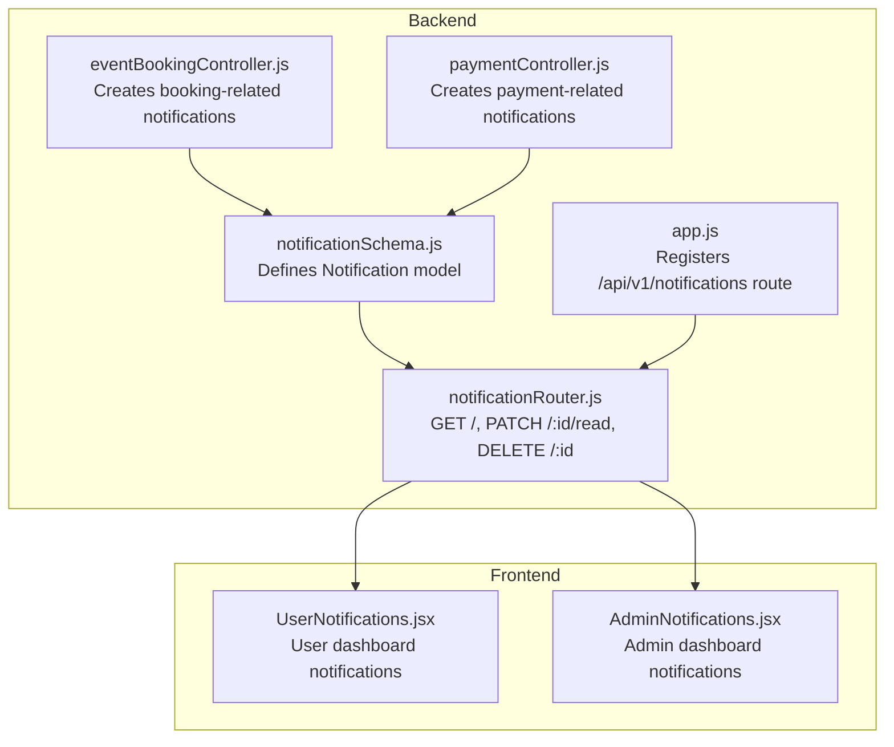
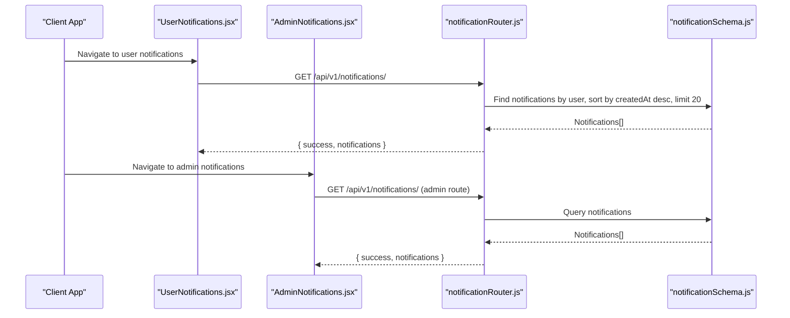
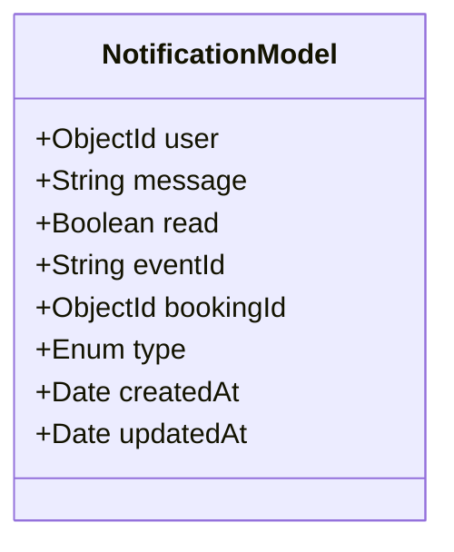
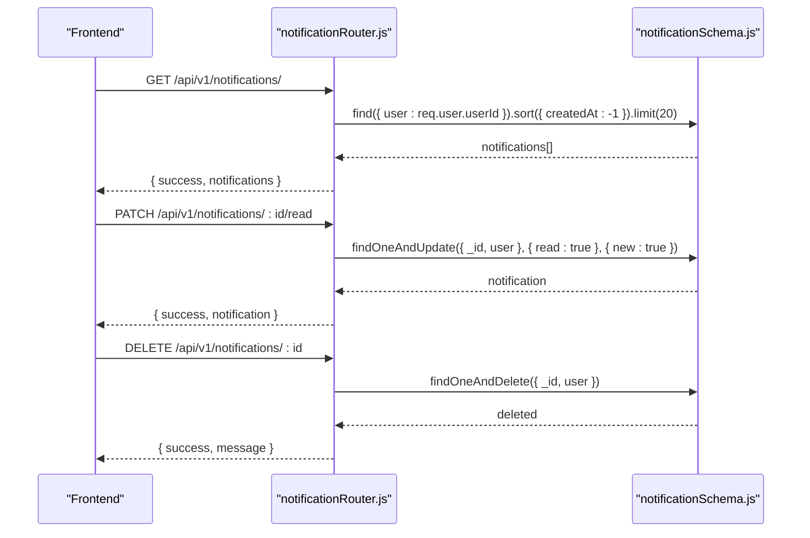
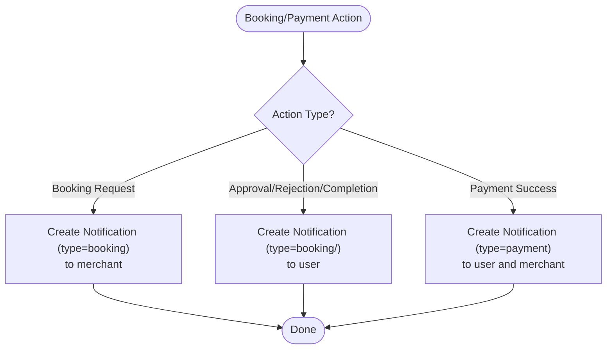
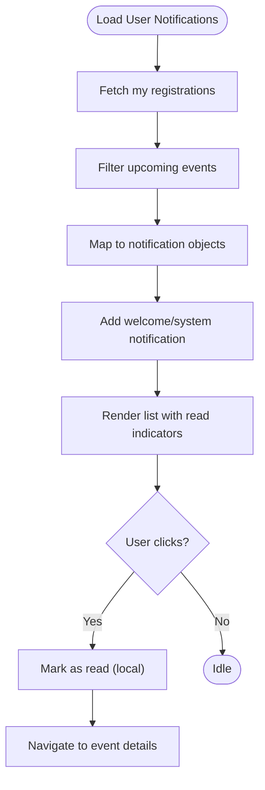
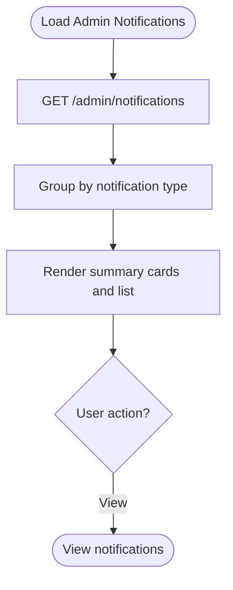
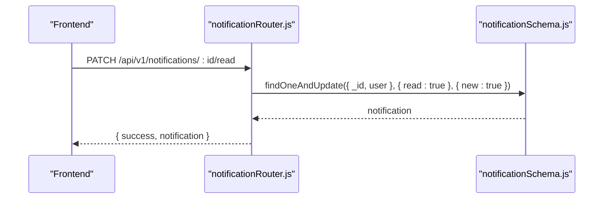
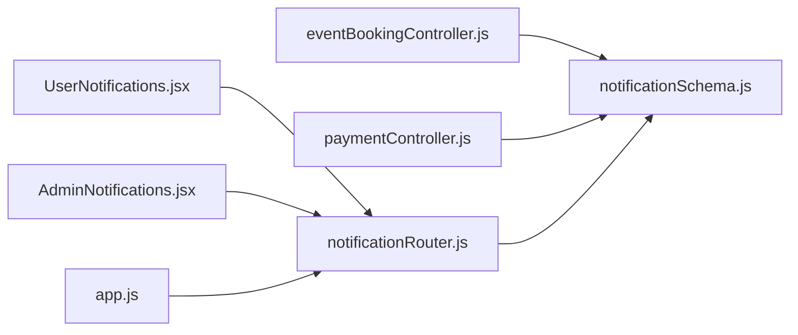

# In-App Notifications

<cite>
**Referenced Files in This Document**
- [notificationSchema.js](file://backend/models/notificationSchema.js)
- [notificationRouter.js](file://backend/router/notificationRouter.js)
- [eventBookingController.js](file://backend/controller/eventBookingController.js)
- [paymentController.js](file://backend/controller/paymentController.js)
- [AdminNotifications.jsx](file://frontend/src/pages/dashboards/AdminNotifications.jsx)
- [UserNotifications.jsx](file://frontend/src/pages/dashboards/UserNotifications.jsx)
- [app.js](file://backend/app.js)
</cite>

## Table of Contents
1. [Introduction](#introduction)
2. [Project Structure](#project-structure)
3. [Core Components](#core-components)
4. [Architecture Overview](#architecture-overview)
5. [Detailed Component Analysis](#detailed-component-analysis)
6. [Dependency Analysis](#dependency-analysis)
7. [Performance Considerations](#performance-considerations)
8. [Troubleshooting Guide](#troubleshooting-guide)
9. [Conclusion](#conclusion)

## Introduction
This document describes the in-app notification system for the Event Management System. It covers the notification schema design, supported notification types, state management, backend creation and retrieval endpoints, and frontend components for both users and administrators. It also documents notification filtering, sorting, pagination, marking as read/unread, notification history, and real-time update strategies. Admin activity tables and notification management interfaces are included to provide a complete operational view.

## Project Structure
The notification system spans backend models and controllers, REST endpoints, and frontend dashboards:
- Backend model defines the notification document structure.
- Controllers create notifications in response to booking and payment lifecycle events.
- REST endpoints expose CRUD-like operations for user notifications.
- Frontend dashboards render notifications for users and administrators.

**Diagram sources**
- [notificationSchema.js:1-36](file://backend/models/notificationSchema.js#L1-L36)
- [notificationRouter.js:1-45](file://backend/router/notificationRouter.js#L1-L45)
- [eventBookingController.js:286-310](file://backend/controller/eventBookingController.js#L286-L310)
- [paymentController.js:89-113](file://backend/controller/paymentController.js#L89-L113)
- [app.js:13-44](file://backend/app.js#L13-L44)
- [UserNotifications.jsx:1-155](file://frontend/src/pages/dashboards/UserNotifications.jsx#L1-L155)
- [AdminNotifications.jsx:1-217](file://frontend/src/pages/dashboards/AdminNotifications.jsx#L1-L217)

**Section sources**
- [notificationSchema.js:1-36](file://backend/models/notificationSchema.js#L1-L36)
- [notificationRouter.js:1-45](file://backend/router/notificationRouter.js#L1-L45)
- [eventBookingController.js:286-310](file://backend/controller/eventBookingController.js#L286-L310)
- [paymentController.js:89-113](file://backend/controller/paymentController.js#L89-L113)
- [app.js:13-44](file://backend/app.js#L13-L44)
- [UserNotifications.jsx:1-155](file://frontend/src/pages/dashboards/UserNotifications.jsx#L1-L155)
- [AdminNotifications.jsx:1-217](file://frontend/src/pages/dashboards/AdminNotifications.jsx#L1-L217)

## Core Components
- Notification model: Stores per-user notifications with fields for message, read status, related event and booking identifiers, and type classification.
- Notification endpoints: Retrieve latest notifications, mark a notification as read, and delete a notification.
- Notification creators: Controllers create notifications during booking lifecycle (approval, acceptance, completion, rejection) and payment processing.
- Frontend dashboards: Users see upcoming event reminders and system messages; admins see aggregated system notifications.

Key capabilities:
- Notification types: booking, payment, general.
- State management: read/unread flag per notification.
- Filtering and sorting: client-side filtering by type and date; server sorts by creation time.
- Pagination: server-side limit on retrieved notifications.
- History: stored in MongoDB via the Notification model.

**Section sources**
- [notificationSchema.js:1-36](file://backend/models/notificationSchema.js#L1-L36)
- [notificationRouter.js:7-42](file://backend/router/notificationRouter.js#L7-L42)
- [eventBookingController.js:545-556](file://backend/controller/eventBookingController.js#L545-L556)
- [paymentController.js:89-113](file://backend/controller/paymentController.js#L89-L113)
- [UserNotifications.jsx:31-51](file://frontend/src/pages/dashboards/UserNotifications.jsx#L31-L51)
- [AdminNotifications.jsx:107-137](file://frontend/src/pages/dashboards/AdminNotifications.jsx#L107-L137)

## Architecture Overview
The notification architecture integrates backend triggers and frontend consumption:
- Backend triggers create notifications upon booking and payment actions.
- Frontend fetches notifications and renders them with read indicators and contextual metadata.
- Admin dashboard aggregates and displays system notifications.

**Diagram sources**
- [notificationRouter.js:7-17](file://backend/router/notificationRouter.js#L7-L17)
- [notificationSchema.js:1-36](file://backend/models/notificationSchema.js#L1-L36)
- [UserNotifications.jsx:1-155](file://frontend/src/pages/dashboards/UserNotifications.jsx#L1-L155)
- [AdminNotifications.jsx:1-217](file://frontend/src/pages/dashboards/AdminNotifications.jsx#L1-L217)

## Detailed Component Analysis

### Notification Schema Design
The Notification model encapsulates:
- user: ObjectId referencing the User who receives the notification.
- message: Textual notification content.
- read: Boolean flag indicating read/unread state.
- eventId: Optional string identifier for the related event.
- bookingId: Optional ObjectId referencing the Booking.
- type: Enumerated type among booking, payment, general.
- timestamps: createdAt and updatedAt managed by Mongoose.

**Diagram sources**
- [notificationSchema.js:3-33](file://backend/models/notificationSchema.js#L3-L33)

**Section sources**
- [notificationSchema.js:1-36](file://backend/models/notificationSchema.js#L1-L36)

### Backend Notification Endpoints
- GET /api/v1/notifications/: Returns the latest notifications for the authenticated user, sorted by creation time descending, limited to a small number for performance.
- PATCH /api/v1/notifications/:id/read: Marks a single notification as read for the authenticated user.
- DELETE /api/v1/notifications/:id: Deletes a notification for the authenticated user.

**Diagram sources**
- [notificationRouter.js:7-42](file://backend/router/notificationRouter.js#L7-L42)
- [notificationSchema.js:1-36](file://backend/models/notificationSchema.js#L1-L36)

**Section sources**
- [notificationRouter.js:7-42](file://backend/router/notificationRouter.js#L7-L42)

### Notification Types and Creation Triggers
Notification types used in the system:
- booking: Created when a booking request is made or when booking status changes (approved, accepted, completed, rejected).
- payment: Created upon successful payment processing.
- general: Used by admin dashboards and user-generated reminders.

Creation triggers:
- Booking lifecycle:
  - New booking request: Creates a booking-type notification for the merchant.
  - Approval/rejection/acceptance/completion: Creates appropriate booking-type notifications for the user.
- Payment processing:
  - Successful payment: Creates payment-type notifications for both user and merchant.

**Diagram sources**
- [eventBookingController.js:286-310](file://backend/controller/eventBookingController.js#L286-L310)
- [eventBookingController.js:545-556](file://backend/controller/eventBookingController.js#L545-L556)
- [eventBookingController.js:671-682](file://backend/controller/eventBookingController.js#L671-L682)
- [eventBookingController.js:733-744](file://backend/controller/eventBookingController.js#L733-L744)
- [eventBookingController.js:929-941](file://backend/controller/eventBookingController.js#L929-L941)
- [eventBookingController.js:1064-1076](file://backend/controller/eventBookingController.js#L1064-L1076)
- [paymentController.js:89-113](file://backend/controller/paymentController.js#L89-L113)

**Section sources**
- [eventBookingController.js:286-310](file://backend/controller/eventBookingController.js#L286-L310)
- [eventBookingController.js:545-556](file://backend/controller/eventBookingController.js#L545-L556)
- [eventBookingController.js:671-682](file://backend/controller/eventBookingController.js#L671-L682)
- [eventBookingController.js:733-744](file://backend/controller/eventBookingController.js#L733-L744)
- [eventBookingController.js:929-941](file://backend/controller/eventBookingController.js#L929-L941)
- [eventBookingController.js:1064-1076](file://backend/controller/eventBookingController.js#L1064-L1076)
- [paymentController.js:89-113](file://backend/controller/paymentController.js#L89-L113)

### User Notification Display Logic
- Data source: The page generates notifications from the user’s upcoming event registrations and augments with system messages.
- Sorting: Notifications are sorted by date/time.
- Filtering: Client-side filtering by type is available for admin dashboards; user dashboard focuses on upcoming and system notifications.
- Pagination: Not applicable in the user dashboard; server-side limit applies to the generic endpoint.
- Mark as read: Clicking a notification marks it as read locally; the backend read endpoint can be used for persistence.

**Diagram sources**
- [UserNotifications.jsx:21-59](file://frontend/src/pages/dashboards/UserNotifications.jsx#L21-L59)
- [UserNotifications.jsx:81-85](file://frontend/src/pages/dashboards/UserNotifications.jsx#L81-L85)
- [UserNotifications.jsx:112-124](file://frontend/src/pages/dashboards/UserNotifications.jsx#L112-L124)

**Section sources**
- [UserNotifications.jsx:1-155](file://frontend/src/pages/dashboards/UserNotifications.jsx#L1-L155)

### Admin Notification Display Logic
- Data source: Aggregates system notifications from the backend admin notifications endpoint.
- Filtering: Summarizes counts by type (booking_request, payment, warning, error, general).
- Sorting: Uses createdAt timestamps; rendered in reverse chronological order.
- Pagination: Not implemented in the admin dashboard; server-side limit is used by the generic endpoint.

**Diagram sources**
- [AdminNotifications.jsx:18-35](file://frontend/src/pages/dashboards/AdminNotifications.jsx#L18-L35)
- [AdminNotifications.jsx:87-141](file://frontend/src/pages/dashboards/AdminNotifications.jsx#L87-L141)
- [AdminNotifications.jsx:161-210](file://frontend/src/pages/dashboards/AdminNotifications.jsx#L161-L210)

**Section sources**
- [AdminNotifications.jsx:1-217](file://frontend/src/pages/dashboards/AdminNotifications.jsx#L1-L217)

### Notification Filtering, Sorting, and Pagination
- Filtering:
  - Admin dashboard: Filters by type for summary cards and list rendering.
  - User dashboard: No explicit type filter; relies on upcoming vs system categorization.
- Sorting:
  - Backend endpoint sorts by createdAt descending.
  - User dashboard sorts by date/time for local notifications.
- Pagination:
  - Backend endpoint limits returned notifications.
  - Frontend dashboards do not implement pagination controls.

**Section sources**
- [notificationRouter.js:10-12](file://backend/router/notificationRouter.js#L10-L12)
- [AdminNotifications.jsx:107-137](file://frontend/src/pages/dashboards/AdminNotifications.jsx#L107-L137)
- [UserNotifications.jsx:61-79](file://frontend/src/pages/dashboards/UserNotifications.jsx#L61-L79)

### Notification Marking as Read/Unread
- Backend:
  - PATCH endpoint updates a single notification’s read flag for the authenticated user.
- Frontend:
  - User dashboard marks notifications as read locally on click.
  - Admin dashboard shows unread indicators via dot badges.

**Diagram sources**
- [notificationRouter.js:19-32](file://backend/router/notificationRouter.js#L19-L32)
- [notificationSchema.js:14-17](file://backend/models/notificationSchema.js#L14-L17)

**Section sources**
- [notificationRouter.js:19-32](file://backend/router/notificationRouter.js#L19-L32)
- [UserNotifications.jsx:81-85](file://frontend/src/pages/dashboards/UserNotifications.jsx#L81-L85)
- [AdminNotifications.jsx:202-206](file://frontend/src/pages/dashboards/AdminNotifications.jsx#L202-L206)

### Notification History and Real-Time Updates
- History:
  - Stored in MongoDB via the Notification model; retrieval is limited to a recent window by default.
- Real-time updates:
  - Current implementation uses on-demand fetching; no WebSocket or push mechanism is present in the referenced files.
  - Recommendation: Integrate a WebSocket connection to receive live notifications when new ones are created.

[No sources needed since this section provides general guidance]

### Admin Activity Tables and Notification Management Interfaces
- Admin dashboard displays aggregated counts and a list of notifications with icons and badges.
- The admin notifications endpoint is used to populate the dashboard.
- No dedicated notification management UI (bulk actions, scheduling, etc.) is present in the referenced files.

**Section sources**
- [AdminNotifications.jsx:87-141](file://frontend/src/pages/dashboards/AdminNotifications.jsx#L87-L141)
- [AdminNotifications.jsx:161-210](file://frontend/src/pages/dashboards/AdminNotifications.jsx#L161-L210)

## Dependency Analysis
- Routes depend on the Notification model.
- Controllers depend on the Notification model to create notifications.
- Frontend dashboards depend on the notification endpoints for data.

**Diagram sources**
- [eventBookingController.js:286-310](file://backend/controller/eventBookingController.js#L286-L310)
- [paymentController.js:89-113](file://backend/controller/paymentController.js#L89-L113)
- [notificationSchema.js:1-36](file://backend/models/notificationSchema.js#L1-L36)
- [notificationRouter.js:1-45](file://backend/router/notificationRouter.js#L1-L45)
- [UserNotifications.jsx:1-155](file://frontend/src/pages/dashboards/UserNotifications.jsx#L1-L155)
- [AdminNotifications.jsx:1-217](file://frontend/src/pages/dashboards/AdminNotifications.jsx#L1-L217)
- [app.js:13-44](file://backend/app.js#L13-L44)

**Section sources**
- [eventBookingController.js:286-310](file://backend/controller/eventBookingController.js#L286-L310)
- [paymentController.js:89-113](file://backend/controller/paymentController.js#L89-L113)
- [notificationSchema.js:1-36](file://backend/models/notificationSchema.js#L1-L36)
- [notificationRouter.js:1-45](file://backend/router/notificationRouter.js#L1-L45)
- [UserNotifications.jsx:1-155](file://frontend/src/pages/dashboards/UserNotifications.jsx#L1-L155)
- [AdminNotifications.jsx:1-217](file://frontend/src/pages/dashboards/AdminNotifications.jsx#L1-L217)
- [app.js:13-44](file://backend/app.js#L13-L44)

## Performance Considerations
- Limit queries: The backend endpoint limits returned notifications to reduce payload size.
- Sorting: Sorting by createdAt desc ensures most recent notifications appear first.
- Client-side rendering: Frontend dashboards render lists efficiently; avoid unnecessary re-renders by updating state minimally.
- Indexing: Consider adding indexes on user, createdAt, and read for improved query performance.

[No sources needed since this section provides general guidance]

## Troubleshooting Guide
- Endpoint errors:
  - 404 Not Found when marking a notification as read or deleting it indicates the notification does not belong to the authenticated user or does not exist.
  - 500 Internal Server Error indicates a failure in the backend query or model operation.
- Frontend loading:
  - Toast notifications indicate failures when fetching data.
  - Empty states show appropriate messaging when no notifications are present.
- Validation:
  - Ensure the authenticated user is passed correctly to the backend endpoints.
  - Confirm that notification creation occurs only for the intended recipients.

**Section sources**
- [notificationRouter.js:19-42](file://backend/router/notificationRouter.js#L19-L42)
- [AdminNotifications.jsx:24-34](file://frontend/src/pages/dashboards/AdminNotifications.jsx#L24-L34)
- [UserNotifications.jsx:54-58](file://frontend/src/pages/dashboards/UserNotifications.jsx#L54-L58)

## Conclusion
The in-app notification system is centered around a robust Notification model and targeted creation triggers in booking and payment controllers. The backend exposes simple endpoints for retrieving, marking as read, and deleting notifications, while the frontend dashboards provide user-friendly views with read indicators and summaries. Extending the system with real-time updates and admin management features would further enhance operability and user experience.