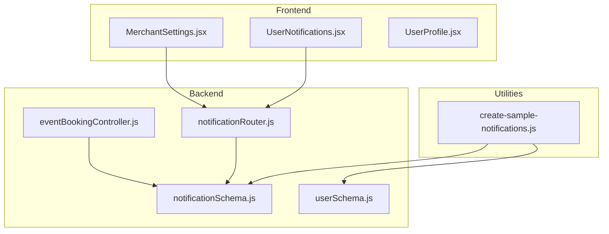
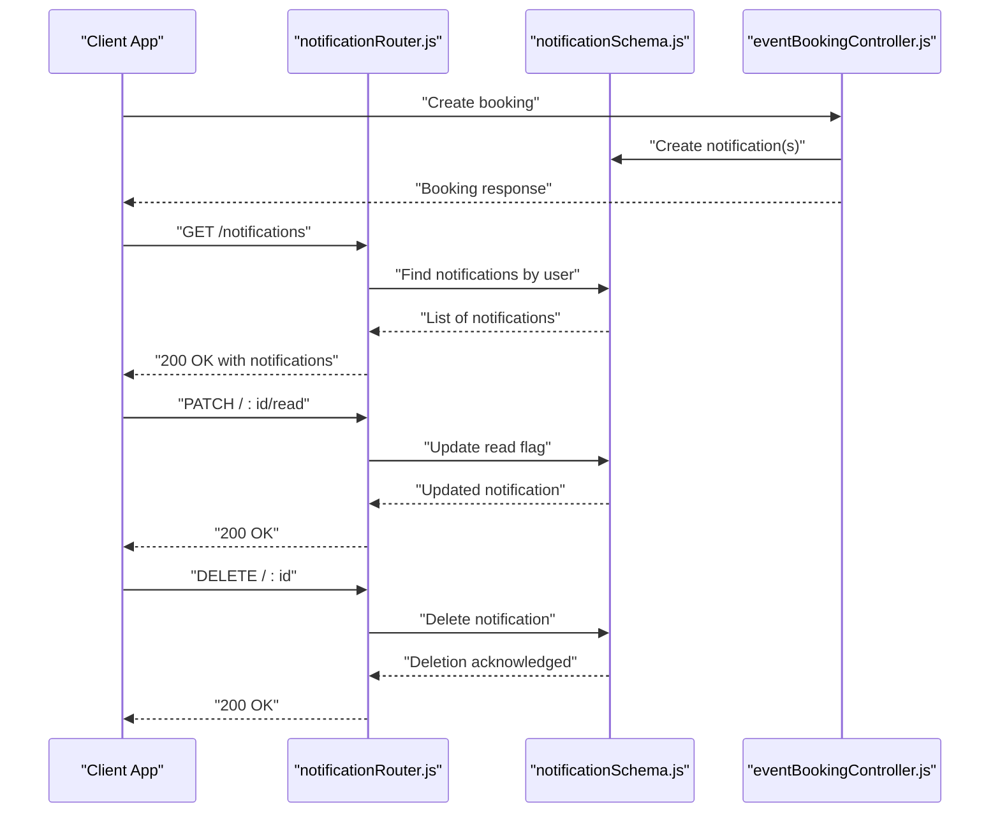
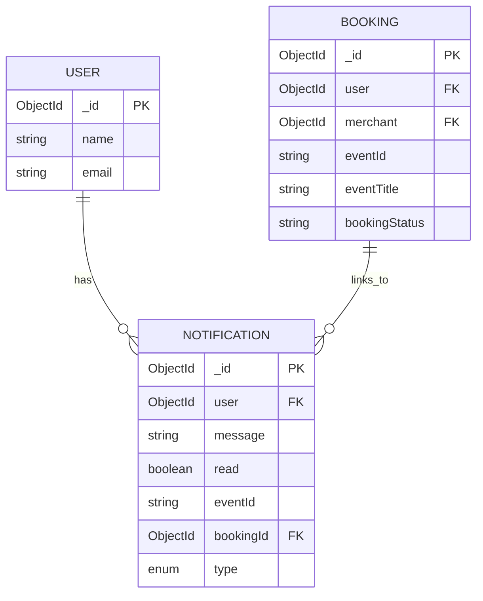
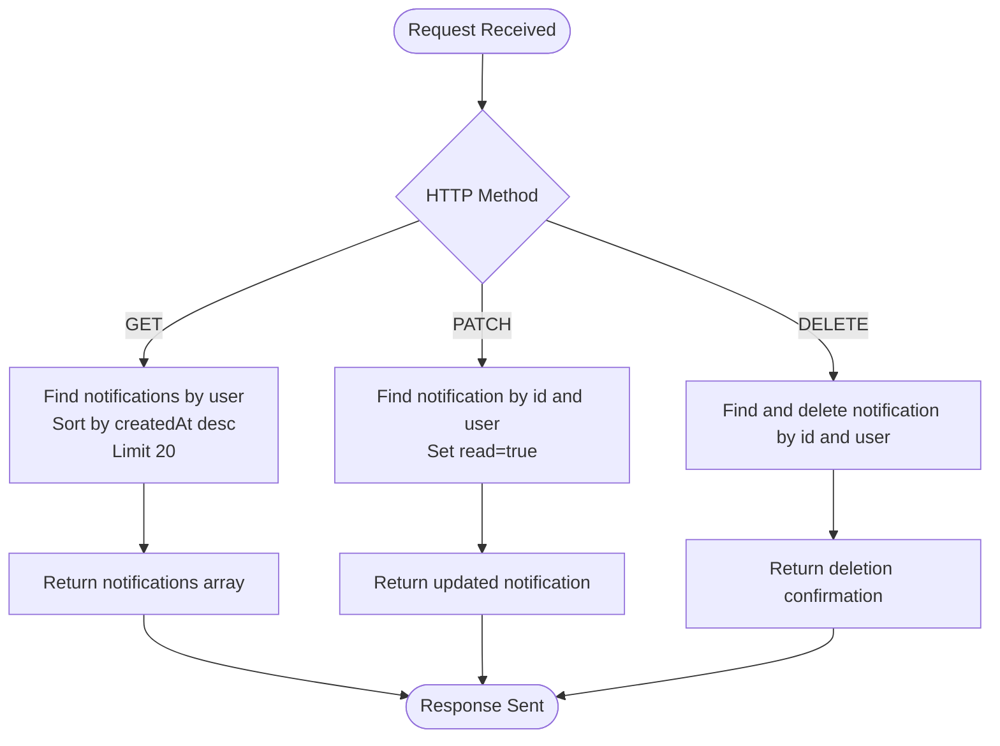
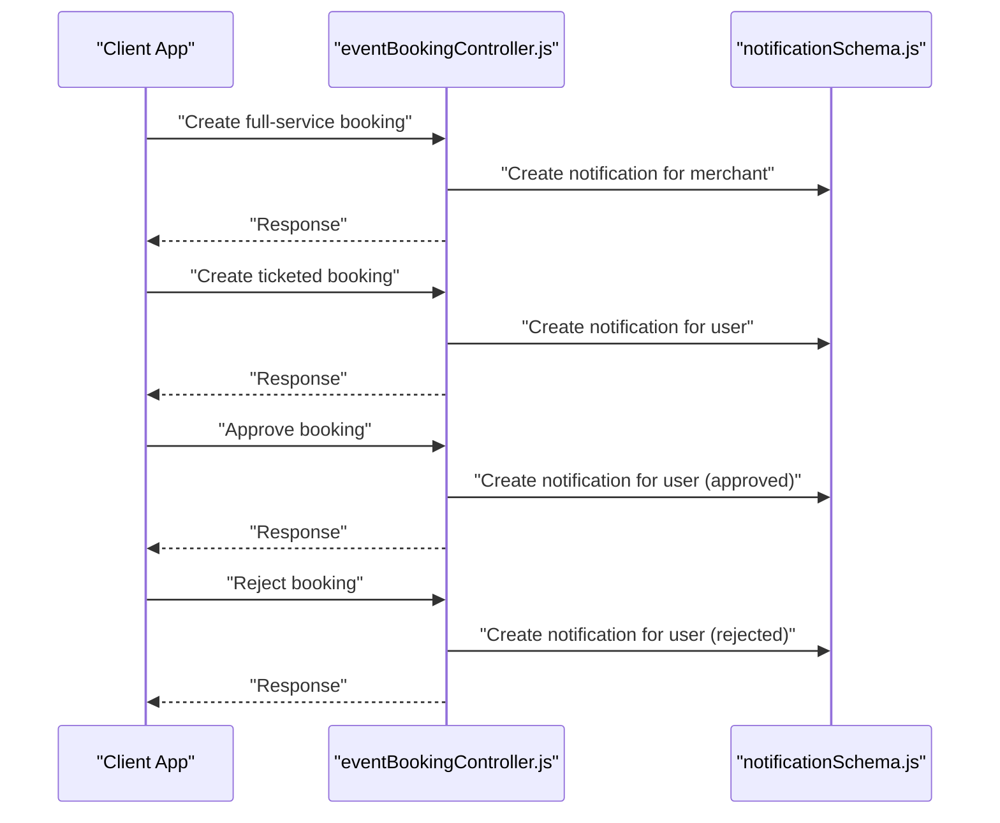
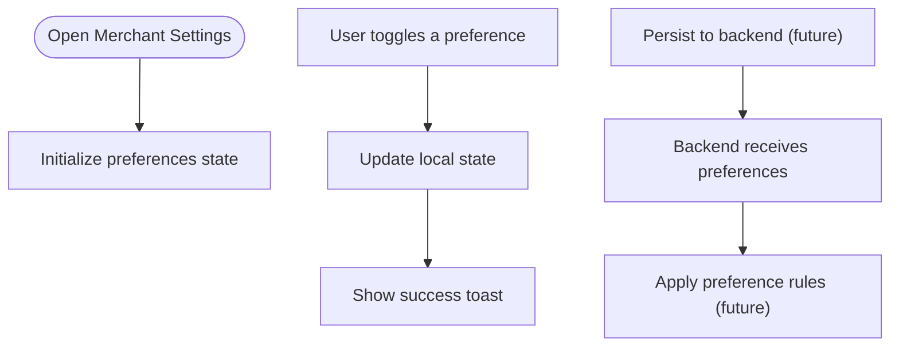
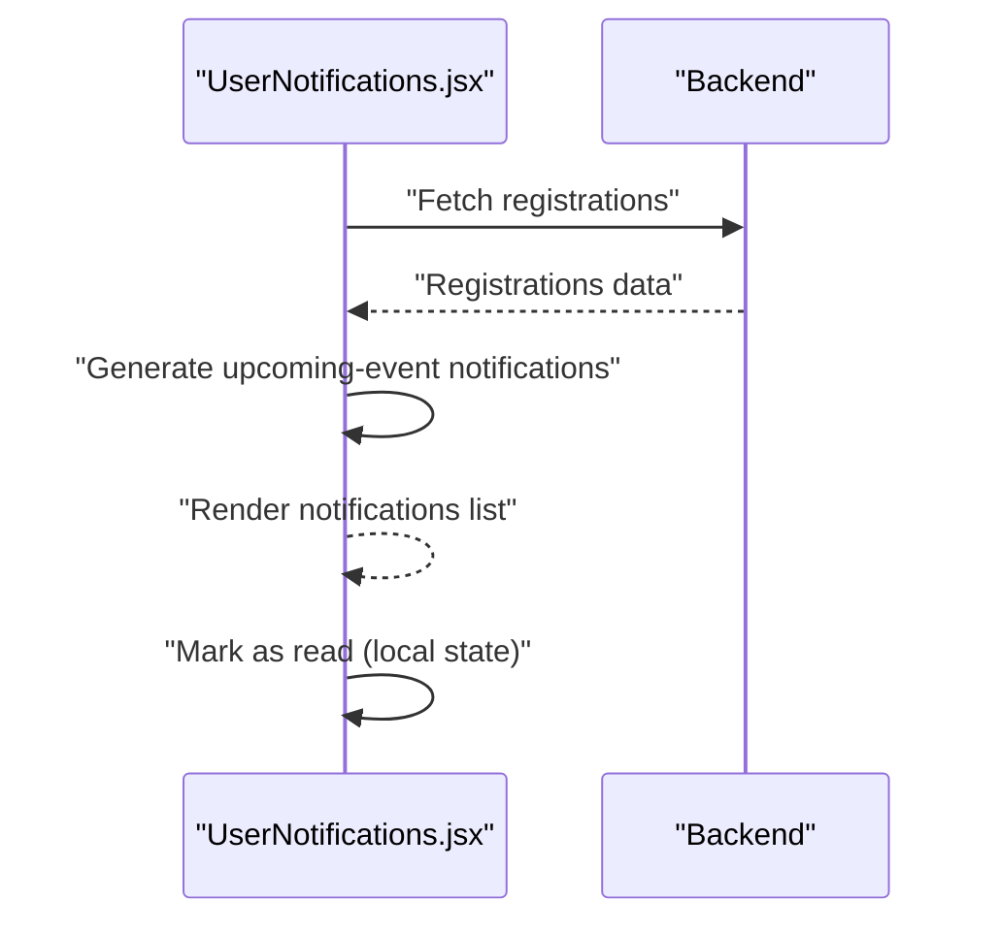
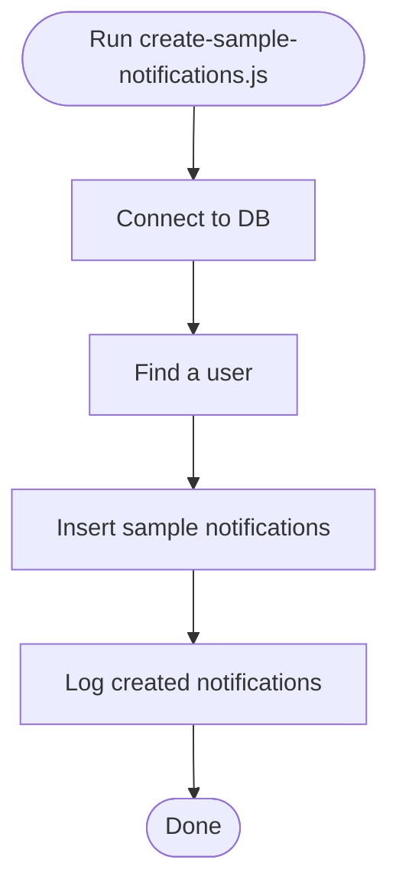
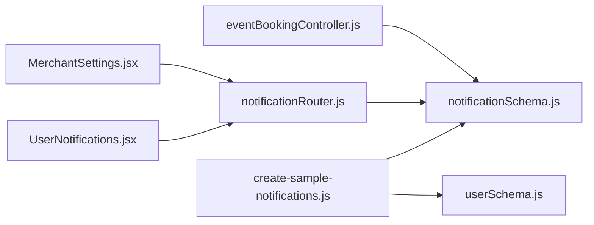

# Notification Preferences

<cite>
**Referenced Files in This Document**
- [notificationSchema.js](file://backend/models/notificationSchema.js)
- [notificationRouter.js](file://backend/router/notificationRouter.js)
- [eventBookingController.js](file://backend/controller/eventBookingController.js)
- [userSchema.js](file://backend/models/userSchema.js)
- [MerchantSettings.jsx](file://frontend/src/pages/dashboards/MerchantSettings.jsx)
- [UserNotifications.jsx](file://frontend/src/pages/dashboards/UserNotifications.jsx)
- [UserProfile.jsx](file://frontend/src/pages/dashboards/UserProfile.jsx)
- [create-sample-notifications.js](file://backend/create-sample-notifications.js)
</cite>

## Table of Contents
1. [Introduction](#introduction)
2. [Project Structure](#project-structure)
3. [Core Components](#core-components)
4. [Architecture Overview](#architecture-overview)
5. [Detailed Component Analysis](#detailed-component-analysis)
6. [Dependency Analysis](#dependency-analysis)
7. [Performance Considerations](#performance-considerations)
8. [Troubleshooting Guide](#troubleshooting-guide)
9. [Conclusion](#conclusion)
10. [Appendices](#appendices)

## Introduction
This document describes the notification preference management system in the MERN stack event project. It covers how notifications are modeled, persisted, and consumed by users and merchants, along with the current frontend interfaces for managing notification preferences. It also outlines areas where notification preferences could be extended (such as explicit user preference storage, opt-in/opt-out mechanisms, and bulk updates), and provides guidance for implementing robust preference management.

## Project Structure
The notification system spans backend models and routers, controller logic that generates notifications during booking workflows, and frontend dashboards that surface notifications and allow toggling of notification preferences for merchants.

**Diagram sources**
- [notificationSchema.js:1-36](file://backend/models/notificationSchema.js#L1-L36)
- [notificationRouter.js:1-45](file://backend/router/notificationRouter.js#L1-L45)
- [eventBookingController.js:1-1607](file://backend/controller/eventBookingController.js#L1-L1607)
- [userSchema.js:1-55](file://backend/models/userSchema.js#L1-L55)
- [MerchantSettings.jsx:1-241](file://frontend/src/pages/dashboards/MerchantSettings.jsx#L1-L241)
- [UserNotifications.jsx:1-154](file://frontend/src/pages/dashboards/UserNotifications.jsx#L1-L154)
- [UserProfile.jsx:1-268](file://frontend/src/pages/dashboards/UserProfile.jsx#L1-L268)
- [create-sample-notifications.js:1-73](file://backend/create-sample-notifications.js#L1-L73)

**Section sources**
- [notificationSchema.js:1-36](file://backend/models/notificationSchema.js#L1-L36)
- [notificationRouter.js:1-45](file://backend/router/notificationRouter.js#L1-L45)
- [eventBookingController.js:1-1607](file://backend/controller/eventBookingController.js#L1-L1607)
- [MerchantSettings.jsx:1-241](file://frontend/src/pages/dashboards/MerchantSettings.jsx#L1-L241)
- [UserNotifications.jsx:1-154](file://frontend/src/pages/dashboards/UserNotifications.jsx#L1-L154)
- [UserProfile.jsx:1-268](file://frontend/src/pages/dashboards/UserProfile.jsx#L1-L268)
- [create-sample-notifications.js:1-73](file://backend/create-sample-notifications.js#L1-L73)

## Core Components
- Notification model: Defines the shape of stored notifications, including user association, message content, read status, optional event/booking linkage, and type categorization.
- Notification router: Exposes endpoints to list, mark as read, and delete notifications for the authenticated user.
- Booking controller: Generates notifications during booking lifecycle events (creation, approval, rejection).
- Merchant settings UI: Provides a toggle interface for notification preferences at the merchant dashboard level.
- User notifications UI: Renders upcoming and system notifications for users.
- Sample notifications utility: Seeds the database with sample notifications for testing.

**Section sources**
- [notificationSchema.js:1-36](file://backend/models/notificationSchema.js#L1-L36)
- [notificationRouter.js:1-45](file://backend/router/notificationRouter.js#L1-L45)
- [eventBookingController.js:287-318](file://backend/controller/eventBookingController.js#L287-L318)
- [eventBookingController.js:545-556](file://backend/controller/eventBookingController.js#L545-L556)
- [eventBookingController.js:671-682](file://backend/controller/eventBookingController.js#L671-L682)
- [eventBookingController.js:733-744](file://backend/controller/eventBookingController.js#L733-L744)
- [MerchantSettings.jsx:17-22](file://frontend/src/pages/dashboards/MerchantSettings.jsx#L17-L22)
- [MerchantSettings.jsx:54-57](file://frontend/src/pages/dashboards/MerchantSettings.jsx#L54-L57)
- [UserNotifications.jsx:1-154](file://frontend/src/pages/dashboards/UserNotifications.jsx#L1-L154)
- [create-sample-notifications.js:22-49](file://backend/create-sample-notifications.js#L22-L49)

## Architecture Overview
The notification preference system currently supports:
- Notification creation during booking workflows (merchant and user).
- Retrieval and read-state management via dedicated endpoints.
- Frontend dashboards that present notifications and allow merchants to toggle notification preferences locally.

**Diagram sources**
- [notificationRouter.js:8-17](file://backend/router/notificationRouter.js#L8-L17)
- [notificationRouter.js:19-32](file://backend/router/notificationRouter.js#L19-L32)
- [notificationRouter.js:34-42](file://backend/router/notificationRouter.js#L34-L42)
- [notificationSchema.js:1-36](file://backend/models/notificationSchema.js#L1-L36)
- [eventBookingController.js:287-318](file://backend/controller/eventBookingController.js#L287-L318)
- [eventBookingController.js:545-556](file://backend/controller/eventBookingController.js#L545-L556)
- [eventBookingController.js:671-682](file://backend/controller/eventBookingController.js#L671-L682)
- [eventBookingController.js:733-744](file://backend/controller/eventBookingController.js#L733-L744)

## Detailed Component Analysis

### Notification Model
The notification model defines:
- Association with a user.
- Message content and read state.
- Optional linkage to an event and booking.
- Type enumeration supporting booking, payment, and general categories.

**Diagram sources**
- [notificationSchema.js:5-30](file://backend/models/notificationSchema.js#L5-L30)
- [userSchema.js:4-50](file://backend/models/userSchema.js#L4-L50)

**Section sources**
- [notificationSchema.js:1-36](file://backend/models/notificationSchema.js#L1-L36)
- [userSchema.js:1-55](file://backend/models/userSchema.js#L1-L55)

### Notification Router
Endpoints:
- GET /: Retrieve the latest notifications for the authenticated user.
- PATCH /:id/read: Mark a notification as read.
- DELETE /:id: Delete a notification.

**Diagram sources**
- [notificationRouter.js:8-17](file://backend/router/notificationRouter.js#L8-L17)
- [notificationRouter.js:19-32](file://backend/router/notificationRouter.js#L19-L32)
- [notificationRouter.js:34-42](file://backend/router/notificationRouter.js#L34-L42)

**Section sources**
- [notificationRouter.js:1-45](file://backend/router/notificationRouter.js#L1-L45)

### Booking Workflow Notification Generation
During booking operations, the system creates notifications:
- Full-service booking creation: Creates a notification for the merchant.
- Ticketed booking creation: Creates a notification for the user.
- Merchant approval/rejection: Creates notifications for the user.

**Diagram sources**
- [eventBookingController.js:287-318](file://backend/controller/eventBookingController.js#L287-L318)
- [eventBookingController.js:545-556](file://backend/controller/eventBookingController.js#L545-L556)
- [eventBookingController.js:671-682](file://backend/controller/eventBookingController.js#L671-L682)
- [eventBookingController.js:733-744](file://backend/controller/eventBookingController.js#L733-L744)

**Section sources**
- [eventBookingController.js:287-318](file://backend/controller/eventBookingController.js#L287-L318)
- [eventBookingController.js:545-556](file://backend/controller/eventBookingController.js#L545-L556)
- [eventBookingController.js:671-682](file://backend/controller/eventBookingController.js#L671-L682)
- [eventBookingController.js:733-744](file://backend/controller/eventBookingController.js#L733-L744)

### Merchant Notification Preferences UI
The merchant settings page maintains a local preferences object and toggles values client-side. These toggles currently affect UI behavior and toast feedback but do not persist to the backend.

**Diagram sources**
- [MerchantSettings.jsx:17-22](file://frontend/src/pages/dashboards/MerchantSettings.jsx#L17-L22)
- [MerchantSettings.jsx:54-57](file://frontend/src/pages/dashboards/MerchantSettings.jsx#L54-L57)

**Section sources**
- [MerchantSettings.jsx:1-241](file://frontend/src/pages/dashboards/MerchantSettings.jsx#L1-L241)

### User Notifications UI
The user notifications page fetches registrations and generates upcoming-event notifications dynamically. It displays notifications and allows marking as read locally.

**Diagram sources**
- [UserNotifications.jsx:21-59](file://frontend/src/pages/dashboards/UserNotifications.jsx#L21-L59)
- [UserNotifications.jsx:81-85](file://frontend/src/pages/dashboards/UserNotifications.jsx#L81-L85)

**Section sources**
- [UserNotifications.jsx:1-154](file://frontend/src/pages/dashboards/UserNotifications.jsx#L1-L154)

### Sample Notifications Utility
The utility script seeds the database with sample notifications and demonstrates typical notification types.

**Diagram sources**
- [create-sample-notifications.js:8-71](file://backend/create-sample-notifications.js#L8-L71)

**Section sources**
- [create-sample-notifications.js:1-73](file://backend/create-sample-notifications.js#L1-L73)

## Dependency Analysis
- Controllers depend on the notification model to create notifications during booking operations.
- The notification router depends on the notification model for queries and mutations.
- Frontend dashboards depend on the notification router for listing and updating read state.
- The sample notifications utility depends on both the notification and user models to seed data.

**Diagram sources**
- [eventBookingController.js:1-1607](file://backend/controller/eventBookingController.js#L1-L1607)
- [notificationSchema.js:1-36](file://backend/models/notificationSchema.js#L1-L36)
- [notificationRouter.js:1-45](file://backend/router/notificationRouter.js#L1-L45)
- [MerchantSettings.jsx:1-241](file://frontend/src/pages/dashboards/MerchantSettings.jsx#L1-L241)
- [UserNotifications.jsx:1-154](file://frontend/src/pages/dashboards/UserNotifications.jsx#L1-L154)
- [create-sample-notifications.js:1-73](file://backend/create-sample-notifications.js#L1-L73)
- [userSchema.js:1-55](file://backend/models/userSchema.js#L1-L55)

**Section sources**
- [eventBookingController.js:1-1607](file://backend/controller/eventBookingController.js#L1-L1607)
- [notificationSchema.js:1-36](file://backend/models/notificationSchema.js#L1-L36)
- [notificationRouter.js:1-45](file://backend/router/notificationRouter.js#L1-L45)
- [MerchantSettings.jsx:1-241](file://frontend/src/pages/dashboards/MerchantSettings.jsx#L1-L241)
- [UserNotifications.jsx:1-154](file://frontend/src/pages/dashboards/UserNotifications.jsx#L1-L154)
- [create-sample-notifications.js:1-73](file://backend/create-sample-notifications.js#L1-L73)
- [userSchema.js:1-55](file://backend/models/userSchema.js#L1-L55)

## Performance Considerations
- Limit retrieval: The router limits notifications to the most recent 20 entries, reducing payload size and query cost.
- Sorting: Results are sorted by creation time to show the newest first.
- Indexing recommendations: Consider adding indexes on user, createdAt, and read fields for improved query performance.
- Batch operations: For bulk preference updates, batch writes and minimize round trips to the server.

[No sources needed since this section provides general guidance]

## Troubleshooting Guide
Common issues and resolutions:
- Missing user context: Ensure authentication middleware is applied to notification endpoints; otherwise, requests may fail to filter by user.
- Not found errors: Attempting to read or delete a notification that does not belong to the authenticated user returns a not found response.
- Server errors: Wrap endpoints in try/catch blocks to return standardized error responses.

**Section sources**
- [notificationRouter.js:8-17](file://backend/router/notificationRouter.js#L8-L17)
- [notificationRouter.js:19-32](file://backend/router/notificationRouter.js#L19-L32)
- [notificationRouter.js:34-42](file://backend/router/notificationRouter.js#L34-L42)

## Conclusion
The current notification system provides a solid foundation with:
- A well-defined notification model and router.
- Notification generation during key booking events.
- Frontend dashboards for viewing and interacting with notifications.

Areas for enhancement include:
- Explicit user preference storage and persistence.
- Opt-in/opt-out mechanisms for different notification categories.
- Bulk preference updates and migrations for legacy users.

[No sources needed since this section summarizes without analyzing specific files]

## Appendices

### Notification Preference Categories
- Booking: Related to booking lifecycle events (requests, approvals, rejections).
- Payment: Related to payment confirmations and updates.
- General: System-wide announcements and informational messages.

**Section sources**
- [notificationSchema.js:26-30](file://backend/models/notificationSchema.js#L26-L30)

### Current Preference Interfaces
- Merchant notification preferences UI: Local state toggles for email, bookings, payments, and marketing.
- User notifications UI: Dynamic generation of upcoming-event notifications and read-state management.

**Section sources**
- [MerchantSettings.jsx:17-22](file://frontend/src/pages/dashboards/MerchantSettings.jsx#L17-L22)
- [MerchantSettings.jsx:54-57](file://frontend/src/pages/dashboards/MerchantSettings.jsx#L54-L57)
- [UserNotifications.jsx:21-59](file://frontend/src/pages/dashboards/UserNotifications.jsx#L21-L59)
- [UserNotifications.jsx:81-85](file://frontend/src/pages/dashboards/UserNotifications.jsx#L81-L85)

### Preference Persistence and Validation
- Persistence: Merchant preferences are currently local to the UI; backend persistence is not implemented.
- Validation: No server-side validation exists for notification preferences; future implementations should validate preference keys and values.

**Section sources**
- [MerchantSettings.jsx:17-22](file://frontend/src/pages/dashboards/MerchantSettings.jsx#L17-L22)

### Default Settings
- Merchant preferences default to enabled/disabled states defined in the merchant settings component.
- Notification types default to general when unspecified.

**Section sources**
- [MerchantSettings.jsx:17-22](file://frontend/src/pages/dashboards/MerchantSettings.jsx#L17-L22)
- [notificationSchema.js:26-30](file://backend/models/notificationSchema.js#L26-L30)

### API Definitions
- GET /: Returns the latest 20 notifications for the authenticated user.
- PATCH /:id/read: Marks a notification as read.
- DELETE /:id: Deletes a notification.

**Section sources**
- [notificationRouter.js:8-17](file://backend/router/notificationRouter.js#L8-L17)
- [notificationRouter.js:19-32](file://backend/router/notificationRouter.js#L19-L32)
- [notificationRouter.js:34-42](file://backend/router/notificationRouter.js#L34-L42)

### Bulk Preference Updates and Migration Strategies
- Bulk updates: Introduce a dedicated endpoint to accept arrays of preference updates and apply them atomically.
- Migration: On first access, initialize missing preferences for existing users based on defaults or historical behavior.

[No sources needed since this section provides general guidance]

### Implementing Notification Preference Interfaces
- Frontend: Extend the merchant settings component to persist preferences to the backend and handle server responses.
- Backend: Add a preferences model/schema and endpoints to manage user-specific notification preferences.

[No sources needed since this section provides general guidance]