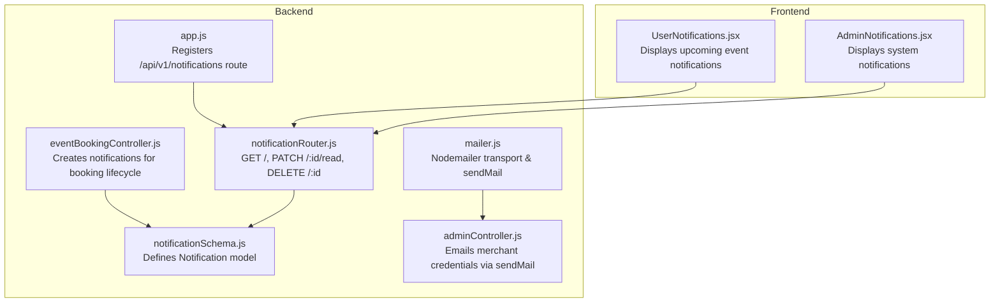
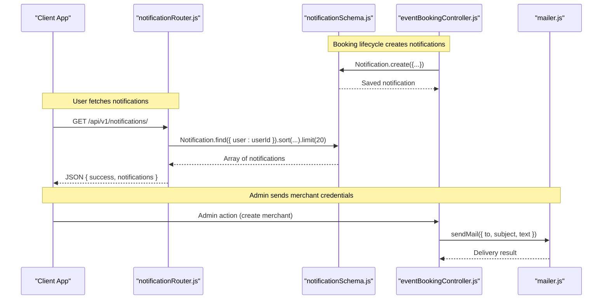
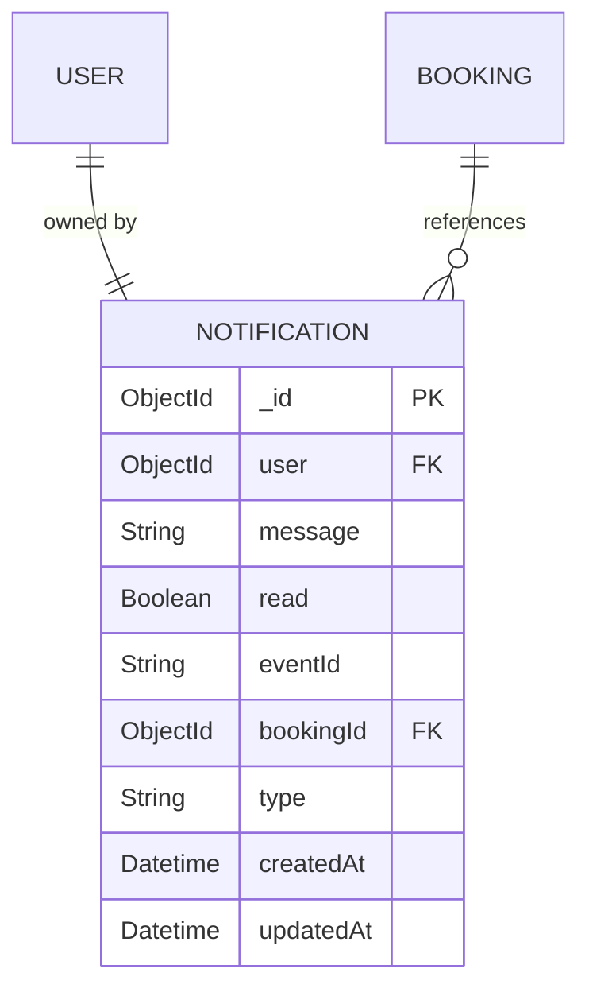
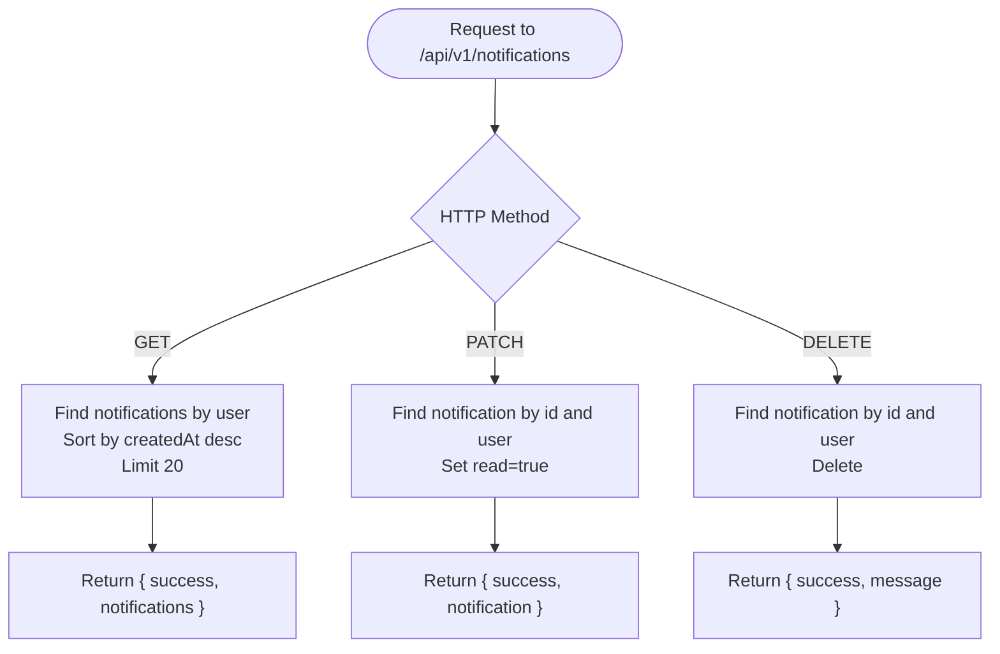
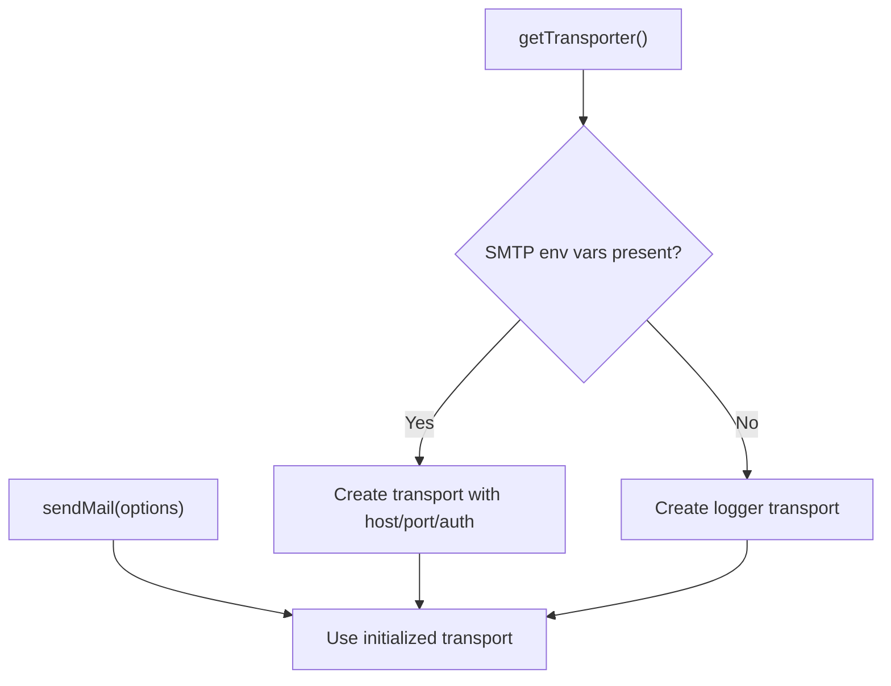
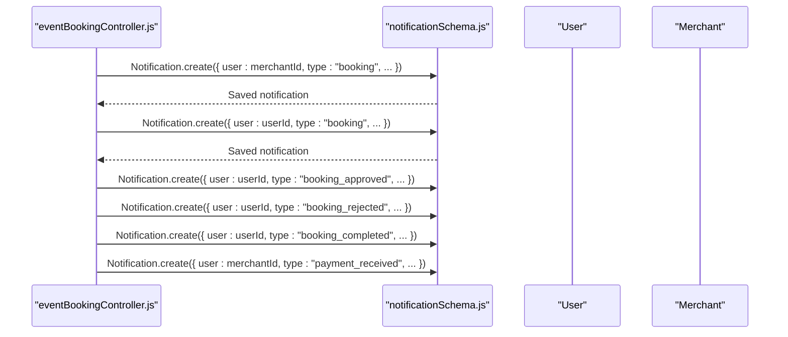
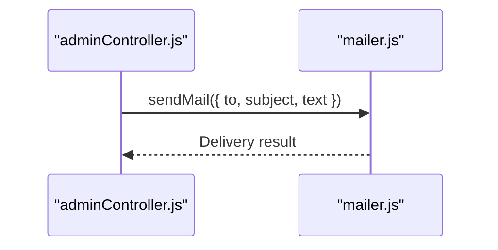
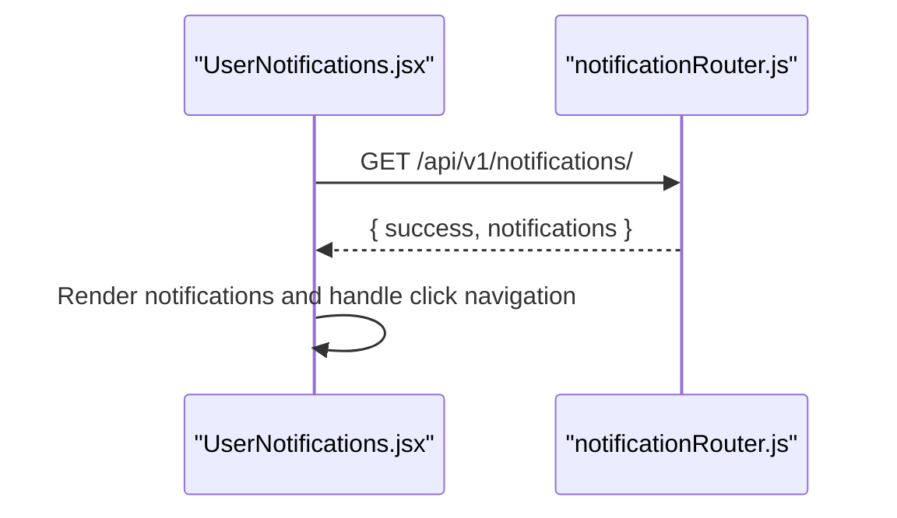
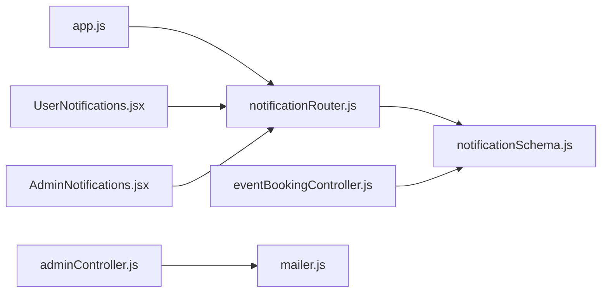

# Notification System

<cite>
**Referenced Files in This Document**
- [notificationSchema.js](file://backend/models/notificationSchema.js)
- [notificationRouter.js](file://backend/router/notificationRouter.js)
- [mailer.js](file://backend/util/mailer.js)
- [eventBookingController.js](file://backend/controller/eventBookingController.js)
- [adminController.js](file://backend/controller/adminController.js)
- [UserNotifications.jsx](file://frontend/src/pages/dashboards/UserNotifications.jsx)
- [AdminNotifications.jsx](file://frontend/src/pages/dashboards/AdminNotifications.jsx)
- [app.js](file://backend/app.js)
</cite>

## Table of Contents
1. [Introduction](#introduction)
2. [Project Structure](#project-structure)
3. [Core Components](#core-components)
4. [Architecture Overview](#architecture-overview)
5. [Detailed Component Analysis](#detailed-component-analysis)
6. [Dependency Analysis](#dependency-analysis)
7. [Performance Considerations](#performance-considerations)
8. [Troubleshooting Guide](#troubleshooting-guide)
9. [Conclusion](#conclusion)

## Introduction
This document describes the Notification System for the Event Management Platform. It covers the notification schema, email delivery via Nodemailer, in-app notification handling, and the integration points between backend controllers and frontend components. It also outlines notification types, delivery mechanisms, and how notifications are filtered and presented to users.

## Project Structure
The notification system spans backend models, routers, controllers, utilities, and frontend pages:
- Backend
  - Model: notification schema definition
  - Router: endpoints for fetching, marking as read, and deleting notifications
  - Controllers: business logic that creates notifications during booking and payment flows
  - Utility: email transport and fallback mechanism
- Frontend
  - User dashboard page for displaying upcoming event notifications
  - Admin dashboard page for viewing system notifications

**Diagram sources**
- [notificationSchema.js:1-36](file://backend/models/notificationSchema.js#L1-L36)
- [notificationRouter.js:1-45](file://backend/router/notificationRouter.js#L1-L45)
- [eventBookingController.js:286-310](file://backend/controller/eventBookingController.js#L286-L310)
- [mailer.js:1-42](file://backend/util/mailer.js#L1-L42)
- [adminController.js:63-67](file://backend/controller/adminController.js#L63-L67)
- [app.js:13](file://backend/app.js#L13)
- [app.js:44](file://backend/app.js#L44)
- [UserNotifications.jsx:1-155](file://frontend/src/pages/dashboards/UserNotifications.jsx#L1-L155)
- [AdminNotifications.jsx:1-217](file://frontend/src/pages/dashboards/AdminNotifications.jsx#L1-L217)

**Section sources**
- [notificationSchema.js:1-36](file://backend/models/notificationSchema.js#L1-L36)
- [notificationRouter.js:1-45](file://backend/router/notificationRouter.js#L1-L45)
- [mailer.js:1-42](file://backend/util/mailer.js#L1-L42)
- [eventBookingController.js:286-310](file://backend/controller/eventBookingController.js#L286-L310)
- [adminController.js:63-67](file://backend/controller/adminController.js#L63-L67)
- [app.js:13](file://backend/app.js#L13)
- [app.js:44](file://backend/app.js#L44)
- [UserNotifications.jsx:1-155](file://frontend/src/pages/dashboards/UserNotifications.jsx#L1-L155)
- [AdminNotifications.jsx:1-217](file://frontend/src/pages/dashboards/AdminNotifications.jsx#L1-L217)

## Core Components
- Notification Schema
  - Fields: user reference, message, read flag, optional eventId and bookingId, type enum, timestamps
  - Purpose: stores in-app notifications triggered by system actions
- Notification Router
  - Endpoints:
    - GET /: returns last 20 notifications for the authenticated user, sorted by creation time
    - PATCH /:id/read: marks a notification as read for the owner
    - DELETE /:id: deletes a notification owned by the authenticated user
- Email Utility (Nodemailer)
  - Creates a reusable transport configured from environment variables
  - Provides a fallback logger when SMTP is not configured
  - Exposes sendMail for sending emails with text or HTML content
- Controllers That Create Notifications
  - Booking lifecycle triggers notifications for merchant and user (booking request, approval, rejection, completion)
  - Payment processing triggers a notification for the merchant upon successful payment
  - Admin merchant creation triggers an email to the merchant with credentials
- Frontend Pages
  - UserNotifications: generates and displays upcoming event notifications and navigates to event details
  - AdminNotifications: displays system notifications with type badges and metadata

**Section sources**
- [notificationSchema.js:3-33](file://backend/models/notificationSchema.js#L3-L33)
- [notificationRouter.js:7-42](file://backend/router/notificationRouter.js#L7-L42)
- [mailer.js:5-41](file://backend/util/mailer.js#L5-L41)
- [eventBookingController.js:286-310](file://backend/controller/eventBookingController.js#L286-L310)
- [eventBookingController.js:544-556](file://backend/controller/eventBookingController.js#L544-L556)
- [eventBookingController.js:671-682](file://backend/controller/eventBookingController.js#L671-L682)
- [eventBookingController.js:733-744](file://backend/controller/eventBookingController.js#L733-L744)
- [eventBookingController.js:1064-1076](file://backend/controller/eventBookingController.js#L1064-L1076)
- [eventBookingController.js:1130-1142](file://backend/controller/eventBookingController.js#L1130-L1142)
- [adminController.js:63-67](file://backend/controller/adminController.js#L63-L67)
- [UserNotifications.jsx:21-59](file://frontend/src/pages/dashboards/UserNotifications.jsx#L21-L59)
- [AdminNotifications.jsx:18-35](file://frontend/src/pages/dashboards/AdminNotifications.jsx#L18-L35)

## Architecture Overview
The notification system integrates three primary flows:
- In-app notifications: created by backend controllers and retrieved via the notification router
- Email notifications: sent via Nodemailer utility for administrative actions
- Frontend presentation: user and admin dashboards render notifications and handle navigation

**Diagram sources**
- [eventBookingController.js:286-310](file://backend/controller/eventBookingController.js#L286-L310)
- [notificationRouter.js:8-17](file://backend/router/notificationRouter.js#L8-L17)
- [notificationSchema.js:34-35](file://backend/models/notificationSchema.js#L34-L35)
- [mailer.js:37-41](file://backend/util/mailer.js#L37-L41)
- [adminController.js:63-67](file://backend/controller/adminController.js#L63-L67)

## Detailed Component Analysis

### Notification Schema
The Notification model defines the structure persisted in MongoDB. It includes:
- Required user reference for ownership
- Message text
- Read flag for UI state
- Optional identifiers for related event and booking
- Type enum supporting booking lifecycle and general messages
- Timestamps for creation/update

**Diagram sources**
- [notificationSchema.js:3-33](file://backend/models/notificationSchema.js#L3-L33)

**Section sources**
- [notificationSchema.js:3-33](file://backend/models/notificationSchema.js#L3-L33)

### Notification Router
Endpoints:
- GET /: Returns the latest 20 notifications for the authenticated user, newest first
- PATCH /:id/read: Marks a notification as read if owned by the authenticated user
- DELETE /:id: Deletes a notification owned by the authenticated user

**Diagram sources**
- [notificationRouter.js:7-42](file://backend/router/notificationRouter.js#L7-L42)

**Section sources**
- [notificationRouter.js:7-42](file://backend/router/notificationRouter.js#L7-L42)

### Email Delivery with Nodemailer
The email utility:
- Lazily initializes a Nodemailer transport using environment variables
- Supports ports 465 (secure) and others
- Falls back to logging email content when SMTP is unavailable
- Exposes sendMail for sending text or HTML emails

**Diagram sources**
- [mailer.js:5-41](file://backend/util/mailer.js#L5-L41)

**Section sources**
- [mailer.js:5-41](file://backend/util/mailer.js#L5-L41)

### Notification Creation in Booking Lifecycle
Controllers create notifications at key lifecycle stages:
- New booking request: notifies merchant and user
- Approval/rejection: notifies user
- Completion: notifies user
- Payment received: notifies merchant

**Diagram sources**
- [eventBookingController.js:286-310](file://backend/controller/eventBookingController.js#L286-L310)
- [eventBookingController.js:544-556](file://backend/controller/eventBookingController.js#L544-L556)
- [eventBookingController.js:671-682](file://backend/controller/eventBookingController.js#L671-L682)
- [eventBookingController.js:733-744](file://backend/controller/eventBookingController.js#L733-L744)
- [eventBookingController.js:1064-1076](file://backend/controller/eventBookingController.js#L1064-L1076)
- [eventBookingController.js:1130-1142](file://backend/controller/eventBookingController.js#L1130-L1142)

**Section sources**
- [eventBookingController.js:286-310](file://backend/controller/eventBookingController.js#L286-L310)
- [eventBookingController.js:544-556](file://backend/controller/eventBookingController.js#L544-L556)
- [eventBookingController.js:671-682](file://backend/controller/eventBookingController.js#L671-L682)
- [eventBookingController.js:733-744](file://backend/controller/eventBookingController.js#L733-L744)
- [eventBookingController.js:1064-1076](file://backend/controller/eventBookingController.js#L1064-L1076)
- [eventBookingController.js:1130-1142](file://backend/controller/eventBookingController.js#L1130-L1142)

### Admin Merchant Email Notification
On merchant creation, the admin controller sends credentials via email using the shared mail utility.

**Diagram sources**
- [adminController.js:63-67](file://backend/controller/adminController.js#L63-L67)
- [mailer.js:37-41](file://backend/util/mailer.js#L37-L41)

**Section sources**
- [adminController.js:63-67](file://backend/controller/adminController.js#L63-L67)
- [mailer.js:37-41](file://backend/util/mailer.js#L37-L41)

### Frontend Notification Presentation
- UserNotifications
  - Loads registrations and generates upcoming event notifications
  - Displays notifications with read/unread indicators and navigation to event details
- AdminNotifications
  - Fetches system notifications from the backend
  - Renders summary cards and a list with type-specific icons and badges

**Diagram sources**
- [UserNotifications.jsx:17-59](file://frontend/src/pages/dashboards/UserNotifications.jsx#L17-L59)
- [notificationRouter.js:8-17](file://backend/router/notificationRouter.js#L8-L17)

**Section sources**
- [UserNotifications.jsx:17-59](file://frontend/src/pages/dashboards/UserNotifications.jsx#L17-L59)
- [AdminNotifications.jsx:18-35](file://frontend/src/pages/dashboards/AdminNotifications.jsx#L18-L35)

## Dependency Analysis
- Backend routing
  - The notification router is registered under /api/v1/notifications in the main application
- Controller-model coupling
  - Controllers depend on the Notification model to persist notifications
- Email dependency
  - Admin controller depends on the mail utility for sending emails
- Frontend-backend integration
  - Frontend pages call the notification router endpoints to manage and display notifications

**Diagram sources**
- [app.js:13](file://backend/app.js#L13)
- [app.js:44](file://backend/app.js#L44)
- [notificationRouter.js:1-45](file://backend/router/notificationRouter.js#L1-L45)
- [notificationSchema.js:1-36](file://backend/models/notificationSchema.js#L1-L36)
- [eventBookingController.js:286-310](file://backend/controller/eventBookingController.js#L286-L310)
- [adminController.js:63-67](file://backend/controller/adminController.js#L63-L67)
- [UserNotifications.jsx:1-155](file://frontend/src/pages/dashboards/UserNotifications.jsx#L1-L155)
- [AdminNotifications.jsx:1-217](file://frontend/src/pages/dashboards/AdminNotifications.jsx#L1-L217)

**Section sources**
- [app.js:13](file://backend/app.js#L13)
- [app.js:44](file://backend/app.js#L44)
- [notificationRouter.js:1-45](file://backend/router/notificationRouter.js#L1-L45)
- [notificationSchema.js:1-36](file://backend/models/notificationSchema.js#L1-L36)
- [eventBookingController.js:286-310](file://backend/controller/eventBookingController.js#L286-L310)
- [adminController.js:63-67](file://backend/controller/adminController.js#L63-L67)
- [UserNotifications.jsx:1-155](file://frontend/src/pages/dashboards/UserNotifications.jsx#L1-L155)
- [AdminNotifications.jsx:1-217](file://frontend/src/pages/dashboards/AdminNotifications.jsx#L1-L217)

## Performance Considerations
- Query limits: The GET endpoint limits returned notifications to 20 and sorts by creation time, reducing payload size and ensuring freshness
- Lazy transport initialization: The email utility avoids unnecessary transport creation until needed
- Minimal frontend rendering: The user notifications page generates a small, finite set of notifications client-side

[No sources needed since this section provides general guidance]

## Troubleshooting Guide
- Notifications not appearing
  - Verify the user is authenticated and the GET endpoint returns notifications
  - Confirm the user ID matches the notification owner
- Read/unread state not updating
  - Ensure the PATCH endpoint is called with the correct notification ID and user context
- Email not sent
  - Check SMTP environment variables are set
  - If missing, the fallback logs email content instead of sending
- Admin merchant email fails
  - Confirm the admin controller’s sendMail call is executed and environment variables are correct

**Section sources**
- [notificationRouter.js:8-17](file://backend/router/notificationRouter.js#L8-L17)
- [notificationRouter.js:20-32](file://backend/router/notificationRouter.js#L20-L32)
- [mailer.js:17-34](file://backend/util/mailer.js#L17-L34)
- [adminController.js:63-67](file://backend/controller/adminController.js#L63-L67)

## Conclusion
The Event Management Platform’s notification system combines in-app notifications and email delivery to inform users and merchants about booking and payment events. The backend model and router provide a straightforward persistence and retrieval mechanism, while controllers integrate notifications into key lifecycle actions. The frontend dashboards present notifications effectively, enabling users to stay informed about upcoming events and admins to monitor system activity.