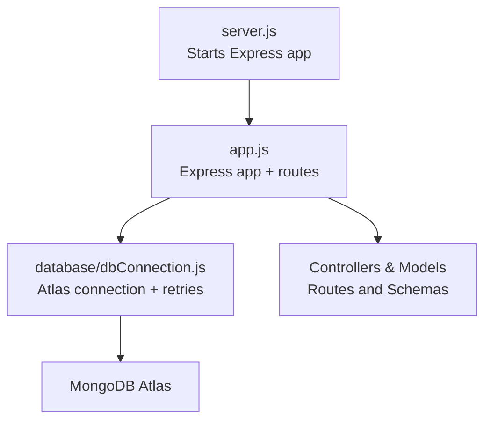
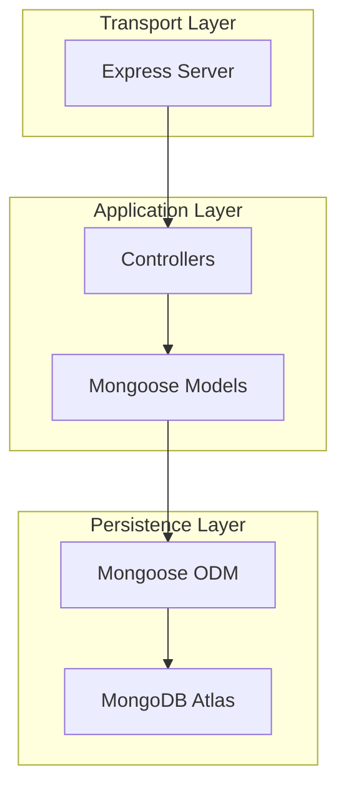
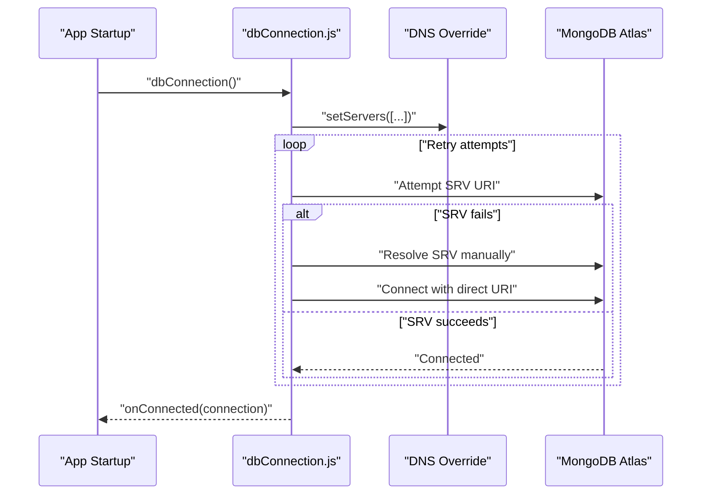
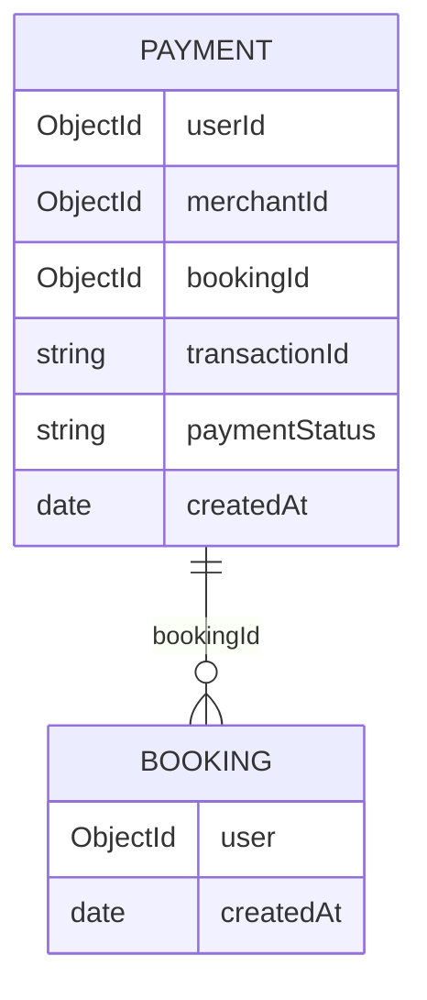
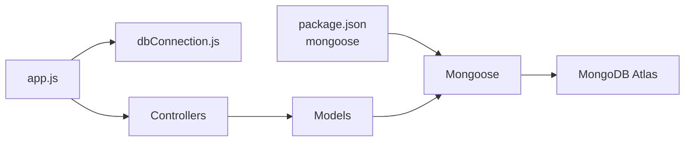

# Database Optimization

<cite>
**Referenced Files in This Document**
- [dbConnection.js](file://backend/database/dbConnection.js)
- [app.js](file://backend/app.js)
- [server.js](file://backend/server.js)
- [package.json](file://backend/package.json)
- [DATABASE_TROUBLESHOOTING.md](file://backend/DATABASE_TROUBLESHOOTING.md)
- [MONGODB_ATLAS_PERMANENT_SOLUTION.md](file://backend/MONGODB_ATLAS_PERMANENT_SOLUTION.md)
- [MONGODB_ATLAS_SETUP_GUIDE.md](file://backend/MONGODB_ATLAS_SETUP_GUIDE.md)
- [eventSchema.js](file://backend/models/eventSchema.js)
- [userSchema.js](file://backend/models/userSchema.js)
- [bookingSchema.js](file://backend/models/bookingSchema.js)
- [paymentSchema.js](file://backend/models/paymentSchema.js)
- [eventController.js](file://backend/controller/eventController.js)
- [bookingController.js](file://backend/controller/bookingController.js)
- [checkDatabase.js](file://backend/scripts/checkDatabase.js)
</cite>

## Table of Contents
1. [Introduction](#introduction)
2. [Project Structure](#project-structure)
3. [Core Components](#core-components)
4. [Architecture Overview](#architecture-overview)
5. [Detailed Component Analysis](#detailed-component-analysis)
6. [Dependency Analysis](#dependency-analysis)
7. [Performance Considerations](#performance-considerations)
8. [Troubleshooting Guide](#troubleshooting-guide)
9. [Conclusion](#conclusion)
10. [Appendices](#appendices)

## Introduction
This document provides comprehensive database optimization guidance for the Event Management Platform with a focus on MongoDB Atlas connectivity, indexing strategies, query performance tuning, connection pooling, schema design, aggregation efficiency, and operational monitoring. It consolidates proven connection fallbacks, DNS resilience, timeout configurations, and practical examples of optimized queries and indexes present in the repository.

## Project Structure
The backend initializes the Express application, loads environment variables, connects to MongoDB via a robust connection module, and exposes API routes. The database connection module centralizes Atlas SRV resolution, manual SRV resolution, and direct shard host fallbacks, along with DNS override and retry logic.

**Diagram sources**
- [server.js:1-6](file://backend/server.js#L1-L6)
- [app.js:1-91](file://backend/app.js#L1-L91)
- [dbConnection.js:1-112](file://backend/database/dbConnection.js#L1-L112)

**Section sources**
- [server.js:1-6](file://backend/server.js#L1-L6)
- [app.js:1-91](file://backend/app.js#L1-L91)
- [dbConnection.js:1-112](file://backend/database/dbConnection.js#L1-L112)

## Core Components
- Database connection module with DNS override, multiple fallback strategies, and retry/backoff logic
- Environment-driven connection options (timeouts, pool size, write concerns)
- Model schemas with targeted indexes for payment analytics and common queries
- Controllers implementing efficient queries and safe population patterns

Key connection options and fallbacks:
- DNS override to Google and Cloudflare DNS servers
- Three connection methods: Atlas SRV, manual SRV resolution, and direct shard hostnames
- Retry attempts and delays configurable via environment variables
- Connection event listeners for monitoring and diagnostics

**Section sources**
- [dbConnection.js:19-94](file://backend/database/dbConnection.js#L19-L94)
- [dbConnection.js:28-37](file://backend/database/dbConnection.js#L28-L37)
- [dbConnection.js:101-112](file://backend/database/dbConnection.js#L101-L112)
- [DATABASE_TROUBLESHOOTING.md:72-87](file://backend/DATABASE_TROUBLESHOOTING.md#L72-L87)
- [MONGODB_ATLAS_PERMANENT_SOLUTION.md:58-76](file://backend/MONGODB_ATLAS_PERMANENT_SOLUTION.md#L58-L76)

## Architecture Overview
The platform uses a layered architecture:
- Transport: Express server
- Application: Route handlers and controllers
- Persistence: Mongoose ODM with MongoDB Atlas
- Observability: Connection event hooks and diagnostic scripts

**Diagram sources**
- [app.js:1-91](file://backend/app.js#L1-L91)
- [dbConnection.js:1-112](file://backend/database/dbConnection.js#L1-L112)

## Detailed Component Analysis

### Database Connection Module
The connection module implements a resilient startup routine:
- Forces DNS resolution via Google and Cloudflare DNS
- Attempts Atlas SRV URI
- Falls back to manual SRV resolution and direct shard hostnames
- Implements retry loop with configurable delay and attempts
- Exposes connection event listeners for monitoring

**Diagram sources**
- [dbConnection.js:19-94](file://backend/database/dbConnection.js#L19-L94)

Operational highlights:
- DNS override ensures SRV resolution stability
- Multiple fallbacks prevent single-point failures
- Connection options tuned for Atlas latency and reliability
- Event hooks for error, disconnect, and reconnect

**Section sources**
- [dbConnection.js:4-17](file://backend/database/dbConnection.js#L4-L17)
- [dbConnection.js:19-94](file://backend/database/dbConnection.js#L19-L94)
- [dbConnection.js:28-37](file://backend/database/dbConnection.js#L28-L37)
- [dbConnection.js:96-112](file://backend/database/dbConnection.js#L96-L112)

### Schema Design and Indexing Strategies
Targeted indexes improve query performance for common access patterns:
- Payments: composite indexes on user and merchant with createdAt, transactionId uniqueness, and status filtering
- Bookings: indexes on user and createdAt for user-centric queries
- Events/Users: minimal indexes; rely on selective queries and projections

**Diagram sources**
- [paymentSchema.js:122-127](file://backend/models/paymentSchema.js#L122-L127)
- [bookingSchema.js:1-53](file://backend/models/bookingSchema.js#L1-L53)

Practical indexing patterns:
- Composite index for user + createdAt descending for recent payments
- Composite index for merchant + createdAt descending for merchant reports
- Unique index on transactionId for idempotency and fast lookups
- Single-field index on paymentStatus for filtering
- Single-field index on bookingId for joins/aggregations

**Section sources**
- [paymentSchema.js:122-127](file://backend/models/paymentSchema.js#L122-L127)
- [bookingSchema.js:1-53](file://backend/models/bookingSchema.js#L1-L53)

### Query Performance Tuning Examples
Controllers demonstrate efficient query patterns:
- Sorting and pagination-friendly queries using createdAt desc
- Safe population of related documents
- Existence checks before insertions
- Selective field retrieval via projections

Examples present in the codebase:
- Fetch user bookings sorted by creation time
- Find single booking with ownership verification
- Populate user details during admin listing
- Existence checks for active bookings before creating new ones

**Section sources**
- [bookingController.js:73-91](file://backend/controller/bookingController.js#L73-L91)
- [bookingController.js:94-122](file://backend/controller/bookingController.js#L94-L122)
- [bookingController.js:174-191](file://backend/controller/bookingController.js#L174-L191)
- [bookingController.js:26-38](file://backend/controller/bookingController.js#L26-L38)

### Aggregation Pipeline Efficiency
While explicit aggregation pipelines are not shown in the referenced files, the presence of virtuals in the payment schema indicates computed fields that can be leveraged in projections to avoid client-side computation. For pipeline efficiency:
- Prefer server-side filtering with match stages
- Use index-backed match conditions
- Limit projection to required fields
- Use $lookup with appropriate filters and limits

[No sources needed since this section provides general guidance]

### Data Access Pattern Improvements
- Use findOneAndUpdate with new: true for atomic updates
- Leverage sparse and partial indexes for optional fields
- Apply TTL collections for ephemeral data
- Normalize embedded arrays carefully; embed only small, frequently accessed data

[No sources needed since this section provides general guidance]

### Connection Pooling and Timeout Configurations
Connection options configured in the connection module:
- Max pool size tuned for concurrent workload
- Socket and server selection timeouts optimized for Atlas latency
- Buffer commands enabled to queue operations until connected
- Retry writes and majority write concern for durability

Environment-driven overrides:
- Retry attempts and delay configurable via environment variables
- Connection string and credentials managed externally

**Section sources**
- [dbConnection.js:28-37](file://backend/database/dbConnection.js#L28-L37)
- [dbConnection.js:20-21](file://backend/database/dbConnection.js#L20-L21)
- [DATABASE_TROUBLESHOOTING.md:72-87](file://backend/DATABASE_TROUBLESHOOTING.md#L72-L87)

### Connection Retry Mechanisms and DNS Fallback Strategies
- Three-tier fallback: Atlas SRV → manual SRV resolution → direct shard hostnames
- DNS override to 8.8.8.8 and 1.1.1.1 for SRV resolution stability
- Diagnostic checklist for common Atlas connectivity issues

**Section sources**
- [dbConnection.js:43-78](file://backend/database/dbConnection.js#L43-L78)
- [MONGODB_ATLAS_PERMANENT_SOLUTION.md:34-57](file://backend/MONGODB_ATLAS_PERMANENT_SOLUTION.md#L34-L57)
- [DATABASE_TROUBLESHOOTING.md:43-71](file://backend/DATABASE_TROUBLESHOOTING.md#L43-L71)

### Database Monitoring, Slow Query Detection, and Metrics Collection
Monitoring hooks:
- Connection error, disconnect, and reconnect event listeners
- Diagnostic script to list collections and verify connectivity
- Health endpoints to validate runtime state

Recommendations:
- Integrate Atlas Performance Advisor and slow operation logs
- Track connection state transitions and error rates
- Monitor pool utilization and timeouts

**Section sources**
- [dbConnection.js:101-112](file://backend/database/dbConnection.js#L101-L112)
- [checkDatabase.js:12-84](file://backend/scripts/checkDatabase.js#L12-L84)
- [app.js:49-51](file://backend/app.js#L49-L51)

## Dependency Analysis
The application depends on Mongoose for ODM and MongoDB for persistence. The connection module encapsulates Atlas-specific concerns, while controllers depend on models for data access.

**Diagram sources**
- [package.json:20](file://backend/package.json#L20)
- [app.js:1-91](file://backend/app.js#L1-L91)
- [dbConnection.js:1-112](file://backend/database/dbConnection.js#L1-L112)

**Section sources**
- [package.json:13-25](file://backend/package.json#L13-L25)
- [app.js:1-91](file://backend/app.js#L1-L91)
- [dbConnection.js:1-112](file://backend/database/dbConnection.js#L1-L112)

## Performance Considerations
- Use targeted indexes aligned to query predicates and sort keys
- Prefer compound indexes for multi-key filters
- Minimize projection size; avoid returning unnecessary fields
- Batch writes and leverage retry logic for transient failures
- Monitor and adjust pool size based on observed concurrency

[No sources needed since this section provides general guidance]

## Troubleshooting Guide
Common issues and remedies:
- DNS resolution failures: configure permanent DNS override and flush cache
- Authentication failures: verify credentials and user permissions
- Network access errors: whitelist IP or use temporary allowance
- Connection refused: check Atlas cluster status and firewall rules

Diagnostic tools:
- Connection checker script to validate environment and connectivity
- Atlas-specific troubleshooting steps and fallback URIs

**Section sources**
- [DATABASE_TROUBLESHOOTING.md:106-137](file://backend/DATABASE_TROUBLESHOOTING.md#L106-L137)
- [MONGODB_ATLAS_PERMANENT_SOLUTION.md:97-122](file://backend/MONGODB_ATLAS_PERMANENT_SOLUTION.md#L97-L122)
- [checkDatabase.js:12-84](file://backend/scripts/checkDatabase.js#L12-L84)

## Conclusion
The Event Management Platform employs a robust, multi-faceted approach to MongoDB Atlas connectivity and performance. The connection module’s DNS override, layered fallbacks, and retry logic ensure reliable startup. Targeted indexes and efficient query patterns in models and controllers support scalable operations. Combined with monitoring hooks and diagnostic tools, the system provides a strong foundation for production-grade database performance.

## Appendices

### Practical Indexing Patterns Used in the Application
- Payments: composite index on user + createdAt desc, merchant + createdAt desc, transactionId unique, paymentStatus single-field
- Bookings: user + createdAt desc, bookingId single-field

**Section sources**
- [paymentSchema.js:122-127](file://backend/models/paymentSchema.js#L122-L127)
- [bookingSchema.js:1-53](file://backend/models/bookingSchema.js#L1-L53)

### Optimized Query Examples Present in the Application
- User bookings fetch with createdAt desc sorting
- Single booking fetch with ownership filter
- Admin listing with user population
- Duplicate booking prevention via existence checks

**Section sources**
- [bookingController.js:73-91](file://backend/controller/bookingController.js#L73-L91)
- [bookingController.js:94-122](file://backend/controller/bookingController.js#L94-L122)
- [bookingController.js:174-191](file://backend/controller/bookingController.js#L174-L191)
- [bookingController.js:26-38](file://backend/controller/bookingController.js#L26-L38)