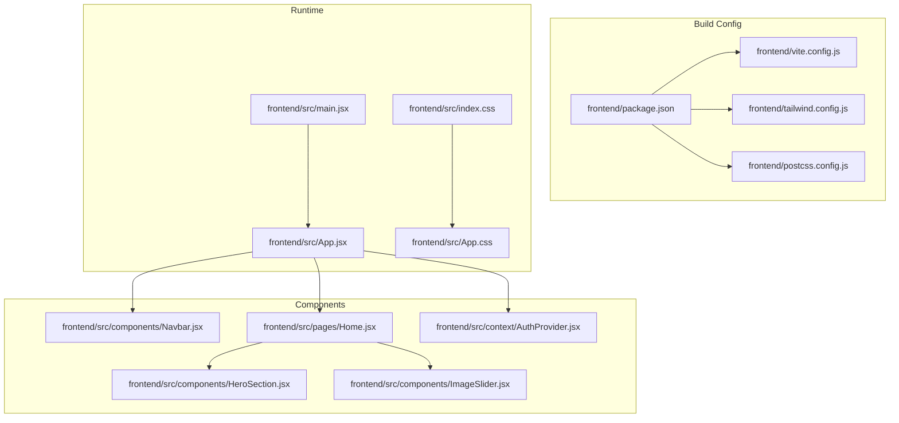
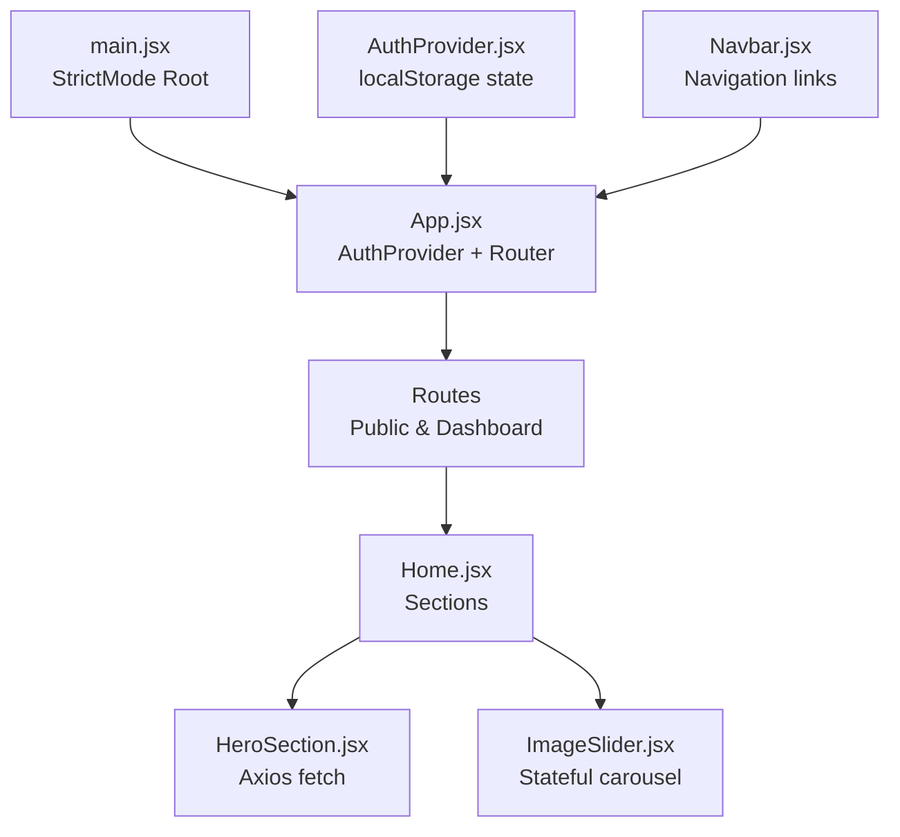
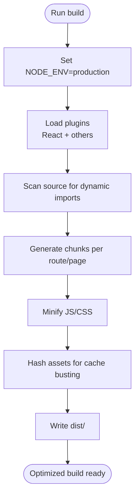
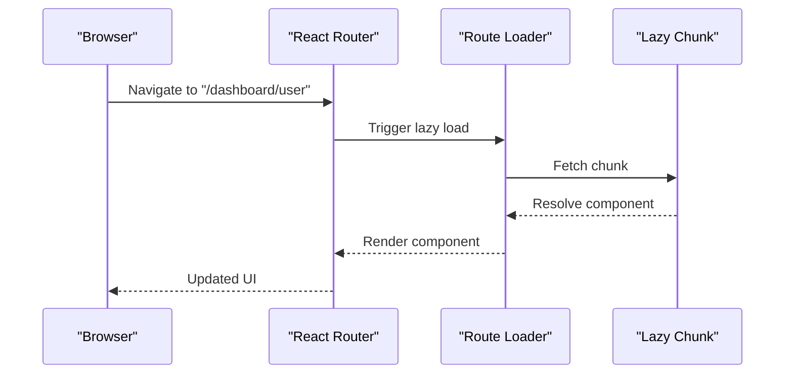
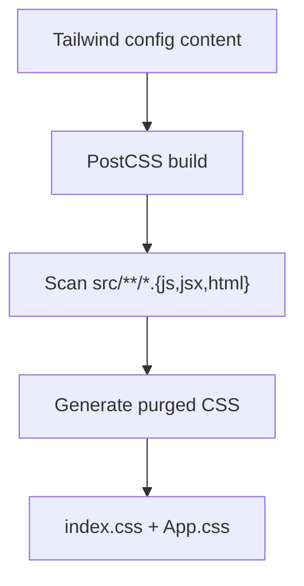
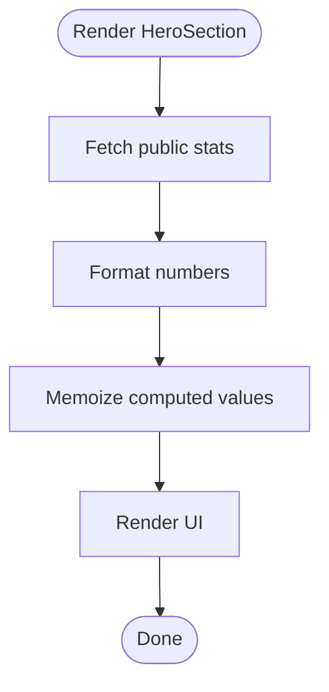
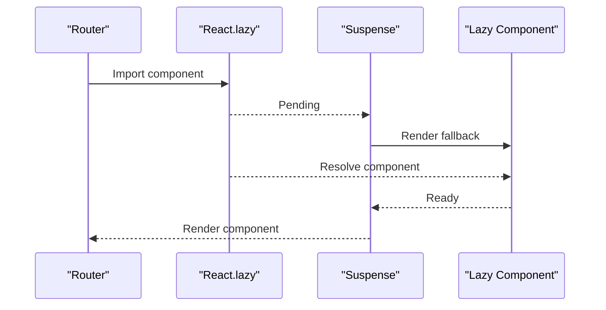
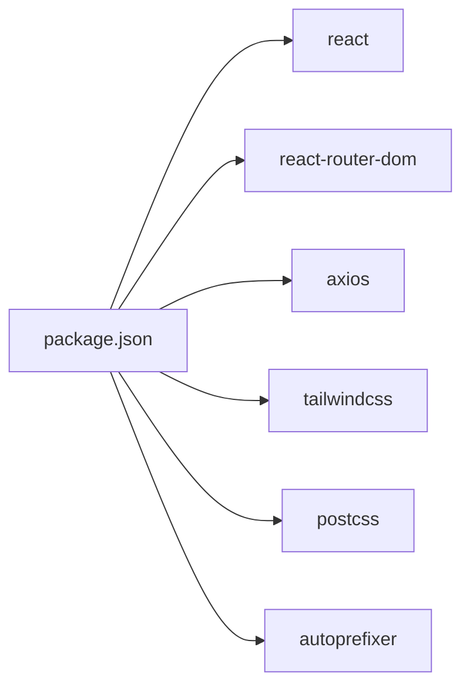

# Frontend Performance

<cite>
**Referenced Files in This Document**
- [vite.config.js](file://frontend/vite.config.js)
- [package.json](file://frontend/package.json)
- [tailwind.config.js](file://frontend/tailwind.config.js)
- [postcss.config.js](file://frontend/postcss.config.js)
- [main.jsx](file://frontend/src/main.jsx)
- [App.jsx](file://frontend/src/App.jsx)
- [index.css](file://frontend/src/index.css)
- [App.css](file://frontend/src/App.css)
- [Navbar.jsx](file://frontend/src/components/Navbar.jsx)
- [AuthProvider.jsx](file://frontend/src/context/AuthProvider.jsx)
- [Home.jsx](file://frontend/src/pages/Home.jsx)
- [HeroSection.jsx](file://frontend/src/components/HeroSection.jsx)
- [ImageSlider.jsx](file://frontend/src/components/ImageSlider.jsx)
- [utils.js](file://frontend/src/lib/utils.js)
</cite>

## Table of Contents
1. [Introduction](#introduction)
2. [Project Structure](#project-structure)
3. [Core Components](#core-components)
4. [Architecture Overview](#architecture-overview)
5. [Detailed Component Analysis](#detailed-component-analysis)
6. [Dependency Analysis](#dependency-analysis)
7. [Performance Considerations](#performance-considerations)
8. [Troubleshooting Guide](#troubleshooting-guide)
9. [Conclusion](#conclusion)
10. [Appendices](#appendices)

## Introduction
This document provides a comprehensive guide to frontend performance optimization for the React.js application built with Vite. It focuses on build-time optimizations, bundle size reduction, code splitting, Tailwind CSS optimization, CSS purging, React component optimization, memoization, lazy loading, image optimization, asset compression, CDN integration, browser caching, service worker implementation, progressive web app features, performance monitoring, Lighthouse recommendations, and deployment best practices. The guidance is grounded in the current project configuration and codebase.

## Project Structure
The frontend is organized around a Vite-based build pipeline with React and Tailwind CSS. Key configuration files define build behavior, plugin usage, and CSS processing. The application’s routing and layout are defined in the main App component, while reusable UI components and page-level views are structured under dedicated folders.

**Diagram sources**
- [vite.config.js:1-12](file://frontend/vite.config.js#L1-L12)
- [package.json:1-37](file://frontend/package.json#L1-L37)
- [tailwind.config.js:1-10](file://frontend/tailwind.config.js#L1-L10)
- [postcss.config.js:1-7](file://frontend/postcss.config.js#L1-L7)
- [main.jsx:1-11](file://frontend/src/main.jsx#L1-L11)
- [App.jsx:1-373](file://frontend/src/App.jsx#L1-L373)
- [index.css:1-80](file://frontend/src/index.css#L1-L80)
- [App.css:1-624](file://frontend/src/App.css#L1-L624)
- [Navbar.jsx:1-60](file://frontend/src/components/Navbar.jsx#L1-L60)
- [Home.jsx:1-22](file://frontend/src/pages/Home.jsx#L1-L22)
- [HeroSection.jsx:1-96](file://frontend/src/components/HeroSection.jsx#L1-L96)
- [ImageSlider.jsx:1-102](file://frontend/src/components/ImageSlider.jsx#L1-L102)
- [AuthProvider.jsx:1-38](file://frontend/src/context/AuthProvider.jsx#L1-L38)

**Section sources**
- [vite.config.js:1-12](file://frontend/vite.config.js#L1-L12)
- [package.json:1-37](file://frontend/package.json#L1-L37)
- [tailwind.config.js:1-10](file://frontend/tailwind.config.js#L1-L10)
- [postcss.config.js:1-7](file://frontend/postcss.config.js#L1-L7)
- [main.jsx:1-11](file://frontend/src/main.jsx#L1-L11)
- [App.jsx:1-373](file://frontend/src/App.jsx#L1-L373)
- [index.css:1-80](file://frontend/src/index.css#L1-L80)
- [App.css:1-624](file://frontend/src/App.css#L1-L624)

## Core Components
- Build configuration defines the React plugin and dev server settings. Current configuration does not enable production-specific optimizations such as minification, chunk splitting, or asset hashing.
- Package scripts include dev, build, lint, and preview commands. No performance-focused build flags are present.
- Tailwind CSS is configured to scan HTML and JSX files for class usage, enabling purge-based removal of unused styles.
- PostCSS applies Tailwind directives and autoprefixer for vendor prefixes.
- The main entry creates a strict-mode React root and mounts the App component.
- App.jsx orchestrates routing for public pages and multiple dashboard routes, with conditional chrome visibility for dashboard paths.

Key areas for performance:
- Vite build optimization needs explicit configuration for production builds.
- Tailwind purging is enabled; ensure production builds run with proper environment flags.
- CSS is split between Tailwind directives and application-specific styles; consolidate and minimize overrides.
- Routing is centralized; consider route-level code splitting for large dashboard pages.

**Section sources**
- [vite.config.js:1-12](file://frontend/vite.config.js#L1-L12)
- [package.json:6-11](file://frontend/package.json#L6-L11)
- [tailwind.config.js:3-3](file://frontend/tailwind.config.js#L3-L3)
- [postcss.config.js:1-7](file://frontend/postcss.config.js#L1-L7)
- [main.jsx:6-10](file://frontend/src/main.jsx#L6-L10)
- [App.jsx:51-359](file://frontend/src/App.jsx#L51-L359)

## Architecture Overview
The runtime architecture centers on a single-page application with route-based rendering. Authentication state is provided via a context provider. Components are composed to render pages such as Home, which aggregates multiple sections including HeroSection and ImageSlider.

**Diagram sources**
- [main.jsx:6-10](file://frontend/src/main.jsx#L6-L10)
- [App.jsx:362-370](file://frontend/src/App.jsx#L362-L370)
- [Home.jsx:8-19](file://frontend/src/pages/Home.jsx#L8-L19)
- [HeroSection.jsx:9-13](file://frontend/src/components/HeroSection.jsx#L9-L13)
- [ImageSlider.jsx:6-26](file://frontend/src/components/ImageSlider.jsx#L6-L26)
- [AuthProvider.jsx:5-32](file://frontend/src/context/AuthProvider.jsx#L5-L32)
- [Navbar.jsx:4-56](file://frontend/src/components/Navbar.jsx#L4-L56)

## Detailed Component Analysis

### Vite Build Optimization
Current configuration:
- Uses the React plugin for fast refresh and JSX transforms.
- Dev server exposes host and runs on port 5173.

Recommendations:
- Enable production optimizations in build scripts:
  - Minification: configure minifier and keep default for React.
  - Chunk splitting: rely on dynamic imports for route-level code splitting.
  - Asset hashing: enable for cache busting.
  - Rollup options: tune external libraries and manual chunks if needed.
- Environment separation:
  - Use NODE_ENV=production for optimized builds.
  - Add build.ssr and build.rollupOptions for advanced bundling.

**Diagram sources**
- [vite.config.js:5-11](file://frontend/vite.config.js#L5-L11)
- [package.json:6-11](file://frontend/package.json#L6-L11)

**Section sources**
- [vite.config.js:1-12](file://frontend/vite.config.js#L1-L12)
- [package.json:6-11](file://frontend/package.json#L6-L11)

### Bundle Size Reduction Strategies
- Dynamic imports for route-level code splitting:
  - Convert large dashboard pages to lazy-loaded routes to reduce initial bundle size.
- Externalize heavy libraries:
  - Keep axios and react icons small; avoid bundling large optional dependencies.
- Tree shaking:
  - Prefer named exports and avoid importing entire libraries.
- Remove unused CSS:
  - Tailwind purging is enabled; ensure production builds run with proper flags.

**Diagram sources**
- [App.jsx:77-126](file://frontend/src/App.jsx#L77-L126)

**Section sources**
- [App.jsx:77-126](file://frontend/src/App.jsx#L77-L126)

### Tailwind CSS Optimization and CSS Purging
- Tailwind scanning includes index.html and all .js/.jsx files under src/.
- Global styles are separated into index.css (Tailwind directives) and App.css (custom overrides).
- Recommendations:
  - Keep Tailwind directives minimal; avoid excessive custom utilities.
  - Consolidate custom styles into index.css where possible to leverage purging.
  - Use dark mode variants sparingly; ensure they are scanned correctly.
  - Avoid runtime CSS-in-JS for static styles to maximize purging effectiveness.

**Diagram sources**
- [tailwind.config.js:3-3](file://frontend/tailwind.config.js#L3-L3)
- [postcss.config.js:1-7](file://frontend/postcss.config.js#L1-L7)
- [index.css:1-3](file://frontend/src/index.css#L1-L3)
- [App.css:1-26](file://frontend/src/App.css#L1-L26)

**Section sources**
- [tailwind.config.js:1-10](file://frontend/tailwind.config.js#L1-L10)
- [postcss.config.js:1-7](file://frontend/postcss.config.js#L1-L7)
- [index.css:1-80](file://frontend/src/index.css#L1-L80)
- [App.css:1-624](file://frontend/src/App.css#L1-L624)

### React Component Optimization and Memoization
- Current patterns:
  - Navbar renders static navigation links with Tailwind classes.
  - HeroSection performs a single GET request on mount and formats stats.
  - ImageSlider manages internal state for slides and navigation.
  - AuthProvider persists token and user in localStorage.

Recommendations:
- Memoize expensive computations:
  - Use useMemo for derived data in HeroSection (e.g., formatted stats).
- Prevent unnecessary re-renders:
  - Use memoization for props passed to child components.
  - Wrap frequently used components with memoization if props rarely change.
- Lazy initialization:
  - Defer heavy computations until after mount or when data is available.

**Diagram sources**
- [HeroSection.jsx:9-15](file://frontend/src/components/HeroSection.jsx#L9-L15)
- [utils.js:6-25](file://frontend/src/lib/utils.js#L6-L25)

**Section sources**
- [Navbar.jsx:4-56](file://frontend/src/components/Navbar.jsx#L4-L56)
- [HeroSection.jsx:6-15](file://frontend/src/components/HeroSection.jsx#L6-L15)
- [ImageSlider.jsx:5-26](file://frontend/src/components/ImageSlider.jsx#L5-L26)
- [AuthProvider.jsx:5-32](file://frontend/src/context/AuthProvider.jsx#L5-L32)
- [utils.js:1-26](file://frontend/src/lib/utils.js#L1-L26)

### Lazy Loading Strategies
- Route-level lazy loading:
  - Replace static imports with dynamic imports for dashboard routes to split bundles.
- Component-level lazy loading:
  - Use React.lazy for heavy components rendered conditionally.
- Suspense boundaries:
  - Wrap lazy components with Suspense to handle loading states gracefully.

**Diagram sources**
- [App.jsx:77-126](file://frontend/src/App.jsx#L77-L126)

**Section sources**
- [App.jsx:77-126](file://frontend/src/App.jsx#L77-L126)

### Image Optimization, Asset Compression, and CDN Integration
- Static images:
  - Use appropriately sized images and modern formats (WebP) where supported.
  - Lazy-load images using native loading="lazy" attributes.
- Background images:
  - HeroSection uses fixed assets; consider responsive image sets and compression.
- Asset compression:
  - Enable gzip or brotli on the server; Vite can pre-compress assets during build.
- CDN:
  - Serve static assets from a CDN to reduce latency and improve caching.

[No sources needed since this section provides general guidance]

### Browser Caching Strategies
- Cache-control headers:
  - Set long max-age for immutable assets (hashed filenames).
  - Short max-age for HTML and dynamic resources.
- ETags/Last-Modified:
  - Use strong validators for immutable assets.
- Versioned assets:
  - Hash filenames to invalidate caches on updates.

[No sources needed since this section provides general guidance]

### Service Worker Implementation and Progressive Web App Features
- Service worker:
  - Register a service worker for offline caching and background sync.
- Manifest:
  - Provide a web app manifest for installability and themed UI.
- HTTPS and scope:
  - Ensure HTTPS and correct scope configuration for service worker registration.

[No sources needed since this section provides general guidance]

### Performance Monitoring Tools and Lighthouse Recommendations
- Performance monitoring:
  - Use browser devtools, React DevTools Profiler, and Lighthouse.
- Lighthouse recommendations:
  - Audit CLS, FID/LCP, and TTI; address Largest Contentful Paint and Cumulative Layout Shift.
  - Optimize images, defer non-critical JavaScript, and leverage caching.

[No sources needed since this section provides general guidance]

## Dependency Analysis
The application relies on React, React Router DOM, Axios, and Tailwind CSS with PostCSS/Autoprefixer. Dependencies are relatively lightweight, but build-time optimizations and code splitting can significantly impact performance.

**Diagram sources**
- [package.json:12-34](file://frontend/package.json#L12-L34)

**Section sources**
- [package.json:12-34](file://frontend/package.json#L12-L34)

## Performance Considerations
- Build-time:
  - Enable production optimizations, chunk splitting, and asset hashing.
  - Use environment-specific configurations for development vs. production.
- Runtime:
  - Implement lazy loading for routes and components.
  - Apply memoization for expensive computations and derived data.
  - Minimize CSS and avoid runtime CSS generation for static styles.
- Assets:
  - Compress images and serve via CDN; lazy-load offscreen images.
- Caching:
  - Configure long-term caching for immutable assets and short-term caching for HTML.
- Observability:
  - Monitor performance metrics and iterate based on Lighthouse audits.

[No sources needed since this section provides general guidance]

## Troubleshooting Guide
- Build artifacts not optimized:
  - Ensure NODE_ENV=production is set and Vite build script is used for production.
- Excessive CSS:
  - Verify Tailwind content globs include all relevant files; rebuild with production flags.
- Slow initial load:
  - Confirm route-level code splitting is applied; inspect generated chunks.
- Image performance:
  - Validate image sizes and formats; confirm lazy-loading attributes are present.

**Section sources**
- [vite.config.js:5-11](file://frontend/vite.config.js#L5-L11)
- [tailwind.config.js:3-3](file://frontend/tailwind.config.js#L3-L3)
- [App.jsx:77-126](file://frontend/src/App.jsx#L77-L126)
- [HeroSection.jsx:20-22](file://frontend/src/components/HeroSection.jsx#L20-L22)

## Conclusion
By enabling Vite’s production optimizations, implementing route-level code splitting, leveraging Tailwind purging, applying React memoization, optimizing images, configuring caching, and adopting service workers, the application can achieve significant performance improvements. Regular monitoring with Lighthouse and continuous iteration will ensure sustained performance gains.

[No sources needed since this section summarizes without analyzing specific files]

## Appendices
- Recommended additions to vite.config.js:
  - Define build.rollupOptions for external libraries and manualChunks.
  - Enable build.assetsDir and build.rollupOptions.output.manualChunks for strategic splitting.
- Tailwind customization:
  - Limit custom utilities; prefer core utilities to maximize purging.
- Component hygiene:
  - Avoid inline styles; use Tailwind classes.
  - Keep components pure and stateless where possible.

[No sources needed since this section provides general guidance]