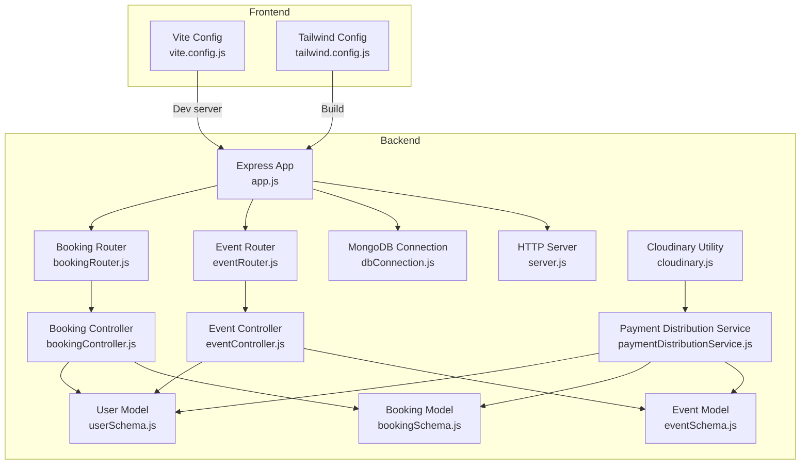
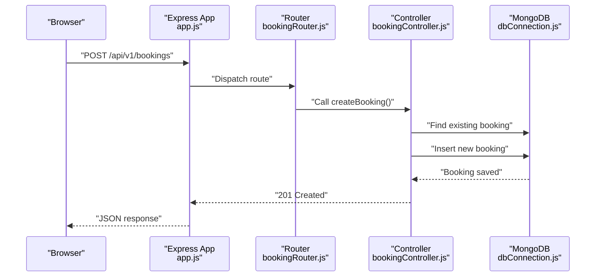
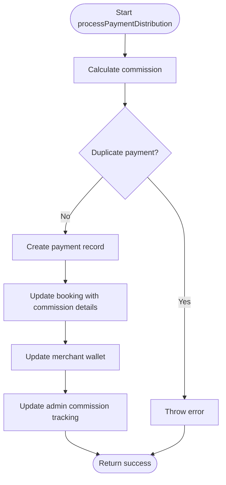
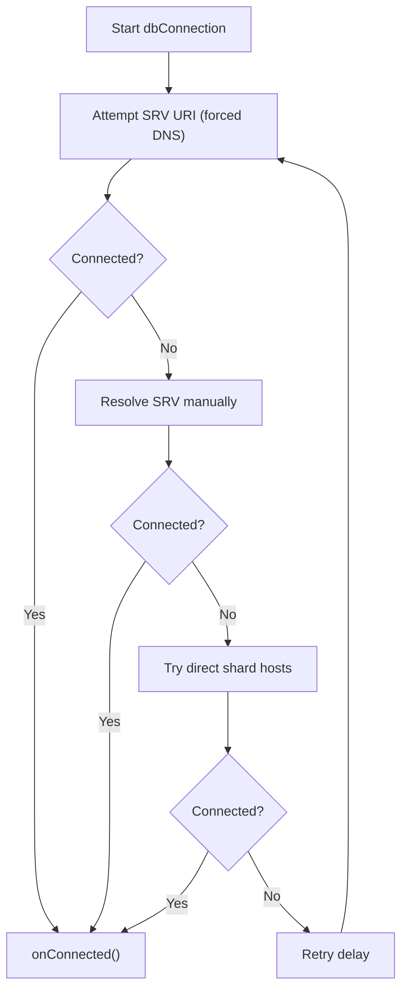
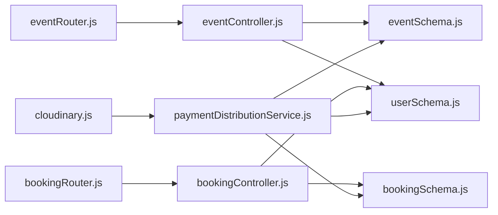

# Performance Optimization

<cite>
**Referenced Files in This Document**
- [app.js](file://backend/app.js)
- [server.js](file://backend/server.js)
- [dbConnection.js](file://backend/database/dbConnection.js)
- [paymentDistributionService.js](file://backend/services/paymentDistributionService.js)
- [cloudinary.js](file://backend/util/cloudinary.js)
- [vite.config.js](file://frontend/vite.config.js)
- [tailwind.config.js](file://frontend/tailwind.config.js)
- [eventSchema.js](file://backend/models/eventSchema.js)
- [bookingSchema.js](file://backend/models/bookingSchema.js)
- [userSchema.js](file://backend/models/userSchema.js)
- [eventController.js](file://backend/controller/eventController.js)
- [bookingController.js](file://backend/controller/bookingController.js)
- [eventRouter.js](file://backend/router/eventRouter.js)
- [bookingRouter.js](file://backend/router/bookingRouter.js)
</cite>

## Table of Contents
1. [Introduction](#introduction)
2. [Project Structure](#project-structure)
3. [Core Components](#core-components)
4. [Architecture Overview](#architecture-overview)
5. [Detailed Component Analysis](#detailed-component-analysis)
6. [Dependency Analysis](#dependency-analysis)
7. [Performance Considerations](#performance-considerations)
8. [Troubleshooting Guide](#troubleshooting-guide)
9. [Conclusion](#conclusion)
10. [Appendices](#appendices)

## Introduction
This document provides a comprehensive performance optimization guide for the Event Management Platform. It focuses on database indexing strategies, caching mechanisms, image optimization techniques, and frontend performance improvements. It also covers payment distribution service optimization, connection pooling, resource management, build optimization with Vite, CSS optimization with Tailwind, and deployment performance considerations. Monitoring strategies, performance metrics, and best practices are included to help maintain and scale the platform effectively.

## Project Structure
The platform follows a standard MERN stack layout with a Node.js/Express backend and React frontend. The backend organizes code by domain (controllers, routers, models, services, utilities) and exposes REST endpoints. The frontend uses Vite for development and build, Tailwind for styling, and React components for UI.

**Diagram sources**
- [app.js:1-91](file://backend/app.js#L1-L91)
- [server.js:1-6](file://backend/server.js#L1-L6)
- [dbConnection.js:1-112](file://backend/database/dbConnection.js#L1-L112)
- [eventController.js:1-35](file://backend/controller/eventController.js#L1-L35)
- [bookingController.js:1-233](file://backend/controller/bookingController.js#L1-L233)
- [eventRouter.js:1-13](file://backend/router/eventRouter.js#L1-L13)
- [bookingRouter.js:1-26](file://backend/router/bookingRouter.js#L1-L26)
- [eventSchema.js:1-23](file://backend/models/eventSchema.js#L1-L23)
- [bookingSchema.js:1-53](file://backend/models/bookingSchema.js#L1-L53)
- [userSchema.js:1-55](file://backend/models/userSchema.js#L1-L55)
- [paymentDistributionService.js:1-340](file://backend/services/paymentDistributionService.js#L1-L340)
- [cloudinary.js:1-112](file://backend/util/cloudinary.js#L1-L112)
- [vite.config.js:1-12](file://frontend/vite.config.js#L1-L12)
- [tailwind.config.js:1-10](file://frontend/tailwind.config.js#L1-L10)

**Section sources**
- [app.js:1-91](file://backend/app.js#L1-L91)
- [server.js:1-6](file://backend/server.js#L1-L6)
- [vite.config.js:1-12](file://frontend/vite.config.js#L1-L12)
- [tailwind.config.js:1-10](file://frontend/tailwind.config.js#L1-L10)

## Core Components
- Express application and routing: Centralized in app.js with CORS and JSON parsing middleware, health checks, and modular routers for features.
- Database connectivity: Robust connection logic with DNS override, SRV resolution fallbacks, retry loops, and connection lifecycle logging.
- Payment distribution service: Calculates commissions, updates payments and bookings, adjusts merchant/admin balances, and aggregates statistics.
- Image optimization: Cloudinary integration with transformations, upload limits, and batch operations.
- Frontend build and styling: Vite dev server configuration and Tailwind content scanning.

Key performance-relevant areas:
- Database pool sizing and timeouts
- Aggregation queries for analytics
- Image transformations and upload concurrency
- Build pipeline optimization

**Section sources**
- [app.js:1-91](file://backend/app.js#L1-L91)
- [dbConnection.js:1-112](file://backend/database/dbConnection.js#L1-L112)
- [paymentDistributionService.js:1-340](file://backend/services/paymentDistributionService.js#L1-L340)
- [cloudinary.js:1-112](file://backend/util/cloudinary.js#L1-L112)
- [vite.config.js:1-12](file://frontend/vite.config.js#L1-L12)
- [tailwind.config.js:1-10](file://frontend/tailwind.config.js#L1-L10)

## Architecture Overview
The backend initializes the database and admin, then serves REST endpoints grouped by feature. Controllers interact with models and services (e.g., payment distribution). The frontend runs on Vite and Tailwind, consuming the backend APIs.

**Diagram sources**
- [app.js:35-47](file://backend/app.js#L35-L47)
- [bookingRouter.js:1-26](file://backend/router/bookingRouter.js#L1-L26)
- [bookingController.js:4-70](file://backend/controller/bookingController.js#L4-L70)
- [dbConnection.js:19-94](file://backend/database/dbConnection.js#L19-L94)

## Detailed Component Analysis

### Database Indexing Strategies
Current model fields and typical queries indicate opportunities for targeted indexes:
- Event listing and filtering: title, category, rating, timestamps
- Booking queries: user, serviceId, status, timestamps
- User queries: email (unique), role, status

Recommended indexes (conceptual):
- Compound index on {user: 1, createdAt: -1} for user bookings
- Compound index on {status: 1, createdAt: -1} for admin booking listing
- Sparse partial index on {email: 1} where unique: true
- Text index on {title: "text", description: "text"} for search

These would reduce collection scans and improve sort/filter performance.

[No sources needed since this section provides general guidance]

### Caching Mechanisms
- Redis cache (recommended): Store frequently accessed lists (events, services) and user sessions. Use short TTLs for near-real-time data and longer TTLs for static content.
- HTTP caching: Add ETag/Last-Modified headers for read-heavy endpoints; leverage CDN for static assets.
- In-memory LRU cache: For hot-path computations (e.g., payment calculations) during a request lifecycle.

[No sources needed since this section provides general guidance]

### Image Optimization Techniques
- Transformations: Resize and compress images at upload time (already configured in Cloudinary).
- Formats: Prefer WebP where supported; provide fallbacks.
- Lazy loading: Defer offscreen images in lists.
- Responsive breakpoints: Serve appropriately sized images per viewport.
- CDN: Offload image delivery to Cloudinary/CDN.

**Section sources**
- [cloudinary.js:36-58](file://backend/util/cloudinary.js#L36-L58)
- [cloudinary.js:61-91](file://backend/util/cloudinary.js#L61-L91)

### Frontend Performance Improvements
- Code splitting: Split large pages and modals into separate chunks.
- React.lazy/Suspense: Lazy-load heavy components.
- Virtualization: Use windowing for long lists (events, bookings).
- Minification and tree shaking: Ensure production builds strip dead code.
- Asset optimization: Compress images, enable gzip/brotli, preload critical resources.

[No sources needed since this section provides general guidance]

### Payment Distribution Service Optimization
Current implementation:
- Calculates commission and updates payment, booking, merchant, and admin records atomically via a single function.
- Uses aggregation for statistics and earnings summaries.
- Includes refund logic that reverses amounts.

Optimization opportunities:
- Batch operations: Group updates where possible to reduce round-trips.
- Idempotency: Ensure payment distribution handles retries safely (already guarded against duplicate payments).
- Asynchronous payouts: Trigger external payout jobs asynchronously to avoid blocking requests.
- Circuit breaker: Protect downstream integrations (e.g., payment gateways) under load.

**Diagram sources**
- [paymentDistributionService.js:33-159](file://backend/services/paymentDistributionService.js#L33-L159)

**Section sources**
- [paymentDistributionService.js:1-340](file://backend/services/paymentDistributionService.js#L1-L340)

### Connection Pooling and Resource Management
- MongoDB connection pool: The connection sets maxPoolSize and socket timeouts; ensure these align with expected concurrent requests.
- Retry strategy: Multiple fallbacks for SRV resolution and direct hostnames; tune retry attempts and delays.
- Graceful shutdown: Implement SIGTERM handling to drain connections before exit.
- Health checks: Expose readiness/liveness endpoints to orchestration platforms.

**Diagram sources**
- [dbConnection.js:19-94](file://backend/database/dbConnection.js#L19-L94)

**Section sources**
- [dbConnection.js:1-112](file://backend/database/dbConnection.js#L1-L112)

### Build Optimization with Vite
- Dev server: Host and port are configurable; enable host binding for LAN access.
- Production builds: Enable minification, chunk splitting, and asset hashing.
- Environment variables: Use .env files and Vite’s built-in variable exposure.

**Section sources**
- [vite.config.js:1-12](file://frontend/vite.config.js#L1-L12)

### CSS Optimization with Tailwind
- Purge unused styles: Ensure content globs match all template paths.
- Dark mode: Keep variants minimal to reduce CSS size.
- Component-driven styles: Favor reusable components to reduce duplication.

**Section sources**
- [tailwind.config.js:1-10](file://frontend/tailwind.config.js#L1-L10)

### Deployment Performance Considerations
- Containerization: Package backend and frontend with optimized base images.
- Load balancing: Distribute traffic across instances; enable sticky sessions if needed.
- CDN: Cache static assets and images at edges.
- Autoscaling: Scale based on CPU/memory or request latency.
- Database scaling: Use replica sets and read replicas for reporting/aggregations.

[No sources needed since this section provides general guidance]

## Dependency Analysis
The backend composes routers into the Express app, which delegates to controllers and models. Payment distribution interacts with models and user accounts. Controllers depend on models for persistence and on services for specialized logic.

**Diagram sources**
- [eventRouter.js:1-13](file://backend/router/eventRouter.js#L1-L13)
- [bookingRouter.js:1-26](file://backend/router/bookingRouter.js#L1-L26)
- [eventController.js:1-35](file://backend/controller/eventController.js#L1-L35)
- [bookingController.js:1-233](file://backend/controller/bookingController.js#L1-L233)
- [eventSchema.js:1-23](file://backend/models/eventSchema.js#L1-L23)
- [bookingSchema.js:1-53](file://backend/models/bookingSchema.js#L1-L53)
- [userSchema.js:1-55](file://backend/models/userSchema.js#L1-L55)
- [paymentDistributionService.js:1-340](file://backend/services/paymentDistributionService.js#L1-L340)
- [cloudinary.js:1-112](file://backend/util/cloudinary.js#L1-L112)

**Section sources**
- [app.js:35-47](file://backend/app.js#L35-L47)
- [eventController.js:1-35](file://backend/controller/eventController.js#L1-L35)
- [bookingController.js:1-233](file://backend/controller/bookingController.js#L1-L233)
- [paymentDistributionService.js:1-340](file://backend/services/paymentDistributionService.js#L1-L340)

## Performance Considerations
- Database
  - Add indexes on frequent filter/sort fields (user, status, timestamps).
  - Use aggregation pipelines for analytics to avoid N+1 queries.
  - Monitor slow queries and query plans.
- Caching
  - Cache read-heavy lists and user sessions with appropriate TTLs.
  - Use CDN for static assets and images.
- Images
  - Apply transformations at upload time; serve responsive sizes.
  - Lazy-load images and use modern formats.
- Backend
  - Optimize controllers to minimize database round-trips.
  - Use pagination for large lists.
  - Implement rate limiting and circuit breakers.
- Frontend
  - Split bundles and lazy-load heavy components.
  - Minimize re-renders with memoization and stable references.
- Observability
  - Instrument endpoints with metrics (latency, throughput, errors).
  - Log slow requests and errors for correlation.

[No sources needed since this section provides general guidance]

## Troubleshooting Guide
- Database connection failures
  - Verify DNS overrides and SRV resolution logs.
  - Check retry attempts and delays; adjust environment variables.
  - Confirm network access and credentials.
- Payment distribution errors
  - Ensure idempotency and duplicate prevention.
  - Validate refund conditions and reversals.
- Image upload issues
  - Confirm Cloudinary configuration and quotas.
  - Check file size limits and allowed formats.
- Frontend build issues
  - Validate Vite and Tailwind configurations.
  - Inspect bundle size and chunk splitting.

**Section sources**
- [dbConnection.js:86-94](file://backend/database/dbConnection.js#L86-L94)
- [paymentDistributionService.js:58-66](file://backend/services/paymentDistributionService.js#L58-L66)
- [cloudinary.js:21-31](file://backend/util/cloudinary.js#L21-L31)
- [vite.config.js:7-10](file://frontend/vite.config.js#L7-L10)

## Conclusion
This guide outlines practical steps to optimize the Event Management Platform across databases, caching, images, and frontend performance. By implementing targeted database indexes, adopting caching strategies, optimizing image delivery, and refining the build pipeline, the platform can achieve improved responsiveness, scalability, and reliability. Continuous monitoring and iterative tuning will ensure sustained performance as usage grows.

## Appendices
- Monitoring and metrics
  - Track endpoint latency, error rates, and throughput.
  - Observe database query performance and connection pool utilization.
  - Monitor image upload success rates and CDN delivery metrics.
- Best practices
  - Keep secrets out of client-side code.
  - Use HTTPS everywhere and secure headers.
  - Regularly audit dependencies and update security patches.

[No sources needed since this section provides general guidance]