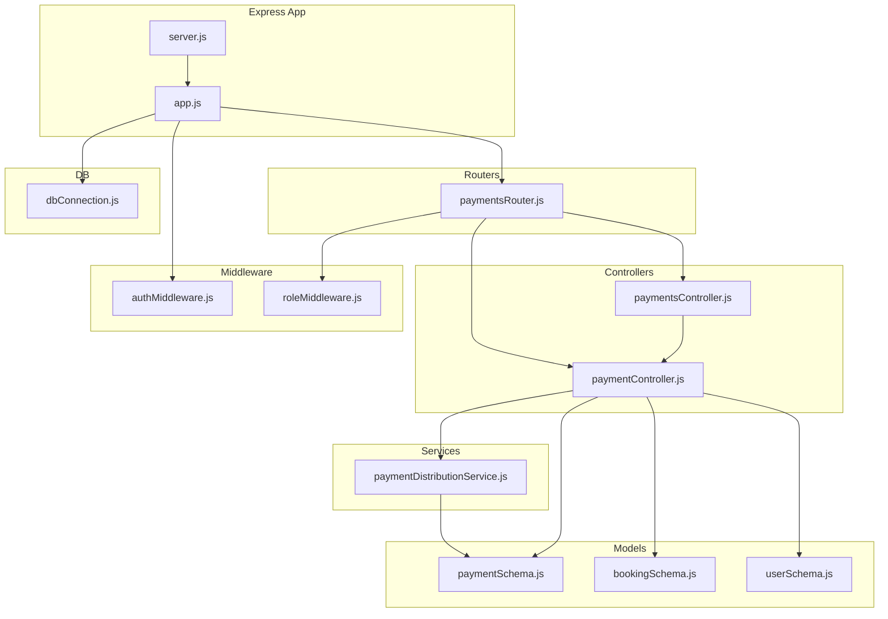
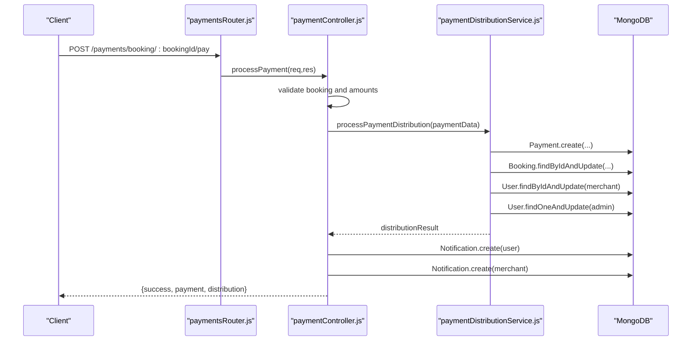
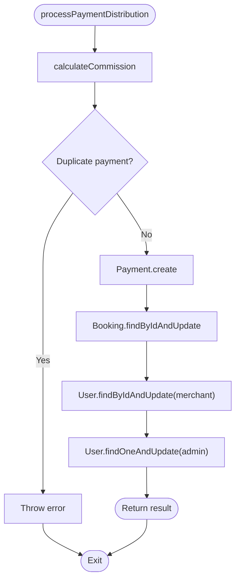
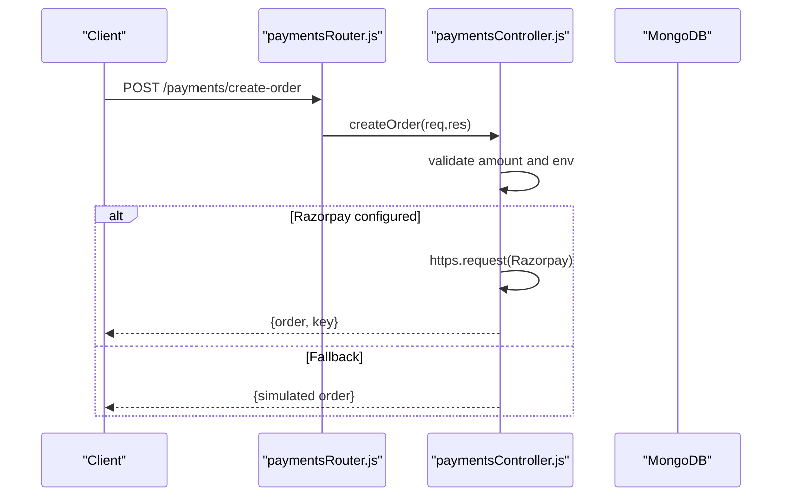
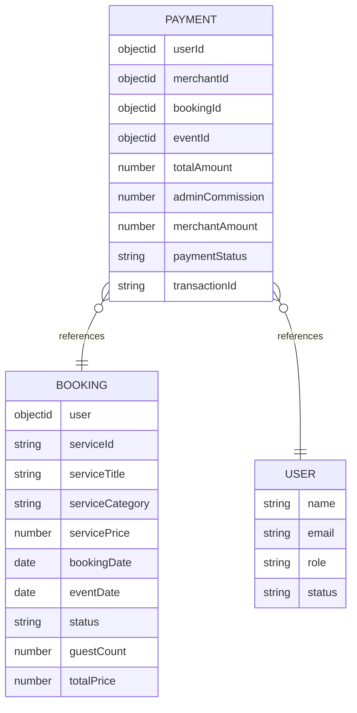
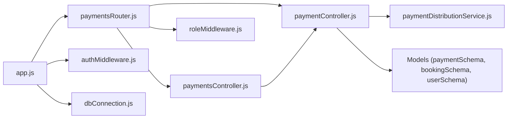

# Service Optimization

<cite>
**Referenced Files in This Document**
- [paymentDistributionService.js](file://backend/services/paymentDistributionService.js)
- [paymentController.js](file://backend/controller/paymentController.js)
- [paymentsController.js](file://backend/controller/paymentsController.js)
- [paymentsRouter.js](file://backend/router/paymentsRouter.js)
- [authMiddleware.js](file://backend/middleware/authMiddleware.js)
- [roleMiddleware.js](file://backend/middleware/roleMiddleware.js)
- [dbConnection.js](file://backend/database/dbConnection.js)
- [app.js](file://backend/app.js)
- [server.js](file://backend/server.js)
- [paymentSchema.js](file://backend/models/paymentSchema.js)
- [bookingSchema.js](file://backend/models/bookingSchema.js)
- [userSchema.js](file://backend/models/userSchema.js)
- [package.json](file://backend/package.json)
</cite>

## Table of Contents
1. [Introduction](#introduction)
2. [Project Structure](#project-structure)
3. [Core Components](#core-components)
4. [Architecture Overview](#architecture-overview)
5. [Detailed Component Analysis](#detailed-component-analysis)
6. [Dependency Analysis](#dependency-analysis)
7. [Performance Considerations](#performance-considerations)
8. [Troubleshooting Guide](#troubleshooting-guide)
9. [Conclusion](#conclusion)
10. [Appendices](#appendices)

## Introduction
This document provides comprehensive service optimization guidance for the backend services of the Event Management Platform with a focus on:
- Payment distribution service optimization
- Request handling efficiency
- Middleware performance improvements
- Controller-level optimizations
- Database query batching and indexing strategies
- Memory management
- Service caching mechanisms
- Rate limiting implementations
- Concurrent request handling
- Error handling optimization, logging performance, and resource cleanup strategies
- Monitoring approaches for service performance metrics, bottleneck identification, and scalability considerations for high-traffic scenarios

## Project Structure
The backend follows a layered architecture:
- Express application bootstrapped in app.js, initialized with environment configuration and middleware
- Routing delegated to modular routers (e.g., paymentsRouter.js)
- Controllers orchestrate business logic and interact with services and models
- Services encapsulate domain-specific operations (e.g., paymentDistributionService.js)
- Models define schemas and indexes for efficient querying
- Middleware enforces authentication and authorization
- Database connection module handles robust connectivity to MongoDB Atlas

**Diagram sources**
- [app.js:1-91](file://backend/app.js#L1-L91)
- [server.js:1-6](file://backend/server.js#L1-L6)
- [paymentsRouter.js:1-44](file://backend/router/paymentsRouter.js#L1-L44)
- [paymentController.js:1-577](file://backend/controller/paymentController.js#L1-L577)
- [paymentsController.js:1-281](file://backend/controller/paymentsController.js#L1-L281)
- [paymentDistributionService.js:1-340](file://backend/services/paymentDistributionService.js#L1-L340)
- [paymentSchema.js:1-142](file://backend/models/paymentSchema.js#L1-L142)
- [bookingSchema.js:1-53](file://backend/models/bookingSchema.js#L1-L53)
- [userSchema.js:1-55](file://backend/models/userSchema.js#L1-L55)
- [authMiddleware.js:1-17](file://backend/middleware/authMiddleware.js#L1-L17)
- [roleMiddleware.js:1-9](file://backend/middleware/roleMiddleware.js#L1-L9)
- [dbConnection.js:1-112](file://backend/database/dbConnection.js#L1-L112)

**Section sources**
- [app.js:1-91](file://backend/app.js#L1-L91)
- [server.js:1-6](file://backend/server.js#L1-L6)
- [paymentsRouter.js:1-44](file://backend/router/paymentsRouter.js#L1-L44)

## Core Components
- Payment distribution service: Calculates commissions, persists payment records, updates booking and user wallets, and supports refunds with atomic-like steps and aggregation-based reporting.
- Payment controllers: Handle Razorpay order creation/verification, service and ticket payments, and orchestrate payment distribution and notifications.
- Middleware: Authentication via JWT and role-based authorization.
- Database connection: Robust Atlas connectivity with multiple fallback strategies and connection tuning.
- Models: Indexed schemas for fast querying and pre-save validations.

Optimization opportunities:
- Reduce synchronous console logs in hot paths
- Batch and reuse database operations
- Introduce caching for static aggregates
- Add rate limiting and concurrency guards
- Optimize controller branching and early exits
- Centralize error handling and structured logging

**Section sources**
- [paymentDistributionService.js:1-340](file://backend/services/paymentDistributionService.js#L1-L340)
- [paymentController.js:1-577](file://backend/controller/paymentController.js#L1-L577)
- [paymentsController.js:1-281](file://backend/controller/paymentsController.js#L1-L281)
- [authMiddleware.js:1-17](file://backend/middleware/authMiddleware.js#L1-L17)
- [roleMiddleware.js:1-9](file://backend/middleware/roleMiddleware.js#L1-L9)
- [dbConnection.js:1-112](file://backend/database/dbConnection.js#L1-L112)
- [paymentSchema.js:1-142](file://backend/models/paymentSchema.js#L1-L142)

## Architecture Overview
The payment flow integrates controllers, services, and models while enforcing middleware checks. Payments are routed through dedicated endpoints, validated, distributed, persisted, and notifications are generated.

**Diagram sources**
- [paymentsRouter.js:27-28](file://backend/router/paymentsRouter.js#L27-L28)
- [paymentController.js:10-141](file://backend/controller/paymentController.js#L10-L141)
- [paymentDistributionService.js:33-159](file://backend/services/paymentDistributionService.js#L33-L159)

## Detailed Component Analysis

### Payment Distribution Service Optimization
Key areas:
- Commission calculation precision and rounding
- Atomicity of distribution steps (payment creation, booking update, merchant wallet, admin commission)
- Duplicate prevention and refund reversal
- Aggregation-based statistics for admin and merchant earnings

Recommendations:
- Replace console logs with structured logging (e.g., Winston) and reduce frequency in production
- Use transactions for multi-document writes to guarantee atomicity
- Cache frequently accessed aggregates (e.g., merchant earnings) with TTL
- Add circuit breaker for downstream dependencies (e.g., external payment gateway)
- Introduce idempotency keys for payment distribution to prevent duplicate processing

**Diagram sources**
- [paymentDistributionService.js:33-159](file://backend/services/paymentDistributionService.js#L33-L159)

**Section sources**
- [paymentDistributionService.js:1-340](file://backend/services/paymentDistributionService.js#L1-L340)

### Payment Controllers Optimization
Key areas:
- Early validation and explicit error responses
- Razorpay order creation with fallback to simulated orders
- Service and ticket payment flows with strict ownership and status checks
- Notification creation with try/catch to avoid blocking

Recommendations:
- Move amount validation to a shared utility to reduce duplication
- Add request/response sanitization and rate limiting per endpoint
- Cache event and booking metadata where safe
- Use async/await consistently and avoid redundant DB calls
- Centralize error handling with a unified response builder

**Diagram sources**
- [paymentsRouter.js:17-19](file://backend/router/paymentsRouter.js#L17-L19)
- [paymentsController.js:8-85](file://backend/controller/paymentsController.js#L8-L85)

**Section sources**
- [paymentsController.js:1-281](file://backend/controller/paymentsController.js#L1-L281)

### Middleware Performance Improvements
- Authentication middleware decodes JWT and attaches user info; ensure secret rotation and token expiration policies
- Role middleware restricts access; combine with rate limiting for protected endpoints

Recommendations:
- Add JWT refresh token rotation and blacklisting
- Introduce sliding window rate limiting per user/IP
- Cache role checks for short-lived tokens
- Validate headers efficiently and fail fast

**Section sources**
- [authMiddleware.js:1-17](file://backend/middleware/authMiddleware.js#L1-L17)
- [roleMiddleware.js:1-9](file://backend/middleware/roleMiddleware.js#L1-L9)

### Database Query Optimization and Indexing
- Payment schema includes composite indexes for userId/merchantId/bookingId/transactionId/paymentStatus
- Pre-save validation ensures amount integrity
- Controllers leverage population and sorting; consider pagination and selective field projection

Recommendations:
- Add compound indexes for frequent filter combinations (e.g., bookingId + paymentStatus)
- Use aggregation pipeline stages to minimize round trips
- Enable read preferences for analytics-heavy endpoints
- Monitor slow queries and add appropriate indexes

**Diagram sources**
- [paymentSchema.js:3-142](file://backend/models/paymentSchema.js#L3-L142)
- [bookingSchema.js:3-53](file://backend/models/bookingSchema.js#L3-L53)
- [userSchema.js:4-55](file://backend/models/userSchema.js#L4-L55)

**Section sources**
- [paymentSchema.js:1-142](file://backend/models/paymentSchema.js#L1-L142)
- [bookingSchema.js:1-53](file://backend/models/bookingSchema.js#L1-L53)
- [userSchema.js:1-55](file://backend/models/userSchema.js#L1-L55)

### Memory Management Strategies
- Controllers and services should avoid building large arrays or objects unnecessarily
- Use streaming or pagination for large result sets
- Dispose of temporary buffers promptly
- Prefer immutable transformations and avoid retaining closures that capture large objects

[No sources needed since this section provides general guidance]

### Service Caching Mechanisms
- Cache merchant earnings and admin statistics with TTL
- Cache frequently accessed booking/payment summaries
- Use cache-aside pattern with invalidation on write

[No sources needed since this section provides general guidance]

### Rate Limiting Implementations
- Apply per-endpoint rate limits (e.g., 100 requests/minute for payment endpoints)
- Enforce per-user/IP limits for sensitive operations
- Use in-memory or Redis-backed stores for counters

[No sources needed since this section provides general guidance]

### Concurrent Request Handling
- Ensure controllers and services are stateless
- Use connection pooling tuned for expected load
- Avoid blocking I/O in request handlers

**Section sources**
- [dbConnection.js:19-37](file://backend/database/dbConnection.js#L19-L37)

## Dependency Analysis
The payment workflow depends on:
- Router -> Controller -> Service -> Models
- Middleware enforcement before controller execution
- Database connection initialization before serving requests

**Diagram sources**
- [paymentsRouter.js:1-44](file://backend/router/paymentsRouter.js#L1-L44)
- [paymentController.js:1-577](file://backend/controller/paymentController.js#L1-L577)
- [paymentsController.js:1-281](file://backend/controller/paymentsController.js#L1-L281)
- [paymentDistributionService.js:1-340](file://backend/services/paymentDistributionService.js#L1-L340)
- [paymentSchema.js:1-142](file://backend/models/paymentSchema.js#L1-L142)
- [bookingSchema.js:1-53](file://backend/models/bookingSchema.js#L1-L53)
- [userSchema.js:1-55](file://backend/models/userSchema.js#L1-L55)
- [authMiddleware.js:1-17](file://backend/middleware/authMiddleware.js#L1-L17)
- [roleMiddleware.js:1-9](file://backend/middleware/roleMiddleware.js#L1-L9)
- [app.js:1-91](file://backend/app.js#L1-L91)
- [dbConnection.js:1-112](file://backend/database/dbConnection.js#L1-L112)

**Section sources**
- [paymentsRouter.js:1-44](file://backend/router/paymentsRouter.js#L1-L44)
- [paymentController.js:1-577](file://backend/controller/paymentController.js#L1-L577)
- [paymentsController.js:1-281](file://backend/controller/paymentsController.js#L1-L281)
- [paymentDistributionService.js:1-340](file://backend/services/paymentDistributionService.js#L1-L340)
- [paymentSchema.js:1-142](file://backend/models/paymentSchema.js#L1-L142)
- [bookingSchema.js:1-53](file://backend/models/bookingSchema.js#L1-L53)
- [userSchema.js:1-55](file://backend/models/userSchema.js#L1-L55)
- [authMiddleware.js:1-17](file://backend/middleware/authMiddleware.js#L1-L17)
- [roleMiddleware.js:1-9](file://backend/middleware/roleMiddleware.js#L1-L9)
- [app.js:1-91](file://backend/app.js#L1-L91)
- [dbConnection.js:1-112](file://backend/database/dbConnection.js#L1-L112)

## Performance Considerations
- Logging: Replace verbose console logs with structured logging and sampling in production
- Transactions: Wrap multi-write distribution steps to maintain consistency
- Batching: Combine reads/writes where possible (e.g., batch notifications)
- Caching: Cache aggregates and repeated reads with TTL and cache warming
- Concurrency: Tune pool sizes and timeouts; avoid long-running synchronous operations
- Monitoring: Instrument endpoints, DB queries, and middleware latency

[No sources needed since this section provides general guidance]

## Troubleshooting Guide
Common issues and remedies:
- Unauthorized access: Ensure auth middleware is applied and JWT is valid
- Role restrictions: Verify ensureRole middleware for admin-only endpoints
- Database connectivity: Check Atlas credentials and network access; review retry logic
- Payment duplication: Use idempotency keys and duplicate detection
- Slow aggregations: Add indexes and consider caching aggregated stats

**Section sources**
- [authMiddleware.js:1-17](file://backend/middleware/authMiddleware.js#L1-L17)
- [roleMiddleware.js:1-9](file://backend/middleware/roleMiddleware.js#L1-L9)
- [dbConnection.js:19-94](file://backend/database/dbConnection.js#L19-L94)
- [paymentDistributionService.js:58-66](file://backend/services/paymentDistributionService.js#L58-L66)

## Conclusion
The Event Management Platform’s backend demonstrates a clean separation of concerns with controllers orchestrating services and models. To achieve optimal performance under high traffic:
- Harden the payment distribution service with transactions and idempotency
- Optimize controllers with early exits, sanitization, and rate limiting
- Improve middleware throughput with efficient JWT handling and caching
- Strengthen database performance with targeted indexes and aggregation pipelines
- Implement robust monitoring, logging, and resource cleanup strategies

[No sources needed since this section summarizes without analyzing specific files]

## Appendices

### Endpoint Reference
- Payment processing: POST /payments/booking/:bookingId/pay
- Service payment: POST /payments/pay-service
- Ticket payment: POST /payments/booking/:bookingId/pay-ticket
- Order creation: POST /payments/create-order
- Verification: POST /payments/verify
- Refund: POST /payments/booking/:bookingId/refund
- Admin statistics: GET /payments/admin/statistics
- Merchant earnings: GET /payments/merchant/earnings

**Section sources**
- [paymentsRouter.js:17-41](file://backend/router/paymentsRouter.js#L17-L41)

### Dependencies and Environment
- Express, mongoose, jsonwebtoken, cors, dotenv, nodemailer, validator
- Production startup via server.js and app initialization

**Section sources**
- [package.json:1-30](file://backend/package.json#L1-L30)
- [server.js:1-6](file://backend/server.js#L1-L6)
- [app.js:64-88](file://backend/app.js#L64-L88)