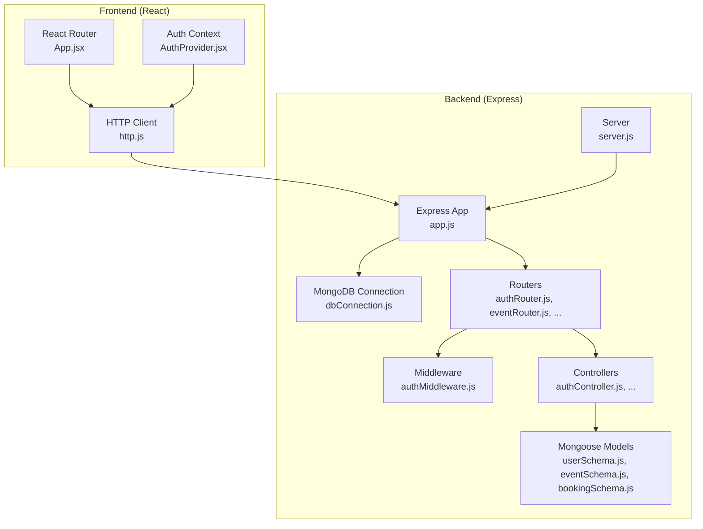
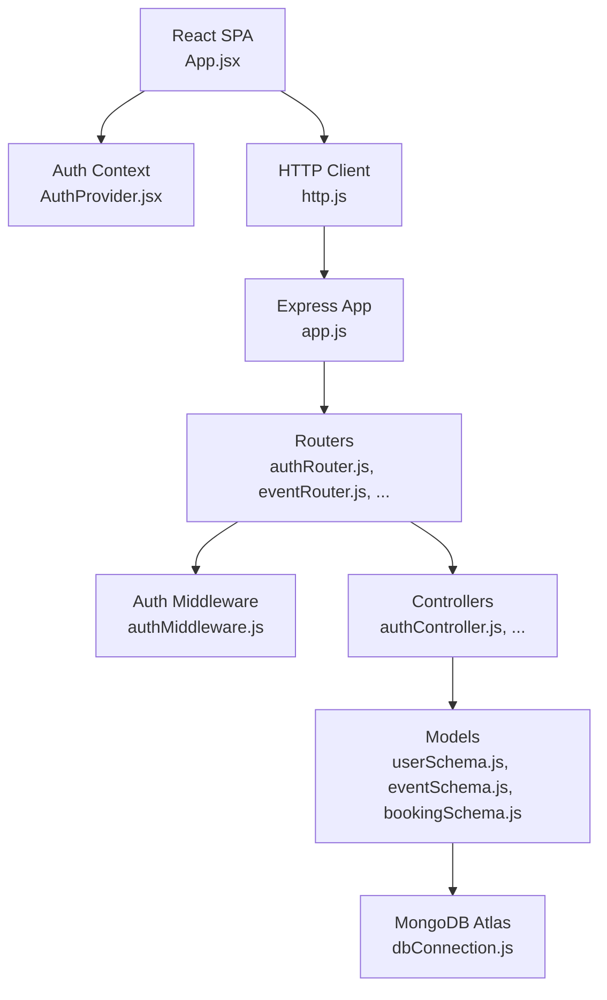
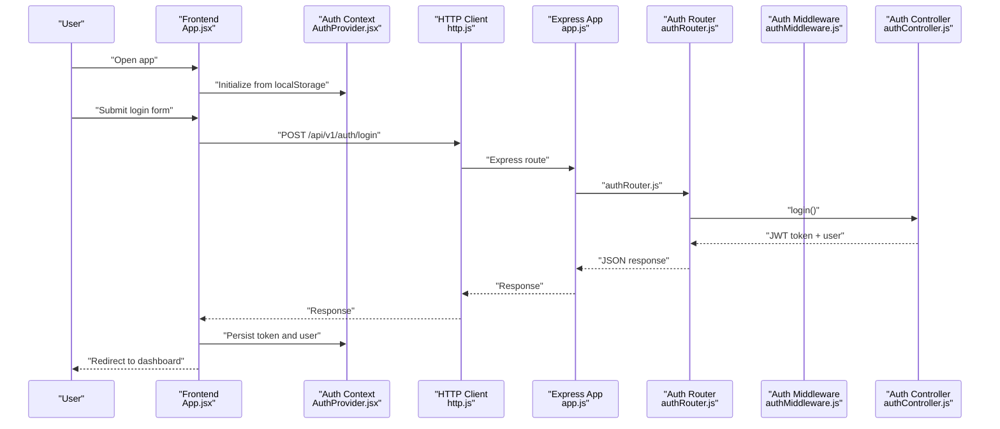
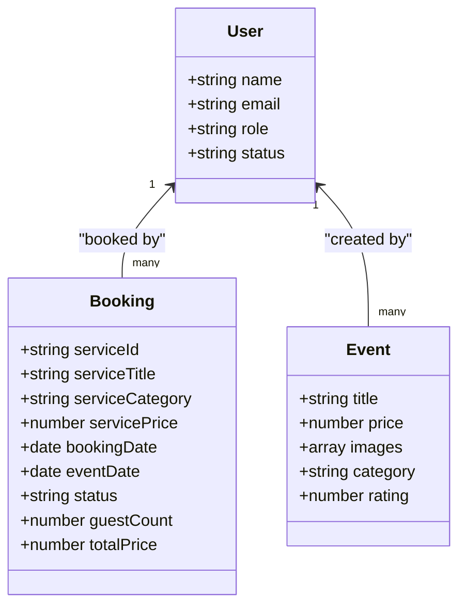
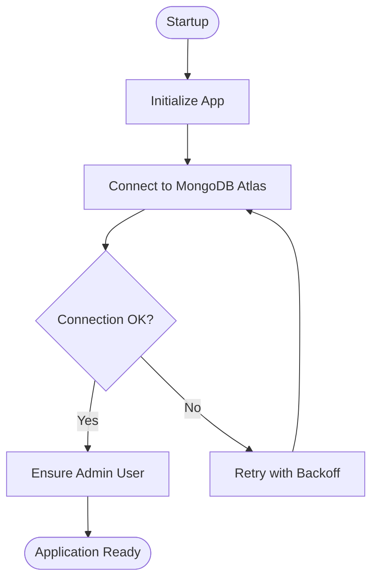
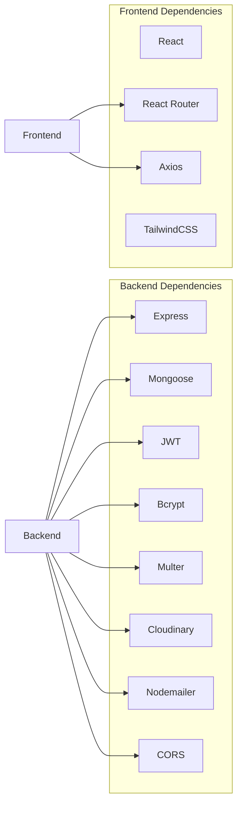

# Project Overview

<cite>
**Referenced Files in This Document**
- [backend/package.json](file://backend/package.json)
- [frontend/package.json](file://frontend/package.json)
- [backend/app.js](file://backend/app.js)
- [backend/server.js](file://backend/server.js)
- [backend/database/dbConnection.js](file://backend/database/dbConnection.js)
- [backend/middleware/authMiddleware.js](file://backend/middleware/authMiddleware.js)
- [backend/router/authRouter.js](file://backend/router/authRouter.js)
- [backend/controller/authController.js](file://backend/controller/authController.js)
- [backend/models/userSchema.js](file://backend/models/userSchema.js)
- [backend/models/eventSchema.js](file://backend/models/eventSchema.js)
- [backend/models/bookingSchema.js](file://backend/models/bookingSchema.js)
- [frontend/src/App.jsx](file://frontend/src/App.jsx)
- [frontend/src/context/AuthProvider.jsx](file://frontend/src/context/AuthProvider.jsx)
- [frontend/src/lib/http.js](file://frontend/src/lib/http.js)
</cite>

## Table of Contents
1. [Introduction](#introduction)
2. [Project Structure](#project-structure)
3. [Core Components](#core-components)
4. [Architecture Overview](#architecture-overview)
5. [Detailed Component Analysis](#detailed-component-analysis)
6. [Dependency Analysis](#dependency-analysis)
7. [Performance Considerations](#performance-considerations)
8. [Troubleshooting Guide](#troubleshooting-guide)
9. [Conclusion](#conclusion)

## Introduction
This MERN Stack Event Management Platform is a full-stack web application designed to support three primary user roles: users, merchants, and administrators. It enables users to browse, discover, and book events and services; allows merchants to manage their offerings and bookings; and provides administrators with analytics, user and merchant oversight, and platform-wide controls. The platform emphasizes secure authentication, robust data persistence with MongoDB, scalable API design with Express.js, and a responsive, role-aware UI built with React.js.

Key value propositions:
- Unified multi-role experience with role-based routing and permissions
- End-to-end booking workflows for both events and services
- Secure authentication with JWT and protected routes
- Scalable backend architecture with modular routers/controllers
- Real-time readiness with structured data models and REST endpoints

Target audience:
- Event attendees seeking discovery and booking
- Merchants managing events and service offerings
- Administrators overseeing platform health and analytics

## Project Structure
The project follows a classic MERN stack separation:
- Backend: Node.js + Express.js with modular routers, controllers, middleware, models, and utilities
- Frontend: React.js SPA with route-based dashboards per role and shared UI components
- Shared concerns: Authentication context, HTTP client configuration, and environment-driven configuration

**Diagram sources**
- [frontend/src/App.jsx:51-373](file://frontend/src/App.jsx#L51-L373)
- [frontend/src/context/AuthProvider.jsx:1-38](file://frontend/src/context/AuthProvider.jsx#L1-L38)
- [frontend/src/lib/http.js:1-5](file://frontend/src/lib/http.js#L1-L5)
- [backend/server.js:1-6](file://backend/server.js#L1-L6)
- [backend/app.js:1-79](file://backend/app.js#L1-L79)
- [backend/database/dbConnection.js:19-112](file://backend/database/dbConnection.js#L19-L112)
- [backend/router/authRouter.js:1-12](file://backend/router/authRouter.js#L1-L12)
- [backend/middleware/authMiddleware.js:1-17](file://backend/middleware/authMiddleware.js#L1-L17)
- [backend/controller/authController.js:1-120](file://backend/controller/authController.js#L1-L120)
- [backend/models/userSchema.js:1-55](file://backend/models/userSchema.js#L1-L55)
- [backend/models/eventSchema.js:1-23](file://backend/models/eventSchema.js#L1-L23)
- [backend/models/bookingSchema.js:1-53](file://backend/models/bookingSchema.js#L1-L53)

**Section sources**
- [backend/package.json:1-30](file://backend/package.json#L1-L30)
- [frontend/package.json:1-37](file://frontend/package.json#L1-L37)
- [backend/app.js:1-79](file://backend/app.js#L1-L79)
- [backend/server.js:1-6](file://backend/server.js#L1-L6)
- [frontend/src/App.jsx:51-373](file://frontend/src/App.jsx#L51-L373)

## Core Components
- Authentication and Authorization
  - JWT-based authentication with middleware verifying tokens and attaching user context
  - Protected routes enforced by role-aware wrappers
- Data Models
  - User model with role enumeration and status flags
  - Event model capturing metadata, pricing, and image references
  - Booking model for service-based reservations with lifecycle statuses
- Routing and Controllers
  - Modular routers for auth, events, bookings, and more
  - Controllers implementing business logic for registration, login, and profile retrieval
- Frontend Routing and State
  - Role-based dashboards and navigation
  - Centralized authentication state persisted in local storage

Practical examples:
- Event browsing: Users navigate to browse listings, view details, and initiate registration
- Booking workflow: Users select a service, enter details, confirm, and receive a booking confirmation
- Administrative management: Admins monitor analytics, manage users and merchants, and oversee platform settings

**Section sources**
- [backend/middleware/authMiddleware.js:1-17](file://backend/middleware/authMiddleware.js#L1-L17)
- [backend/router/authRouter.js:1-12](file://backend/router/authRouter.js#L1-L12)
- [backend/controller/authController.js:1-120](file://backend/controller/authController.js#L1-L120)
- [backend/models/userSchema.js:1-55](file://backend/models/userSchema.js#L1-L55)
- [backend/models/eventSchema.js:1-23](file://backend/models/eventSchema.js#L1-L23)
- [backend/models/bookingSchema.js:1-53](file://backend/models/bookingSchema.js#L1-L53)
- [frontend/src/App.jsx:51-373](file://frontend/src/App.jsx#L51-L373)
- [frontend/src/context/AuthProvider.jsx:1-38](file://frontend/src/context/AuthProvider.jsx#L1-L38)

## Architecture Overview
High-level architecture:
- Frontend (React) communicates with backend REST endpoints via Axios
- Backend exposes versioned API routes under /api/v1
- Authentication middleware validates JWT tokens and injects user identity
- Database connection is centralized and robustly configured for MongoDB Atlas with retry logic and DNS overrides
- Models define schemas for Users, Events, and Bookings

**Diagram sources**
- [frontend/src/App.jsx:51-373](file://frontend/src/App.jsx#L51-L373)
- [frontend/src/context/AuthProvider.jsx:1-38](file://frontend/src/context/AuthProvider.jsx#L1-L38)
- [frontend/src/lib/http.js:1-5](file://frontend/src/lib/http.js#L1-L5)
- [backend/app.js:1-79](file://backend/app.js#L1-L79)
- [backend/router/authRouter.js:1-12](file://backend/router/authRouter.js#L1-L12)
- [backend/middleware/authMiddleware.js:1-17](file://backend/middleware/authMiddleware.js#L1-L17)
- [backend/controller/authController.js:1-120](file://backend/controller/authController.js#L1-L120)
- [backend/models/userSchema.js:1-55](file://backend/models/userSchema.js#L1-L55)
- [backend/models/eventSchema.js:1-23](file://backend/models/eventSchema.js#L1-L23)
- [backend/models/bookingSchema.js:1-53](file://backend/models/bookingSchema.js#L1-L53)
- [backend/database/dbConnection.js:19-112](file://backend/database/dbConnection.js#L19-L112)

## Detailed Component Analysis

### Authentication Flow
The authentication flow integrates frontend state management with backend endpoints and middleware.

**Diagram sources**
- [frontend/src/App.jsx:51-373](file://frontend/src/App.jsx#L51-L373)
- [frontend/src/context/AuthProvider.jsx:1-38](file://frontend/src/context/AuthProvider.jsx#L1-L38)
- [frontend/src/lib/http.js:1-5](file://frontend/src/lib/http.js#L1-L5)
- [backend/app.js:1-79](file://backend/app.js#L1-L79)
- [backend/router/authRouter.js:1-12](file://backend/router/authRouter.js#L1-L12)
- [backend/middleware/authMiddleware.js:1-17](file://backend/middleware/authMiddleware.js#L1-L17)
- [backend/controller/authController.js:54-107](file://backend/controller/authController.js#L54-L107)

**Section sources**
- [backend/controller/authController.js:1-120](file://backend/controller/authController.js#L1-L120)
- [backend/middleware/authMiddleware.js:1-17](file://backend/middleware/authMiddleware.js#L1-L17)
- [frontend/src/context/AuthProvider.jsx:1-38](file://frontend/src/context/AuthProvider.jsx#L1-L38)
- [frontend/src/lib/http.js:1-5](file://frontend/src/lib/http.js#L1-L5)

### Data Models Overview
The backend defines core domain models with relationships and constraints.

**Diagram sources**
- [backend/models/userSchema.js:1-55](file://backend/models/userSchema.js#L1-L55)
- [backend/models/eventSchema.js:1-23](file://backend/models/eventSchema.js#L1-L23)
- [backend/models/bookingSchema.js:1-53](file://backend/models/bookingSchema.js#L1-L53)

**Section sources**
- [backend/models/userSchema.js:1-55](file://backend/models/userSchema.js#L1-L55)
- [backend/models/eventSchema.js:1-23](file://backend/models/eventSchema.js#L1-L23)
- [backend/models/bookingSchema.js:1-53](file://backend/models/bookingSchema.js#L1-L53)

### Database Connectivity and Initialization
The backend initializes the database connection with multiple fallback strategies and ensures admin setup on startup.

**Diagram sources**
- [backend/app.js:52-76](file://backend/app.js#L52-L76)
- [backend/database/dbConnection.js:19-112](file://backend/database/dbConnection.js#L19-L112)

**Section sources**
- [backend/app.js:52-76](file://backend/app.js#L52-L76)
- [backend/database/dbConnection.js:19-112](file://backend/database/dbConnection.js#L19-L112)

## Dependency Analysis
Technology stack and module-level relationships:
- Backend dependencies include Express, Mongoose, JWT, Bcrypt, Multer, Cloudinary, Nodemailer, and CORS
- Frontend dependencies include React, React Router, Axios, TailwindCSS, and related dev tools
- Frontend relies on a centralized HTTP client and authentication context for API communication
- Backend centralizes database connectivity and exposes modular routers for feature domains

**Diagram sources**
- [backend/package.json:13-25](file://backend/package.json#L13-L25)
- [frontend/package.json:12-21](file://frontend/package.json#L12-L21)

**Section sources**
- [backend/package.json:1-30](file://backend/package.json#L1-L30)
- [frontend/package.json:1-37](file://frontend/package.json#L1-L37)

## Performance Considerations
- Database connection resilience: Multiple Atlas connection strategies and retry/backoff reduce downtime
- Token-based auth avoids session overhead and scales horizontally
- Modular routers and controllers keep request handling focused and testable
- Environment-controlled timeouts and pool sizes help maintain responsiveness under load

## Troubleshooting Guide
Common areas to inspect:
- Database connectivity: Verify Atlas credentials, network access, and DNS resolution; the backend includes explicit DNS overrides and multiple connection strategies
- Authentication: Ensure JWT secret is configured and tokens are included in Authorization headers
- CORS: Confirm frontend URL matches backend CORS configuration
- Local storage persistence: Verify token and user are stored and retrieved by the Auth Provider

Operational endpoints:
- Health check: GET /api/v1/health
- Config check: GET /api/v1/config-check

**Section sources**
- [backend/app.js:37-50](file://backend/app.js#L37-L50)
- [backend/database/dbConnection.js:4-17](file://backend/database/dbConnection.js#L4-L17)
- [frontend/src/context/AuthProvider.jsx:9-28](file://frontend/src/context/AuthProvider.jsx#L9-L28)

## Conclusion
This MERN Stack Event Management Platform provides a solid foundation for a multi-role event and service booking ecosystem. Its modular backend, robust authentication, and role-aware frontend enable scalable growth while maintaining clear separation of concerns. By leveraging MongoDB Atlas for persistence, JWT for secure sessions, and React for an intuitive UI, the platform supports users, merchants, and administrators with streamlined workflows and strong operational controls.