# Authentication Security

<cite>
**Referenced Files in This Document**
- [authMiddleware.js](file://backend/middleware/authMiddleware.js)
- [authController.js](file://backend/controller/authController.js)
- [userSchema.js](file://backend/models/userSchema.js)
- [authRouter.js](file://backend/router/authRouter.js)
- [config.env](file://backend/config/config.env)
- [roleMiddleware.js](file://backend/middleware/roleMiddleware.js)
- [ensureAdmin.js](file://backend/util/ensureAdmin.js)
- [app.js](file://backend/app.js)
- [AuthProvider.jsx](file://frontend/src/context/AuthProvider.jsx)
- [AuthContext.js](file://frontend/src/context/AuthContext.js)
- [useAuth.js](file://frontend/src/context/useAuth.js)
</cite>

## Table of Contents
1. [Introduction](#introduction)
2. [Project Structure](#project-structure)
3. [Core Components](#core-components)
4. [Architecture Overview](#architecture-overview)
5. [Detailed Component Analysis](#detailed-component-analysis)
6. [Dependency Analysis](#dependency-analysis)
7. [Performance Considerations](#performance-considerations)
8. [Troubleshooting Guide](#troubleshooting-guide)
9. [Conclusion](#conclusion)

## Introduction
This document provides comprehensive authentication security documentation for the MERN stack event management project. It covers JWT token implementation, password hashing with bcrypt, token verification processes, session management, middleware enforcement, and role-based access control. It also explains how bearer tokens are extracted from HTTP headers, how JWT secrets are managed via environment configuration, and how unauthorized access is handled. The document includes code-level diagrams and references to specific implementation files to help developers understand and maintain secure authentication flows.

## Project Structure
Authentication-related components are organized across backend controllers, middleware, routers, models, and environment configuration. The frontend provides a React context for managing local session state.

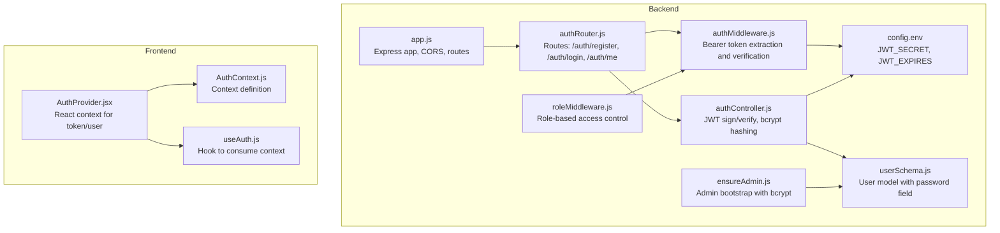

**Diagram sources**
- [authController.js:1-120](file://backend/controller/authController.js#L1-L120)
- [authMiddleware.js:1-17](file://backend/middleware/authMiddleware.js#L1-L17)
- [roleMiddleware.js:1-9](file://backend/middleware/roleMiddleware.js#L1-L9)
- [authRouter.js:1-12](file://backend/router/authRouter.js#L1-L12)
- [userSchema.js:1-55](file://backend/models/userSchema.js#L1-L55)
- [config.env:23-26](file://backend/config/config.env#L23-L26)
- [ensureAdmin.js:1-35](file://backend/util/ensureAdmin.js#L1-L35)
- [app.js:1-91](file://backend/app.js#L1-L91)
- [AuthProvider.jsx:1-37](file://frontend/src/context/AuthProvider.jsx#L1-L37)
- [AuthContext.js:1-5](file://frontend/src/context/AuthContext.js#L1-L5)
- [useAuth.js:1-6](file://frontend/src/context/useAuth.js#L1-L6)

**Section sources**
- [authController.js:1-120](file://backend/controller/authController.js#L1-L120)
- [authMiddleware.js:1-17](file://backend/middleware/authMiddleware.js#L1-L17)
- [roleMiddleware.js:1-9](file://backend/middleware/roleMiddleware.js#L1-L9)
- [authRouter.js:1-12](file://backend/router/authRouter.js#L1-L12)
- [userSchema.js:1-55](file://backend/models/userSchema.js#L1-L55)
- [config.env:23-26](file://backend/config/config.env#L23-L26)
- [ensureAdmin.js:1-35](file://backend/util/ensureAdmin.js#L1-L35)
- [app.js:1-91](file://backend/app.js#L1-L91)
- [AuthProvider.jsx:1-37](file://frontend/src/context/AuthProvider.jsx#L1-L37)
- [AuthContext.js:1-5](file://frontend/src/context/AuthContext.js#L1-L5)
- [useAuth.js:1-6](file://frontend/src/context/useAuth.js#L1-L6)

## Core Components
- JWT token issuance and verification: Implemented in the authentication controller and middleware using jsonwebtoken. Tokens are signed with a secret from environment configuration and include user identity and role claims.
- Password hashing: bcrypt is used to hash passwords before storing user credentials, with a configurable salt factor.
- Token extraction from headers: Middleware extracts the Authorization header, validates the Bearer scheme, and passes the token to the verifier.
- Session management: The backend uses JWT for stateless session tokens. The frontend persists tokens and user data in localStorage via a React context provider.
- Role-based access control: A dedicated middleware enforces allowed roles based on the decoded token’s role claim.
- Secret and expiration management: JWT secret and expiration are configured in environment variables.

**Section sources**
- [authController.js:5-9](file://backend/controller/authController.js#L5-L9)
- [authMiddleware.js:3-16](file://backend/middleware/authMiddleware.js#L3-L16)
- [userSchema.js:33-38](file://backend/models/userSchema.js#L33-L38)
- [config.env:23-26](file://backend/config/config.env#L23-L26)
- [roleMiddleware.js:1-9](file://backend/middleware/roleMiddleware.js#L1-L9)
- [AuthProvider.jsx:16-28](file://frontend/src/context/AuthProvider.jsx#L16-L28)

## Architecture Overview
The authentication flow spans client and server. On the backend, Express routes delegate to the authentication controller for registration and login, and to the auth middleware for protected routes. The auth middleware verifies JWTs against the configured secret and attaches user identity and role to the request. Role enforcement is applied via a separate middleware. On the frontend, a React context stores tokens and user metadata locally.

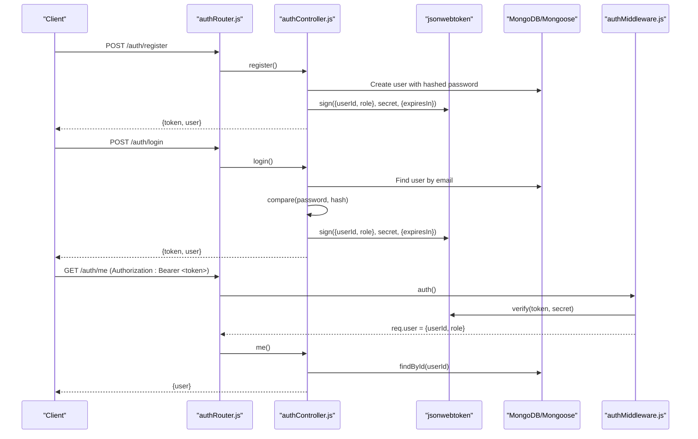

**Diagram sources**
- [authRouter.js:7-9](file://backend/router/authRouter.js#L7-L9)
- [authController.js:11-52](file://backend/controller/authController.js#L11-L52)
- [authController.js:54-107](file://backend/controller/authController.js#L54-L107)
- [authController.js:109-119](file://backend/controller/authController.js#L109-L119)
- [authMiddleware.js:3-16](file://backend/middleware/authMiddleware.js#L3-L16)

## Detailed Component Analysis

### JWT Implementation and Token Verification
- Token signing: The authentication controller signs a payload containing user ID and role with the JWT secret and sets an expiration period from environment configuration.
- Token verification: The auth middleware extracts the Bearer token from the Authorization header, verifies it against the secret, and attaches decoded user identity and role to the request object.
- Error handling: On missing or invalid tokens, the middleware responds with an unauthorized status and a standardized message.

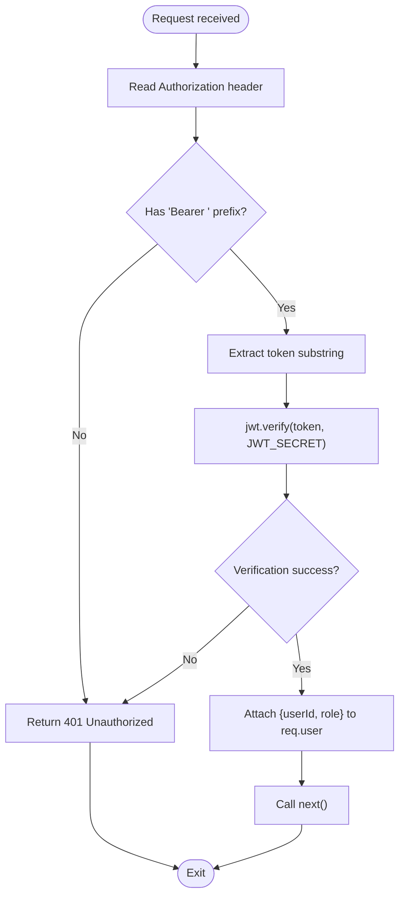

**Diagram sources**
- [authMiddleware.js:3-16](file://backend/middleware/authMiddleware.js#L3-L16)
- [config.env:23-26](file://backend/config/config.env#L23-L26)

**Section sources**
- [authController.js:5-9](file://backend/controller/authController.js#L5-L9)
- [authMiddleware.js:3-16](file://backend/middleware/authMiddleware.js#L3-L16)
- [config.env:23-26](file://backend/config/config.env#L23-L26)

### Password Hashing with bcrypt
- Registration and admin bootstrap: Passwords are hashed using bcrypt before persisting user records. The salt factor is configured in the hashing function.
- Login comparison: During login, the provided password is compared against the stored hash to authenticate the user.

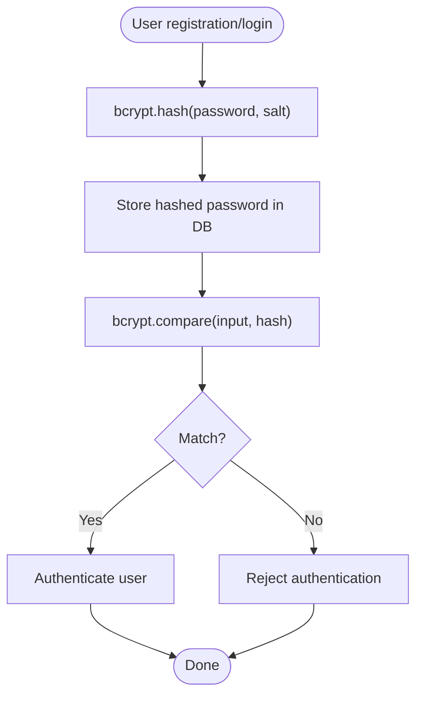

**Diagram sources**
- [authController.js:31-31](file://backend/controller/authController.js#L31-L31)
- [authController.js:75-75](file://backend/controller/authController.js#L75-L75)
- [ensureAdmin.js:19-28](file://backend/util/ensureAdmin.js#L19-L28)

**Section sources**
- [authController.js:31-31](file://backend/controller/authController.js#L31-L31)
- [authController.js:75-75](file://backend/controller/authController.js#L75-L75)
- [ensureAdmin.js:19-28](file://backend/util/ensureAdmin.js#L19-L28)

### Token Extraction from Headers
- The auth middleware reads the Authorization header, checks for the Bearer scheme, and extracts the token portion. If the header is missing or not prefixed with Bearer, it rejects the request with an unauthorized status.

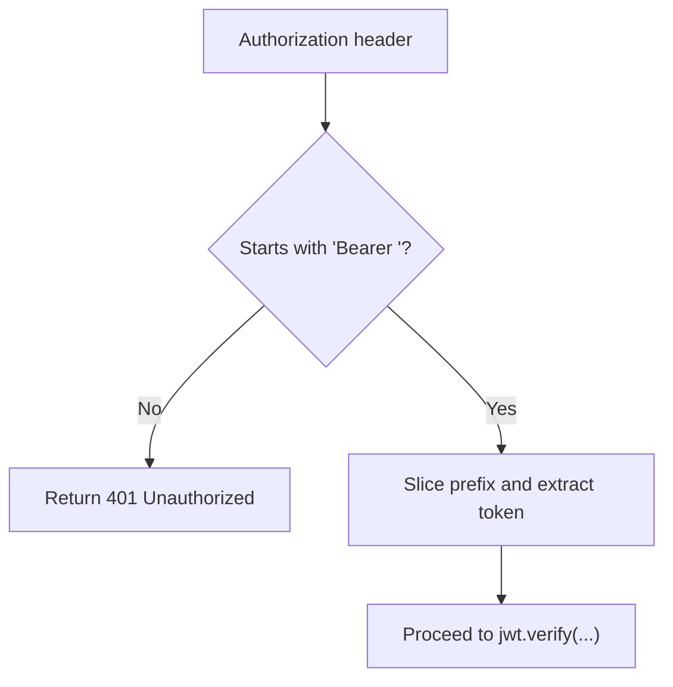

**Diagram sources**
- [authMiddleware.js:5-6](file://backend/middleware/authMiddleware.js#L5-L6)

**Section sources**
- [authMiddleware.js:5-6](file://backend/middleware/authMiddleware.js#L5-L6)

### JWT Secret Management
- The JWT secret and expiration are configured in the environment file. The secret is used by both the authentication controller for signing and the auth middleware for verification.

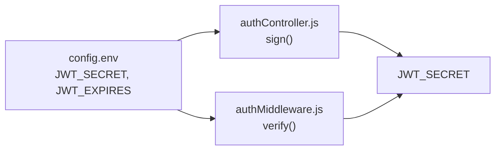

**Diagram sources**
- [config.env:23-26](file://backend/config/config.env#L23-L26)
- [authController.js:5-9](file://backend/controller/authController.js#L5-L9)
- [authMiddleware.js:10-10](file://backend/middleware/authMiddleware.js#L10-L10)

**Section sources**
- [config.env:23-26](file://backend/config/config.env#L23-L26)
- [authController.js:5-9](file://backend/controller/authController.js#L5-L9)
- [authMiddleware.js:10-10](file://backend/middleware/authMiddleware.js#L10-L10)

### Session Management
- Backend: Stateless JWT-based sessions. Tokens carry identity and role; middleware attaches user info to requests for protected endpoints.
- Frontend: React context persists token and user data in localStorage and exposes login/logout actions. The context provider initializes state from localStorage on mount.

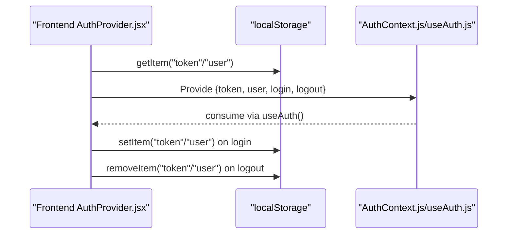

**Diagram sources**
- [AuthProvider.jsx:9-28](file://frontend/src/context/AuthProvider.jsx#L9-L28)
- [AuthContext.js:1-5](file://frontend/src/context/AuthContext.js#L1-L5)
- [useAuth.js:1-6](file://frontend/src/context/useAuth.js#L1-L6)

**Section sources**
- [AuthProvider.jsx:9-28](file://frontend/src/context/AuthProvider.jsx#L9-L28)
- [AuthContext.js:1-5](file://frontend/src/context/AuthContext.js#L1-L5)
- [useAuth.js:1-6](file://frontend/src/context/useAuth.js#L1-L6)

### Role-Based Access Control
- The role middleware checks whether the authenticated user’s role is included in the allowed roles. If not, it returns a forbidden response. This middleware relies on the presence of req.user populated by the auth middleware.

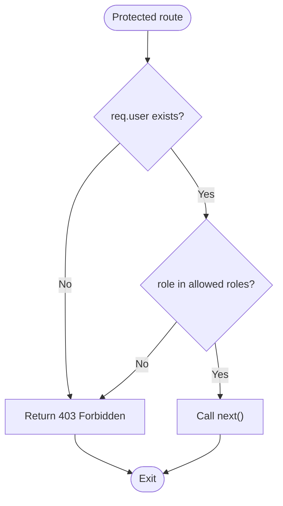

**Diagram sources**
- [roleMiddleware.js:1-9](file://backend/middleware/roleMiddleware.js#L1-L9)
- [authMiddleware.js:11-11](file://backend/middleware/authMiddleware.js#L11-L11)

**Section sources**
- [roleMiddleware.js:1-9](file://backend/middleware/roleMiddleware.js#L1-L9)
- [authMiddleware.js:11-11](file://backend/middleware/authMiddleware.js#L11-L11)

### User Model and Password Field
- The user schema defines the password field with strict validation and ensures it is not returned in queries by default. This protects sensitive data and aligns with secure defaults.

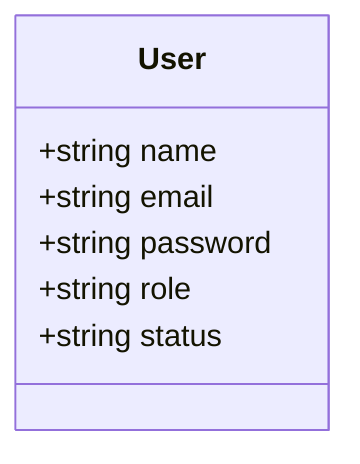

**Diagram sources**
- [userSchema.js:4-52](file://backend/models/userSchema.js#L4-L52)

**Section sources**
- [userSchema.js:33-38](file://backend/models/userSchema.js#L33-L38)

### Admin Bootstrap and Password Reset
- The admin bootstrap utility ensures an admin user exists, hashing the password and setting the role to admin. It supports optional forced resets via environment flags.

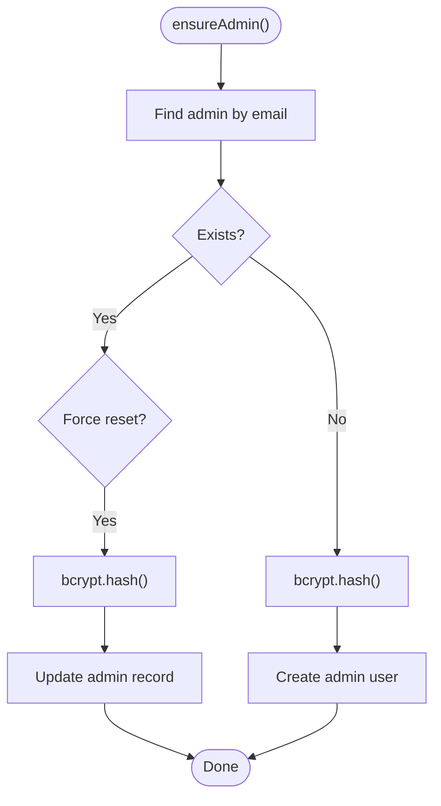

**Diagram sources**
- [ensureAdmin.js:4-34](file://backend/util/ensureAdmin.js#L4-L34)

**Section sources**
- [ensureAdmin.js:4-34](file://backend/util/ensureAdmin.js#L4-L34)

## Dependency Analysis
The authentication system exhibits clear separation of concerns:
- Routes depend on the authentication controller for registration and login, and on the auth middleware for protection.
- The auth middleware depends on the JWT library and environment configuration for secret and expiration.
- The authentication controller depends on bcrypt for hashing and the user model for persistence.
- Role enforcement middleware depends on the auth middleware’s decoded user claims.
- The frontend context depends on localStorage for persistence and exposes a simple API for login/logout.

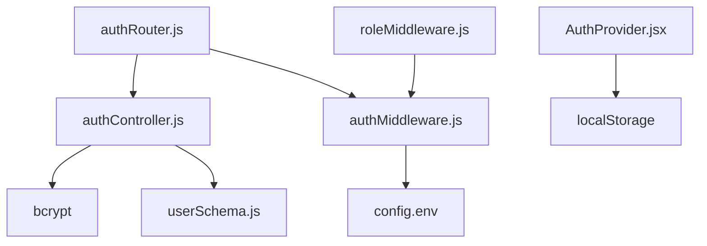

**Diagram sources**
- [authRouter.js:1-12](file://backend/router/authRouter.js#L1-L12)
- [authController.js:1-3](file://backend/controller/authController.js#L1-L3)
- [authMiddleware.js:1-1](file://backend/middleware/authMiddleware.js#L1-L1)
- [config.env:23-26](file://backend/config/config.env#L23-L26)
- [userSchema.js:1-2](file://backend/models/userSchema.js#L1-L2)
- [roleMiddleware.js:1-1](file://backend/middleware/roleMiddleware.js#L1-L1)
- [AuthProvider.jsx:1-3](file://frontend/src/context/AuthProvider.jsx#L1-L3)

**Section sources**
- [authRouter.js:1-12](file://backend/router/authRouter.js#L1-L12)
- [authController.js:1-3](file://backend/controller/authController.js#L1-L3)
- [authMiddleware.js:1-1](file://backend/middleware/authMiddleware.js#L1-L1)
- [config.env:23-26](file://backend/config/config.env#L23-L26)
- [userSchema.js:1-2](file://backend/models/userSchema.js#L1-L2)
- [roleMiddleware.js:1-1](file://backend/middleware/roleMiddleware.js#L1-L1)
- [AuthProvider.jsx:1-3](file://frontend/src/context/AuthProvider.jsx#L1-L3)

## Performance Considerations
- Token verification cost: JWT verification is lightweight compared to database lookups. Keep the JWT secret strong and avoid excessive token lifetimes to balance security and performance.
- bcrypt cost: Hashing uses a moderate cost factor; adjust according to server capacity. Avoid overly high costs that increase latency on registration/login.
- Middleware overhead: The auth middleware performs a single header parse and a single verification call per protected request.
- Frontend caching: Persisting tokens in localStorage avoids repeated logins but requires secure storage practices and prompt removal on logout.

## Troubleshooting Guide
Common issues and resolutions:
- Unauthorized errors on protected routes:
  - Ensure the Authorization header is present and starts with the Bearer scheme.
  - Verify the JWT secret matches the backend configuration.
  - Confirm the token is not expired.
- Login failures:
  - Check that the email exists and the password matches the stored hash.
  - Confirm bcrypt is installed and functioning.
- Role-based access denied:
  - Verify the user’s role claim in the token matches allowed roles.
  - Ensure the auth middleware runs before the role middleware.
- Frontend session not persisting:
  - Confirm localStorage keys exist after login.
  - Ensure the context provider wraps the application and useAuth is used correctly.

**Section sources**
- [authMiddleware.js:7-15](file://backend/middleware/authMiddleware.js#L7-L15)
- [authController.js:70-81](file://backend/controller/authController.js#L70-L81)
- [roleMiddleware.js:3-4](file://backend/middleware/roleMiddleware.js#L3-L4)
- [AuthProvider.jsx:16-28](file://frontend/src/context/AuthProvider.jsx#L16-L28)

## Conclusion
The authentication system employs industry-standard practices: bcrypt for password hashing, JWT for stateless session tokens, and middleware-based enforcement for bearer token validation and role-based access control. Secrets and expiration are managed via environment configuration, and the frontend maintains a simple, secure session context. By following the documented flows and best practices, teams can maintain robust and secure authentication across the platform.