# Authorization Controls

<cite>
**Referenced Files in This Document**
- [authMiddleware.js](file://backend/middleware/authMiddleware.js)
- [roleMiddleware.js](file://backend/middleware/roleMiddleware.js)
- [userSchema.js](file://backend/models/userSchema.js)
- [authController.js](file://backend/controller/authController.js)
- [authRouter.js](file://backend/router/authRouter.js)
- [adminRouter.js](file://backend/router/adminRouter.js)
- [merchantRouter.js](file://backend/router/merchantRouter.js)
- [eventRouter.js](file://backend/router/eventRouter.js)
- [bookingRouter.js](file://backend/router/bookingRouter.js)
- [serviceRouter.js](file://backend/router/serviceRouter.js)
- [adminController.js](file://backend/controller/adminController.js)
- [merchantController.js](file://backend/controller/merchantController.js)
- [ensureAdmin.js](file://backend/util/ensureAdmin.js)
- [RoleRoute.jsx](file://frontend/src/components/RoleRoute.jsx)
</cite>

## Table of Contents
1. [Introduction](#introduction)
2. [Project Structure](#project-structure)
3. [Core Components](#core-components)
4. [Architecture Overview](#architecture-overview)
5. [Detailed Component Analysis](#detailed-component-analysis)
6. [Dependency Analysis](#dependency-analysis)
7. [Performance Considerations](#performance-considerations)
8. [Troubleshooting Guide](#troubleshooting-guide)
9. [Conclusion](#conclusion)

## Introduction
This document explains the authorization controls implemented in the backend and integrated with the frontend. It covers role-based access control (RBAC), permission validation, and user role management across three user types: user, merchant, and admin. It documents the role middleware implementation, user role validation, and access control patterns enforced by middleware on API endpoints. It also outlines authorization flows, role checking mechanisms, and practical examples of role-based route protection and authorization patterns used throughout the application.

## Project Structure
Authorization is implemented via two middleware layers:
- Authentication middleware validates the bearer token and attaches user identity and role to the request.
- Role middleware enforces role-based access checks against allowed roles per endpoint.

Key backend components:
- Authentication middleware: verifies JWT and populates req.user with userId and role.
- Role middleware: ensures the authenticated user’s role matches the allowed set.
- User model: defines the role enumeration and default role assignment.
- Controllers and routers: apply middleware to protect endpoints and enforce access patterns.
- Frontend RoleRoute: mirrors backend role checks for client-side navigation.

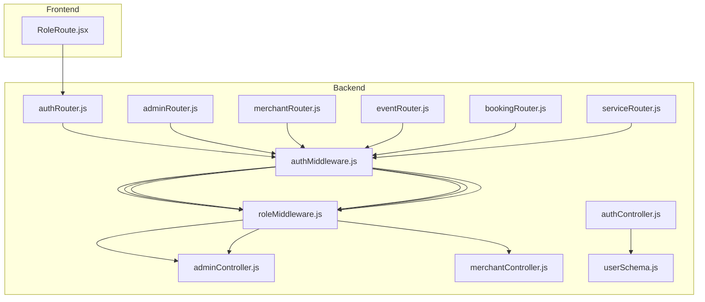

**Diagram sources**
- [authMiddleware.js:1-17](file://backend/middleware/authMiddleware.js#L1-L17)
- [roleMiddleware.js:1-9](file://backend/middleware/roleMiddleware.js#L1-L9)
- [userSchema.js:39-44](file://backend/models/userSchema.js#L39-L44)
- [authRouter.js:1-12](file://backend/router/authRouter.js#L1-L12)
- [adminRouter.js:1-29](file://backend/router/adminRouter.js#L1-L29)
- [merchantRouter.js:1-16](file://backend/router/merchantRouter.js#L1-L16)
- [eventRouter.js:1-13](file://backend/router/eventRouter.js#L1-L13)
- [bookingRouter.js:1-26](file://backend/router/bookingRouter.js#L1-L26)
- [serviceRouter.js:1-49](file://backend/router/serviceRouter.js#L1-L49)
- [adminController.js:1-194](file://backend/controller/adminController.js#L1-L194)
- [merchantController.js:1-199](file://backend/controller/merchantController.js#L1-L199)
- [authController.js:1-120](file://backend/controller/authController.js#L1-L120)
- [RoleRoute.jsx:1-15](file://frontend/src/components/RoleRoute.jsx#L1-L15)

**Section sources**
- [authMiddleware.js:1-17](file://backend/middleware/authMiddleware.js#L1-L17)
- [roleMiddleware.js:1-9](file://backend/middleware/roleMiddleware.js#L1-L9)
- [userSchema.js:39-44](file://backend/models/userSchema.js#L39-L44)
- [authRouter.js:1-12](file://backend/router/authRouter.js#L1-L12)
- [adminRouter.js:1-29](file://backend/router/adminRouter.js#L1-L29)
- [merchantRouter.js:1-16](file://backend/router/merchantRouter.js#L1-L16)
- [eventRouter.js:1-13](file://backend/router/eventRouter.js#L1-L13)
- [bookingRouter.js:1-26](file://backend/router/bookingRouter.js#L1-L26)
- [serviceRouter.js:1-49](file://backend/router/serviceRouter.js#L1-L49)
- [RoleRoute.jsx:1-15](file://frontend/src/components/RoleRoute.jsx#L1-L15)

## Core Components
- Authentication middleware
  - Extracts Bearer token from Authorization header.
  - Verifies JWT signature using a secret.
  - Attaches user identity and role to req.user.
  - Returns 401 Unauthorized on missing or invalid token.
  - Reference: [authMiddleware.js:3-16](file://backend/middleware/authMiddleware.js#L3-L16)

- Role middleware
  - Accepts one or more allowed roles.
  - Checks req.user presence and role inclusion.
  - Returns 403 Forbidden if role is not allowed.
  - Calls next() otherwise.
  - Reference: [roleMiddleware.js:1-8](file://backend/middleware/roleMiddleware.js#L1-L8)

- User model roles
  - Enumerated roles: user, admin, merchant.
  - Default role: user.
  - Reference: [userSchema.js:39-44](file://backend/models/userSchema.js#L39-L44)

- Admin bootstrap utility
  - Ensures an admin user exists with default or configured credentials.
  - Enforces admin role and optional password reset.
  - Reference: [ensureAdmin.js:4-34](file://backend/util/ensureAdmin.js#L4-L34)

**Section sources**
- [authMiddleware.js:3-16](file://backend/middleware/authMiddleware.js#L3-L16)
- [roleMiddleware.js:1-8](file://backend/middleware/roleMiddleware.js#L1-L8)
- [userSchema.js:39-44](file://backend/models/userSchema.js#L39-L44)
- [ensureAdmin.js:4-34](file://backend/util/ensureAdmin.js#L4-L34)

## Architecture Overview
The authorization pipeline enforces layered checks:
- Every protected endpoint requires authentication.
- Some endpoints additionally require a specific role.
- Controllers implement additional business-level checks (e.g., ownership verification).

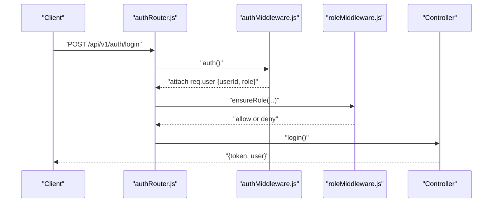

**Diagram sources**
- [authRouter.js:1-12](file://backend/router/authRouter.js#L1-L12)
- [authMiddleware.js:3-16](file://backend/middleware/authMiddleware.js#L3-L16)
- [roleMiddleware.js:1-8](file://backend/middleware/roleMiddleware.js#L1-L8)
- [authController.js:54-107](file://backend/controller/authController.js#L54-L107)

## Detailed Component Analysis

### Authentication Middleware
- Validates presence of Bearer token.
- Verifies JWT and decodes userId and role.
- Attaches decoded payload to req.user.
- Returns 401 Unauthorized on failure.

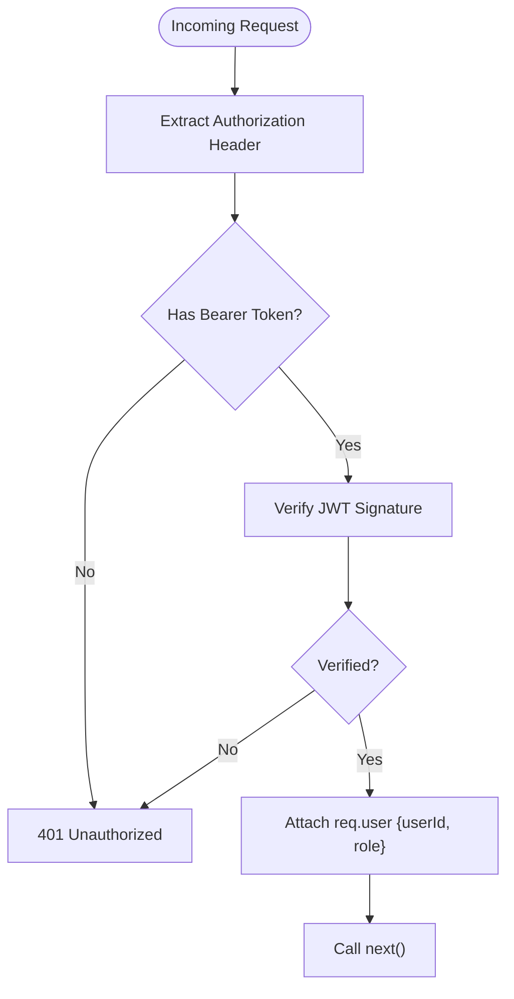

**Diagram sources**
- [authMiddleware.js:3-16](file://backend/middleware/authMiddleware.js#L3-L16)

**Section sources**
- [authMiddleware.js:3-16](file://backend/middleware/authMiddleware.js#L3-L16)

### Role Middleware
- Accepts allowed roles as variadic arguments.
- Compares req.user.role against allowed roles.
- Denies access with 403 Forbidden if mismatch.
- Proceeds if role is allowed.

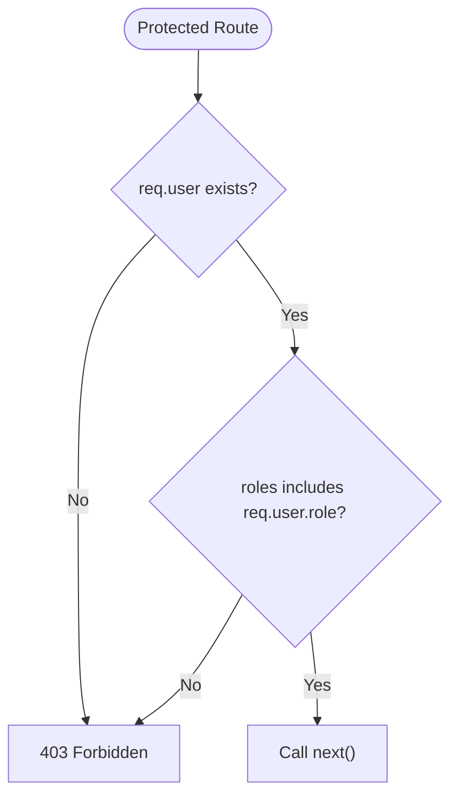

**Diagram sources**
- [roleMiddleware.js:1-8](file://backend/middleware/roleMiddleware.js#L1-L8)

**Section sources**
- [roleMiddleware.js:1-8](file://backend/middleware/roleMiddleware.js#L1-L8)

### User Model Roles
- Role enumeration: user, admin, merchant.
- Default role assignment: user.
- Used by controllers and middleware to enforce access.

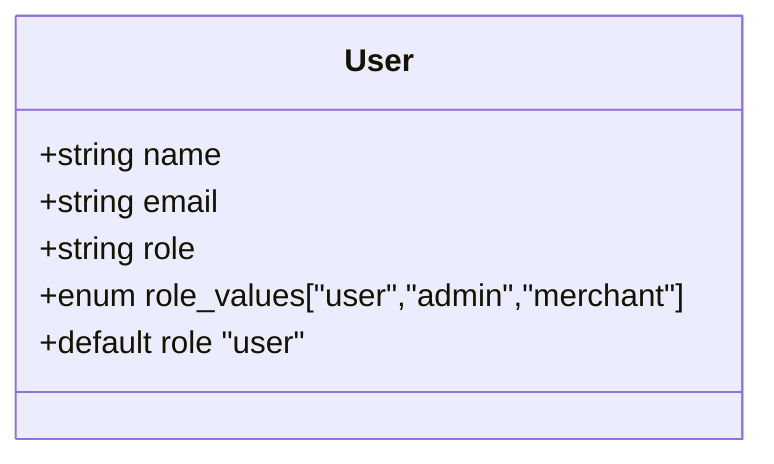

**Diagram sources**
- [userSchema.js:39-44](file://backend/models/userSchema.js#L39-L44)

**Section sources**
- [userSchema.js:39-44](file://backend/models/userSchema.js#L39-L44)

### Admin Routes (Admin-Only)
- All endpoints require auth and role admin.
- Examples: list users, list merchants, create merchant, delete user, list events, delete event, list registrations, reports, public stats.

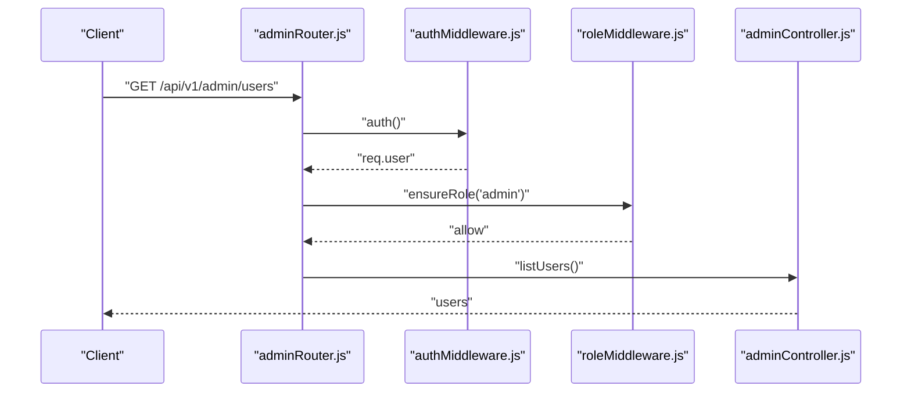

**Diagram sources**
- [adminRouter.js:19-26](file://backend/router/adminRouter.js#L19-L26)
- [authMiddleware.js:3-16](file://backend/middleware/authMiddleware.js#L3-L16)
- [roleMiddleware.js:1-8](file://backend/middleware/roleMiddleware.js#L1-L8)
- [adminController.js:9-16](file://backend/controller/adminController.js#L9-L16)

**Section sources**
- [adminRouter.js:19-26](file://backend/router/adminRouter.js#L19-L26)
- [adminController.js:1-194](file://backend/controller/adminController.js#L1-L194)

### Merchant Routes (Merchant-Only)
- All endpoints require auth and role merchant.
- Examples: create event, update event, list my events, get event, participants for event.
- Controllers also enforce ownership checks (e.g., createdBy comparison).

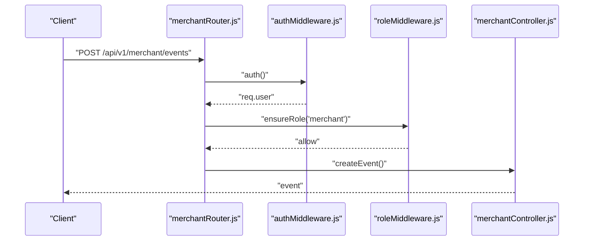

**Diagram sources**
- [merchantRouter.js:9-13](file://backend/router/merchantRouter.js#L9-L13)
- [authMiddleware.js:3-16](file://backend/middleware/authMiddleware.js#L3-L16)
- [roleMiddleware.js:1-8](file://backend/middleware/roleMiddleware.js#L1-L8)
- [merchantController.js:5-109](file://backend/controller/merchantController.js#L5-L109)

**Section sources**
- [merchantRouter.js:9-13](file://backend/router/merchantRouter.js#L9-L13)
- [merchantController.js:111-158](file://backend/controller/merchantController.js#L111-L158)

### User Routes (User-Only)
- Registration and login endpoints do not require auth.
- Protected endpoints under event and booking routers require auth and role user.

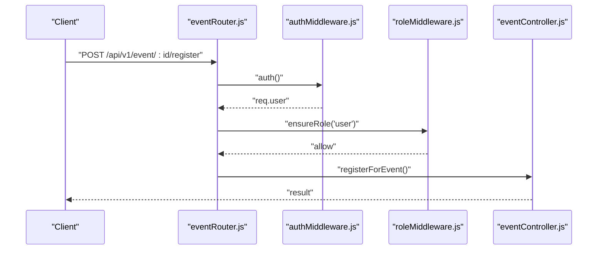

**Diagram sources**
- [eventRouter.js:9-10](file://backend/router/eventRouter.js#L9-L10)
- [authMiddleware.js:3-16](file://backend/middleware/authMiddleware.js#L3-L16)
- [roleMiddleware.js:1-8](file://backend/middleware/roleMiddleware.js#L1-L8)

**Section sources**
- [eventRouter.js:9-10](file://backend/router/eventRouter.js#L9-L10)

### Admin-Only Booking Management
- Admin-only endpoints for listing all bookings and updating booking status.

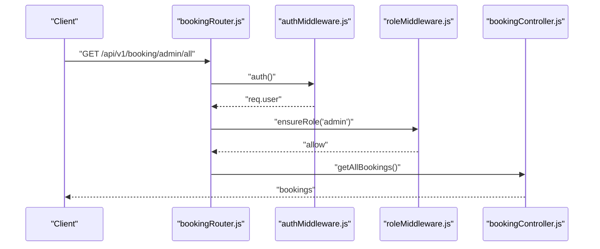

**Diagram sources**
- [bookingRouter.js:22-23](file://backend/router/bookingRouter.js#L22-L23)
- [authMiddleware.js:3-16](file://backend/middleware/authMiddleware.js#L3-L16)
- [roleMiddleware.js:1-8](file://backend/middleware/roleMiddleware.js#L1-L8)

**Section sources**
- [bookingRouter.js:22-23](file://backend/router/bookingRouter.js#L22-L23)

### Admin-Only Service Management
- Admin-only endpoints for creating, updating, deleting, and listing services.

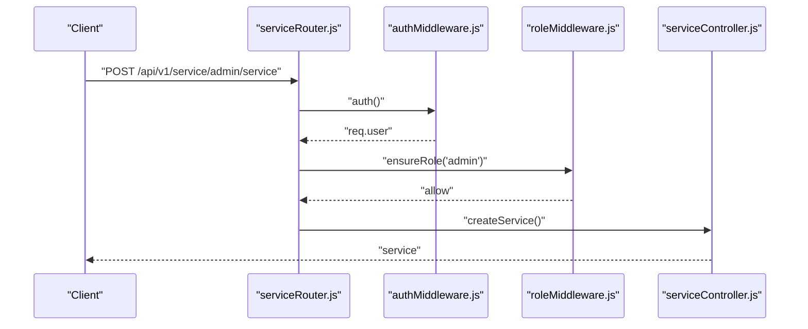

**Diagram sources**
- [serviceRouter.js:23-29](file://backend/router/serviceRouter.js#L23-L29)
- [authMiddleware.js:3-16](file://backend/middleware/authMiddleware.js#L3-L16)
- [roleMiddleware.js:1-8](file://backend/middleware/roleMiddleware.js#L1-L8)

**Section sources**
- [serviceRouter.js:23-29](file://backend/router/serviceRouter.js#L23-L29)

### Ownership Enforcement in Merchant Controller
- Controllers implement additional ownership checks beyond role middleware.
- Example: event updates and retrievals verify that the event’s createdBy matches the authenticated user’s ID.

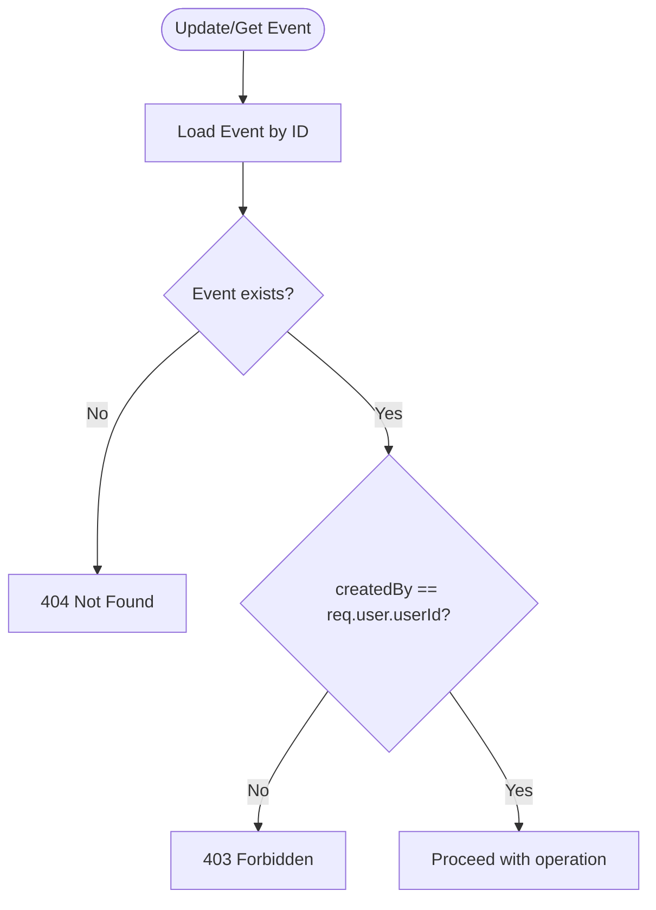

**Diagram sources**
- [merchantController.js:111-198](file://backend/controller/merchantController.js#L111-L198)

**Section sources**
- [merchantController.js:111-198](file://backend/controller/merchantController.js#L111-L198)

### Frontend Role-Based Navigation
- RoleRoute component enforces role-based access on the client side.
- Redirects unauthenticated or unauthorized users to the login page.

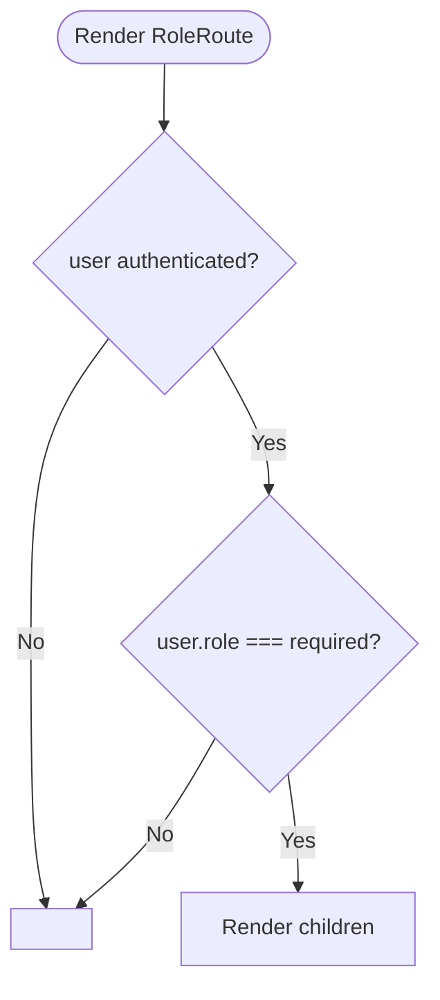

**Diagram sources**
- [RoleRoute.jsx:5-9](file://frontend/src/components/RoleRoute.jsx#L5-L9)

**Section sources**
- [RoleRoute.jsx:1-15](file://frontend/src/components/RoleRoute.jsx#L1-L15)

## Dependency Analysis
Authorization depends on:
- Authentication middleware for token verification and user attachment.
- Role middleware for role-based gatekeeping.
- User model for role enumeration and defaults.
- Controllers for additional business-level checks (e.g., ownership).
- Frontend RoleRoute for mirrored client-side enforcement.

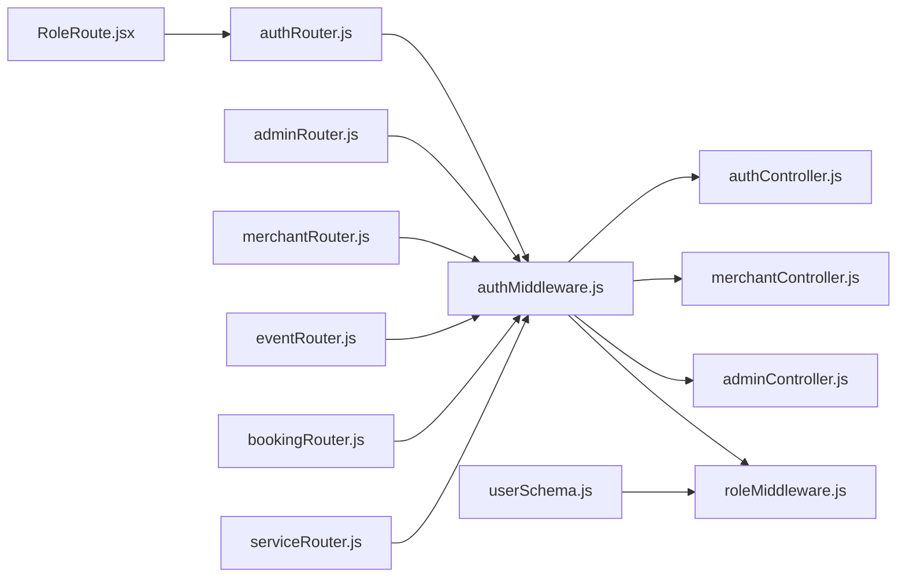

**Diagram sources**
- [authMiddleware.js:3-16](file://backend/middleware/authMiddleware.js#L3-L16)
- [roleMiddleware.js:1-8](file://backend/middleware/roleMiddleware.js#L1-L8)
- [userSchema.js:39-44](file://backend/models/userSchema.js#L39-L44)
- [authRouter.js:1-12](file://backend/router/authRouter.js#L1-L12)
- [adminRouter.js:1-29](file://backend/router/adminRouter.js#L1-L29)
- [merchantRouter.js:1-16](file://backend/router/merchantRouter.js#L1-L16)
- [eventRouter.js:1-13](file://backend/router/eventRouter.js#L1-L13)
- [bookingRouter.js:1-26](file://backend/router/bookingRouter.js#L1-L26)
- [serviceRouter.js:1-49](file://backend/router/serviceRouter.js#L1-L49)
- [adminController.js:1-194](file://backend/controller/adminController.js#L1-L194)
- [merchantController.js:1-199](file://backend/controller/merchantController.js#L1-L199)
- [authController.js:1-120](file://backend/controller/authController.js#L1-L120)
- [RoleRoute.jsx:1-15](file://frontend/src/components/RoleRoute.jsx#L1-L15)

**Section sources**
- [authMiddleware.js:3-16](file://backend/middleware/authMiddleware.js#L3-L16)
- [roleMiddleware.js:1-8](file://backend/middleware/roleMiddleware.js#L1-L8)
- [userSchema.js:39-44](file://backend/models/userSchema.js#L39-L44)
- [authRouter.js:1-12](file://backend/router/authRouter.js#L1-L12)
- [adminRouter.js:1-29](file://backend/router/adminRouter.js#L1-L29)
- [merchantRouter.js:1-16](file://backend/router/merchantRouter.js#L1-L16)
- [eventRouter.js:1-13](file://backend/router/eventRouter.js#L1-L13)
- [bookingRouter.js:1-26](file://backend/router/bookingRouter.js#L1-L26)
- [serviceRouter.js:1-49](file://backend/router/serviceRouter.js#L1-L49)
- [adminController.js:1-194](file://backend/controller/adminController.js#L1-L194)
- [merchantController.js:1-199](file://backend/controller/merchantController.js#L1-L199)
- [authController.js:1-120](file://backend/controller/authController.js#L1-L120)
- [RoleRoute.jsx:1-15](file://frontend/src/components/RoleRoute.jsx#L1-L15)

## Performance Considerations
- Token verification occurs on every protected request; keep JWT_SECRET secure and avoid excessive middleware overhead.
- Role checks are O(n) over allowed roles; keep allowed roles lists short.
- Ownership checks in controllers add database reads; ensure proper indexing on foreign keys (e.g., createdBy).
- Consider caching frequently accessed user roles or permissions at the edge if scaling horizontally.

## Troubleshooting Guide
Common authorization issues and resolutions:
- 401 Unauthorized on protected endpoints
  - Cause: Missing or invalid Bearer token.
  - Resolution: Ensure Authorization header is present and valid; verify JWT_SECRET correctness.
  - References: [authMiddleware.js:7-9](file://backend/middleware/authMiddleware.js#L7-L9), [authMiddleware.js:13-15](file://backend/middleware/authMiddleware.js#L13-L15)

- 403 Forbidden despite valid token
  - Cause: User role not included in allowed roles.
  - Resolution: Confirm user role matches endpoint requirements; adjust route guards accordingly.
  - References: [roleMiddleware.js:3-5](file://backend/middleware/roleMiddleware.js#L3-L5)

- Admin user not found
  - Cause: Missing admin user.
  - Resolution: Run admin bootstrap utility to create admin with default or configured credentials.
  - References: [ensureAdmin.js:4-34](file://backend/util/ensureAdmin.js#L4-L34)

- Ownership denied in merchant endpoints
  - Cause: Attempting to modify or access an event not owned by the user.
  - Resolution: Ensure the event’s createdBy matches req.user.userId.
  - References: [merchantController.js:116-118](file://backend/controller/merchantController.js#L116-L118), [merchantController.js:176-178](file://backend/controller/merchantController.js#L176-L178)

**Section sources**
- [authMiddleware.js:7-9](file://backend/middleware/authMiddleware.js#L7-L9)
- [authMiddleware.js:13-15](file://backend/middleware/authMiddleware.js#L13-L15)
- [roleMiddleware.js:3-5](file://backend/middleware/roleMiddleware.js#L3-L5)
- [ensureAdmin.js:4-34](file://backend/util/ensureAdmin.js#L4-L34)
- [merchantController.js:116-118](file://backend/controller/merchantController.js#L116-L118)
- [merchantController.js:176-178](file://backend/controller/merchantController.js#L176-L178)

## Conclusion
The application implements a robust RBAC system with clear separation of concerns:
- Authentication middleware validates identity and role.
- Role middleware enforces role-based access at the routing layer.
- Controllers add ownership and business-specific checks.
- Frontend RoleRoute mirrors backend protections for navigation.
This layered approach ensures consistent authorization across endpoints and user types, with straightforward patterns for extending access controls to new routes.