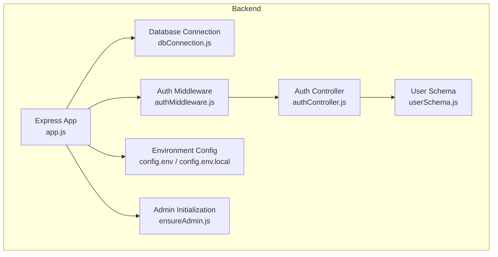
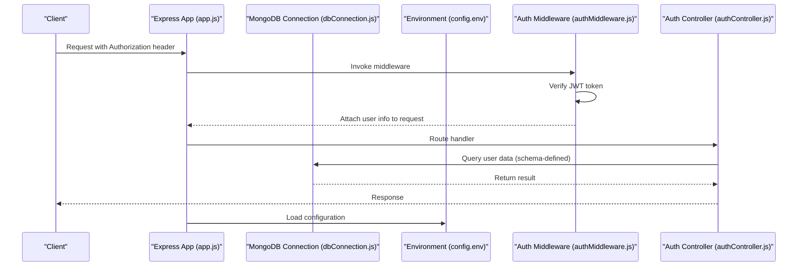
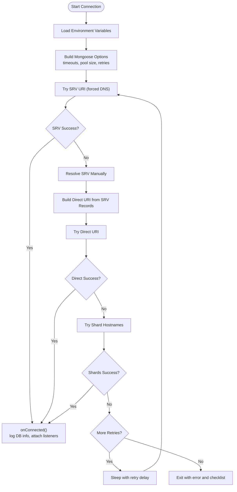
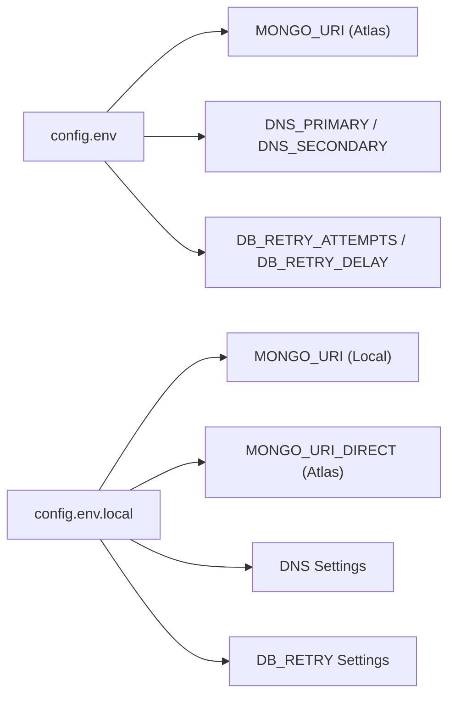
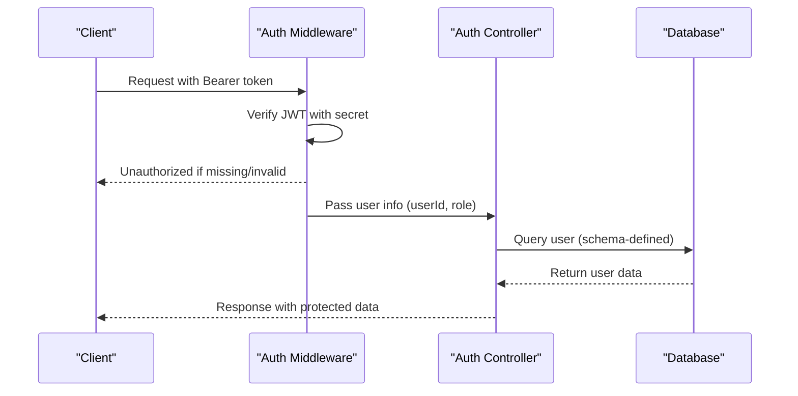
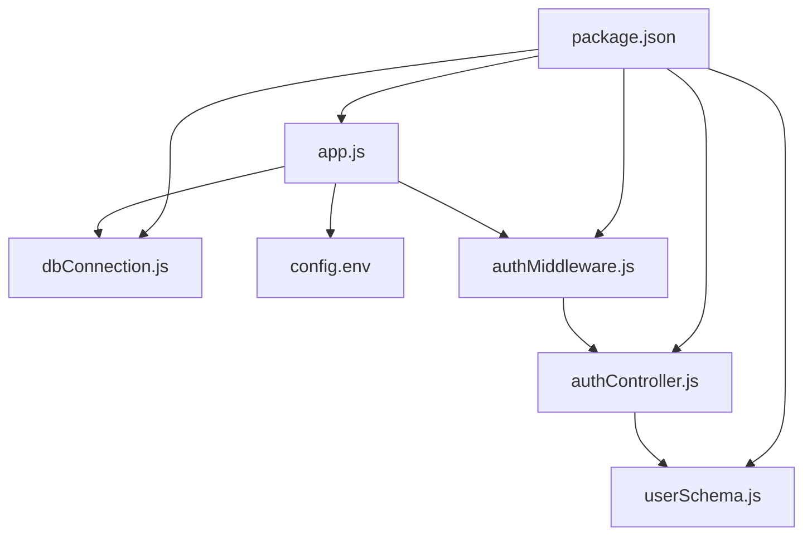

# Database Security

<cite>
**Referenced Files in This Document**
- [dbConnection.js](file://backend/database/dbConnection.js)
- [app.js](file://backend/app.js)
- [config.env](file://backend/config/config.env)
- [config.env.local](file://backend/config/config.env.local)
- [authMiddleware.js](file://backend/middleware/authMiddleware.js)
- [authController.js](file://backend/controller/authController.js)
- [userSchema.js](file://backend/models/userSchema.js)
- [ensureAdmin.js](file://backend/util/ensureAdmin.js)
- [MONGODB_ATLAS_PERMANENT_SOLUTION.md](file://backend/MONGODB_ATLAS_PERMANENT_SOLUTION.md)
- [FIX_MONGODB_ATLAS_IP.md](file://backend/FIX_MONGODB_ATLAS_IP.md)
- [MONGODB_ATLAS_SETUP_GUIDE.md](file://backend/MONGODB_ATLAS_SETUP_GUIDE.md)
- [DATABASE_SETUP.md](file://backend/DATABASE_SETUP.md)
- [package.json](file://backend/package.json)
</cite>

## Table of Contents
1. [Introduction](#introduction)
2. [Project Structure](#project-structure)
3. [Core Components](#core-components)
4. [Architecture Overview](#architecture-overview)
5. [Detailed Component Analysis](#detailed-component-analysis)
6. [Dependency Analysis](#dependency-analysis)
7. [Performance Considerations](#performance-considerations)
8. [Troubleshooting Guide](#troubleshooting-guide)
9. [Conclusion](#conclusion)
10. [Appendices](#appendices)

## Introduction
This document provides comprehensive database security documentation for the MERN stack event project. It focuses on MongoDB connection security, credential management, data encryption, access control, environment variable security, connection pooling, and security configurations. It also explains user data protection, sensitive information handling, database query security, MongoDB Atlas security features, connection string management, and database-level security best practices used in the application.

## Project Structure
The backend module centralizes database connectivity, environment configuration, authentication, and security middleware. The database connection logic resides in a dedicated module with robust fallback mechanisms. Environment variables are managed via dotenv and validated at runtime. Authentication is enforced via JWT tokens and middleware. Schemas define data models and sensitive field handling.

**Diagram sources**
- [app.js:1-91](file://backend/app.js#L1-L91)
- [dbConnection.js:1-112](file://backend/database/dbConnection.js#L1-L112)
- [config.env:1-42](file://backend/config/config.env#L1-L42)
- [config.env.local:1-49](file://backend/config/config.env.local#L1-L49)
- [authMiddleware.js:1-17](file://backend/middleware/authMiddleware.js#L1-L17)
- [authController.js:1-120](file://backend/controller/authController.js#L1-L120)
- [userSchema.js:1-55](file://backend/models/userSchema.js#L1-L55)
- [ensureAdmin.js:1-35](file://backend/util/ensureAdmin.js#L1-L35)

**Section sources**
- [app.js:1-91](file://backend/app.js#L1-L91)
- [dbConnection.js:1-112](file://backend/database/dbConnection.js#L1-L112)
- [config.env:1-42](file://backend/config/config.env#L1-L42)
- [config.env.local:1-49](file://backend/config/config.env.local#L1-L49)

## Core Components
- Database connection module with multiple fallback strategies, DNS override, and connection monitoring.
- Environment configuration with production-grade defaults and Atlas-specific settings.
- Authentication middleware enforcing bearer token verification and role propagation.
- User model with sensitive field handling and validation.
- Admin initialization ensuring secure default credentials and optional reset behavior.
- Atlas-specific documentation for DNS fixes, IP whitelisting, and connection methods.

**Section sources**
- [dbConnection.js:19-94](file://backend/database/dbConnection.js#L19-L94)
- [config.env:5-15](file://backend/config/config.env#L5-L15)
- [authMiddleware.js:3-16](file://backend/middleware/authMiddleware.js#L3-L16)
- [userSchema.js:33-38](file://backend/models/userSchema.js#L33-L38)
- [ensureAdmin.js:4-34](file://backend/util/ensureAdmin.js#L4-L34)
- [MONGODB_ATLAS_PERMANENT_SOLUTION.md:58-76](file://backend/MONGODB_ATLAS_PERMANENT_SOLUTION.md#L58-L76)

## Architecture Overview
The application initializes the Express server, loads environment variables, establishes a secure database connection with multiple fallbacks, and enforces authentication via JWT. The database connection module manages DNS overrides, retry logic, and connection options tailored for reliability and security.

**Diagram sources**
- [app.js:64-88](file://backend/app.js#L64-L88)
- [dbConnection.js:19-94](file://backend/database/dbConnection.js#L19-L94)
- [config.env:1-42](file://backend/config/config.env#L1-L42)
- [authMiddleware.js:3-16](file://backend/middleware/authMiddleware.js#L3-L16)
- [authController.js:54-107](file://backend/controller/authController.js#L54-L107)

## Detailed Component Analysis

### Database Connection Security
- DNS override: Forces resolution via trusted DNS servers to mitigate SRV lookup failures.
- Fallback connection methods: Attempts SRV, manual SRV resolution, and direct shard hostnames.
- Connection options: Includes timeouts, pool size, retry writes, write concern, and IPv4 preference.
- Retry logic: Configurable attempts and delays with explicit failure handling and exit strategy.
- Connection monitoring: Listeners for error, disconnect, and reconnect events.

**Diagram sources**
- [dbConnection.js:19-94](file://backend/database/dbConnection.js#L19-L94)
- [config.env:13-15](file://backend/config/config.env#L13-L15)

**Section sources**
- [dbConnection.js:4-17](file://backend/database/dbConnection.js#L4-L17)
- [dbConnection.js:28-37](file://backend/database/dbConnection.js#L28-L37)
- [dbConnection.js:39-84](file://backend/database/dbConnection.js#L39-L84)
- [dbConnection.js:96-112](file://backend/database/dbConnection.js#L96-L112)

### Environment Variable Security
- Centralized configuration via dotenv with separate environment files for Atlas and local fallback.
- Production defaults for ports, JWT secrets, and admin credentials.
- Atlas-specific variables including DNS servers and retry settings.
- Local fallback configuration for development continuity.

**Diagram sources**
- [config.env:5-15](file://backend/config/config.env#L5-L15)
- [config.env.local:6-13](file://backend/config/config.env.local#L6-L13)

**Section sources**
- [config.env:1-42](file://backend/config/config.env#L1-L42)
- [config.env.local:1-49](file://backend/config/config.env.local#L1-L49)

### Connection Pooling and Security Configurations
- Pool size: Configured to balance concurrency and resource usage.
- Write concerns: Uses majority acknowledgment for durability.
- Socket and selection timeouts: Prevents hanging connections under load or network issues.
- Buffer commands: Ensures commands are queued until connection is ready.

**Section sources**
- [dbConnection.js:28-37](file://backend/database/dbConnection.js#L28-L37)

### MongoDB Atlas Security Features and Best Practices
- DNS configuration: Permanent DNS and hosts file entries to stabilize SRV resolution.
- IP whitelist: Guidance to add current or temporary IP access for development.
- Connection methods: Multiple fallbacks to ensure connectivity under various network conditions.
- Backup recommendations: Local dump/restore and Atlas automatic backups.

**Section sources**
- [MONGODB_ATLAS_PERMANENT_SOLUTION.md:34-57](file://backend/MONGODB_ATLAS_PERMANENT_SOLUTION.md#L34-L57)
- [FIX_MONGODB_ATLAS_IP.md:1-72](file://backend/FIX_MONGODB_ATLAS_IP.md#L1-L72)
- [MONGODB_ATLAS_SETUP_GUIDE.md:30-64](file://backend/MONGODB_ATLAS_SETUP_GUIDE.md#L30-L64)

### Authentication and Access Control
- JWT-based authentication middleware validates bearer tokens and attaches user identity.
- Controllers enforce input validation and secure password handling.
- User schema defines sensitive fields and validation rules.

**Diagram sources**
- [authMiddleware.js:3-16](file://backend/middleware/authMiddleware.js#L3-L16)
- [authController.js:54-107](file://backend/controller/authController.js#L54-L107)
- [userSchema.js:33-38](file://backend/models/userSchema.js#L33-L38)

**Section sources**
- [authMiddleware.js:3-16](file://backend/middleware/authMiddleware.js#L3-L16)
- [authController.js:11-52](file://backend/controller/authController.js#L11-L52)
- [userSchema.js:33-38](file://backend/models/userSchema.js#L33-L38)

### User Data Protection and Sensitive Information Handling
- Password hashing: Bcrypt used during registration and admin creation.
- Field visibility: Password marked as non-select by default in schema; explicitly selected during login.
- Validation: Email and password constraints enforced at schema level.

**Section sources**
- [authController.js:31-37](file://backend/controller/authController.js#L31-L37)
- [userSchema.js:33-38](file://backend/models/userSchema.js#L33-L38)

### Database Query Security
- Controlled field selection: Password excluded by default; explicitly included only when necessary (e.g., login).
- Input validation: Controllers validate presence of required fields before processing.
- Role-based access: Middleware attaches role to request; controllers can enforce role checks.

**Section sources**
- [userSchema.js:37-38](file://backend/models/userSchema.js#L37-L38)
- [authController.js:17-25](file://backend/controller/authController.js#L17-L25)
- [authMiddleware.js:10](file://backend/middleware/authMiddleware.js#L10)

### Admin Initialization and Secure Defaults
- Admin creation with hashed password and configurable role.
- Optional force reset to update credentials if needed.
- Initialization occurs after successful database connection.

**Section sources**
- [ensureAdmin.js:4-34](file://backend/util/ensureAdmin.js#L4-L34)
- [app.js:64-84](file://backend/app.js#L64-L84)

## Dependency Analysis
The backend depends on Mongoose for database connectivity, dotenv for environment loading, and JWT for authentication. The database connection module encapsulates MongoDB specifics, while the Express app orchestrates initialization and routing.

**Diagram sources**
- [package.json:13-24](file://backend/package.json#L13-L24)
- [app.js:1-22](file://backend/app.js#L1-L22)
- [dbConnection.js:1-2](file://backend/database/dbConnection.js#L1-L2)
- [authMiddleware.js:1](file://backend/middleware/authMiddleware.js#L1)
- [authController.js:1](file://backend/controller/authController.js#L1)
- [userSchema.js:1](file://backend/models/userSchema.js#L1)

**Section sources**
- [package.json:13-24](file://backend/package.json#L13-L24)
- [app.js:1-22](file://backend/app.js#L1-L22)

## Performance Considerations
- Connection pooling: Tune pool size according to expected concurrent requests.
- Timeouts: Adjust socket and selection timeouts to match deployment network characteristics.
- Retry strategy: Balance retry attempts and delays to avoid overwhelming external services.
- DNS stability: Use permanent DNS configuration to reduce connection flakiness.

[No sources needed since this section provides general guidance]

## Troubleshooting Guide
Common issues and resolutions:
- DNS SRV failures: Apply permanent DNS configuration and verify hosts file entries.
- IP not whitelisted: Add current or temporary IP to Atlas network access.
- Authentication failures: Verify credentials and user permissions in Atlas.
- Connection refused: Ensure local MongoDB is running or Atlas cluster is active.
- Timeout errors: Check firewall, cluster status, and network connectivity.

**Section sources**
- [MONGODB_ATLAS_PERMANENT_SOLUTION.md:97-122](file://backend/MONGODB_ATLAS_PERMANENT_SOLUTION.md#L97-L122)
- [FIX_MONGODB_ATLAS_IP.md:3-72](file://backend/FIX_MONGODB_ATLAS_IP.md#L3-L72)
- [MONGODB_ATLAS_SETUP_GUIDE.md:67-101](file://backend/MONGODB_ATLAS_SETUP_GUIDE.md#L67-L101)

## Conclusion
The application implements robust database security through multiple connection fallbacks, DNS stabilization, strict environment configuration, and strong authentication controls. Sensitive data is handled securely with hashing and controlled field visibility. MongoDB Atlas features and best practices are documented to ensure reliable connectivity and operational resilience.

[No sources needed since this section summarizes without analyzing specific files]

## Appendices
- Connection string management: Prefer Atlas SRV URIs with DNS overrides; maintain direct fallbacks for emergencies.
- Database-level security: Use Atlas network access lists, user permissions, and automatic backups; monitor cluster health regularly.
- Operational hygiene: Rotate secrets, review environment files, and validate connection options periodically.

[No sources needed since this section provides general guidance]