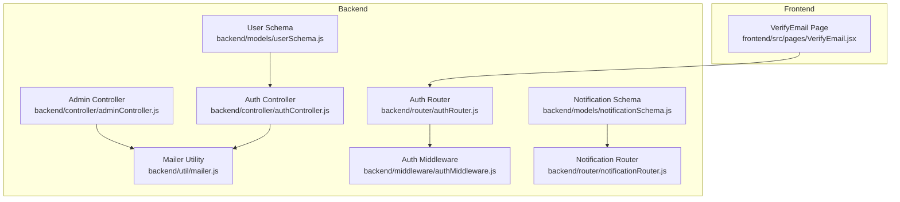
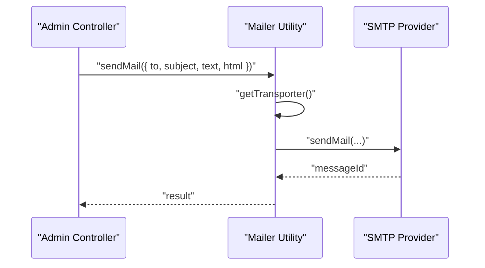
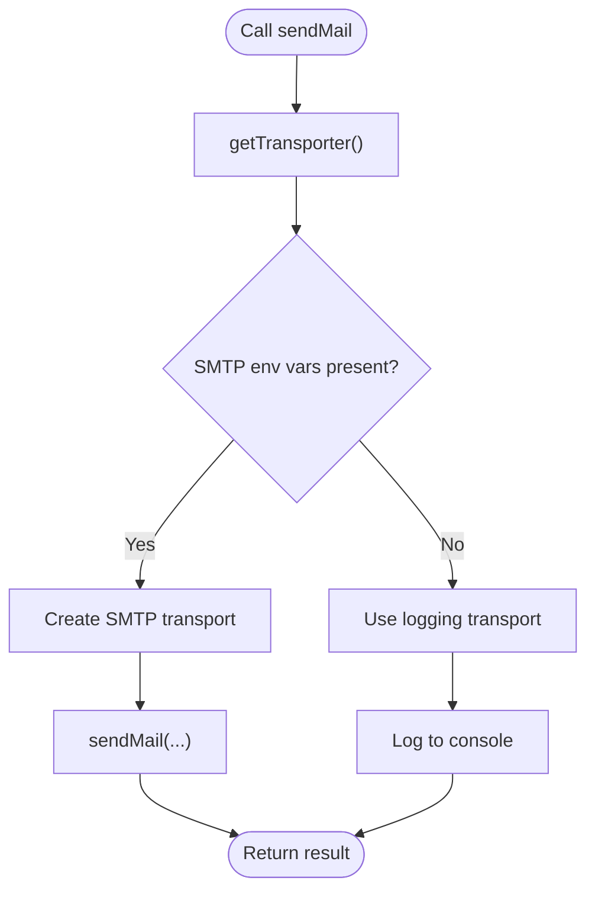
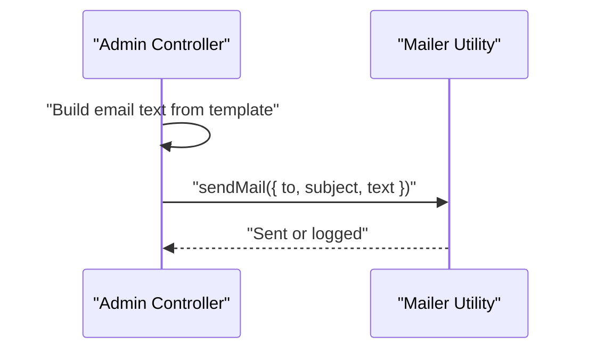
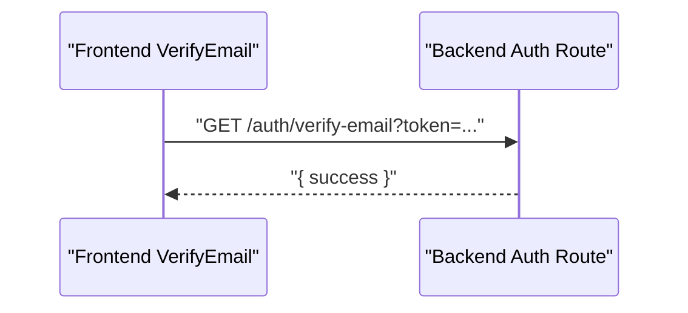
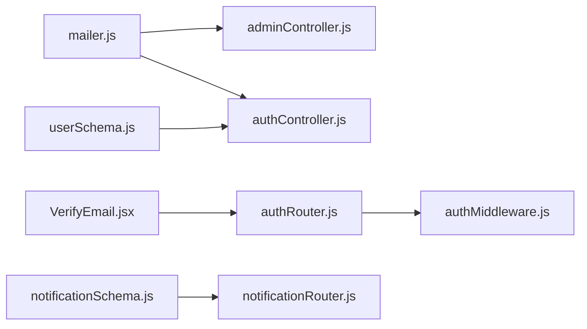

# Email Security

<cite>
**Referenced Files in This Document**
- [mailer.js](file://backend/util/mailer.js)
- [adminController.js](file://backend/controller/adminController.js)
- [authController.js](file://backend/controller/authController.js)
- [authRouter.js](file://backend/router/authRouter.js)
- [authMiddleware.js](file://backend/middleware/authMiddleware.js)
- [userSchema.js](file://backend/models/userSchema.js)
- [notificationSchema.js](file://backend/models/notificationSchema.js)
- [notificationRouter.js](file://backend/router/notificationRouter.js)
- [VerifyEmail.jsx](file://frontend/src/pages/VerifyEmail.jsx)
</cite>

## Table of Contents
1. [Introduction](#introduction)
2. [Project Structure](#project-structure)
3. [Core Components](#core-components)
4. [Architecture Overview](#architecture-overview)
5. [Detailed Component Analysis](#detailed-component-analysis)
6. [Dependency Analysis](#dependency-analysis)
7. [Performance Considerations](#performance-considerations)
8. [Troubleshooting Guide](#troubleshooting-guide)
9. [Conclusion](#conclusion)
10. [Appendices](#appendices)

## Introduction
This document provides comprehensive email security guidance for the project’s email infrastructure. It covers SMTP configuration, transport security, content protection, and secure email transmission. It also documents the mailer utility implementation, email template safety, and protection against email-based attacks. Practical examples illustrate secure email sending, content sanitization, and best practices for user notifications and verification emails.

## Project Structure
The email security implementation spans backend utilities, controllers, routers, middleware, and models, along with a frontend verification page. The backend uses a reusable mailer utility to send emails via SMTP, while controllers orchestrate secure email workflows for administrative actions and user authentication.

**Diagram sources**
- [mailer.js](file://backend/util/mailer.js)
- [adminController.js](file://backend/controller/adminController.js)
- [authController.js](file://backend/controller/authController.js)
- [authRouter.js](file://backend/router/authRouter.js)
- [authMiddleware.js](file://backend/middleware/authMiddleware.js)
- [userSchema.js](file://backend/models/userSchema.js)
- [notificationSchema.js](file://backend/models/notificationSchema.js)
- [notificationRouter.js](file://backend/router/notificationRouter.js)
- [VerifyEmail.jsx](file://frontend/src/pages/VerifyEmail.jsx)

**Section sources**
- [mailer.js](file://backend/util/mailer.js)
- [adminController.js](file://backend/controller/adminController.js)
- [authController.js](file://backend/controller/authController.js)
- [authRouter.js](file://backend/router/authRouter.js)
- [authMiddleware.js](file://backend/middleware/authMiddleware.js)
- [userSchema.js](file://backend/models/userSchema.js)
- [notificationSchema.js](file://backend/models/notificationSchema.js)
- [notificationRouter.js](file://backend/router/notificationRouter.js)
- [VerifyEmail.jsx](file://frontend/src/pages/VerifyEmail.jsx)

## Core Components
- Mailer utility: Provides a singleton SMTP transport configured from environment variables and a fallback logging mode when SMTP is unavailable.
- Admin controller: Sends merchant credentials securely via the mailer utility.
- Auth controller: Manages user registration and login; does not currently send verification emails in the provided code.
- Auth router and middleware: Enforce bearer token authentication for protected routes.
- User schema: Defines email validation and storage policies.
- Notification system: Stores and retrieves user notifications; not used for sending emails.
- Frontend verification page: Handles email verification requests from the client.

Key security aspects:
- Transport security: Uses SMTP with automatic secure mode selection based on port number.
- Authentication: Requires proper SMTP credentials and environment configuration.
- Content protection: Emails are constructed from controlled templates; HTML content is optional and can be used for richer messages.

**Section sources**
- [mailer.js](file://backend/util/mailer.js)
- [adminController.js](file://backend/controller/adminController.js)
- [authController.js](file://backend/controller/authController.js)
- [authRouter.js](file://backend/router/authRouter.js)
- [authMiddleware.js](file://backend/middleware/authMiddleware.js)
- [userSchema.js](file://backend/models/userSchema.js)
- [notificationSchema.js](file://backend/models/notificationSchema.js)
- [notificationRouter.js](file://backend/router/notificationRouter.js)
- [VerifyEmail.jsx](file://frontend/src/pages/VerifyEmail.jsx)

## Architecture Overview
The email security architecture centers on a single mailer utility that encapsulates SMTP configuration and transport creation. Controllers invoke the mailer to send secure emails. Authentication middleware protects routes that might trigger email actions. The frontend verification page interacts with the backend to validate tokens.

**Diagram sources**
- [adminController.js](file://backend/controller/adminController.js)
- [mailer.js](file://backend/util/mailer.js)

## Detailed Component Analysis

### Mailer Utility Implementation
The mailer utility creates a reusable transport for sending emails. It reads SMTP configuration from environment variables and sets secure mode when the port is 465. If SMTP credentials are missing, it falls back to a logging mode that prints email content to the console instead of sending.

Security highlights:
- Secure mode: Automatically enables TLS when the port is 465.
- Credential handling: Supports two environment variable names for user and password to accommodate different providers.
- From address: Uses a configurable sender address or a default no-reply address.
- Fallback logging: Prevents silent failures and aids debugging.

Operational flow:
- On first use, the utility constructs a transport with host, port, secure flag, and credentials.
- Subsequent calls reuse the same transport instance.
- If SMTP is not configured, the transport logs outgoing messages instead of sending.

**Diagram sources**
- [mailer.js](file://backend/util/mailer.js)

**Section sources**
- [mailer.js](file://backend/util/mailer.js)

### Email Templates and Content Protection
Administrative emails are generated from controlled templates and sent via the mailer utility. The template includes the recipient’s name, login credentials, and a login URL. While the current implementation sends plain text, the mailer supports HTML content for richer templates.

Best practices for templates:
- Keep sensitive data minimal and avoid exposing internal identifiers in plaintext.
- Use HTML templates for branded, accessible emails with links to secure pages.
- Sanitize dynamic content to prevent injection attacks.

Current implementation example:
- Merchant credentials email is constructed with the recipient’s name, email, temporary password, and a login URL.

**Diagram sources**
- [adminController.js](file://backend/controller/adminController.js)
- [mailer.js](file://backend/util/mailer.js)

**Section sources**
- [adminController.js](file://backend/controller/adminController.js)
- [mailer.js](file://backend/util/mailer.js)

### Secure Email Transmission
SMTP configuration and transport security:
- Host and port are read from environment variables.
- Secure mode is enabled automatically when the port equals 465.
- Authentication credentials are required for production SMTP.

Recommendations:
- Use environment variables for SMTP configuration and never hardcode secrets.
- Prefer port 465 for implicit TLS or modern TLS-enabled ports (e.g., 587) with STARTTLS.
- Restrict MAIL_FROM to a verified sender domain to improve deliverability and reduce spoofing risk.

**Section sources**
- [mailer.js](file://backend/util/mailer.js)

### Email Authentication and Verification
The authentication flow relies on JWT tokens for session management. The provided backend code does not include an email verification endpoint or token generation for verification. The frontend verification page makes a GET request expecting a token parameter, but the backend route for verification is not shown in the provided files.

Security considerations:
- If verification emails are introduced, generate short-lived tokens and store hashed tokens server-side.
- Use HTTPS to protect token transmission.
- Invalidate tokens after use or expiry.

Current verification flow:
- Frontend navigates to a verification URL with a token parameter.
- The backend route for verification is not present in the provided files.

**Diagram sources**
- [VerifyEmail.jsx](file://frontend/src/pages/VerifyEmail.jsx)
- [authRouter.js](file://backend/router/authRouter.js)

**Section sources**
- [VerifyEmail.jsx](file://frontend/src/pages/VerifyEmail.jsx)
- [authRouter.js](file://backend/router/authRouter.js)

### User Notifications and Email Delivery
The notification system stores and retrieves user notifications. It is separate from email delivery and does not handle sending emails. Administrators can create sample notifications for testing.

Security considerations:
- Ensure notification messages do not contain sensitive data.
- Use appropriate types and metadata to categorize notifications.

**Section sources**
- [notificationSchema.js](file://backend/models/notificationSchema.js)
- [notificationRouter.js](file://backend/router/notificationRouter.js)

## Dependency Analysis
The mailer utility is consumed by controllers that need to send emails. Authentication middleware protects routes that may trigger email actions. The user model defines email validation and storage. The frontend verification page depends on the backend auth routes.

**Diagram sources**
- [mailer.js](file://backend/util/mailer.js)
- [adminController.js](file://backend/controller/adminController.js)
- [authController.js](file://backend/controller/authController.js)
- [authRouter.js](file://backend/router/authRouter.js)
- [authMiddleware.js](file://backend/middleware/authMiddleware.js)
- [userSchema.js](file://backend/models/userSchema.js)
- [notificationSchema.js](file://backend/models/notificationSchema.js)
- [notificationRouter.js](file://backend/router/notificationRouter.js)
- [VerifyEmail.jsx](file://frontend/src/pages/VerifyEmail.jsx)

**Section sources**
- [mailer.js](file://backend/util/mailer.js)
- [adminController.js](file://backend/controller/adminController.js)
- [authController.js](file://backend/controller/authController.js)
- [authRouter.js](file://backend/router/authRouter.js)
- [authMiddleware.js](file://backend/middleware/authMiddleware.js)
- [userSchema.js](file://backend/models/userSchema.js)
- [notificationSchema.js](file://backend/models/notificationSchema.js)
- [notificationRouter.js](file://backend/router/notificationRouter.js)
- [VerifyEmail.jsx](file://frontend/src/pages/VerifyEmail.jsx)

## Performance Considerations
- Reuse the transport instance to avoid reconnect overhead.
- Batch email operations where feasible to reduce connection churn.
- Monitor SMTP provider rate limits and implement retry/backoff logic for transient failures.
- Use asynchronous sending to avoid blocking request threads.

## Troubleshooting Guide
Common issues and resolutions:
- Missing SMTP environment variables: The mailer falls back to logging. Ensure SMTP_HOST, SMTP_PORT, SMTP_USER/SMTP_EMAIL, SMTP_PASS/SMTP_PASSWORD, and MAIL_FROM are set.
- Port misconfiguration: If using implicit TLS, set port 465; otherwise use a TLS-enabled port like 587.
- Authentication failures: Verify credentials and provider-specific settings.
- Email not delivered: Check provider logs and SPF/DKIM/DMARC records if deliverability is affected.
- Frontend verification errors: Confirm the backend verification route exists and handles the token parameter correctly.

**Section sources**
- [mailer.js](file://backend/util/mailer.js)
- [VerifyEmail.jsx](file://frontend/src/pages/VerifyEmail.jsx)

## Conclusion
The project’s email security foundation relies on a robust mailer utility with automatic transport security and a fallback mechanism. Administrative emails are sent from controlled templates, and the system enforces bearer token authentication for protected routes. To strengthen email security, introduce verified email verification with short-lived tokens, sanitize dynamic content, and ensure secure SMTP configuration. These steps will enhance protection against email-based attacks and improve user trust.

## Appendices

### SMTP Configuration Checklist
- Set SMTP_HOST and SMTP_PORT from your provider.
- Configure SMTP_USER/SMTP_EMAIL and SMTP_PASS/SMTP_PASSWORD.
- Set MAIL_FROM to a verified sender address.
- Choose port 465 for implicit TLS or a TLS-enabled port.
- Store secrets in environment variables, not in code.

### Secure Email Sending Examples
- Merchant credentials email: Construct a controlled text template and call the mailer utility to send.
- Verification email (recommended): Generate a short-lived token, embed a secure verification link, and send via the mailer utility.

### Email Content Best Practices
- Avoid embedding sensitive data in plaintext.
- Use HTML templates for branding and accessibility.
- Sanitize dynamic content to prevent injection.
- Keep subject lines concise and descriptive.
- Provide clear action buttons and links to secure pages.