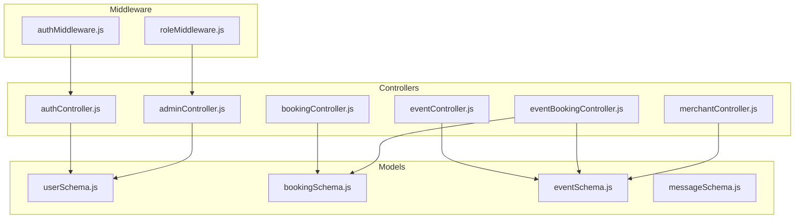
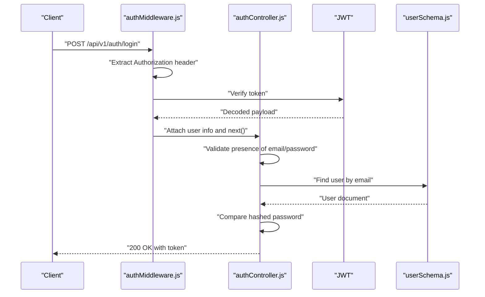
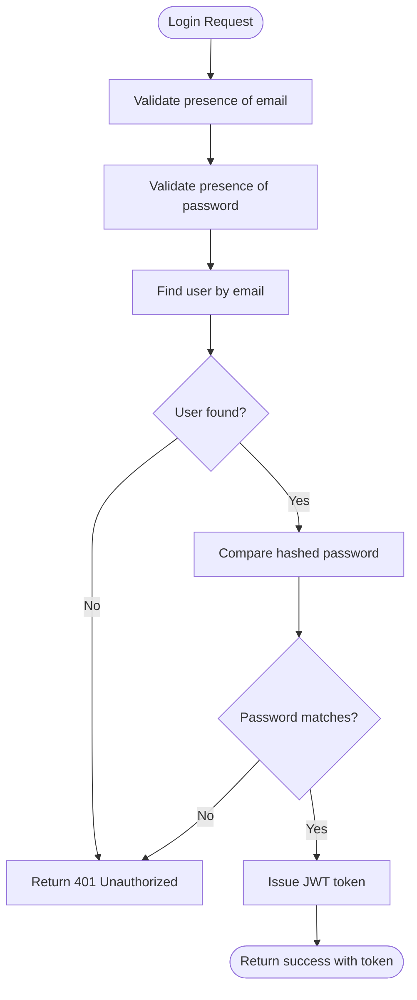
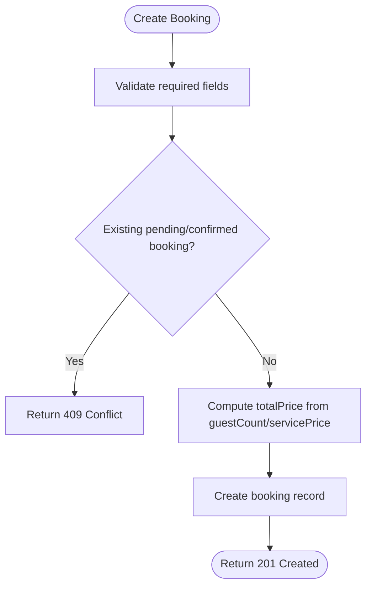
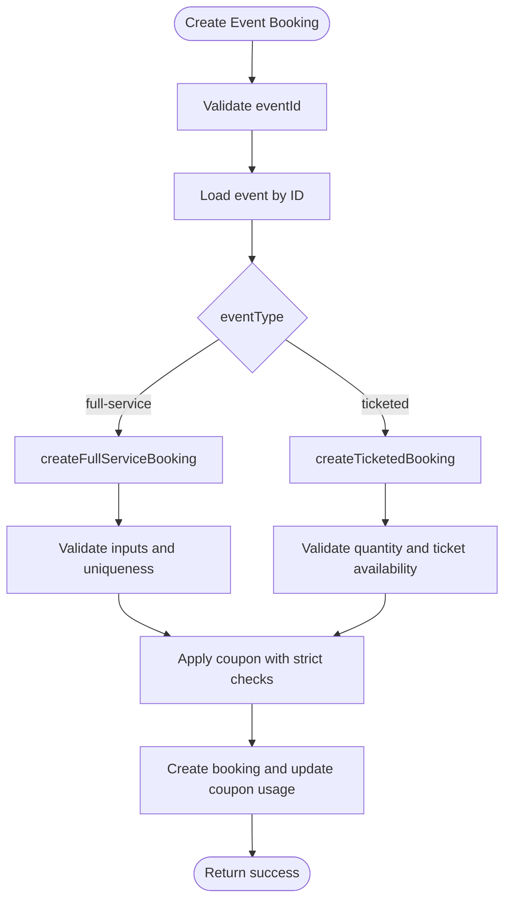
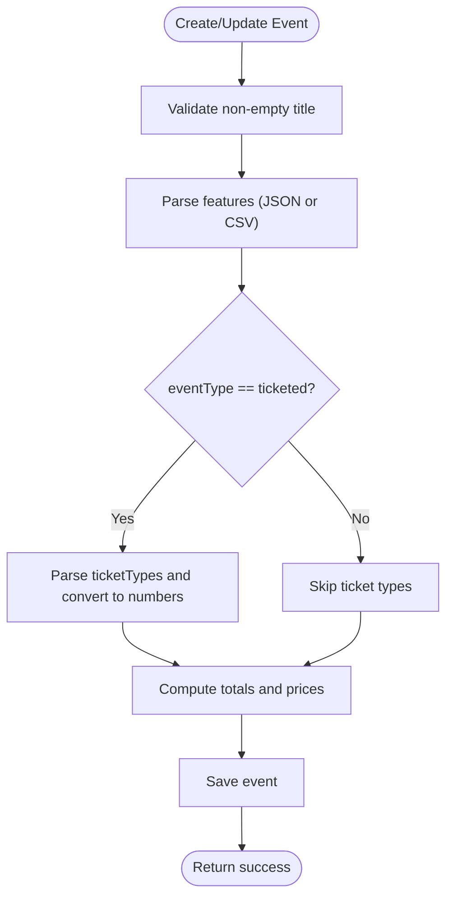
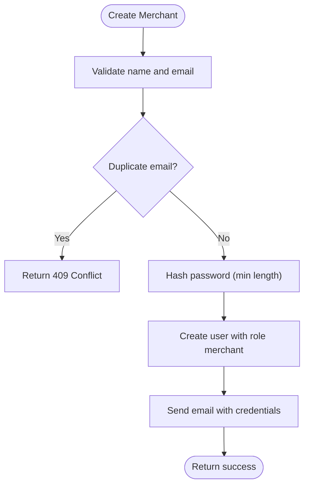
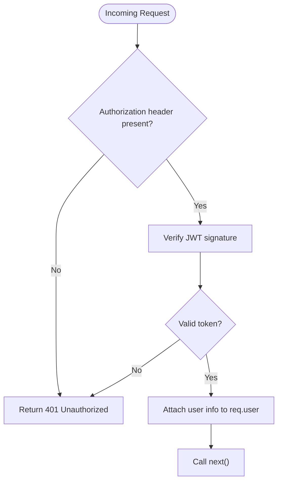
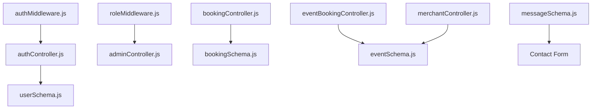

# Input Validation and Sanitization

<cite>
**Referenced Files in This Document**
- [authController.js](file://backend/controller/authController.js)
- [bookingController.js](file://backend/controller/bookingController.js)
- [eventBookingController.js](file://backend/controller/eventBookingController.js)
- [merchantController.js](file://backend/controller/merchantController.js)
- [adminController.js](file://backend/controller/adminController.js)
- [authMiddleware.js](file://backend/middleware/authMiddleware.js)
- [roleMiddleware.js](file://backend/middleware/roleMiddleware.js)
- [userSchema.js](file://backend/models/userSchema.js)
- [bookingSchema.js](file://backend/models/bookingSchema.js)
- [eventSchema.js](file://backend/models/eventSchema.js)
- [messageSchema.js](file://backend/models/messageSchema.js)
</cite>

## Table of Contents
1. [Introduction](#introduction)
2. [Project Structure](#project-structure)
3. [Core Components](#core-components)
4. [Architecture Overview](#architecture-overview)
5. [Detailed Component Analysis](#detailed-component-analysis)
6. [Dependency Analysis](#dependency-analysis)
7. [Performance Considerations](#performance-considerations)
8. [Troubleshooting Guide](#troubleshooting-guide)
9. [Conclusion](#conclusion)

## Introduction
This document provides a comprehensive guide to input validation and sanitization across the backend controllers and middleware. It explains validation patterns, sanitization techniques, and security measures against injection attacks. It covers form validation implementation, data sanitization methods, and protection mechanisms used in authentication, event management, and booking controllers. It also documents middleware usage, input filtering, and safeguards against cross-site scripting (XSS) and SQL injection risks.

## Project Structure
The backend follows a layered architecture:
- Controllers handle HTTP requests and enforce business logic validation.
- Middleware enforces authentication and role-based access control.
- Models define schemas with built-in validation and sanitization via Mongoose and validator library.
- Utilities and services support specialized tasks (e.g., email, cloud storage).

**Diagram sources**
- [authController.js:1-120](file://backend/controller/authController.js#L1-L120)
- [bookingController.js:1-233](file://backend/controller/bookingController.js#L1-L233)
- [eventBookingController.js:1-800](file://backend/controller/eventBookingController.js#L1-L800)
- [merchantController.js:1-176](file://backend/controller/merchantController.js#L1-L176)
- [adminController.js:1-194](file://backend/controller/adminController.js#L1-L194)
- [authMiddleware.js:1-17](file://backend/middleware/authMiddleware.js#L1-L17)
- [roleMiddleware.js:1-9](file://backend/middleware/roleMiddleware.js#L1-L9)
- [userSchema.js:1-55](file://backend/models/userSchema.js#L1-L55)
- [bookingSchema.js:1-53](file://backend/models/bookingSchema.js#L1-L53)
- [eventSchema.js:1-44](file://backend/models/eventSchema.js#L1-L44)
- [messageSchema.js:1-28](file://backend/models/messageSchema.js#L1-L28)

**Section sources**
- [authController.js:1-120](file://backend/controller/authController.js#L1-L120)
- [bookingController.js:1-233](file://backend/controller/bookingController.js#L1-L233)
- [eventBookingController.js:1-800](file://backend/controller/eventBookingController.js#L1-L800)
- [merchantController.js:1-176](file://backend/controller/merchantController.js#L1-L176)
- [adminController.js:1-194](file://backend/controller/adminController.js#L1-L194)
- [authMiddleware.js:1-17](file://backend/middleware/authMiddleware.js#L1-L17)
- [roleMiddleware.js:1-9](file://backend/middleware/roleMiddleware.js#L1-L9)
- [userSchema.js:1-55](file://backend/models/userSchema.js#L1-L55)
- [bookingSchema.js:1-53](file://backend/models/bookingSchema.js#L1-L53)
- [eventSchema.js:1-44](file://backend/models/eventSchema.js#L1-L44)
- [messageSchema.js:1-28](file://backend/models/messageSchema.js#L1-L28)

## Core Components
- Authentication controller validates presence of required fields and uses bcrypt for password hashing. It relies on JWT for secure token issuance and middleware for authorization.
- Booking controllers validate required fields, enforce uniqueness constraints, and sanitize numeric and string inputs.
- Event booking controller routes requests based on event type, validates inputs, and applies coupon logic with strict checks.
- Merchant controller sanitizes and parses inputs for event creation and updates, ensuring safe numeric conversions and trimming.
- Admin controller validates required fields for merchant creation and uses bcrypt for secure password handling.
- Middleware enforces bearer token validation and role-based access control.

Security measures:
- Input presence checks and explicit type conversions prevent injection and type coercion attacks.
- Model-level validators (e.g., email format) reduce risk of malformed data entering the database.
- JWT-based authentication ensures secure session handling.

**Section sources**
- [authController.js:11-107](file://backend/controller/authController.js#L11-L107)
- [bookingController.js:4-70](file://backend/controller/bookingController.js#L4-L70)
- [eventBookingController.js:8-73](file://backend/controller/eventBookingController.js#L8-L73)
- [merchantController.js:5-86](file://backend/controller/merchantController.js#L5-L86)
- [adminController.js:27-77](file://backend/controller/adminController.js#L27-L77)
- [authMiddleware.js:3-16](file://backend/middleware/authMiddleware.js#L3-L16)
- [roleMiddleware.js:1-9](file://backend/middleware/roleMiddleware.js#L1-L9)
- [userSchema.js:26-36](file://backend/models/userSchema.js#L26-L36)
- [bookingSchema.js:10-25](file://backend/models/bookingSchema.js#L10-L25)
- [eventSchema.js:5-28](file://backend/models/eventSchema.js#L5-L28)

## Architecture Overview
The validation pipeline integrates middleware, controller-level checks, and model-level validations.

**Diagram sources**
- [authMiddleware.js:3-16](file://backend/middleware/authMiddleware.js#L3-L16)
- [authController.js:54-107](file://backend/controller/authController.js#L54-L107)
- [userSchema.js:1-55](file://backend/models/userSchema.js#L1-L55)

**Section sources**
- [authMiddleware.js:1-17](file://backend/middleware/authMiddleware.js#L1-L17)
- [authController.js:1-120](file://backend/controller/authController.js#L1-L120)
- [userSchema.js:1-55](file://backend/models/userSchema.js#L1-L55)

## Detailed Component Analysis

### Authentication Controller Validation
- Presence validation: Ensures email and password are provided before proceeding.
- Role validation: Limits accepted roles to predefined values, defaulting to a safe default.
- Password handling: Uses bcrypt for secure hashing; model schema enforces minimum length.
- Token issuance: Uses JWT with environment-configured expiration and secret.

**Diagram sources**
- [authController.js:54-107](file://backend/controller/authController.js#L54-L107)
- [userSchema.js:33-36](file://backend/models/userSchema.js#L33-L36)

**Section sources**
- [authController.js:11-107](file://backend/controller/authController.js#L11-L107)
- [userSchema.js:1-55](file://backend/models/userSchema.js#L1-L55)

### Booking Controller Validation
- Required fields: serviceId, serviceTitle, serviceCategory, servicePrice are mandatory.
- Uniqueness: Prevents duplicate pending or confirmed bookings per user and service.
- Numeric sanitization: Guest count defaults to 1 if missing; total price computed safely.
- Status validation: Only accepts predefined statuses.

**Diagram sources**
- [bookingController.js:4-70](file://backend/controller/bookingController.js#L4-L70)
- [bookingSchema.js:10-25](file://backend/models/bookingSchema.js#L10-L25)

**Section sources**
- [bookingController.js:4-70](file://backend/controller/bookingController.js#L4-L70)
- [bookingSchema.js:1-53](file://backend/models/bookingSchema.js#L1-L53)

### Event Booking Controller Validation
- Event routing: Routes to full-service or ticketed handlers based on event type.
- Full-service validation: Requires user ID, event existence, and enforces pending/approved booking exclusivity.
- Ticketed validation: Validates quantity, ticket type availability, and enforces numeric conversions.
- Coupon validation: Strict checks for validity, expiry, usage limits, minimum order amount, and per-user usage.

**Diagram sources**
- [eventBookingController.js:8-73](file://backend/controller/eventBookingController.js#L8-L73)
- [eventBookingController.js:76-319](file://backend/controller/eventBookingController.js#L76-L319)
- [eventBookingController.js:322-589](file://backend/controller/eventBookingController.js#L322-L589)

**Section sources**
- [eventBookingController.js:1-800](file://backend/controller/eventBookingController.js#L1-L800)

### Merchant Controller Validation
- Title validation: Ensures non-empty trimmed title.
- Image handling: Uploads images and replaces previous ones when updated.
- Features parsing: Safely parses JSON or falls back to CSV-like parsing with trimming and filtering.
- Ticket types parsing: Converts to numbers and ensures availability equals quantity on creation.
- Numeric sanitization: Uses Number() for safe conversion with fallbacks.

**Diagram sources**
- [merchantController.js:5-86](file://backend/controller/merchantController.js#L5-L86)
- [merchantController.js:88-135](file://backend/controller/merchantController.js#L88-L135)
- [eventSchema.js:5-39](file://backend/models/eventSchema.js#L5-L39)

**Section sources**
- [merchantController.js:1-176](file://backend/controller/merchantController.js#L1-L176)
- [eventSchema.js:1-44](file://backend/models/eventSchema.js#L1-L44)

### Admin Controller Validation
- Merchant creation: Validates required fields (name, email), checks for duplicates, and generates a temporary password with minimum length enforcement.
- Password hashing: Uses bcrypt for secure storage.
- Email notifications: Sends credentials via mail utility.

**Diagram sources**
- [adminController.js:27-77](file://backend/controller/adminController.js#L27-L77)

**Section sources**
- [adminController.js:1-194](file://backend/controller/adminController.js#L1-L194)

### Middleware Validation
- Authentication middleware: Extracts Bearer token, verifies JWT, and attaches user info to the request.
- Role middleware: Enforces allowed roles for protected endpoints.

**Diagram sources**
- [authMiddleware.js:3-16](file://backend/middleware/authMiddleware.js#L3-L16)
- [roleMiddleware.js:1-9](file://backend/middleware/roleMiddleware.js#L1-L9)

**Section sources**
- [authMiddleware.js:1-17](file://backend/middleware/authMiddleware.js#L1-L17)
- [roleMiddleware.js:1-9](file://backend/middleware/roleMiddleware.js#L1-L9)

## Dependency Analysis
Validation and sanitization depend on:
- Middleware for authentication and role checks.
- Model schemas for field-level validation and sanitization.
- Controller logic for runtime checks and transformations.

**Diagram sources**
- [authMiddleware.js:1-17](file://backend/middleware/authMiddleware.js#L1-L17)
- [roleMiddleware.js:1-9](file://backend/middleware/roleMiddleware.js#L1-L9)
- [authController.js:1-120](file://backend/controller/authController.js#L1-L120)
- [adminController.js:1-194](file://backend/controller/adminController.js#L1-L194)
- [bookingController.js:1-233](file://backend/controller/bookingController.js#L1-L233)
- [eventBookingController.js:1-800](file://backend/controller/eventBookingController.js#L1-L800)
- [merchantController.js:1-176](file://backend/controller/merchantController.js#L1-L176)
- [userSchema.js:1-55](file://backend/models/userSchema.js#L1-L55)
- [bookingSchema.js:1-53](file://backend/models/bookingSchema.js#L1-L53)
- [eventSchema.js:1-44](file://backend/models/eventSchema.js#L1-L44)
- [messageSchema.js:1-28](file://backend/models/messageSchema.js#L1-L28)

**Section sources**
- [authMiddleware.js:1-17](file://backend/middleware/authMiddleware.js#L1-L17)
- [roleMiddleware.js:1-9](file://backend/middleware/roleMiddleware.js#L1-L9)
- [authController.js:1-120](file://backend/controller/authController.js#L1-L120)
- [adminController.js:1-194](file://backend/controller/adminController.js#L1-L194)
- [bookingController.js:1-233](file://backend/controller/bookingController.js#L1-L233)
- [eventBookingController.js:1-800](file://backend/controller/eventBookingController.js#L1-L800)
- [merchantController.js:1-176](file://backend/controller/merchantController.js#L1-L176)
- [userSchema.js:1-55](file://backend/models/userSchema.js#L1-L55)
- [bookingSchema.js:1-53](file://backend/models/bookingSchema.js#L1-L53)
- [eventSchema.js:1-44](file://backend/models/eventSchema.js#L1-L44)
- [messageSchema.js:1-28](file://backend/models/messageSchema.js#L1-L28)

## Performance Considerations
- Prefer early exits for invalid inputs to minimize database queries.
- Use model-level validators to offload validation logic and reduce controller complexity.
- Avoid expensive computations in hot paths; cache frequently accessed metadata when appropriate.
- Keep sanitization minimal and targeted to prevent unnecessary overhead.

## Troubleshooting Guide
Common validation failures and resolutions:
- Missing required fields: Ensure client sends all required parameters. Controllers return explicit 400 responses for missing inputs.
- Duplicate entries: For bookings, ensure uniqueness constraints are respected; controllers return 409 for conflicts.
- Invalid tokens: Authentication middleware returns 401 for missing or invalid tokens.
- Role restrictions: Role middleware returns 403 for unauthorized access attempts.
- Email validation errors: Model-level validators enforce email format; ensure clients provide valid emails.

**Section sources**
- [authController.js:17-29](file://backend/controller/authController.js#L17-L29)
- [bookingController.js:33-38](file://backend/controller/bookingController.js#L33-L38)
- [authMiddleware.js:7-14](file://backend/middleware/authMiddleware.js#L7-L14)
- [roleMiddleware.js:3-6](file://backend/middleware/roleMiddleware.js#L3-L6)
- [userSchema.js:26-31](file://backend/models/userSchema.js#L26-L31)

## Conclusion
The backend implements robust input validation and sanitization across controllers and models. Middleware ensures secure authentication and role-based access control. Controllers apply presence checks, type conversions, and business-specific validations. Model schemas enforce field-level constraints, reducing the risk of injection and malformed data. Together, these layers provide strong protection against common vulnerabilities while maintaining clean separation of concerns.