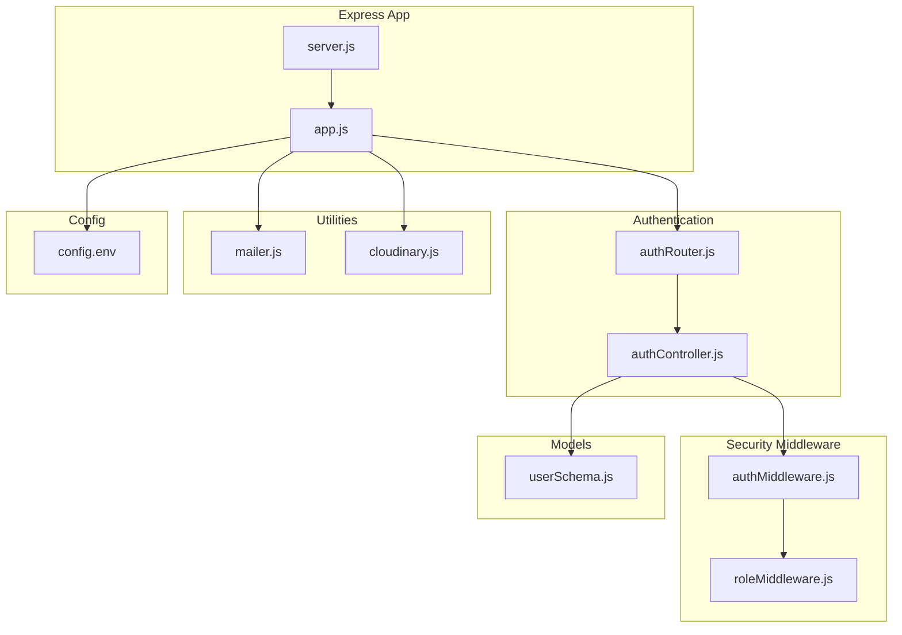
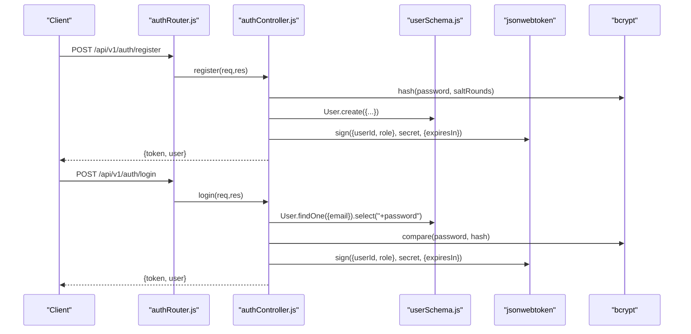
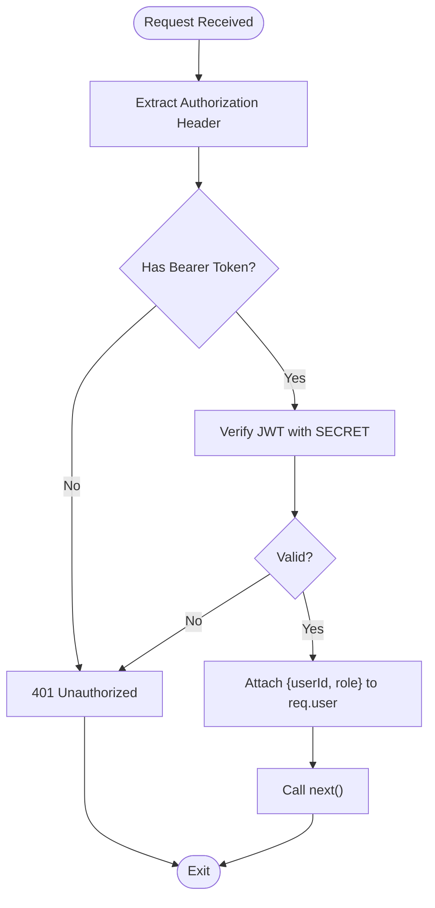
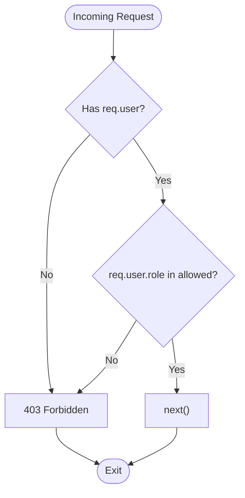
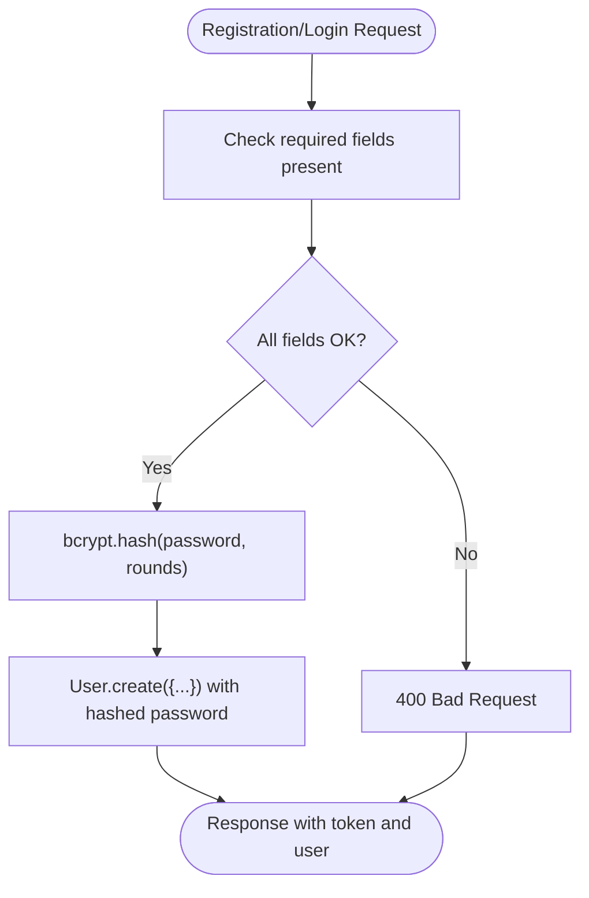
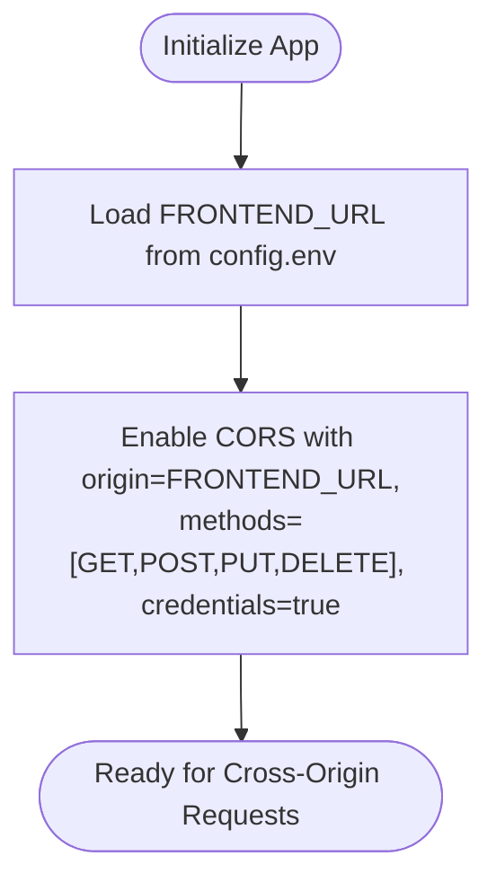
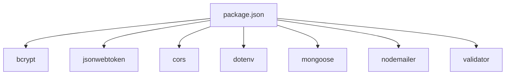

# Security Implementation

<cite>
**Referenced Files in This Document**
- [app.js](file://backend/app.js)
- [server.js](file://backend/server.js)
- [authMiddleware.js](file://backend/middleware/authMiddleware.js)
- [roleMiddleware.js](file://backend/middleware/roleMiddleware.js)
- [authController.js](file://backend/controller/authController.js)
- [authRouter.js](file://backend/router/authRouter.js)
- [userSchema.js](file://backend/models/userSchema.js)
- [dbConnection.js](file://backend/database/dbConnection.js)
- [mailer.js](file://backend/util/mailer.js)
- [cloudinary.js](file://backend/util/cloudinary.js)
- [config.env](file://backend/config/config.env)
- [package.json](file://backend/package.json)
- [testCors.js](file://backend/scripts/testCors.js)
</cite>

## Table of Contents
1. [Introduction](#introduction)
2. [Project Structure](#project-structure)
3. [Core Components](#core-components)
4. [Architecture Overview](#architecture-overview)
5. [Detailed Component Analysis](#detailed-component-analysis)
6. [Dependency Analysis](#dependency-analysis)
7. [Performance Considerations](#performance-considerations)
8. [Troubleshooting Guide](#troubleshooting-guide)
9. [Conclusion](#conclusion)
10. [Appendices](#appendices)

## Introduction
This document provides comprehensive security implementation documentation for the MERN Stack Event Management Platform. It focuses on authentication and authorization controls, input validation and sanitization, CORS configuration, and CSRF protection. It also covers JWT token security, password hashing with bcrypt, secure database connections, and email security. The document outlines middleware implementation, vulnerability prevention strategies, and security monitoring practices, along with best practices, threat mitigations, and security audit considerations.

## Project Structure
Security-related components are organized across middleware, controllers, routers, models, utilities, and configuration files. The Express application initializes CORS, body parsing, and routes. Authentication and authorization middleware enforce sessionless bearer tokens and role-based access. Controllers implement registration, login, and profile retrieval with bcrypt and JWT. Models define schema-level validations. Utilities handle email delivery and Cloudinary uploads. Environment variables centralize secrets and configuration.

**Diagram sources**
- [app.js:1-91](file://backend/app.js#L1-L91)
- [server.js:1-6](file://backend/server.js#L1-L6)
- [authMiddleware.js:1-17](file://backend/middleware/authMiddleware.js#L1-L17)
- [roleMiddleware.js:1-9](file://backend/middleware/roleMiddleware.js#L1-L9)
- [authController.js:1-120](file://backend/controller/authController.js#L1-L120)
- [authRouter.js:1-12](file://backend/router/authRouter.js#L1-L12)
- [userSchema.js:1-55](file://backend/models/userSchema.js#L1-L55)
- [mailer.js:1-42](file://backend/util/mailer.js#L1-L42)
- [cloudinary.js:1-112](file://backend/util/cloudinary.js#L1-L112)
- [config.env:1-42](file://backend/config/config.env#L1-L42)

**Section sources**
- [app.js:1-91](file://backend/app.js#L1-L91)
- [server.js:1-6](file://backend/server.js#L1-L6)
- [config.env:1-42](file://backend/config/config.env#L1-L42)

## Core Components
- Authentication middleware validates bearer tokens and attaches user identity to the request.
- Authorization middleware enforces role-based access control.
- Authentication controller implements registration, login, and profile retrieval with bcrypt and JWT.
- User model defines schema-level validations and selects password field carefully.
- Database connection utility implements robust Atlas connectivity with retries and DNS overrides.
- Email utility provides secure SMTP transport with fallback logging.
- Cloudinary utility manages secure image uploads with file filtering and transformations.
- CORS configuration restricts origins and enables credentials for cross-origin requests.

**Section sources**
- [authMiddleware.js:1-17](file://backend/middleware/authMiddleware.js#L1-L17)
- [roleMiddleware.js:1-9](file://backend/middleware/roleMiddleware.js#L1-L9)
- [authController.js:1-120](file://backend/controller/authController.js#L1-L120)
- [userSchema.js:1-55](file://backend/models/userSchema.js#L1-L55)
- [dbConnection.js:1-112](file://backend/database/dbConnection.js#L1-L112)
- [mailer.js:1-42](file://backend/util/mailer.js#L1-L42)
- [cloudinary.js:1-112](file://backend/util/cloudinary.js#L1-L112)
- [app.js:24-30](file://backend/app.js#L24-L30)

## Architecture Overview
The platform enforces authentication via bearer tokens and authorization via role checks. Requests flow through middleware to controllers, which interact with models and utilities. CORS is configured centrally to allow credentials and specific methods. Secrets and configuration are loaded from environment variables.

**Diagram sources**
- [authRouter.js:1-12](file://backend/router/authRouter.js#L1-L12)
- [authController.js:1-120](file://backend/controller/authController.js#L1-L120)
- [userSchema.js:1-55](file://backend/models/userSchema.js#L1-L55)

## Detailed Component Analysis

### Authentication Security
- Token issuance uses a configurable secret and expiration. The controller signs a payload containing user ID and role.
- Token verification occurs in middleware by extracting the Bearer token from the Authorization header and validating it against the configured secret.
- On successful verification, the request is augmented with user identity and forwarded to the next handler.

**Diagram sources**
- [authMiddleware.js:1-17](file://backend/middleware/authMiddleware.js#L1-L17)
- [authController.js:5-9](file://backend/controller/authController.js#L5-L9)

**Section sources**
- [authMiddleware.js:1-17](file://backend/middleware/authMiddleware.js#L1-L17)
- [authController.js:5-9](file://backend/controller/authController.js#L5-L9)

### Authorization Controls
- Role enforcement middleware accepts a list of allowed roles and rejects requests from unauthorized roles.
- Controllers can compose route-level authorization by chaining the auth middleware with role enforcement.

**Diagram sources**
- [roleMiddleware.js:1-9](file://backend/middleware/roleMiddleware.js#L1-L9)

**Section sources**
- [roleMiddleware.js:1-9](file://backend/middleware/roleMiddleware.js#L1-L9)

### Input Validation and Sanitization
- Registration and login endpoints validate presence of required fields and normalize email to lowercase in the model.
- The user model applies schema-level validators for email format and minimum length for name and password.
- Passwords are hashed with bcrypt before persistence, and the password field is excluded from queries by default.

**Diagram sources**
- [authController.js:11-52](file://backend/controller/authController.js#L11-L52)
- [userSchema.js:26-38](file://backend/models/userSchema.js#L26-L38)

**Section sources**
- [authController.js:11-52](file://backend/controller/authController.js#L11-L52)
- [userSchema.js:26-38](file://backend/models/userSchema.js#L26-L38)

### CORS Configuration
- The application enables CORS with a single allowed origin from environment variables, supports specific HTTP methods, and permits credentials.
- Tests confirm that CORS allows PATCH and other methods required by the frontend.

**Diagram sources**
- [app.js:24-30](file://backend/app.js#L24-L30)
- [config.env:20-21](file://backend/config/config.env#L20-L21)
- [testCors.js:75-104](file://backend/scripts/testCors.js#L75-L104)

**Section sources**
- [app.js:24-30](file://backend/app.js#L24-L30)
- [config.env:20-21](file://backend/config/config.env#L20-L21)
- [testCors.js:75-104](file://backend/scripts/testCors.js#L75-L104)

### CSRF Protection
- The backend does not implement CSRF middleware. CSRF protection is typically handled on the client side by ensuring SameSite cookies and anti-CSRF tokens for state-changing requests. Given the current architecture using bearer tokens for authentication, CSRF is mitigated by avoiding cookie-based sessions. However, adding CSRF protection is recommended for broader defense-in-depth.

[No sources needed since this section provides general guidance]

### JWT Token Security
- Token signing uses a configurable secret and expiration window.
- Token verification occurs in middleware using the same secret.
- Recommendations:
  - Rotate JWT_SECRET regularly.
  - Use short-lived tokens with refresh token rotation.
  - Store tokens securely on the client (HttpOnly/Secure cookies or secure storage).
  - Enforce HTTPS in production.

**Section sources**
- [authController.js:5-9](file://backend/controller/authController.js#L5-L9)
- [authMiddleware.js:10](file://backend/middleware/authMiddleware.js#L10)

### Password Hashing with bcrypt
- Passwords are hashed with a high-round cost factor before storage.
- Authentication compares submitted passwords against stored hashes.
- Best practices:
  - Keep bcrypt cost factors reasonable for performance.
  - Never log raw passwords or hashes.
  - Enforce strong password policies at the application level.

**Section sources**
- [authController.js:31](file://backend/controller/authController.js#L31)
- [authController.js:75](file://backend/controller/authController.js#L75)

### Secure Database Connections
- The database connection utility implements multiple fallback strategies for Atlas connectivity, including forced DNS resolution and manual SRV resolution.
- Connection options include timeouts, pool sizing, retry writes, and write concerns.
- Recommendations:
  - Use environment-specific credentials and network access lists.
  - Monitor connection events and implement circuit breaker patterns.
  - Prefer TLS 1.2+ and avoid plaintext connections.

**Section sources**
- [dbConnection.js:19-94](file://backend/database/dbConnection.js#L19-L94)

### Email Security
- The email utility constructs a transport using SMTP host, port, and credentials.
- Port 465 enables implicit TLS; other ports should use STARTTLS.
- Fallback mode logs messages instead of sending, useful for development.
- Recommendations:
  - Use app-specific passwords or OAuth.
  - Restrict sender address and validate recipients.
  - Implement rate limiting and queueing for bulk sends.

**Section sources**
- [mailer.js:5-35](file://backend/util/mailer.js#L5-L35)
- [config.env:37-41](file://backend/config/config.env#L37-L41)

### Cloudinary Image Upload Security
- Uploads are filtered to image MIME types and limited by file size.
- Images are transformed and stored securely with Cloudinary.
- Recommendations:
  - Use signed uploads for untrusted clients.
  - Apply strict allowed formats and enforce transformations.
  - Implement deletion hooks and audit logs.

**Section sources**
- [cloudinary.js:36-58](file://backend/util/cloudinary.js#L36-L58)
- [cloudinary.js:61-109](file://backend/util/cloudinary.js#L61-L109)

### Security Middleware Implementation
- Centralized middleware for authentication and role enforcement ensures consistent enforcement across routes.
- Route composition demonstrates chaining auth and role middleware for protected endpoints.

**Section sources**
- [authRouter.js:3](file://backend/router/authRouter.js#L3)
- [authMiddleware.js:1-17](file://backend/middleware/authMiddleware.js#L1-L17)
- [roleMiddleware.js:1-9](file://backend/middleware/roleMiddleware.js#L1-L9)

### Vulnerability Prevention
- Injection prevention:
  - Use Mongoose ODM with validated schemas to prevent NoSQL injection.
  - Avoid dynamic query construction with user input.
- XSS prevention:
  - Sanitize and escape user-generated content on the client.
  - Use Content-Security-Policy headers.
- SSRF prevention:
  - Validate and restrict outbound URLs in utilities.
- Least privilege:
  - Enforce role-based access control for administrative endpoints.

[No sources needed since this section provides general guidance]

### Security Monitoring
- Log connection events and errors from the database utility.
- Centralize application logs and monitor for repeated 401/403 responses.
- Implement health checks and configuration verification endpoints.

**Section sources**
- [dbConnection.js:96-112](file://backend/database/dbConnection.js#L96-L112)
- [app.js:49-62](file://backend/app.js#L49-L62)

## Dependency Analysis
Security-related dependencies include bcrypt, jsonwebtoken, cors, dotenv, mongoose, nodemailer, and validator. These libraries underpin authentication, authorization, transport security, and input validation.

**Diagram sources**
- [package.json:13-24](file://backend/package.json#L13-L24)

**Section sources**
- [package.json:13-24](file://backend/package.json#L13-L24)

## Performance Considerations
- bcrypt cost factor impacts CPU usage during registration/login; tune for acceptable latency.
- JWT verification is lightweight but ensure minimal payload to reduce overhead.
- Database connection pooling and retry logic balance reliability and resource usage.
- Email and Cloudinary operations should be asynchronous and rate-limited.

[No sources needed since this section provides general guidance]

## Troubleshooting Guide
- CORS failures:
  - Verify FRONTEND_URL matches the client origin.
  - Confirm allowed methods include PATCH and credentials are enabled.
- Authentication failures:
  - Ensure JWT_SECRET is consistent across deployments.
  - Check token presence and expiration.
- Database connectivity:
  - Review DNS override logs and Atlas network access settings.
  - Validate credentials and cluster availability.
- Email delivery:
  - Confirm SMTP_HOST, SMTP_PORT, and credentials.
  - Use fallback logging to verify message content.

**Section sources**
- [app.js:24-30](file://backend/app.js#L24-L30)
- [config.env:20-21](file://backend/config/config.env#L20-L21)
- [authMiddleware.js:10](file://backend/middleware/authMiddleware.js#L10)
- [dbConnection.js:86-94](file://backend/database/dbConnection.js#L86-L94)
- [mailer.js:17-34](file://backend/util/mailer.js#L17-L34)

## Conclusion
The platform implements a robust foundation for authentication and authorization using bearer tokens and role-based access control. Schema-level validations, bcrypt hashing, and secure environment configuration contribute to overall security. CORS is configured to support the frontend while enabling credentials. Additional CSRF protection, enhanced JWT lifecycle management, and stricter transport security would further strengthen the platform’s defenses.

[No sources needed since this section summarizes without analyzing specific files]

## Appendices

### Security Best Practices Checklist
- Enforce HTTPS in production.
- Rotate secrets regularly and manage them via secure vaults.
- Implement rate limiting for authentication endpoints.
- Add CSRF protection for cookie-based sessions.
- Use short-lived access tokens with refresh token rotation.
- Harden CORS policy to least privilege.
- Monitor and alert on authentication anomalies.

[No sources needed since this section provides general guidance]