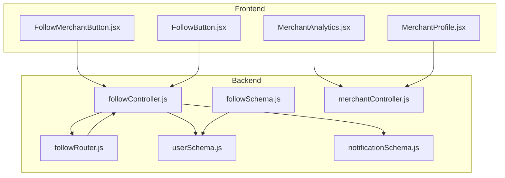
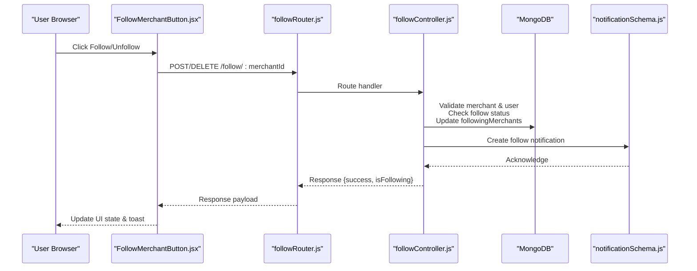
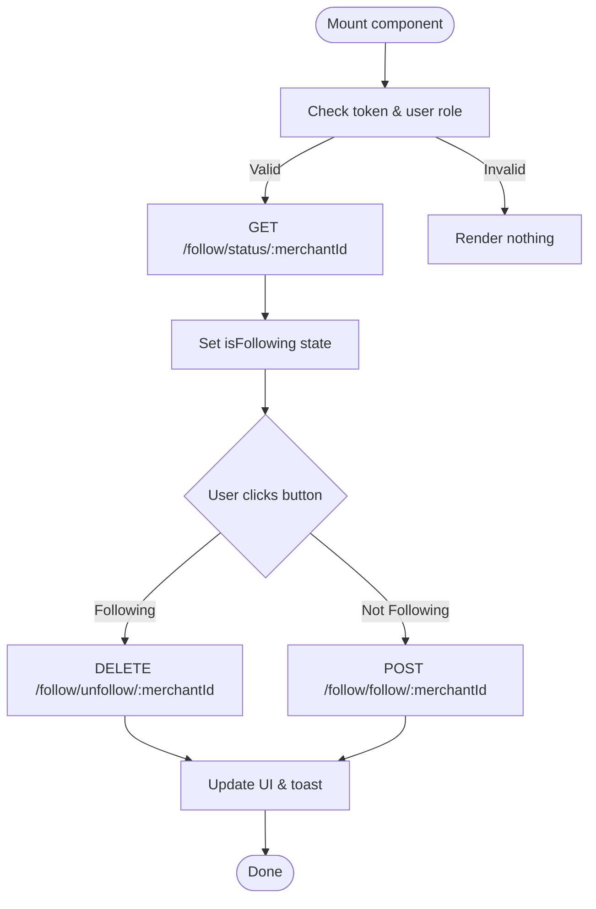
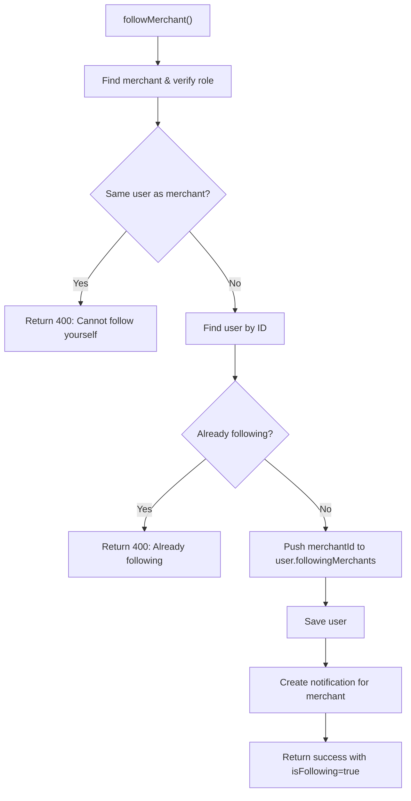
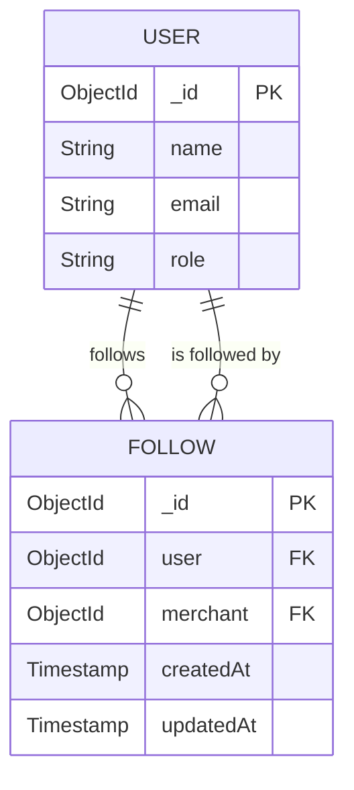
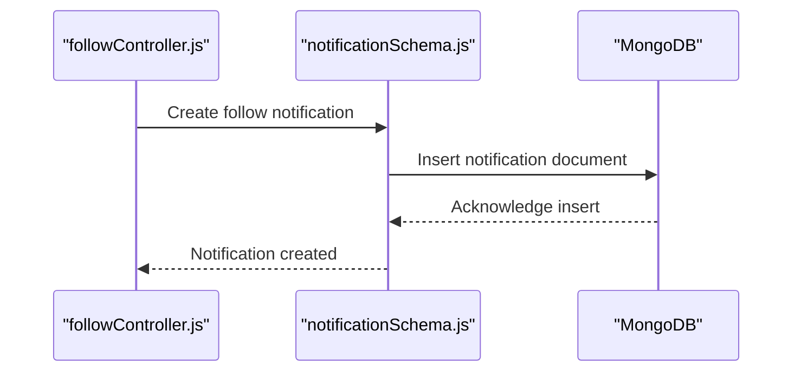
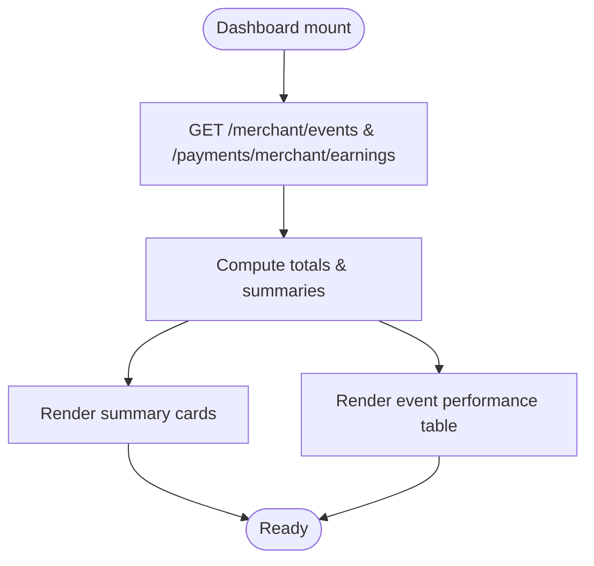
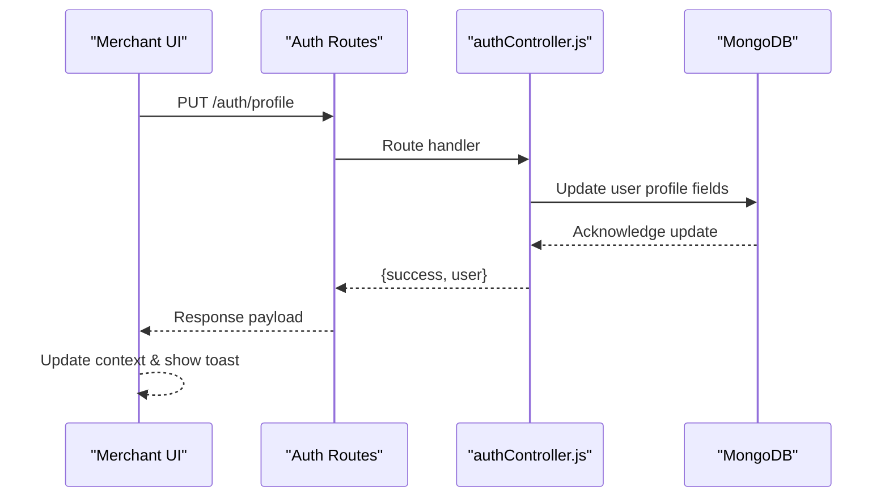
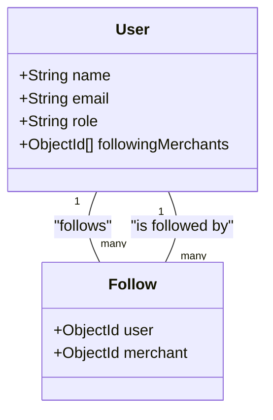
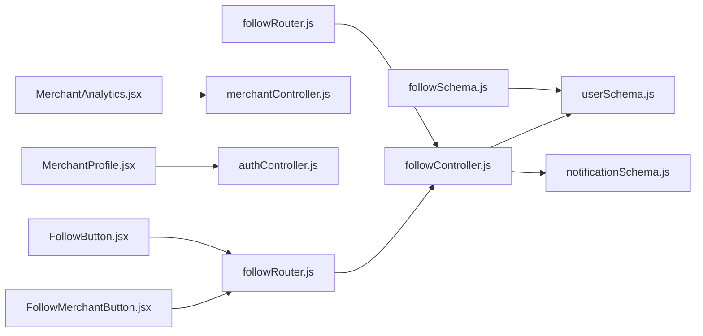

# Merchant Following System

<cite>
**Referenced Files in This Document**
- [followController.js](file://backend/controller/followController.js)
- [followSchema.js](file://backend/models/followSchema.js)
- [followRouter.js](file://backend/router/followRouter.js)
- [userSchema.js](file://backend/models/userSchema.js)
- [notificationSchema.js](file://backend/models/notificationSchema.js)
- [FollowMerchantButton.jsx](file://frontend/src/components/FollowMerchantButton.jsx)
- [FollowButton.jsx](file://frontend/src/components/FollowButton.jsx)
- [MerchantAnalytics.jsx](file://frontend/src/pages/dashboards/MerchantAnalytics.jsx)
- [MerchantProfile.jsx](file://frontend/src/pages/dashboards/MerchantProfile.jsx)
- [merchantController.js](file://backend/controller/merchantController.js)
</cite>

## Table of Contents
1. [Introduction](#introduction)
2. [Project Structure](#project-structure)
3. [Core Components](#core-components)
4. [Architecture Overview](#architecture-overview)
5. [Detailed Component Analysis](#detailed-component-analysis)
6. [Dependency Analysis](#dependency-analysis)
7. [Performance Considerations](#performance-considerations)
8. [Troubleshooting Guide](#troubleshooting-guide)
9. [Conclusion](#conclusion)

## Introduction
This document provides comprehensive documentation for the merchant following system implementation. It covers merchant-specific follow functionality, merchant discovery mechanisms, and business relationship management. The documentation explains the FollowMerchantButton component design, merchant profile integration, and event subscription features. It also details merchant following analytics, popularity metrics, and promotional benefits, along with merchant verification processes, following recommendations, and social commerce features. Finally, it addresses merchant performance tracking, follower engagement metrics, and marketing automation integration.

## Project Structure
The merchant following system spans both backend and frontend layers:
- Backend: Controllers manage follow/unfollow operations, status checks, and follower retrieval. Models define the follow relationship and notifications. Routers expose REST endpoints.
- Frontend: React components render follow buttons, handle user interactions, and integrate with backend APIs. Merchant dashboards present analytics and profile management.

**Diagram sources**
- [followController.js:1-234](file://backend/controller/followController.js#L1-L234)
- [followRouter.js:1-26](file://backend/router/followRouter.js#L1-L26)
- [followSchema.js:1-22](file://backend/models/followSchema.js#L1-L22)
- [userSchema.js:1-55](file://backend/models/userSchema.js#L1-L55)
- [notificationSchema.js:1-36](file://backend/models/notificationSchema.js#L1-L36)
- [FollowMerchantButton.jsx:1-117](file://frontend/src/components/FollowMerchantButton.jsx#L1-L117)
- [FollowButton.jsx:1-121](file://frontend/src/components/FollowButton.jsx#L1-L121)
- [MerchantAnalytics.jsx:1-156](file://frontend/src/pages/dashboards/MerchantAnalytics.jsx#L1-L156)
- [MerchantProfile.jsx:1-214](file://frontend/src/pages/dashboards/MerchantProfile.jsx#L1-L214)
- [merchantController.js:1-151](file://backend/controller/merchantController.js#L1-L151)

**Section sources**
- [followController.js:1-234](file://backend/controller/followController.js#L1-L234)
- [followRouter.js:1-26](file://backend/router/followRouter.js#L1-L26)
- [followSchema.js:1-22](file://backend/models/followSchema.js#L1-L22)
- [userSchema.js:1-55](file://backend/models/userSchema.js#L1-L55)
- [notificationSchema.js:1-36](file://backend/models/notificationSchema.js#L1-L36)
- [FollowMerchantButton.jsx:1-117](file://frontend/src/components/FollowMerchantButton.jsx#L1-L117)
- [FollowButton.jsx:1-121](file://frontend/src/components/FollowButton.jsx#L1-L121)
- [MerchantAnalytics.jsx:1-156](file://frontend/src/pages/dashboards/MerchantAnalytics.jsx#L1-L156)
- [MerchantProfile.jsx:1-214](file://frontend/src/pages/dashboards/MerchantProfile.jsx#L1-L214)
- [merchantController.js:1-151](file://backend/controller/merchantController.js#L1-L151)

## Core Components
- FollowMerchantButton (frontend): A React component that renders a follow/unfollow button for merchants, handles authentication checks, and manages loading states and user feedback.
- followController (backend): Implements follow/unfollow, status checks, and retrieval of following merchants and followers. It validates roles, prevents self-following, and creates notifications for merchants upon new followers.
- followRouter (backend): Exposes REST endpoints for follow actions, status checks, and data retrieval.
- followSchema (backend): Defines the relational model for follow relationships with uniqueness constraints.
- notificationSchema (backend): Manages notification creation for merchant follow events.
- MerchantAnalytics (frontend): Provides merchant-side analytics dashboards for performance tracking and earnings.
- MerchantProfile (frontend): Enables merchant profile updates and integrates with backend APIs.

**Section sources**
- [FollowMerchantButton.jsx:1-117](file://frontend/src/components/FollowMerchantButton.jsx#L1-L117)
- [followController.js:1-234](file://backend/controller/followController.js#L1-L234)
- [followRouter.js:1-26](file://backend/router/followRouter.js#L1-L26)
- [followSchema.js:1-22](file://backend/models/followSchema.js#L1-L22)
- [notificationSchema.js:1-36](file://backend/models/notificationSchema.js#L1-L36)
- [MerchantAnalytics.jsx:1-156](file://frontend/src/pages/dashboards/MerchantAnalytics.jsx#L1-L156)
- [MerchantProfile.jsx:1-214](file://frontend/src/pages/dashboards/MerchantProfile.jsx#L1-L214)

## Architecture Overview
The system follows a layered architecture:
- Frontend components communicate with backend via authenticated HTTP requests.
- Backend controllers coordinate with models and database operations.
- Notifications are created asynchronously when a user follows a merchant.
- Merchant dashboards consume merchant-specific endpoints for analytics and profile management.

**Diagram sources**
- [FollowMerchantButton.jsx:1-117](file://frontend/src/components/FollowMerchantButton.jsx#L1-L117)
- [followRouter.js:1-26](file://backend/router/followRouter.js#L1-L26)
- [followController.js:1-234](file://backend/controller/followController.js#L1-L234)
- [notificationSchema.js:1-36](file://backend/models/notificationSchema.js#L1-L36)

## Detailed Component Analysis

### FollowMerchantButton Component
The FollowMerchantButton component encapsulates merchant follow functionality:
- Authentication and role checks: Ensures only authenticated users with role "user" can follow merchants.
- Status polling: On mount, fetches current follow status via GET /follow/status/:merchantId.
- Toggle logic: Calls POST /follow/follow/:merchantId to follow or DELETE /follow/unfollow/:merchantId to unfollow.
- UI feedback: Displays loading states, heart icons, and toast notifications for success/error.

**Diagram sources**
- [FollowMerchantButton.jsx:1-117](file://frontend/src/components/FollowMerchantButton.jsx#L1-L117)

**Section sources**
- [FollowMerchantButton.jsx:1-117](file://frontend/src/components/FollowMerchantButton.jsx#L1-L117)

### Backend Follow Controller
The follow controller implements core business logic:
- followMerchant: Validates merchant existence and role, prevents self-following, checks existing follow status, updates user's followingMerchants array, and creates a follow notification for the merchant.
- unfollowMerchant: Confirms user existence, verifies follow status, removes merchant from followingMerchants, and persists changes.
- checkFollowStatus: Returns whether the current user follows the specified merchant.
- getFollowingMerchants: Returns the list of merchants a user is following, populated with selected merchant fields.
- getMerchantFollowers: Retrieves all users who follow a given merchant and returns follower count.

**Diagram sources**
- [followController.js:1-86](file://backend/controller/followController.js#L1-L86)

**Section sources**
- [followController.js:1-234](file://backend/controller/followController.js#L1-L234)

### Follow Relationship Model
The followSchema defines a relational model linking users to merchants they follow:
- Fields: user (ObjectId referencing User), merchant (ObjectId referencing User).
- Index: Unique composite index on {user, merchant} to prevent duplicate follow relationships.
- Timestamps: Tracks creation/update times.

**Diagram sources**
- [followSchema.js:1-22](file://backend/models/followSchema.js#L1-L22)
- [userSchema.js:1-55](file://backend/models/userSchema.js#L1-L55)

**Section sources**
- [followSchema.js:1-22](file://backend/models/followSchema.js#L1-L22)
- [userSchema.js:1-55](file://backend/models/userSchema.js#L1-L55)

### Notification System for Follows
When a user follows a merchant, a notification is created for the merchant:
- Fields: user (merchant's ObjectId), message, read flag, type "follow".
- The notification is persisted to the Notification collection and can be retrieved by the merchant.

**Diagram sources**
- [followController.js:60-69](file://backend/controller/followController.js#L60-L69)
- [notificationSchema.js:1-36](file://backend/models/notificationSchema.js#L1-L36)

**Section sources**
- [followController.js:60-69](file://backend/controller/followController.js#L60-L69)
- [notificationSchema.js:1-36](file://backend/models/notificationSchema.js#L1-L36)

### Merchant Analytics Dashboard
The MerchantAnalytics dashboard aggregates merchant performance metrics:
- Fetches events and earnings via authenticated endpoints.
- Computes totals for events, upcoming vs completed events, total bookings, and earnings.
- Displays summary cards and an event performance table with revenue and booking counts.

**Diagram sources**
- [MerchantAnalytics.jsx:1-156](file://frontend/src/pages/dashboards/MerchantAnalytics.jsx#L1-L156)

**Section sources**
- [MerchantAnalytics.jsx:1-156](file://frontend/src/pages/dashboards/MerchantAnalytics.jsx#L1-L156)

### Merchant Profile Management
The MerchantProfile page enables merchants to update personal and business information:
- Loads current user data into form fields.
- Submits PUT /auth/profile with updated fields.
- Updates local auth context and shows success/error toasts.

**Diagram sources**
- [MerchantProfile.jsx:1-214](file://frontend/src/pages/dashboards/MerchantProfile.jsx#L1-L214)

**Section sources**
- [MerchantProfile.jsx:1-214](file://frontend/src/pages/dashboards/MerchantProfile.jsx#L1-L214)

### Merchant Discovery and Business Relationship Management
- Merchant discovery: Users can browse events and services; merchant profiles and business names are exposed via populated fields in follow queries.
- Business relationship management: Follow relationships are stored in the user document's followingMerchants array, enabling personalized discovery and relationship tracking.
- Event management: Merchant-specific event CRUD operations are handled by merchantController, supporting business relationship growth through event offerings.

**Diagram sources**
- [userSchema.js:1-55](file://backend/models/userSchema.js#L1-L55)
- [followSchema.js:1-22](file://backend/models/followSchema.js#L1-L22)

**Section sources**
- [userSchema.js:1-55](file://backend/models/userSchema.js#L1-L55)
- [followSchema.js:1-22](file://backend/models/followSchema.js#L1-L22)
- [merchantController.js:1-151](file://backend/controller/merchantController.js#L1-L151)

## Dependency Analysis
The system exhibits clear separation of concerns:
- Frontend components depend on HTTP utilities and auth context for secure requests.
- Backend controllers depend on models and middleware for authentication and authorization.
- Models enforce referential integrity and uniqueness constraints.
- Routers bind routes to controller handlers.

**Diagram sources**
- [FollowMerchantButton.jsx:1-117](file://frontend/src/components/FollowMerchantButton.jsx#L1-L117)
- [FollowButton.jsx:1-121](file://frontend/src/components/FollowButton.jsx#L1-L121)
- [MerchantAnalytics.jsx:1-156](file://frontend/src/pages/dashboards/MerchantAnalytics.jsx#L1-L156)
- [MerchantProfile.jsx:1-214](file://frontend/src/pages/dashboards/MerchantProfile.jsx#L1-L214)
- [followRouter.js:1-26](file://backend/router/followRouter.js#L1-L26)
- [followController.js:1-234](file://backend/controller/followController.js#L1-L234)
- [userSchema.js:1-55](file://backend/models/userSchema.js#L1-L55)
- [notificationSchema.js:1-36](file://backend/models/notificationSchema.js#L1-L36)
- [followSchema.js:1-22](file://backend/models/followSchema.js#L1-L22)
- [merchantController.js:1-151](file://backend/controller/merchantController.js#L1-L151)

**Section sources**
- [followRouter.js:1-26](file://backend/router/followRouter.js#L1-L26)
- [followController.js:1-234](file://backend/controller/followController.js#L1-L234)
- [userSchema.js:1-55](file://backend/models/userSchema.js#L1-L55)
- [notificationSchema.js:1-36](file://backend/models/notificationSchema.js#L1-L36)
- [followSchema.js:1-22](file://backend/models/followSchema.js#L1-L22)
- [merchantController.js:1-151](file://backend/controller/merchantController.js#L1-L151)

## Performance Considerations
- Database indexing: The unique compound index on {user, merchant} in the followSchema ensures efficient duplicate prevention and fast lookups.
- Population strategy: The getFollowingMerchants endpoint populates merchant fields selectively to reduce payload size while preserving essential merchant details for discovery.
- Asynchronous notifications: Notification creation occurs after user persistence to avoid blocking the primary follow operation.
- Frontend caching: The FollowMerchantButton caches follow status to minimize redundant API calls during a single session.

## Troubleshooting Guide
Common issues and resolutions:
- Authentication failures: Ensure the user is authenticated and has role "user" before attempting to follow.
- Merchant validation errors: Confirm the merchant exists and has role "merchant"; otherwise, return appropriate 404/400 responses.
- Self-follow attempts: Prevent users from following themselves; the controller returns a 400 error for such cases.
- Duplicate follow entries: The unique index on the followSchema prevents duplicate follow relationships.
- Notification creation failures: The controller logs and continues even if notification creation fails, ensuring the follow operation remains successful.

**Section sources**
- [followController.js:14-85](file://backend/controller/followController.js#L14-L85)
- [followSchema.js:19-21](file://backend/models/followSchema.js#L19-L21)
- [notificationSchema.js:60-69](file://backend/controller/followController.js#L60-L69)

## Conclusion
The merchant following system provides a robust foundation for building social commerce features around merchant discovery and relationship management. The frontend FollowMerchantButton component offers seamless user interactions, while the backend followController enforces business rules and maintains data integrity. Merchant dashboards enable performance tracking and profile management, supporting broader marketing automation and promotional initiatives. Together, these components deliver a scalable and maintainable solution for merchant-follower dynamics.