# Rating and Review System

<cite>
**Referenced Files in This Document**
- [ratingController.js](file://backend/controller/ratingController.js)
- [reviewController.js](file://backend/controller/reviewController.js)
- [ratingSchema.js](file://backend/models/ratingSchema.js)
- [reviewSchema.js](file://backend/models/reviewSchema.js)
- [ratingRouter.js](file://backend/router/ratingRouter.js)
- [reviewRouter.js](file://backend/router/reviewRouter.js)
- [authMiddleware.js](file://backend/middleware/authMiddleware.js)
- [roleMiddleware.js](file://backend/middleware/roleMiddleware.js)
- [RatingModal.jsx](file://frontend/src/components/RatingModal.jsx)
- [ReviewModal.jsx](file://frontend/src/components/ReviewModal.jsx)
- [StarRating.jsx](file://frontend/src/components/StarRating.jsx)
- [EventReviews.jsx](file://frontend/src/components/EventReviews.jsx)
- [UserEventDetails.jsx](file://frontend/src/pages/dashboards/UserEventDetails.jsx)
- [test-completed-event-rating.js](file://backend/test-completed-event-rating.js)
</cite>

## Table of Contents
1. [Introduction](#introduction)
2. [Project Structure](#project-structure)
3. [Core Components](#core-components)
4. [Architecture Overview](#architecture-overview)
5. [Detailed Component Analysis](#detailed-component-analysis)
6. [Dependency Analysis](#dependency-analysis)
7. [Performance Considerations](#performance-considerations)
8. [Troubleshooting Guide](#troubleshooting-guide)
9. [Conclusion](#conclusion)

## Introduction
This document provides comprehensive documentation for the rating and review system implemented in the MERN stack event project. It covers the rating schema design with star rating mechanics, review submission workflows, and moderation processes. It explains the rating controller functionality including rating calculations, validation rules, and business logic. It also documents review modal components, star rating widgets, and event review display systems. Additional topics include rating aggregation algorithms, review sorting mechanisms, spam prevention strategies, review editing/deletion capabilities, user permission controls, and community guidelines enforcement.

## Project Structure
The rating and review system spans both backend and frontend layers:
- Backend: Controllers, models, routers, and middleware manage data persistence, validation, and API exposure.
- Frontend: Modal components and display components provide user interaction for submitting ratings and reviews, and for viewing event reviews.

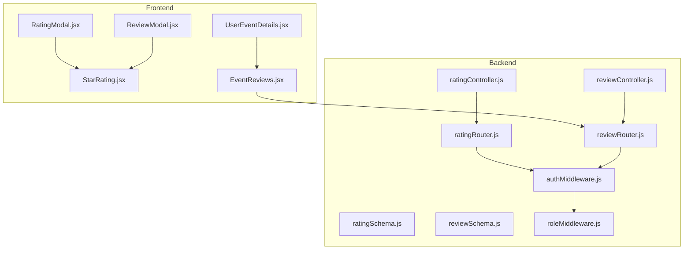

**Diagram sources**
- [ratingController.js:1-161](file://backend/controller/ratingController.js#L1-L161)
- [reviewController.js:1-195](file://backend/controller/reviewController.js#L1-L195)
- [ratingSchema.js:1-28](file://backend/models/ratingSchema.js#L1-L28)
- [reviewSchema.js:1-17](file://backend/models/reviewSchema.js#L1-L17)
- [ratingRouter.js:1-16](file://backend/router/ratingRouter.js#L1-L16)
- [reviewRouter.js:1-19](file://backend/router/reviewRouter.js#L1-L19)
- [authMiddleware.js:1-17](file://backend/middleware/authMiddleware.js#L1-L17)
- [roleMiddleware.js:1-9](file://backend/middleware/roleMiddleware.js#L1-L9)
- [RatingModal.jsx:1-125](file://frontend/src/components/RatingModal.jsx#L1-L125)
- [ReviewModal.jsx:1-170](file://frontend/src/components/ReviewModal.jsx#L1-L170)
- [StarRating.jsx:1-102](file://frontend/src/components/StarRating.jsx#L1-L102)
- [EventReviews.jsx:1-145](file://frontend/src/components/EventReviews.jsx#L1-L145)
- [UserEventDetails.jsx:1-355](file://frontend/src/pages/dashboards/UserEventDetails.jsx#L1-L355)

**Section sources**
- [ratingController.js:1-161](file://backend/controller/ratingController.js#L1-L161)
- [reviewController.js:1-195](file://backend/controller/reviewController.js#L1-L195)
- [ratingSchema.js:1-28](file://backend/models/ratingSchema.js#L1-L28)
- [reviewSchema.js:1-17](file://backend/models/reviewSchema.js#L1-L17)
- [ratingRouter.js:1-16](file://backend/router/ratingRouter.js#L1-L16)
- [reviewRouter.js:1-19](file://backend/router/reviewRouter.js#L1-L19)
- [authMiddleware.js:1-17](file://backend/middleware/authMiddleware.js#L1-L17)
- [roleMiddleware.js:1-9](file://backend/middleware/roleMiddleware.js#L1-L9)
- [RatingModal.jsx:1-125](file://frontend/src/components/RatingModal.jsx#L1-L125)
- [ReviewModal.jsx:1-170](file://frontend/src/components/ReviewModal.jsx#L1-L170)
- [StarRating.jsx:1-102](file://frontend/src/components/StarRating.jsx#L1-L102)
- [EventReviews.jsx:1-145](file://frontend/src/components/EventReviews.jsx#L1-L145)
- [UserEventDetails.jsx:1-355](file://frontend/src/pages/dashboards/UserEventDetails.jsx#L1-L355)

## Core Components
- Rating Controller: Handles creation/update of star ratings, retrieval of event/user ratings, and recalculates event average rating.
- Review Controller: Manages creation/update of reviews with text, retrieval of event/user reviews, pagination, deletion, and public latest reviews endpoint.
- Rating Schema: Defines the rating model with user and event references and a 1–5 numeric rating field.
- Review Schema: Defines the review model with user, event, rating, and optional review text.
- Frontend Modals: RatingModal and ReviewModal provide interactive star selection and form submission.
- StarRating Component: Renders static or interactive star ratings with half-star support and optional counts.
- EventReviews Component: Displays paginated event reviews with user avatars and dates.
- Authentication Middleware: Ensures requests are authenticated via JWT bearer tokens.

**Section sources**
- [ratingController.js:1-161](file://backend/controller/ratingController.js#L1-L161)
- [reviewController.js:1-195](file://backend/controller/reviewController.js#L1-L195)
- [ratingSchema.js:1-28](file://backend/models/ratingSchema.js#L1-L28)
- [reviewSchema.js:1-17](file://backend/models/reviewSchema.js#L1-L17)
- [RatingModal.jsx:1-125](file://frontend/src/components/RatingModal.jsx#L1-L125)
- [ReviewModal.jsx:1-170](file://frontend/src/components/ReviewModal.jsx#L1-L170)
- [StarRating.jsx:1-102](file://frontend/src/components/StarRating.jsx#L1-L102)
- [EventReviews.jsx:1-145](file://frontend/src/components/EventReviews.jsx#L1-L145)
- [authMiddleware.js:1-17](file://backend/middleware/authMiddleware.js#L1-L17)

## Architecture Overview
The system follows a layered architecture:
- Frontend components trigger actions via HTTP requests to backend routes.
- Controllers validate inputs, enforce permissions, and interact with models.
- Models define data structures and uniqueness constraints.
- Routers expose endpoints and apply authentication middleware.
- Middleware enforces authentication and role-based access control.

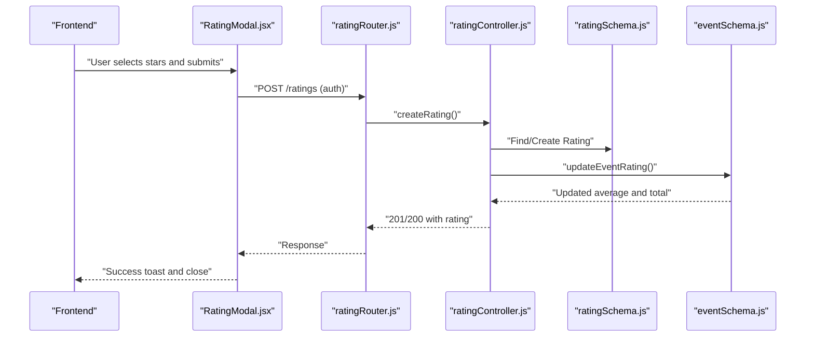

**Diagram sources**
- [RatingModal.jsx:1-125](file://frontend/src/components/RatingModal.jsx#L1-L125)
- [ratingRouter.js:1-16](file://backend/router/ratingRouter.js#L1-L16)
- [ratingController.js:1-161](file://backend/controller/ratingController.js#L1-L161)
- [ratingSchema.js:1-28](file://backend/models/ratingSchema.js#L1-L28)

**Section sources**
- [ratingRouter.js:1-16](file://backend/router/ratingRouter.js#L1-L16)
- [ratingController.js:1-161](file://backend/controller/ratingController.js#L1-L161)
- [ratingSchema.js:1-28](file://backend/models/ratingSchema.js#L1-L28)

## Detailed Component Analysis

### Rating Controller Functionality
- Validation: Ensures rating is between 1 and 5, event exists, user has a confirmed/completed booking, and the event has completed before allowing a rating.
- Idempotency: Prevents duplicate ratings per user-event pair using a unique index.
- Update vs Create: Updates existing rating or creates a new one; recalculates event average rating afterward.
- Event Aggregation: Computes average rating and total ratings for an event, rounding to one decimal place.

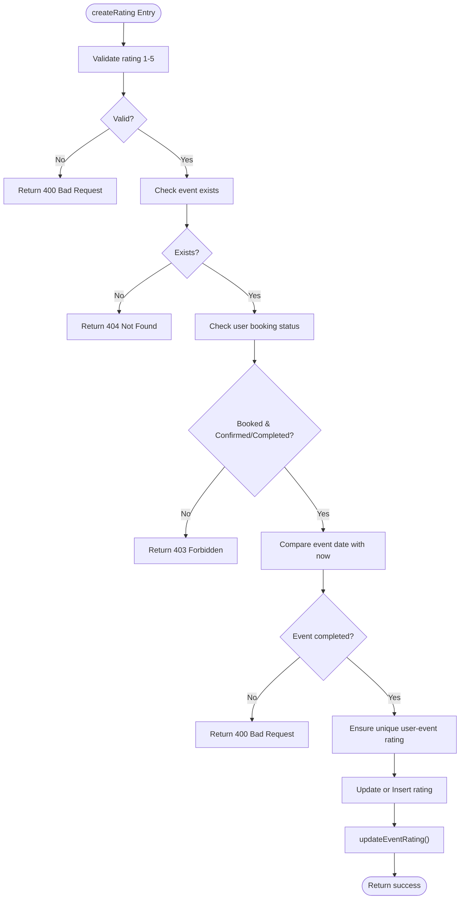

**Diagram sources**
- [ratingController.js:6-89](file://backend/controller/ratingController.js#L6-L89)

**Section sources**
- [ratingController.js:1-161](file://backend/controller/ratingController.js#L1-L161)
- [ratingSchema.js:25-26](file://backend/models/ratingSchema.js#L25-L26)

### Review Controller Functionality
- Validation: Same preconditions as rating (1–5 rating, event existence, booking status, event completion).
- Creation/Update: Allows updating an existing review or creating a new one with optional review text.
- Retrieval: Supports paginated retrieval of event reviews and user-specific reviews; includes latest reviews endpoint for public testimonials.
- Deletion: Deletes a review owned by the requesting user.
- Moderation Hooks: No explicit moderation endpoints exist in the current implementation; moderation could be added via admin endpoints using role middleware.

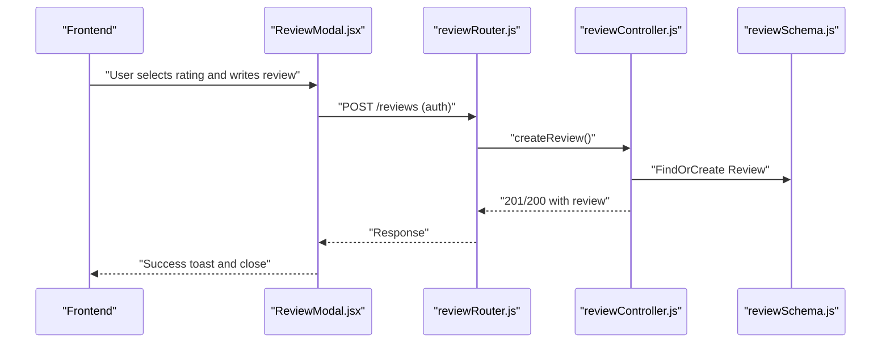

**Diagram sources**
- [ReviewModal.jsx:1-170](file://frontend/src/components/ReviewModal.jsx#L1-L170)
- [reviewRouter.js:1-19](file://backend/router/reviewRouter.js#L1-L19)
- [reviewController.js:1-195](file://backend/controller/reviewController.js#L1-L195)
- [reviewSchema.js:13-14](file://backend/models/reviewSchema.js#L13-L14)

**Section sources**
- [reviewController.js:1-195](file://backend/controller/reviewController.js#L1-L195)
- [reviewSchema.js:1-17](file://backend/models/reviewSchema.js#L1-L17)
- [reviewRouter.js:1-19](file://backend/router/reviewRouter.js#L1-L19)

### Rating Schema Design
- Fields: user (ObjectId ref to User), event (ObjectId ref to Event), rating (Number 1–5).
- Index: Unique compound index on user and event to prevent duplicate ratings.
- Timestamps: Automatic createdAt/updatedAt.

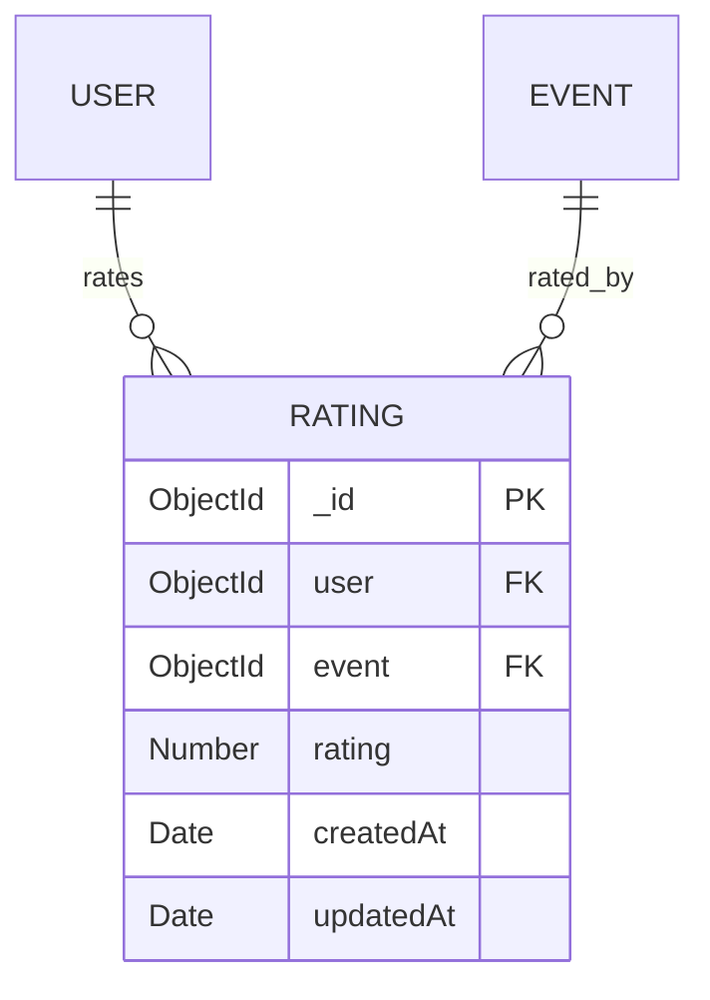

**Diagram sources**
- [ratingSchema.js:3-26](file://backend/models/ratingSchema.js#L3-L26)

**Section sources**
- [ratingSchema.js:1-28](file://backend/models/ratingSchema.js#L1-L28)

### Review Schema Design
- Fields: user (ObjectId ref to User), event (ObjectId ref to Event), rating (Number 1–5), reviewText (String, default empty).
- Index: Unique compound index on user and event to prevent duplicate reviews.
- Timestamps: Automatic createdAt/updatedAt.

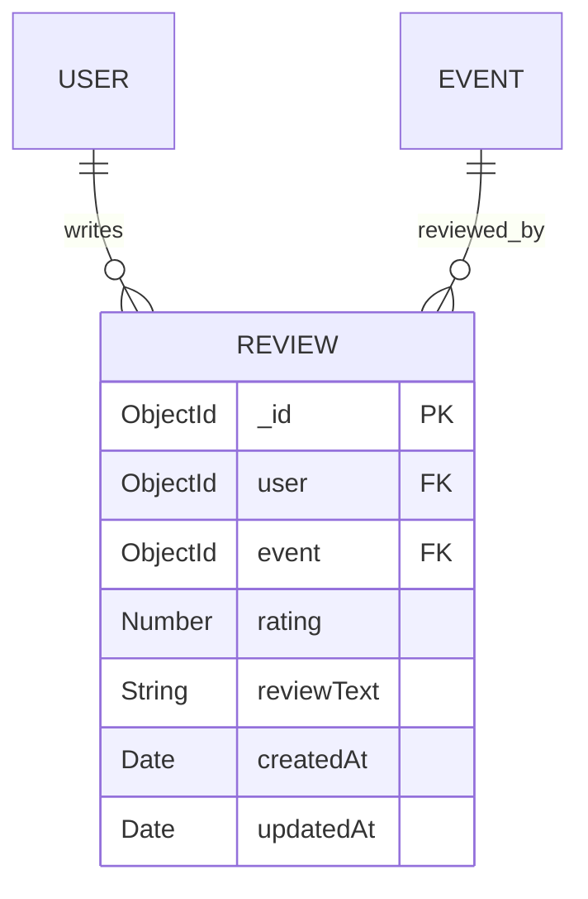

**Diagram sources**
- [reviewSchema.js:3-14](file://backend/models/reviewSchema.js#L3-L14)

**Section sources**
- [reviewSchema.js:1-17](file://backend/models/reviewSchema.js#L1-L17)

### Frontend Rating Modal Component
- Purpose: Allows authenticated users to submit a star rating for an event after validation.
- Behavior: Displays event info, interactive star selection, validation feedback, and submission with loading states.
- Integration: Calls backend rating endpoint and triggers success callbacks.

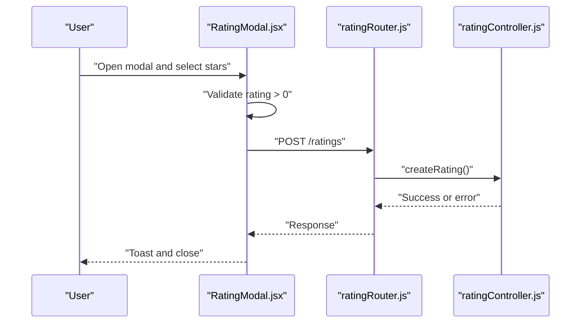

**Diagram sources**
- [RatingModal.jsx:1-125](file://frontend/src/components/RatingModal.jsx#L1-L125)
- [ratingRouter.js:12-14](file://backend/router/ratingRouter.js#L12-L14)
- [ratingController.js:6-89](file://backend/controller/ratingController.js#L6-L89)

**Section sources**
- [RatingModal.jsx:1-125](file://frontend/src/components/RatingModal.jsx#L1-L125)

### Frontend Review Modal Component
- Purpose: Allows authenticated users to submit a review with a rating and optional text.
- Behavior: Validates rating presence and non-empty review text, handles submission with loading states, and clears form on success.
- Integration: Calls backend review endpoint and triggers success callbacks.

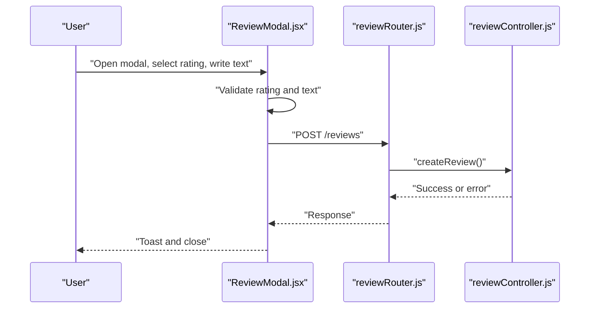

**Diagram sources**
- [ReviewModal.jsx:1-170](file://frontend/src/components/ReviewModal.jsx#L1-L170)
- [reviewRouter.js:14-17](file://backend/router/reviewRouter.js#L14-L17)
- [reviewController.js:6-92](file://backend/controller/reviewController.js#L6-L92)

**Section sources**
- [ReviewModal.jsx:1-170](file://frontend/src/components/ReviewModal.jsx#L1-L170)

### Star Rating Widget
- Purpose: Render star ratings with full, half, and empty stars.
- Features: Static rendering with optional count display; interactive mode for rating selection; configurable sizes.
- Integration: Used in modals and review displays.

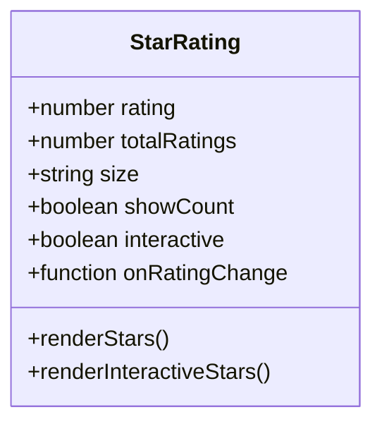

**Diagram sources**
- [StarRating.jsx:4-91](file://frontend/src/components/StarRating.jsx#L4-L91)

**Section sources**
- [StarRating.jsx:1-102](file://frontend/src/components/StarRating.jsx#L1-L102)

### Event Reviews Display
- Purpose: Paginated display of reviews for a given event with user avatars and formatted dates.
- Features: Previous/Next navigation, skeleton loaders, empty state messaging.
- Integration: Fetches reviews from backend with page and limit query parameters.

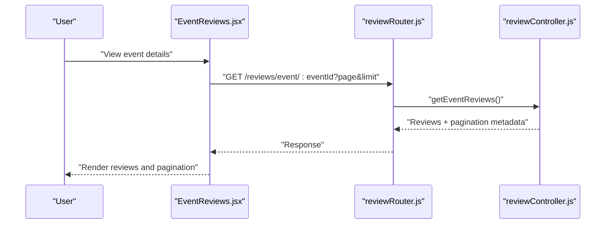

**Diagram sources**
- [EventReviews.jsx:19-35](file://frontend/src/components/EventReviews.jsx#L19-L35)
- [reviewRouter.js:15-17](file://backend/router/reviewRouter.js#L15-L17)
- [reviewController.js:94-123](file://backend/controller/reviewController.js#L94-L123)

**Section sources**
- [EventReviews.jsx:1-145](file://frontend/src/components/EventReviews.jsx#L1-L145)

### Rating Aggregation and Sorting
- Aggregation: The rating controller recalculates event average rating and total ratings by scanning all ratings for an event and computing the mean, rounded to one decimal place.
- Sorting: Ratings and reviews are sorted by creation time (most recent first) in both backend and frontend components.

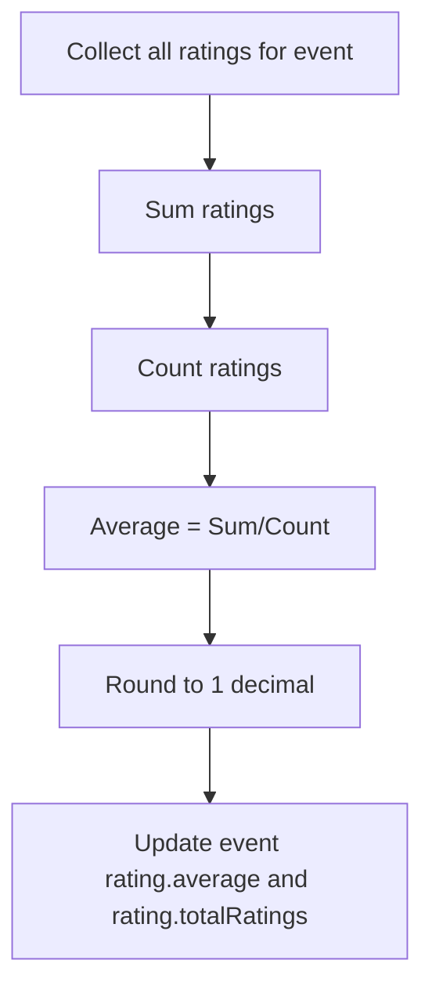

**Diagram sources**
- [ratingController.js:137-161](file://backend/controller/ratingController.js#L137-L161)

**Section sources**
- [ratingController.js:137-161](file://backend/controller/ratingController.js#L137-L161)
- [EventReviews.jsx:100-104](file://frontend/src/components/EventReviews.jsx#L100-L104)

### Review Sorting Mechanisms
- Backend: Reviews are sorted by createdAt descending for event and user retrieval endpoints.
- Frontend: EventReviews component paginates and sorts reviews client-side using the same order.

**Section sources**
- [reviewController.js:94-123](file://backend/controller/reviewController.js#L94-L123)
- [EventReviews.jsx:19-35](file://frontend/src/components/EventReviews.jsx#L19-L35)

### Spam Prevention Strategies
- Access Control: Authentication middleware ensures only logged-in users can submit ratings and reviews.
- Eligibility Checks: Submissions require a confirmed/completed booking and a completed event date.
- Uniqueness Constraints: MongoDB unique indexes prevent duplicate ratings and reviews per user-event pair.
- Optional Enhancements: Consider adding rate limiting, content filtering, and admin moderation endpoints.

**Section sources**
- [authMiddleware.js:1-17](file://backend/middleware/authMiddleware.js#L1-L17)
- [ratingController.js:28-50](file://backend/controller/ratingController.js#L28-L50)
- [reviewController.js:28-50](file://backend/controller/reviewController.js#L28-L50)
- [ratingSchema.js:25-26](file://backend/models/ratingSchema.js#L25-L26)
- [reviewSchema.js:13-14](file://backend/models/reviewSchema.js#L13-L14)

### Review Editing/Deletion Capabilities
- Editing: Reviews can be updated by resubmitting with the same user-event pair; the controller updates rating and reviewText.
- Deletion: Users can delete their own reviews via DELETE /reviews/:reviewId.
- Community Guidelines: Enforce via backend validation and optional moderation endpoints.

**Section sources**
- [reviewController.js:58-83](file://backend/controller/reviewController.js#L58-L83)
- [reviewController.js:148-180](file://backend/controller/reviewController.js#L148-L180)

### User Permission Controls
- Authentication: All user-facing endpoints require a valid JWT bearer token.
- Authorization: Role middleware can be applied to restrict access to administrative endpoints.

**Section sources**
- [authMiddleware.js:1-17](file://backend/middleware/authMiddleware.js#L1-L17)
- [roleMiddleware.js:1-9](file://backend/middleware/roleMiddleware.js#L1-L9)

### Integration Examples
- Event Details Page: Displays event rating and integrates with review display component.
- Rating/Review Submission: Triggered from event details or booking completion flows.

**Section sources**
- [UserEventDetails.jsx:222-231](file://frontend/src/pages/dashboards/UserEventDetails.jsx#L222-L231)
- [EventReviews.jsx:1-145](file://frontend/src/components/EventReviews.jsx#L1-L145)

## Dependency Analysis
The system exhibits clear separation of concerns:
- Controllers depend on models and external schemas (Event, Booking).
- Routers depend on controllers and apply authentication middleware.
- Frontend components depend on shared UI components (StarRating) and HTTP utilities.

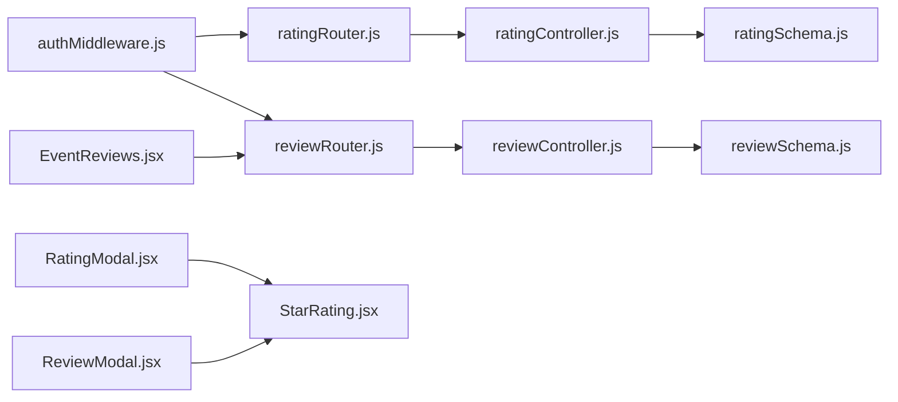

**Diagram sources**
- [authMiddleware.js:1-17](file://backend/middleware/authMiddleware.js#L1-L17)
- [ratingRouter.js:1-16](file://backend/router/ratingRouter.js#L1-L16)
- [reviewRouter.js:1-19](file://backend/router/reviewRouter.js#L1-L19)
- [ratingController.js:1-161](file://backend/controller/ratingController.js#L1-L161)
- [reviewController.js:1-195](file://backend/controller/reviewController.js#L1-L195)
- [ratingSchema.js:1-28](file://backend/models/ratingSchema.js#L1-L28)
- [reviewSchema.js:1-17](file://backend/models/reviewSchema.js#L1-L17)
- [RatingModal.jsx:1-125](file://frontend/src/components/RatingModal.jsx#L1-L125)
- [ReviewModal.jsx:1-170](file://frontend/src/components/ReviewModal.jsx#L1-L170)
- [StarRating.jsx:1-102](file://frontend/src/components/StarRating.jsx#L1-L102)
- [EventReviews.jsx:1-145](file://frontend/src/components/EventReviews.jsx#L1-L145)

**Section sources**
- [ratingController.js:1-161](file://backend/controller/ratingController.js#L1-L161)
- [reviewController.js:1-195](file://backend/controller/reviewController.js#L1-L195)
- [ratingRouter.js:1-16](file://backend/router/ratingRouter.js#L1-L16)
- [reviewRouter.js:1-19](file://backend/router/reviewRouter.js#L1-L19)
- [authMiddleware.js:1-17](file://backend/middleware/authMiddleware.js#L1-L17)

## Performance Considerations
- Indexing: Unique indexes on user-event pairs prevent duplicates and improve lookup performance.
- Aggregation: Event rating recalculation scans all ratings for an event; consider caching average and incrementally updating for high-volume scenarios.
- Pagination: Review retrieval uses limit/skip; consider cursor-based pagination for large datasets.
- Network: Minimize payload sizes by selecting only necessary fields in populated queries.

## Troubleshooting Guide
Common issues and resolutions:
- Unauthorized Access: Ensure Authorization header with Bearer token is present and valid.
- Forbidden Rating/Review: Verify the user has a confirmed/completed booking and the event has ended.
- Duplicate Rating/Review: Unique indexes prevent duplicates; avoid resubmitting for the same user-event pair.
- Pagination Problems: Confirm page and limit query parameters are integers and within acceptable ranges.
- Frontend Validation: Ensure rating is selected and review text is non-empty before submission.

**Section sources**
- [authMiddleware.js:7-15](file://backend/middleware/authMiddleware.js#L7-L15)
- [ratingController.js:35-40](file://backend/controller/ratingController.js#L35-L40)
- [reviewController.js:35-40](file://backend/controller/reviewController.js#L35-L40)
- [RatingModal.jsx:14-18](file://frontend/src/components/RatingModal.jsx#L14-L18)
- [ReviewModal.jsx:32-41](file://frontend/src/components/ReviewModal.jsx#L32-L41)

## Conclusion
The rating and review system provides a robust foundation for collecting user feedback with strong validation, authentication, and data integrity guarantees. The modular design enables straightforward extension for moderation, analytics, and advanced sorting/filtering. Future enhancements can include admin moderation endpoints, content filtering, and incremental rating updates to scale with increased usage.