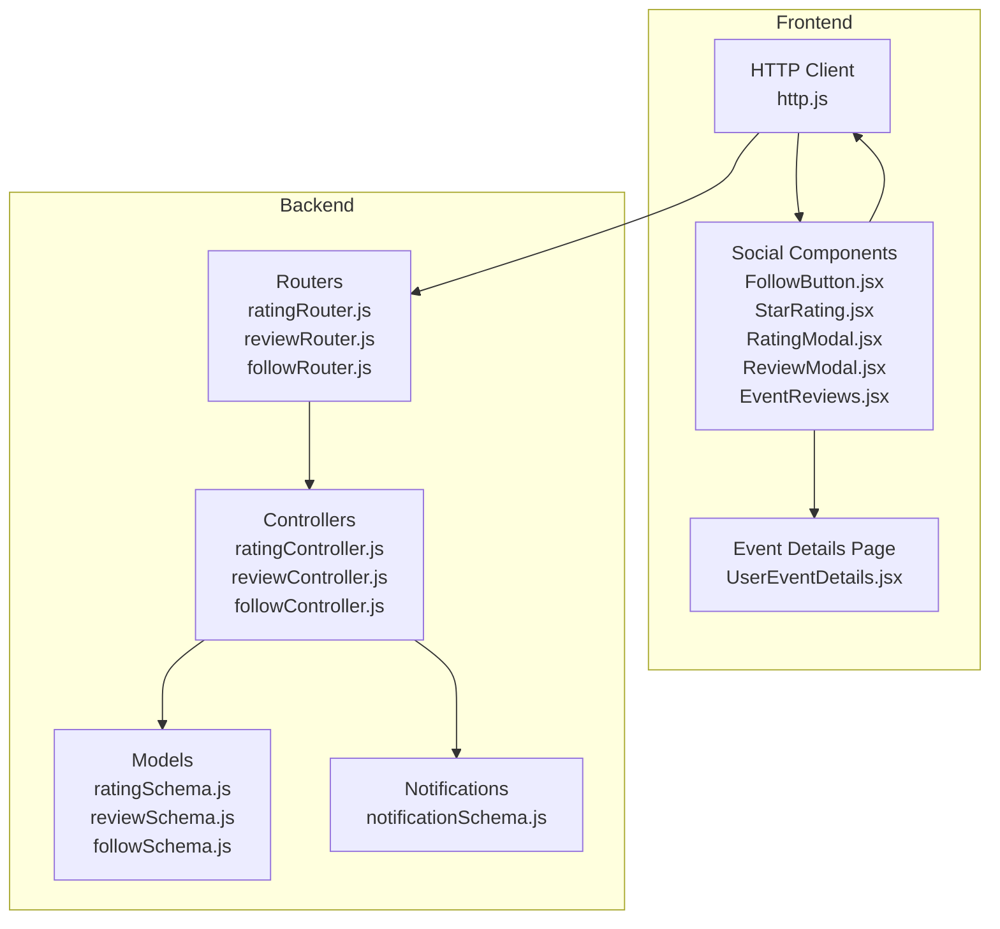
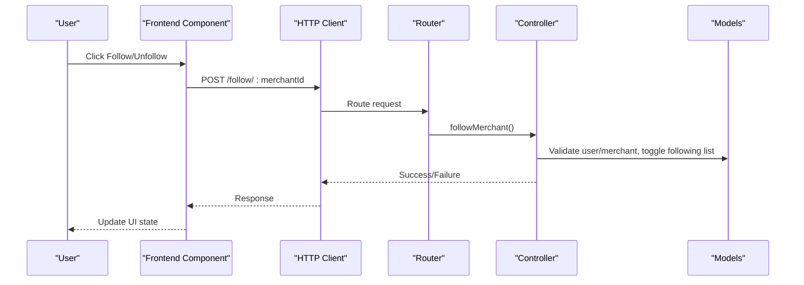
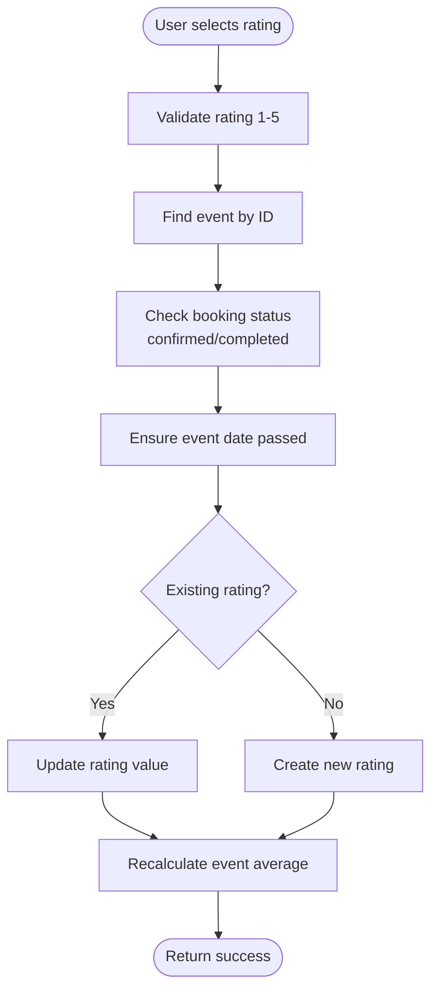
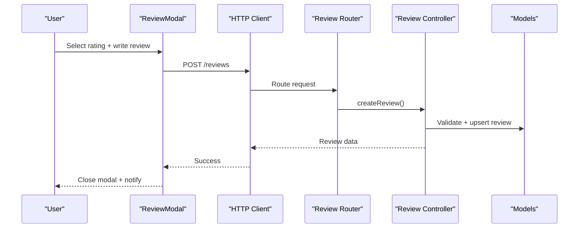
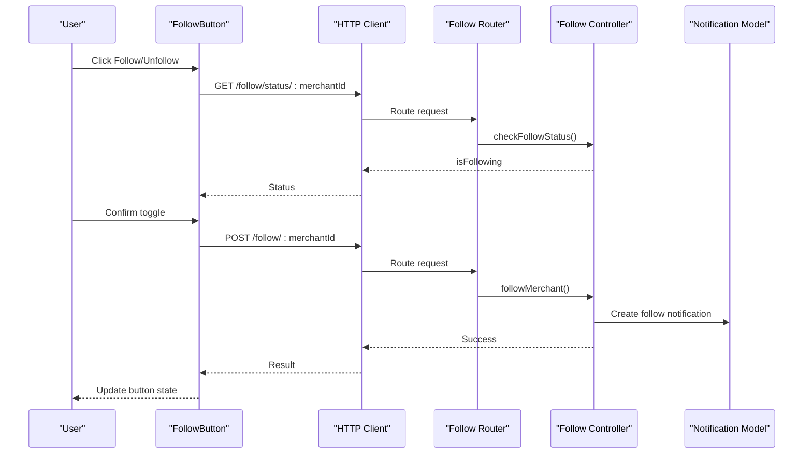
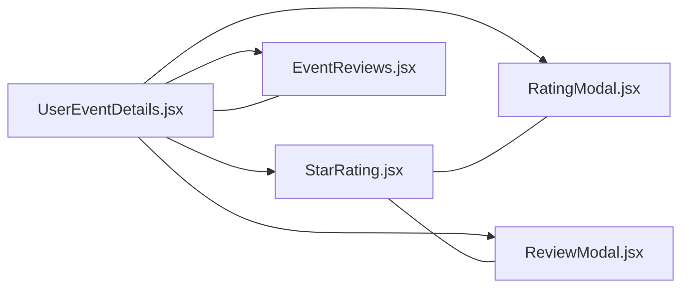
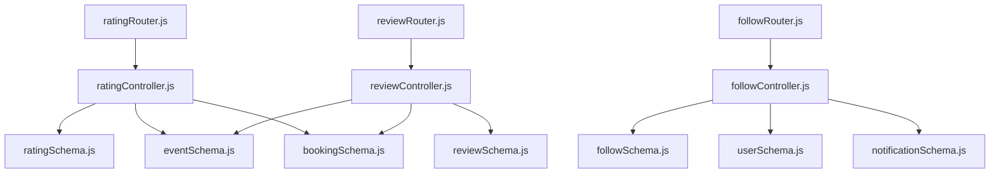

# Social Interaction Integration

<cite>
**Referenced Files in This Document**
- [RATING_REVIEW_FOLLOW_IMPLEMENTATION_SUMMARY.md](file://backend/RATING_REVIEW_FOLLOW_IMPLEMENTATION_SUMMARY.md)
- [ratingSchema.js](file://backend/models/ratingSchema.js)
- [reviewSchema.js](file://backend/models/reviewSchema.js)
- [followSchema.js](file://backend/models/followSchema.js)
- [ratingController.js](file://backend/controller/ratingController.js)
- [reviewController.js](file://backend/controller/reviewController.js)
- [followController.js](file://backend/controller/followController.js)
- [ratingRouter.js](file://backend/router/ratingRouter.js)
- [reviewRouter.js](file://backend/router/reviewRouter.js)
- [followRouter.js](file://backend/router/followRouter.js)
- [FollowButton.jsx](file://frontend/src/components/FollowButton.jsx)
- [StarRating.jsx](file://frontend/src/components/StarRating.jsx)
- [RatingModal.jsx](file://frontend/src/components/RatingModal.jsx)
- [ReviewModal.jsx](file://frontend/src/components/ReviewModal.jsx)
- [EventReviews.jsx](file://frontend/src/components/EventReviews.jsx)
- [UserEventDetails.jsx](file://frontend/src/pages/dashboards/UserEventDetails.jsx)
- [http.js](file://frontend/src/lib/http.js)
- [notificationSchema.js](file://backend/models/notificationSchema.js)
</cite>

## Table of Contents
1. [Introduction](#introduction)
2. [Project Structure](#project-structure)
3. [Core Components](#core-components)
4. [Architecture Overview](#architecture-overview)
5. [Detailed Component Analysis](#detailed-component-analysis)
6. [Dependency Analysis](#dependency-analysis)
7. [Performance Considerations](#performance-considerations)
8. [Troubleshooting Guide](#troubleshooting-guide)
9. [Conclusion](#conclusion)

## Introduction
This document explains how social interaction features—ratings, reviews, and following—are integrated across the platform. It covers how these features connect with event browsing, user profiles, and merchant displays, and how they contribute to social proof, community building, and engagement. The system ensures secure, real-time interactions with robust validation and pagination.

## Project Structure
The social integration spans backend APIs/controllers/models, frontend components, and routing. The backend exposes REST endpoints for ratings, reviews, and following, while the frontend integrates these features into event pages and user dashboards.

**Diagram sources**
- [http.js:1-5](file://frontend/src/lib/http.js#L1-L5)
- [ratingRouter.js:1-16](file://backend/router/ratingRouter.js#L1-L16)
- [reviewRouter.js:1-19](file://backend/router/reviewRouter.js#L1-L19)
- [followRouter.js:1-26](file://backend/router/followRouter.js#L1-L26)
- [ratingController.js:1-161](file://backend/controller/ratingController.js#L1-L161)
- [reviewController.js:1-195](file://backend/controller/reviewController.js#L1-L195)
- [followController.js:1-234](file://backend/controller/followController.js#L1-L234)
- [ratingSchema.js:1-28](file://backend/models/ratingSchema.js#L1-L28)
- [reviewSchema.js:1-17](file://backend/models/reviewSchema.js#L1-L17)
- [followSchema.js:1-22](file://backend/models/followSchema.js#L1-L22)
- [notificationSchema.js](file://backend/models/notificationSchema.js)

**Section sources**
- [RATING_REVIEW_FOLLOW_IMPLEMENTATION_SUMMARY.md:1-201](file://backend/RATING_REVIEW_FOLLOW_IMPLEMENTATION_SUMMARY.md#L1-L201)
- [http.js:1-5](file://frontend/src/lib/http.js#L1-L5)

## Core Components
- Rating system: One-time per-event user rating with validation and automatic event average recalculation.
- Review system: Text-based reviews with pagination, character limits, and deletion capability.
- Following system: Toggle follow/unfollow for merchants with notifications and follower statistics.

Key integrations:
- Event Details page displays ratings and reviews and provides rating/review actions for eligible users.
- FollowButton enables real-time follow/unfollow toggling with immediate UI feedback.
- Backend enforces booking and completion constraints for ratings and reviews.

**Section sources**
- [RATING_REVIEW_FOLLOW_IMPLEMENTATION_SUMMARY.md:9-125](file://backend/RATING_REVIEW_FOLLOW_IMPLEMENTATION_SUMMARY.md#L9-L125)
- [ratingController.js:1-161](file://backend/controller/ratingController.js#L1-L161)
- [reviewController.js:1-195](file://backend/controller/reviewController.js#L1-L195)
- [followController.js:1-234](file://backend/controller/followController.js#L1-L234)
- [UserEventDetails.jsx:1-355](file://frontend/src/pages/dashboards/UserEventDetails.jsx#L1-L355)

## Architecture Overview
The social features follow a layered architecture:
- Frontend components communicate via HTTP client to backend routers.
- Routers delegate to controllers that enforce business rules and interact with models.
- Models define schemas and uniqueness constraints; controllers update denormalized event averages and create notifications.

**Diagram sources**
- [followRouter.js:1-26](file://backend/router/followRouter.js#L1-L26)
- [followController.js:1-234](file://backend/controller/followController.js#L1-L234)
- [http.js:1-5](file://frontend/src/lib/http.js#L1-L5)

## Detailed Component Analysis

### Rating System
- Purpose: Allow users who attended an event to rate it once (1–5 stars).
- Validation: Only users with confirmed/completed bookings can rate; event must be completed; uniqueness enforced by schema index.
- Backend: Controller handles creation/update, validates eligibility, and recalculates event average.
- Frontend: RatingModal collects star input and submits via authenticated request; UserEventDetails integrates rating display.

**Diagram sources**
- [ratingController.js:5-89](file://backend/controller/ratingController.js#L5-L89)
- [ratingSchema.js:25-26](file://backend/models/ratingSchema.js#L25-L26)

**Section sources**
- [ratingController.js:1-161](file://backend/controller/ratingController.js#L1-L161)
- [ratingRouter.js:1-16](file://backend/router/ratingRouter.js#L1-L16)
- [RatingModal.jsx:1-125](file://frontend/src/components/RatingModal.jsx#L1-L125)
- [UserEventDetails.jsx:222-231](file://frontend/src/pages/dashboards/UserEventDetails.jsx#L222-L231)

### Review System
- Purpose: Allow users to write text reviews with star ratings and manage their own reviews.
- Validation: Same eligibility rules as ratings; pagination supported; optional deletion.
- Backend: Controller manages creation/update/deletion and public latest reviews endpoint.
- Frontend: ReviewModal handles star selection and text input; EventReviews displays paginated reviews with user avatars and dates.

**Diagram sources**
- [reviewRouter.js:1-19](file://backend/router/reviewRouter.js#L1-L19)
- [reviewController.js:5-92](file://backend/controller/reviewController.js#L5-L92)
- [ReviewModal.jsx:1-170](file://frontend/src/components/ReviewModal.jsx#L1-L170)

**Section sources**
- [reviewController.js:1-195](file://backend/controller/reviewController.js#L1-L195)
- [reviewRouter.js:1-19](file://backend/router/reviewRouter.js#L1-L19)
- [EventReviews.jsx:1-145](file://frontend/src/components/EventReviews.jsx#L1-L145)

### Following System
- Purpose: Enable users to follow merchants; triggers notifications for merchants.
- Validation: Merchant must exist and have merchant role; self-follow blocked; toggle logic handled in controller.
- Backend: Controllers implement follow/unfollow, status check, and follower retrieval; notifications created on follow.
- Frontend: FollowButton encapsulates status checking, toggling, loading states, and user feedback.

**Diagram sources**
- [followRouter.js:1-26](file://backend/router/followRouter.js#L1-L26)
- [followController.js:5-172](file://backend/controller/followController.js#L5-L172)
- [notificationSchema.js](file://backend/models/notificationSchema.js)

**Section sources**
- [followController.js:1-234](file://backend/controller/followController.js#L1-L234)
- [followRouter.js:1-26](file://backend/router/followRouter.js#L1-L26)
- [FollowButton.jsx:1-121](file://frontend/src/components/FollowButton.jsx#L1-L121)

### Frontend Integration Points
- UserEventDetails: Displays event rating and provides actions for rating/review for eligible users.
- StarRating: Reusable component for display and interactive selection.
- RatingModal and ReviewModal: Unified modals for rating and review submission with validation and feedback.
- EventReviews: Paginated display of reviews with user info and dates.

**Diagram sources**
- [UserEventDetails.jsx:222-231](file://frontend/src/pages/dashboards/UserEventDetails.jsx#L222-L231)
- [StarRating.jsx:1-102](file://frontend/src/components/StarRating.jsx#L1-L102)
- [RatingModal.jsx:1-125](file://frontend/src/components/RatingModal.jsx#L1-L125)
- [ReviewModal.jsx:1-170](file://frontend/src/components/ReviewModal.jsx#L1-L170)
- [EventReviews.jsx:1-145](file://frontend/src/components/EventReviews.jsx#L1-L145)

**Section sources**
- [UserEventDetails.jsx:1-355](file://frontend/src/pages/dashboards/UserEventDetails.jsx#L1-L355)
- [StarRating.jsx:1-102](file://frontend/src/components/StarRating.jsx#L1-L102)
- [RatingModal.jsx:1-125](file://frontend/src/components/RatingModal.jsx#L1-L125)
- [ReviewModal.jsx:1-170](file://frontend/src/components/ReviewModal.jsx#L1-L170)
- [EventReviews.jsx:1-145](file://frontend/src/components/EventReviews.jsx#L1-L145)

## Dependency Analysis
- Controllers depend on models for persistence and uniqueness constraints.
- Routers depend on controllers for business logic.
- Frontend components depend on HTTP client and auth context for authenticated requests.
- FollowController creates notifications, linking social actions to user alerts.

**Diagram sources**
- [ratingController.js:1-161](file://backend/controller/ratingController.js#L1-L161)
- [reviewController.js:1-195](file://backend/controller/reviewController.js#L1-L195)
- [followController.js:1-234](file://backend/controller/followController.js#L1-L234)
- [ratingSchema.js:1-28](file://backend/models/ratingSchema.js#L1-L28)
- [reviewSchema.js:1-17](file://backend/models/reviewSchema.js#L1-L17)
- [followSchema.js:1-22](file://backend/models/followSchema.js#L1-L22)
- [ratingRouter.js:1-16](file://backend/router/ratingRouter.js#L1-L16)
- [reviewRouter.js:1-19](file://backend/router/reviewRouter.js#L1-L19)
- [followRouter.js:1-26](file://backend/router/followRouter.js#L1-L26)

**Section sources**
- [ratingController.js:1-161](file://backend/controller/ratingController.js#L1-L161)
- [reviewController.js:1-195](file://backend/controller/reviewController.js#L1-L195)
- [followController.js:1-234](file://backend/controller/followController.js#L1-L234)

## Performance Considerations
- Unique indexes on rating/review/follow prevent duplicate entries and improve lookup performance.
- Event average recalculation occurs after rating changes; consider caching averages for high-traffic scenarios.
- Pagination in review listing reduces payload sizes; maintain reasonable page sizes for responsiveness.
- Frontend components debounce status checks and avoid unnecessary re-renders during follow toggling.

## Troubleshooting Guide
Common issues and resolutions:
- Authentication failures: Ensure token is present in headers for protected endpoints.
- Authorization errors: Verify user has a confirmed/completed booking for rating/review.
- Event not completed: Ratings require past event dates; reviews share the same constraint.
- Duplicate submissions: Unique indexes prevent multiple ratings/reviews; handle optimistic UI updates carefully.
- Follow loops: Self-follow is blocked; ensure merchant role validation passes.

**Section sources**
- [ratingController.js:28-50](file://backend/controller/ratingController.js#L28-L50)
- [reviewController.js:28-50](file://backend/controller/reviewController.js#L28-L50)
- [followController.js:30-36](file://backend/controller/followController.js#L30-L36)
- [followController.js:140-172](file://backend/controller/followController.js#L140-L172)

## Conclusion
The social interaction system integrates cleanly across the platform, enforcing strong business rules and providing real-time feedback. Ratings and reviews enhance social proof, while following builds communities around merchants. The modular frontend components and robust backend controllers enable scalable enhancements for analytics, recommendations, and growth strategies.