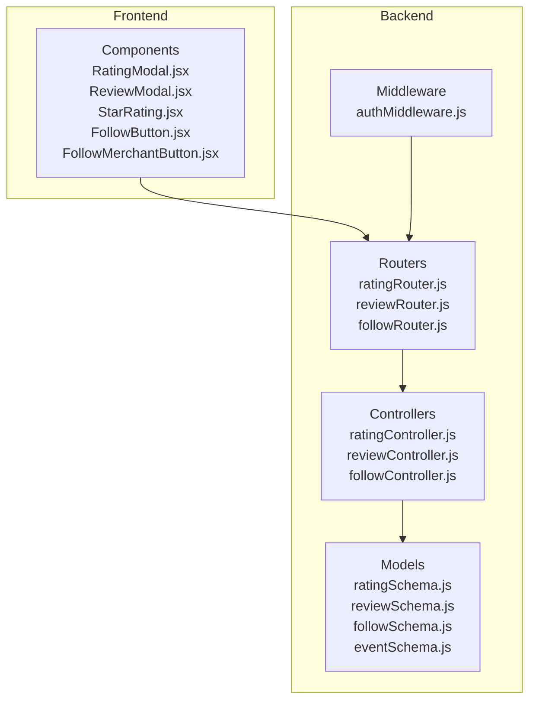
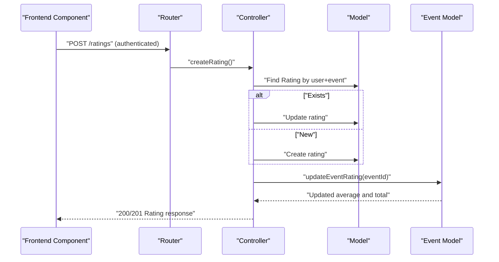
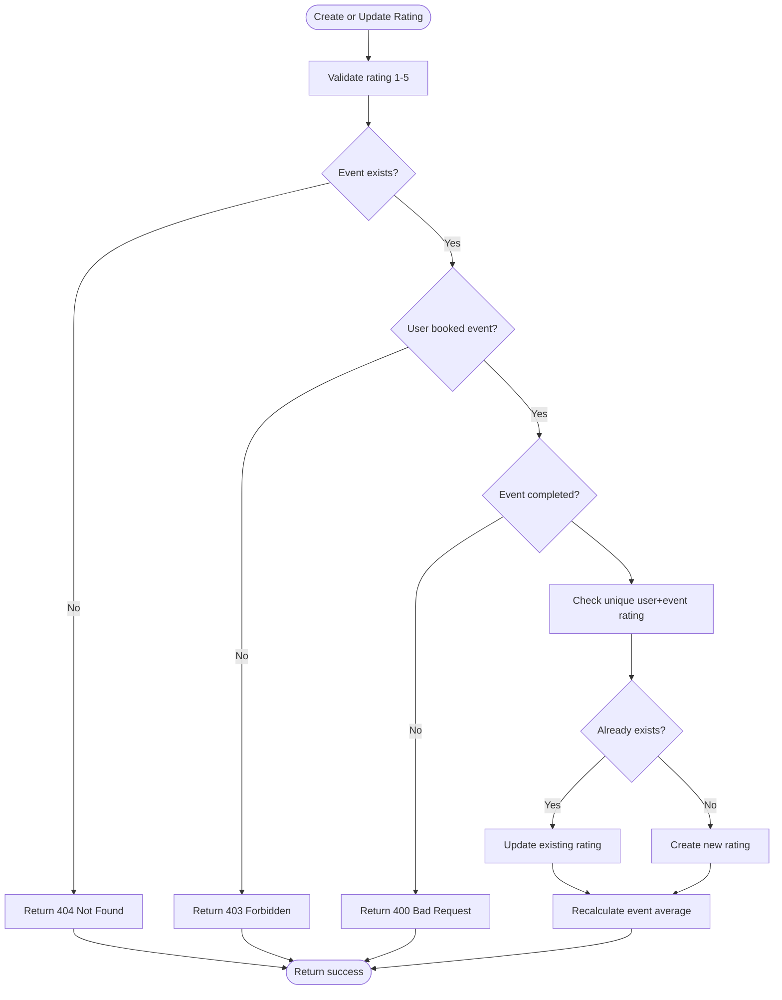
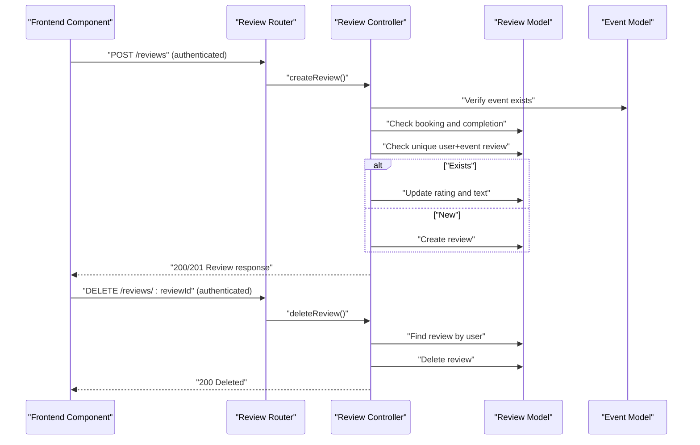
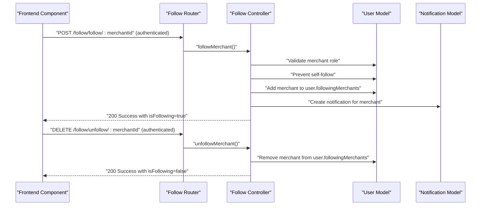
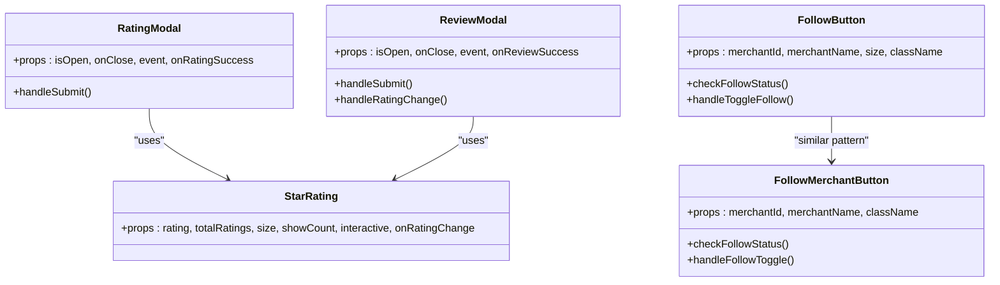
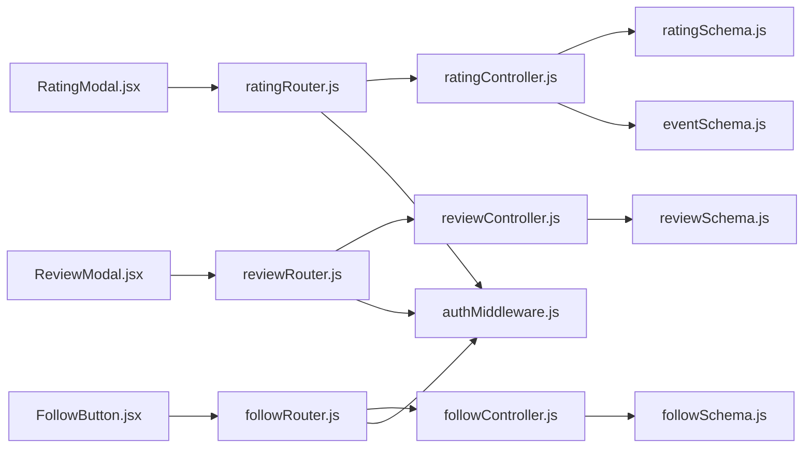

# Social and Interaction Features

<cite>
**Referenced Files in This Document**
- [ratingSchema.js](file://backend/models/ratingSchema.js)
- [reviewSchema.js](file://backend/models/reviewSchema.js)
- [followSchema.js](file://backend/models/followSchema.js)
- [eventSchema.js](file://backend/models/eventSchema.js)
- [ratingController.js](file://backend/controller/ratingController.js)
- [reviewController.js](file://backend/controller/reviewController.js)
- [followController.js](file://backend/controller/followController.js)
- [ratingRouter.js](file://backend/router/ratingRouter.js)
- [reviewRouter.js](file://backend/router/reviewRouter.js)
- [followRouter.js](file://backend/router/followRouter.js)
- [authMiddleware.js](file://backend/middleware/authMiddleware.js)
- [RatingModal.jsx](file://frontend/src/components/RatingModal.jsx)
- [ReviewModal.jsx](file://frontend/src/components/ReviewModal.jsx)
- [FollowButton.jsx](file://frontend/src/components/FollowButton.jsx)
- [FollowMerchantButton.jsx](file://frontend/src/components/FollowMerchantButton.jsx)
- [StarRating.jsx](file://frontend/src/components/StarRating.jsx)
</cite>

## Table of Contents
1. [Introduction](#introduction)
2. [Project Structure](#project-structure)
3. [Core Components](#core-components)
4. [Architecture Overview](#architecture-overview)
5. [Detailed Component Analysis](#detailed-component-analysis)
6. [Dependency Analysis](#dependency-analysis)
7. [Performance Considerations](#performance-considerations)
8. [Troubleshooting Guide](#troubleshooting-guide)
9. [Conclusion](#conclusion)

## Introduction
This document provides comprehensive documentation for the social and interaction features of the Event Management Platform. It covers the rating and review system, user following functionality, merchant following capabilities, and social interaction patterns. The documentation explains rating schema design, review moderation processes, follow/unfollow mechanisms, and social feature integration. It also details social components, rating widgets, and user engagement features, including social validation, spam prevention, and community management considerations.

## Project Structure
The social and interaction features span both backend and frontend components:
- Backend: Models define the data structures for ratings, reviews, and follows; controllers implement business logic; routers expose REST endpoints; middleware enforces authentication.
- Frontend: Components implement user-facing social widgets such as rating modals, review modals, star rating displays, and follow buttons.

**Diagram sources**
- [ratingSchema.js:1-28](file://backend/models/ratingSchema.js#L1-L28)
- [reviewSchema.js:1-17](file://backend/models/reviewSchema.js#L1-L17)
- [followSchema.js:1-22](file://backend/models/followSchema.js#L1-L22)
- [eventSchema.js:1-23](file://backend/models/eventSchema.js#L1-L23)
- [ratingController.js:1-161](file://backend/controller/ratingController.js#L1-L161)
- [reviewController.js:1-195](file://backend/controller/reviewController.js#L1-L195)
- [followController.js:1-234](file://backend/controller/followController.js#L1-L234)
- [ratingRouter.js:1-16](file://backend/router/ratingRouter.js#L1-L16)
- [reviewRouter.js:1-19](file://backend/router/reviewRouter.js#L1-L19)
- [followRouter.js:1-26](file://backend/router/followRouter.js#L1-L26)
- [authMiddleware.js:1-17](file://backend/middleware/authMiddleware.js#L1-L17)
- [RatingModal.jsx:1-125](file://frontend/src/components/RatingModal.jsx#L1-L125)
- [ReviewModal.jsx:1-170](file://frontend/src/components/ReviewModal.jsx#L1-L170)
- [StarRating.jsx:1-102](file://frontend/src/components/StarRating.jsx#L1-L102)
- [FollowButton.jsx:1-121](file://frontend/src/components/FollowButton.jsx#L1-L121)
- [FollowMerchantButton.jsx:1-117](file://frontend/src/components/FollowMerchantButton.jsx#L1-L117)

**Section sources**
- [ratingSchema.js:1-28](file://backend/models/ratingSchema.js#L1-L28)
- [reviewSchema.js:1-17](file://backend/models/reviewSchema.js#L1-L17)
- [followSchema.js:1-22](file://backend/models/followSchema.js#L1-L22)
- [eventSchema.js:1-23](file://backend/models/eventSchema.js#L1-L23)
- [ratingController.js:1-161](file://backend/controller/ratingController.js#L1-L161)
- [reviewController.js:1-195](file://backend/controller/reviewController.js#L1-L195)
- [followController.js:1-234](file://backend/controller/followController.js#L1-L234)
- [ratingRouter.js:1-16](file://backend/router/ratingRouter.js#L1-L16)
- [reviewRouter.js:1-19](file://backend/router/reviewRouter.js#L1-L19)
- [followRouter.js:1-26](file://backend/router/followRouter.js#L1-L26)
- [authMiddleware.js:1-17](file://backend/middleware/authMiddleware.js#L1-L17)
- [RatingModal.jsx:1-125](file://frontend/src/components/RatingModal.jsx#L1-L125)
- [ReviewModal.jsx:1-170](file://frontend/src/components/ReviewModal.jsx#L1-L170)
- [StarRating.jsx:1-102](file://frontend/src/components/StarRating.jsx#L1-L102)
- [FollowButton.jsx:1-121](file://frontend/src/components/FollowButton.jsx#L1-L121)
- [FollowMerchantButton.jsx:1-117](file://frontend/src/components/FollowMerchantButton.jsx#L1-L117)

## Core Components
- Rating system: Stores user ratings for events, validates eligibility, prevents duplicates, and updates event averages.
- Review system: Allows users to submit textual reviews with star ratings, supports updates and deletion, and exposes latest reviews.
- Following system: Enables users to follow merchants, tracks follow status, and notifies merchants upon new followers.
- Frontend widgets: Provide interactive star ratings, rating modals, review modals, and follow buttons.

Key backend endpoints:
- Ratings: POST /ratings, GET /ratings/event/:eventId, GET /ratings/my-ratings
- Reviews: POST /reviews, GET /reviews/latest, GET /reviews/event/:eventId, GET /reviews/my-reviews, DELETE /reviews/:reviewId
- Follow: POST /follow/follow/:merchantId, DELETE /follow/unfollow/:merchantId, GET /follow/status/:merchantId, GET /follow/following, GET /follow/followers

**Section sources**
- [ratingRouter.js:1-16](file://backend/router/ratingRouter.js#L1-L16)
- [reviewRouter.js:1-19](file://backend/router/reviewRouter.js#L1-L19)
- [followRouter.js:1-26](file://backend/router/followRouter.js#L1-L26)
- [ratingController.js:1-161](file://backend/controller/ratingController.js#L1-L161)
- [reviewController.js:1-195](file://backend/controller/reviewController.js#L1-L195)
- [followController.js:1-234](file://backend/controller/followController.js#L1-L234)

## Architecture Overview
The social features follow a layered architecture:
- Frontend components send authenticated requests to backend routers.
- Routers delegate to controllers that enforce business rules and interact with models.
- Models define schemas and uniqueness constraints; controllers update denormalized event ratings.
- Middleware ensures authentication for protected routes.

**Diagram sources**
- [ratingRouter.js:11-14](file://backend/router/ratingRouter.js#L11-L14)
- [ratingController.js:6-89](file://backend/controller/ratingController.js#L6-L89)
- [ratingSchema.js:25-26](file://backend/models/ratingSchema.js#L25-L26)
- [eventSchema.js:9-9](file://backend/models/eventSchema.js#L9-L9)

**Section sources**
- [ratingRouter.js:1-16](file://backend/router/ratingRouter.js#L1-L16)
- [ratingController.js:1-161](file://backend/controller/ratingController.js#L1-L161)
- [ratingSchema.js:1-28](file://backend/models/ratingSchema.js#L1-L28)
- [eventSchema.js:1-23](file://backend/models/eventSchema.js#L1-L23)

## Detailed Component Analysis

### Rating System
The rating system ensures that:
- Users can only rate events they have booked and that have completed.
- Ratings are validated to be within 1–5.
- Duplicate ratings per user-event pair are prevented via a unique compound index.
- Event-level average and total ratings are recalculated after each rating change.

**Diagram sources**
- [ratingController.js:6-89](file://backend/controller/ratingController.js#L6-L89)
- [ratingSchema.js:25-26](file://backend/models/ratingSchema.js#L25-L26)
- [eventSchema.js:9-9](file://backend/models/eventSchema.js#L9-L9)

**Section sources**
- [ratingController.js:1-161](file://backend/controller/ratingController.js#L1-L161)
- [ratingSchema.js:1-28](file://backend/models/ratingSchema.js#L1-L28)
- [eventSchema.js:1-23](file://backend/models/eventSchema.js#L1-L23)

### Review System
The review system provides:
- Star ratings and optional textual reviews.
- Validation for booking and completion criteria.
- Pagination for event reviews.
- Deletion capability restricted to the review author.
- Latest reviews endpoint for public showcases.

**Diagram sources**
- [reviewRouter.js:14-17](file://backend/router/reviewRouter.js#L14-L17)
- [reviewController.js:6-180](file://backend/controller/reviewController.js#L6-L180)
- [reviewSchema.js:13-14](file://backend/models/reviewSchema.js#L13-L14)

**Section sources**
- [reviewController.js:1-195](file://backend/controller/reviewController.js#L1-L195)
- [reviewSchema.js:1-17](file://backend/models/reviewSchema.js#L1-L17)
- [reviewRouter.js:1-19](file://backend/router/reviewRouter.js#L1-L19)

### Following System
The following system enables users to follow merchants:
- Validates merchant existence and role.
- Prevents self-following.
- Tracks following lists in user documents.
- Creates notifications for merchants upon new followers.
- Provides endpoints to check follow status, list following, and list followers.

**Diagram sources**
- [followRouter.js:14-24](file://backend/router/followRouter.js#L14-L24)
- [followController.js:5-137](file://backend/controller/followController.js#L5-L137)
- [followSchema.js:19-20](file://backend/models/followSchema.js#L19-L20)

**Section sources**
- [followController.js:1-234](file://backend/controller/followController.js#L1-L234)
- [followSchema.js:1-22](file://backend/models/followSchema.js#L1-L22)
- [followRouter.js:1-26](file://backend/router/followRouter.js#L1-L26)

### Frontend Social Components
- RatingModal: Presents a star rating widget and submits ratings to the backend.
- ReviewModal: Collects star ratings and review text, then posts to the backend.
- StarRating: Reusable component for displaying and selecting star ratings.
- FollowButton and FollowMerchantButton: Toggle follow/unfollow states and reflect follow status.

**Diagram sources**
- [RatingModal.jsx:1-125](file://frontend/src/components/RatingModal.jsx#L1-L125)
- [ReviewModal.jsx:1-170](file://frontend/src/components/ReviewModal.jsx#L1-L170)
- [StarRating.jsx:1-102](file://frontend/src/components/StarRating.jsx#L1-L102)
- [FollowButton.jsx:1-121](file://frontend/src/components/FollowButton.jsx#L1-L121)
- [FollowMerchantButton.jsx:1-117](file://frontend/src/components/FollowMerchantButton.jsx#L1-L117)

**Section sources**
- [RatingModal.jsx:1-125](file://frontend/src/components/RatingModal.jsx#L1-L125)
- [ReviewModal.jsx:1-170](file://frontend/src/components/ReviewModal.jsx#L1-L170)
- [StarRating.jsx:1-102](file://frontend/src/components/StarRating.jsx#L1-L102)
- [FollowButton.jsx:1-121](file://frontend/src/components/FollowButton.jsx#L1-L121)
- [FollowMerchantButton.jsx:1-117](file://frontend/src/components/FollowMerchantButton.jsx#L1-L117)

## Dependency Analysis
- Controllers depend on models for persistence and on the event model for denormalized aggregates.
- Routers depend on controllers and apply authentication middleware.
- Frontend components depend on backend routers via HTTP and on shared UI components like StarRating.

**Diagram sources**
- [RatingModal.jsx:1-125](file://frontend/src/components/RatingModal.jsx#L1-L125)
- [ReviewModal.jsx:1-170](file://frontend/src/components/ReviewModal.jsx#L1-L170)
- [FollowButton.jsx:1-121](file://frontend/src/components/FollowButton.jsx#L1-L121)
- [ratingRouter.js:1-16](file://backend/router/ratingRouter.js#L1-L16)
- [reviewRouter.js:1-19](file://backend/router/reviewRouter.js#L1-L19)
- [followRouter.js:1-26](file://backend/router/followRouter.js#L1-L26)
- [ratingController.js:1-161](file://backend/controller/ratingController.js#L1-L161)
- [reviewController.js:1-195](file://backend/controller/reviewController.js#L1-L195)
- [followController.js:1-234](file://backend/controller/followController.js#L1-L234)
- [ratingSchema.js:1-28](file://backend/models/ratingSchema.js#L1-L28)
- [reviewSchema.js:1-17](file://backend/models/reviewSchema.js#L1-L17)
- [followSchema.js:1-22](file://backend/models/followSchema.js#L1-L22)
- [eventSchema.js:1-23](file://backend/models/eventSchema.js#L1-L23)
- [authMiddleware.js:1-17](file://backend/middleware/authMiddleware.js#L1-L17)

**Section sources**
- [ratingController.js:1-161](file://backend/controller/ratingController.js#L1-L161)
- [reviewController.js:1-195](file://backend/controller/reviewController.js#L1-L195)
- [followController.js:1-234](file://backend/controller/followController.js#L1-L234)
- [ratingSchema.js:1-28](file://backend/models/ratingSchema.js#L1-L28)
- [reviewSchema.js:1-17](file://backend/models/reviewSchema.js#L1-L17)
- [followSchema.js:1-22](file://backend/models/followSchema.js#L1-L22)
- [eventSchema.js:1-23](file://backend/models/eventSchema.js#L1-L23)
- [authMiddleware.js:1-17](file://backend/middleware/authMiddleware.js#L1-L17)

## Performance Considerations
- Indexing: Unique compound indexes on user+event pairs for ratings and reviews prevent duplicates and support fast lookups.
- Aggregation recalculation: Event average and total ratings are recalculated after each rating change; consider caching or batch updates for high-volume scenarios.
- Pagination: Reviews endpoint uses pagination to limit payload sizes.
- Network efficiency: Frontend components minimize re-renders and avoid unnecessary API calls by checking follow status before toggling.

[No sources needed since this section provides general guidance]

## Troubleshooting Guide
Common issues and resolutions:
- Authentication failures: Ensure tokens are included in Authorization headers for protected endpoints.
- Unauthorized actions: Follow/unfollow requires proper roles; verify user role and merchant existence.
- Duplicate submissions: Unique indexes prevent multiple ratings/reviews; handle errors gracefully in UI.
- Event eligibility: Ratings and reviews require completed events and confirmed bookings; validate dates and statuses.
- Notification creation: Follow notifications are best-effort; errors are logged but do not block follow actions.

**Section sources**
- [authMiddleware.js:1-17](file://backend/middleware/authMiddleware.js#L1-L17)
- [followController.js:14-86](file://backend/controller/followController.js#L14-L86)
- [ratingController.js:28-50](file://backend/controller/ratingController.js#L28-L50)
- [reviewController.js:28-50](file://backend/controller/reviewController.js#L28-L50)
- [ratingSchema.js:25-26](file://backend/models/ratingSchema.js#L25-L26)
- [reviewSchema.js:13-14](file://backend/models/reviewSchema.js#L13-L14)

## Conclusion
The Event Management Platform’s social and interaction features are built around robust models, strict business validations, and intuitive frontend components. The rating and review systems ensure quality feedback while preventing abuse, and the following system fosters merchant-user engagement with real-time notifications. Together, these components deliver a cohesive, scalable foundation for community-driven event discovery and interaction.