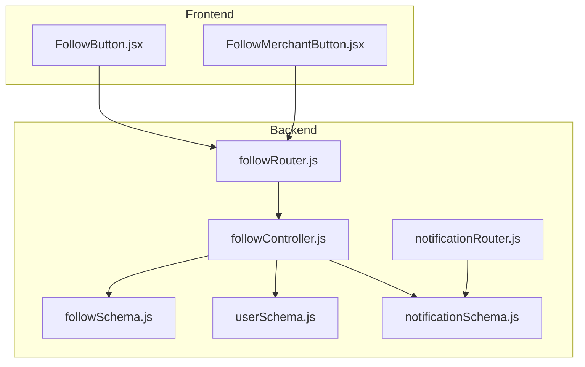
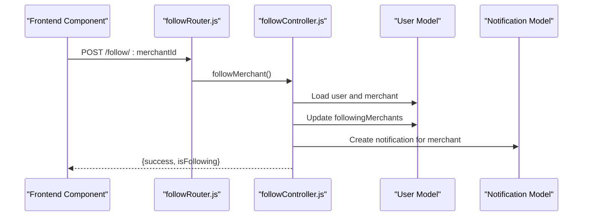
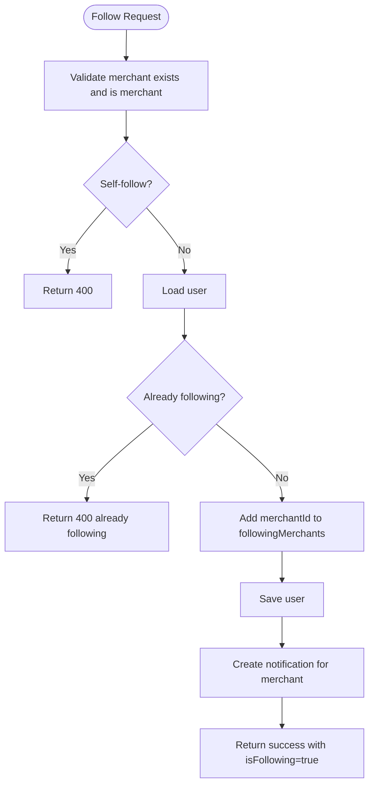
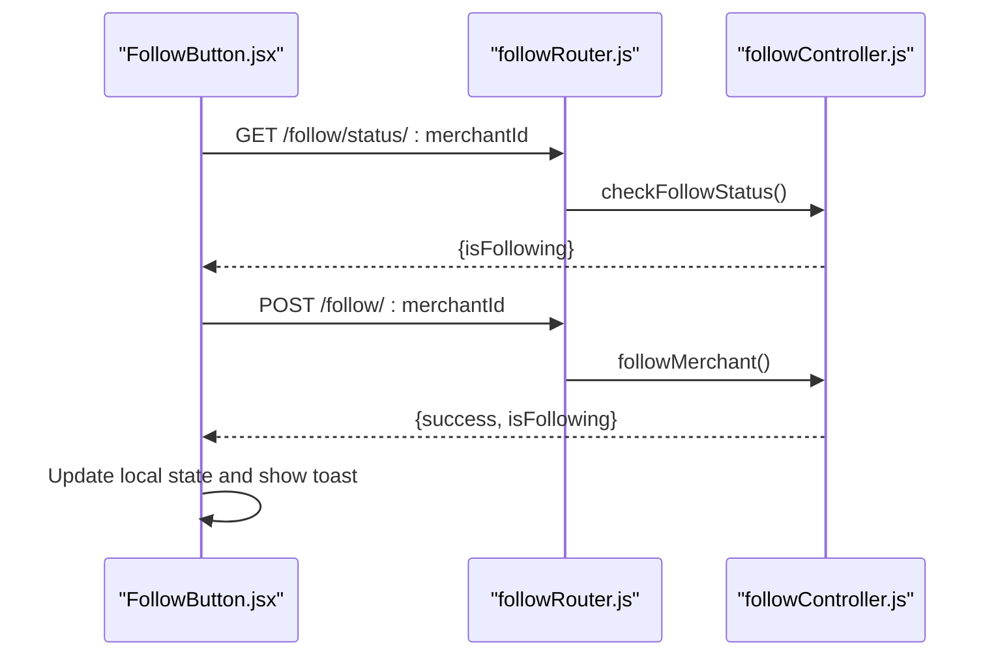
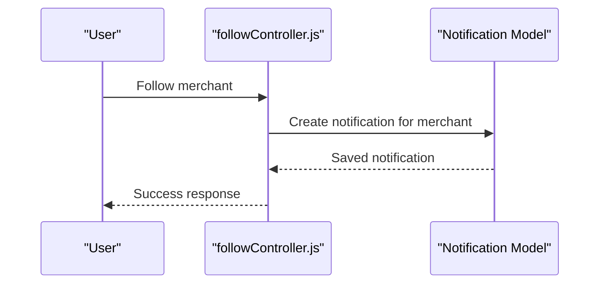
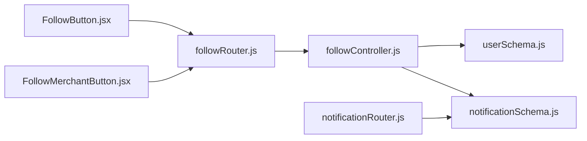

# User Following System

<cite>
**Referenced Files in This Document**
- [followController.js](file://backend/controller/followController.js)
- [followSchema.js](file://backend/models/followSchema.js)
- [followRouter.js](file://backend/router/followRouter.js)
- [FollowButton.jsx](file://frontend/src/components/FollowButton.jsx)
- [FollowMerchantButton.jsx](file://frontend/src/components/FollowMerchantButton.jsx)
- [notificationSchema.js](file://backend/models/notificationSchema.js)
- [notificationRouter.js](file://backend/router/notificationRouter.js)
- [userSchema.js](file://backend/models/userSchema.js)
- [RATING_REVIEW_FOLLOW_IMPLEMENTATION_SUMMARY.md](file://backend/RATING_REVIEW_FOLLOW_IMPLEMENTATION_SUMMARY.md)
</cite>

## Table of Contents
1. [Introduction](#introduction)
2. [Project Structure](#project-structure)
3. [Core Components](#core-components)
4. [Architecture Overview](#architecture-overview)
5. [Detailed Component Analysis](#detailed-component-analysis)
6. [Dependency Analysis](#dependency-analysis)
7. [Performance Considerations](#performance-considerations)
8. [Troubleshooting Guide](#troubleshooting-guide)
9. [Conclusion](#conclusion)

## Introduction
This document explains the user following system that enables users to follow merchants. It covers the backend controller implementation for follow/unfollow operations, follower/following relationship management, and social graph maintenance. It also documents the follow schema design, the frontend FollowButton component, user interactions, and notification triggers for new followers. Privacy controls, mutual following indicators, and social discovery features are addressed conceptually.

## Project Structure
The following diagram shows how the follow system is organized across the backend and frontend:

**Diagram sources**
- [followController.js:1-234](file://backend/controller/followController.js#L1-L234)
- [followSchema.js:1-22](file://backend/models/followSchema.js#L1-L22)
- [followRouter.js:1-26](file://backend/router/followRouter.js#L1-L26)
- [userSchema.js:1-55](file://backend/models/userSchema.js#L1-L55)
- [notificationSchema.js:1-36](file://backend/models/notificationSchema.js#L1-L36)
- [notificationRouter.js:1-44](file://backend/router/notificationRouter.js#L1-L44)
- [FollowButton.jsx:1-121](file://frontend/src/components/FollowButton.jsx#L1-L121)
- [FollowMerchantButton.jsx:1-117](file://frontend/src/components/FollowMerchantButton.jsx#L1-L117)

**Section sources**
- [followController.js:1-234](file://backend/controller/followController.js#L1-L234)
- [followSchema.js:1-22](file://backend/models/followSchema.js#L1-L22)
- [followRouter.js:1-26](file://backend/router/followRouter.js#L1-L26)
- [userSchema.js:1-55](file://backend/models/userSchema.js#L1-L55)
- [notificationSchema.js:1-36](file://backend/models/notificationSchema.js#L1-L36)
- [notificationRouter.js:1-44](file://backend/router/notificationRouter.js#L1-L44)
- [FollowButton.jsx:1-121](file://frontend/src/components/FollowButton.jsx#L1-L121)
- [FollowMerchantButton.jsx:1-117](file://frontend/src/components/FollowMerchantButton.jsx#L1-L117)

## Core Components
- Backend follow controller: Implements follow/unfollow, status checks, and follower queries.
- Follow schema: Defines the relationship model with uniqueness constraints.
- Follow router: Exposes REST endpoints for follow operations.
- Frontend FollowButton: Manages UI state and user interactions for follow/unfollow.
- Notification system: Handles merchant notifications upon new followers.

Key capabilities:
- Toggle follow/unfollow with validation and error handling.
- Retrieve following lists and follower counts.
- Trigger notifications for merchants when users follow them.
- Maintain a clean social graph via unique constraints.

**Section sources**
- [followController.js:1-234](file://backend/controller/followController.js#L1-L234)
- [followSchema.js:1-22](file://backend/models/followSchema.js#L1-L22)
- [followRouter.js:1-26](file://backend/router/followRouter.js#L1-L26)
- [FollowButton.jsx:1-121](file://frontend/src/components/FollowButton.jsx#L1-L121)
- [notificationSchema.js:1-36](file://backend/models/notificationSchema.js#L1-L36)

## Architecture Overview
The follow system follows a layered architecture:
- Frontend components send requests to backend routes.
- Routes delegate to the follow controller.
- Controller manipulates the User model and optionally creates notifications.
- Notifications are persisted and retrievable via the notification router.

**Diagram sources**
- [followRouter.js:13-18](file://backend/router/followRouter.js#L13-L18)
- [followController.js:5-86](file://backend/controller/followController.js#L5-L86)
- [userSchema.js:1-55](file://backend/models/userSchema.js#L1-L55)
- [notificationSchema.js:1-36](file://backend/models/notificationSchema.js#L1-L36)

## Detailed Component Analysis

### Backend Follow Controller
Responsibilities:
- Validate merchant existence and role.
- Prevent self-following.
- Manage followingMerchants array on the User model.
- Create notifications for merchants when a user follows them.
- Provide endpoints to check follow status, list following, and list followers.

Processing logic highlights:
- Follow operation adds merchantId to user.followingMerchants and persists.
- Unfollow removes merchantId from user.followingMerchants and persists.
- Status check returns a boolean indicating follow state.
- Followers retrieval queries users where followingMerchants includes merchantId.

**Diagram sources**
- [followController.js:5-86](file://backend/controller/followController.js#L5-L86)

**Section sources**
- [followController.js:1-234](file://backend/controller/followController.js#L1-L234)

### Follow Schema Design
The follow schema defines a many-to-many-like relationship between users and merchants using arrays on the User model:
- User model maintains a followingMerchants array.
- No separate Follow entity is used; relationships are stored directly on the User document.
- Unique constraint ensures a user cannot follow the same merchant twice (conceptual note: see limitations below).

Important characteristics:
- Timestamps are enabled on the User model for createdAt/updatedAt.
- The followSchema file defines a separate Follow model with user and merchant references and a unique compound index. This indicates a potential divergence between the controller’s approach and the schema definition.

Recommendation:
- Align the controller to use the Follow model consistently if a normalized relationship is desired, or remove the Follow model if denormalized arrays are preferred.

**Section sources**
- [followSchema.js:1-22](file://backend/models/followSchema.js#L1-L22)
- [userSchema.js:1-55](file://backend/models/userSchema.js#L1-L55)
- [followController.js:174-206](file://backend/controller/followController.js#L174-L206)

### Frontend FollowButton Component
Responsibilities:
- Fetch and display follow status.
- Toggle follow/unfollow via API calls.
- Provide loading states and user feedback via toast notifications.
- Support different sizes and custom classes.

Behavior:
- On mount, checks follow status via GET /follow/status/:merchantId.
- On click, posts to POST /follow/:merchantId to toggle.
- Uses auth headers and handles errors gracefully.

**Diagram sources**
- [FollowButton.jsx:25-75](file://frontend/src/components/FollowButton.jsx#L25-L75)
- [followRouter.js:13-18](file://backend/router/followRouter.js#L13-L18)
- [followController.js:140-172](file://backend/controller/followController.js#L140-L172)

**Section sources**
- [FollowButton.jsx:1-121](file://frontend/src/components/FollowButton.jsx#L1-L121)

### Notification Triggers for New Followers
When a user follows a merchant:
- The backend attempts to create a notification for the merchant.
- The notification schema supports storing user-specific messages with read status and timestamps.

Integration points:
- Notification creation occurs inside the followMerchant controller.
- Notification retrieval is handled by the notification router.

**Diagram sources**
- [followController.js:60-69](file://backend/controller/followController.js#L60-L69)
- [notificationSchema.js:1-36](file://backend/models/notificationSchema.js#L1-L36)
- [notificationRouter.js:7-17](file://backend/router/notificationRouter.js#L7-L17)

**Section sources**
- [followController.js:60-69](file://backend/controller/followController.js#L60-L69)
- [notificationSchema.js:1-36](file://backend/models/notificationSchema.js#L1-L36)
- [notificationRouter.js:1-44](file://backend/router/notificationRouter.js#L1-L44)

### Social Graph Maintenance
Current approach:
- The User model stores followingMerchants as an array of merchant IDs.
- Followers are discovered by querying users whose followingMerchants includes the target merchantId.

Considerations:
- Array-based relationships are simple but can become inefficient for very large graphs.
- Indexing on followingMerchants can help with lookups.
- For advanced features (mutual follows, recommendations), consider migrating to a dedicated Follow collection with indexes and aggregation pipelines.

**Section sources**
- [followController.js:208-234](file://backend/controller/followController.js#L208-L234)
- [userSchema.js:1-55](file://backend/models/userSchema.js#L1-L55)

### Privacy Controls and Role-Based Access
- Only users with role "user" can follow merchants.
- The FollowMerchantButton component enforces role checks and hides itself for non-users or during status checks.

**Section sources**
- [FollowMerchantButton.jsx:88-91](file://frontend/src/components/FollowMerchantButton.jsx#L88-L91)
- [userSchema.js:39-44](file://backend/models/userSchema.js#L39-L44)

### Mutual Following Indicators and Social Discovery
- The current implementation does not expose mutual following indicators or social discovery features.
- To implement mutual following, compare a user’s following list with another user’s followers.
- For discovery, recommend merchants based on shared interests, categories, or popularity metrics.

[No sources needed since this section provides conceptual guidance]

## Dependency Analysis
The follow system has clear boundaries:
- Frontend components depend on backend routes.
- Backend routes depend on the follow controller.
- The follow controller depends on the User and Notification models.
- The notification router depends on the Notification model.

**Diagram sources**
- [FollowButton.jsx:1-121](file://frontend/src/components/FollowButton.jsx#L1-L121)
- [FollowMerchantButton.jsx:1-117](file://frontend/src/components/FollowMerchantButton.jsx#L1-L117)
- [followRouter.js:1-26](file://backend/router/followRouter.js#L1-L26)
- [followController.js:1-234](file://backend/controller/followController.js#L1-L234)
- [userSchema.js:1-55](file://backend/models/userSchema.js#L1-L55)
- [notificationSchema.js:1-36](file://backend/models/notificationSchema.js#L1-L36)
- [notificationRouter.js:1-44](file://backend/router/notificationRouter.js#L1-L44)

**Section sources**
- [followController.js:1-234](file://backend/controller/followController.js#L1-L234)
- [followRouter.js:1-26](file://backend/router/followRouter.js#L1-L26)
- [userSchema.js:1-55](file://backend/models/userSchema.js#L1-L55)
- [notificationSchema.js:1-36](file://backend/models/notificationSchema.js#L1-L36)
- [notificationRouter.js:1-44](file://backend/router/notificationRouter.js#L1-L44)
- [FollowButton.jsx:1-121](file://frontend/src/components/FollowButton.jsx#L1-L121)
- [FollowMerchantButton.jsx:1-117](file://frontend/src/components/FollowMerchantButton.jsx#L1-L117)

## Performance Considerations
- Array operations on User.followingMerchants are O(n) for membership checks and filtering.
- For high-scale scenarios, consider:
  - Using a dedicated Follow collection with indexes on user and merchant.
  - Aggregation pipelines for efficient follower/following queries.
  - Caching frequently accessed lists (e.g., top merchants by follower count).
- Ensure database indexes on User.email and Notification.user for fast lookups.

[No sources needed since this section provides general guidance]

## Troubleshooting Guide
Common issues and resolutions:
- Merchant not found or not a merchant:
  - Ensure merchantId is valid and role is "merchant".
- Cannot follow yourself:
  - Self-follow is prevented by a guard condition.
- Already following:
  - Attempting to follow again returns a 400 error; use status endpoint to check.
- Unfollow when not following:
  - Attempting to unfollow returns a 400 error.
- Notification creation failures:
  - Follow controller logs and continues; verify Notification model connectivity.

**Section sources**
- [followController.js:14-86](file://backend/controller/followController.js#L14-L86)
- [followController.js:88-137](file://backend/controller/followController.js#L88-L137)
- [followController.js:139-172](file://backend/controller/followController.js#L139-L172)
- [followController.js:174-234](file://backend/controller/followController.js#L174-L234)

## Conclusion
The user following system provides a straightforward mechanism for users to follow merchants, with real-time status updates and notifications. The backend controller and frontend components work together to deliver a smooth user experience. For production-scale deployments, consider migrating to a normalized Follow collection and adding advanced social features such as mutual following indicators and discovery algorithms.