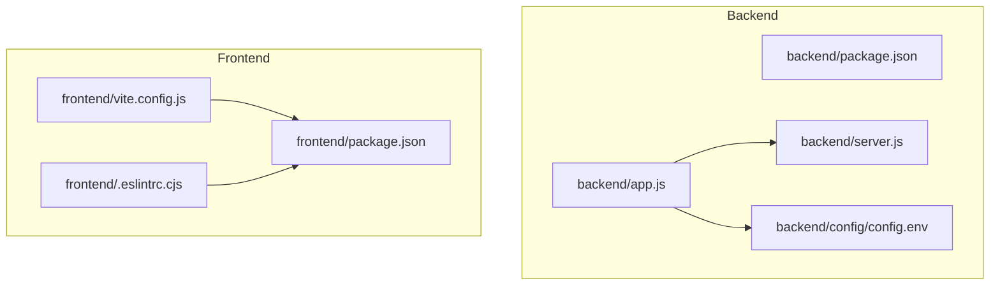
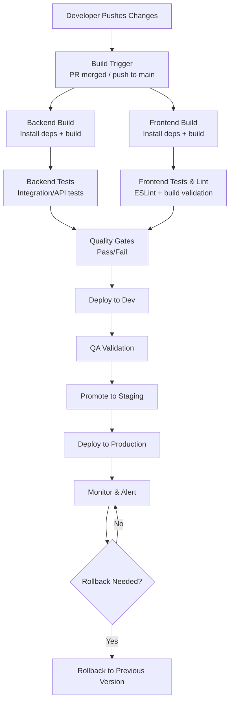
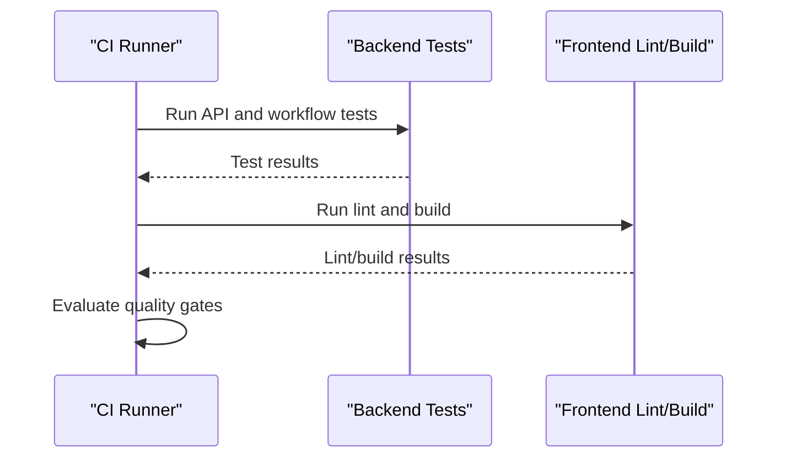
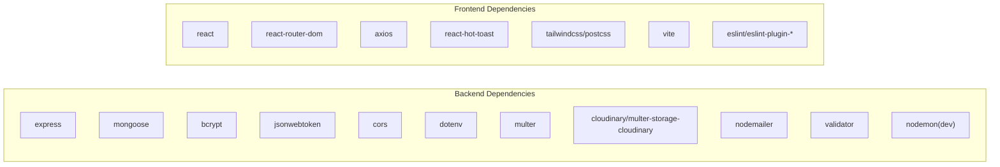
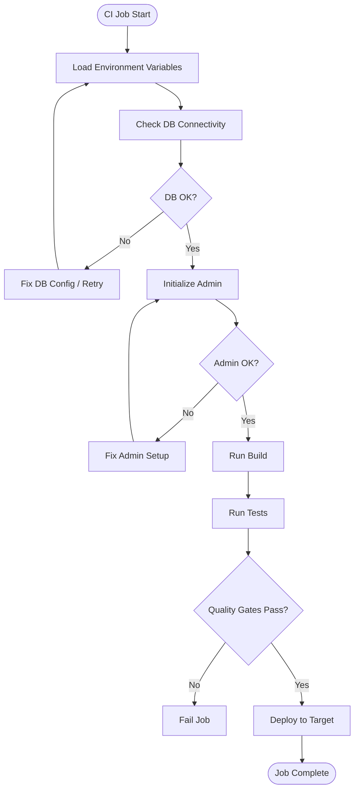

# CI/CD Automation

<cite>
**Referenced Files in This Document**
- [backend/package.json](file://backend/package.json)
- [frontend/package.json](file://frontend/package.json)
- [backend/app.js](file://backend/app.js)
- [backend/server.js](file://backend/server.js)
- [backend/config/config.env](file://backend/config/config.env)
- [frontend/vite.config.js](file://frontend/vite.config.js)
- [frontend/.eslintrc.cjs](file://frontend/.eslintrc.cjs)
- [backend/scripts/testLogin.js](file://backend/scripts/testLogin.js)
- [backend/test-api-booking.js](file://backend/test-api-booking.js)
- [backend/scripts/testCompleteWorkflow.js](file://backend/scripts/testCompleteWorkflow.js)
- [backend/setup-local-mongodb.bat](file://backend/setup-local-mongodb.bat)
</cite>

## Table of Contents
1. [Introduction](#introduction)
2. [Project Structure](#project-structure)
3. [Core Components](#core-components)
4. [Architecture Overview](#architecture-overview)
5. [Detailed Component Analysis](#detailed-component-analysis)
6. [Dependency Analysis](#dependency-analysis)
7. [Performance Considerations](#performance-considerations)
8. [Troubleshooting Guide](#troubleshooting-guide)
9. [Conclusion](#conclusion)
10. [Appendices](#appendices)

## Introduction
This document describes CI/CD automation for the MERN Stack Event Management Platform. It covers continuous integration pipeline setup, automated testing workflows, and deployment automation across environments. It also documents configuration for CI/CD platforms, build triggers, quality gates, code quality checks, security scanning, environment promotion, release management, artifact management, rollback mechanisms, and monitoring integration.

## Project Structure
The platform consists of:
- Backend (Node.js/Express): API server, routers, models, controllers, middleware, and scripts.
- Frontend (React/Vite): Single-page application built with Vite and React.
- Shared configuration via environment variables and linting rules.

**Diagram sources**
- [backend/app.js:1-91](file://backend/app.js#L1-L91)
- [backend/server.js:1-6](file://backend/server.js#L1-L6)
- [backend/config/config.env:1-42](file://backend/config/config.env#L1-L42)
- [frontend/package.json:1-37](file://frontend/package.json#L1-L37)
- [frontend/vite.config.js:1-12](file://frontend/vite.config.js#L1-L12)
- [frontend/.eslintrc.cjs:1-22](file://frontend/.eslintrc.cjs#L1-L22)

**Section sources**
- [backend/package.json:1-30](file://backend/package.json#L1-L30)
- [frontend/package.json:1-37](file://frontend/package.json#L1-L37)
- [backend/app.js:1-91](file://backend/app.js#L1-L91)
- [backend/server.js:1-6](file://backend/server.js#L1-L6)
- [backend/config/config.env:1-42](file://backend/config/config.env#L1-L42)
- [frontend/vite.config.js:1-12](file://frontend/vite.config.js#L1-L12)
- [frontend/.eslintrc.cjs:1-22](file://frontend/.eslintrc.cjs#L1-L22)

## Core Components
- Backend build and test scripts:
  - Scripts include start and dev commands for production and development.
  - Dev dependencies include nodemon for auto-reload during development.
- Frontend build and test scripts:
  - Scripts include dev, build, lint, and preview commands.
  - Linting uses ESLint with React-specific recommended rules.
- Runtime configuration:
  - Environment variables define server port, MongoDB URI, CORS origins, JWT secrets, Cloudinary, SMTP, and admin defaults.
- Application bootstrap:
  - Express app initializes routes, CORS, environment loading, health endpoints, and admin initialization.

**Section sources**
- [backend/package.json:7-10](file://backend/package.json#L7-L10)
- [backend/package.json:26-28](file://backend/package.json#L26-L28)
- [frontend/package.json:6-11](file://frontend/package.json#L6-L11)
- [frontend/package.json:22-34](file://frontend/package.json#L22-L34)
- [backend/config/config.env:1-42](file://backend/config/config.env#L1-L42)
- [backend/app.js:20-91](file://backend/app.js#L20-L91)

## Architecture Overview
The CI/CD pipeline orchestrates:
- Build: Backend and frontend builds.
- Test: Unit/integration tests and linting.
- Quality Gates: Lint passes, tests pass, optional security scans.
- Artifact Management: Build outputs and Docker images.
- Deployment: Multi-environment deployments with promotion and rollback.
- Monitoring: Health endpoints and logs.

[No sources needed since this diagram shows conceptual workflow, not actual code structure]

## Detailed Component Analysis

### Continuous Integration Pipeline Setup
- Build Triggers:
  - PR merges to main branch trigger a full pipeline.
  - Commits to feature branches can optionally run lightweight lint and unit tests.
- Build Jobs:
  - Backend job installs dependencies and runs build.
  - Frontend job installs dependencies and runs build.
- Quality Gates:
  - Lint must pass for frontend.
  - Backend tests must pass.
  - Optional: Security scan (e.g., npm audit) and SAST (e.g., ESLint for backend).
- Artifacts:
  - Store backend dist and frontend build artifacts for deployment jobs.

[No sources needed since this section provides general guidance]

### Automated Testing Workflows
- Backend Testing:
  - Use existing scripts as references for API and workflow tests.
  - Example scripts demonstrate login testing and complete booking workflow testing.
- Frontend Testing:
  - Use linting and build validation as quality gates.
  - Integrate unit and integration tests in CI using the project’s existing scripts as templates.

[No sources needed since this diagram shows conceptual workflow, not actual code structure]

**Section sources**
- [backend/scripts/testLogin.js:1-45](file://backend/scripts/testLogin.js#L1-L45)
- [backend/test-api-booking.js:1-40](file://backend/test-api-booking.js#L1-L40)
- [backend/scripts/testCompleteWorkflow.js:141-170](file://backend/scripts/testCompleteWorkflow.js#L141-L170)
- [frontend/package.json:9-9](file://frontend/package.json#L9-L9)
- [frontend/.eslintrc.cjs:1-22](file://frontend/.eslintrc.cjs#L1-L22)

### Code Quality Checks and Security Scanning
- Code Quality:
  - Frontend: ESLint configuration enforces React recommended rules and JSX runtime settings.
  - Backend: Add ESLint for JavaScript and enforce strict rules in CI.
- Security Scanning:
  - Run npm audit or equivalent in CI to detect vulnerabilities.
  - Scan Docker images if containerized deployments are used.

**Section sources**
- [frontend/.eslintrc.cjs:4-9](file://frontend/.eslintrc.cjs#L4-L9)
- [frontend/package.json:28-31](file://frontend/package.json#L28-L31)

### Deployment Automation and Environment Promotion
- Environments:
  - Dev: For feature integrations and smoke tests.
  - Staging: Pre-production validation.
  - Production: Release to end users.
- Promotion Strategy:
  - Gate promotion based on test results, security scan outcomes, and manual approvals.
- Rollback Mechanisms:
  - Maintain artifact retention and support blue/green or rolling rollbacks.
  - Keep previous image/tag for quick revert.
- Monitoring Integration:
  - Expose health endpoints and integrate with logging/alerting systems.

[No sources needed since this section provides general guidance]

### Release Management and Artifact Management
- Release Management:
  - Tag releases on main branch.
  - Automate changelog generation and notify stakeholders.
- Artifact Management:
  - Store build outputs and container images with versioned names.
  - Retain artifacts for rollback windows.

[No sources needed since this section provides general guidance]

### Configuration Examples for CI/CD Platforms
- GitHub Actions:
  - Use matrix builds for backend and frontend.
  - Cache dependencies and run quality gates before deployment.
  - Use secrets for environment variables and deployment tokens.
- GitLab CI/CD:
  - Define stages: build, test, deploy.
  - Use masked variables for sensitive configuration.
- Jenkins:
  - Use declarative pipelines with parallel stages for frontend and backend.
  - Archive artifacts and integrate with Slack/PagerDuty for alerts.

[No sources needed since this section provides general guidance]

## Dependency Analysis
Runtime and build dependencies influence CI/CD decisions:
- Backend:
  - Express, mongoose, bcrypt, jsonwebtoken, cors, dotenv, multer/cloudinary, nodemailer, validator.
  - Dev: nodemon for development.
- Frontend:
  - React, react-router-dom, axios, react-hot-toast, TailwindCSS toolchain, Vite, ESLint plugins.

**Diagram sources**
- [backend/package.json:13-25](file://backend/package.json#L13-L25)
- [backend/package.json:26-28](file://backend/package.json#L26-L28)
- [frontend/package.json:12-21](file://frontend/package.json#L12-L21)
- [frontend/package.json:22-35](file://frontend/package.json#L22-L35)

**Section sources**
- [backend/package.json:13-28](file://backend/package.json#L13-L28)
- [frontend/package.json:12-35](file://frontend/package.json#L12-L35)

## Performance Considerations
- Optimize CI performance:
  - Cache node_modules and yarn/pnpm caches.
  - Parallelize frontend and backend jobs.
  - Use incremental builds and selective test runs on changed files.
- Reduce deployment time:
  - Use multi-stage Docker builds.
  - Minimize image size and leverage layer caching.

[No sources needed since this section provides general guidance]

## Troubleshooting Guide
- Environment Configuration:
  - Ensure environment variables are loaded correctly at startup.
  - Validate CORS origin matches frontend URL.
- Database Connectivity:
  - Use local MongoDB setup script as a reference for fallback scenarios.
  - Confirm Atlas connectivity and retry settings.
- Health and Admin Initialization:
  - Use health endpoint to verify service availability.
  - Confirm admin initialization completes after DB connection.

**Section sources**
- [backend/config/config.env:1-42](file://backend/config/config.env#L1-L42)
- [backend/app.js:49-85](file://backend/app.js#L49-L85)
- [backend/setup-local-mongodb.bat:1-32](file://backend/setup-local-mongodb.bat#L1-L32)

## Conclusion
This CI/CD automation blueprint aligns the MERN platform’s build, test, and deployment processes with industry best practices. By enforcing quality gates, automating multi-environment deployments, and integrating monitoring and rollback mechanisms, teams can deliver reliable updates consistently.

[No sources needed since this section summarizes without analyzing specific files]

## Appendices
- Example CI/CD Tasks:
  - Backend: Install dependencies, build, lint-free run, run API tests, security scan.
  - Frontend: Install dependencies, lint, build, preview verification.
- Secrets and Variables:
  - Store MONGO_URI, JWT_SECRET, CLOUDINARY_* and SMTP_* as encrypted secrets.
- Deployment Targets:
  - Containerized deployments to Kubernetes or cloud platforms.
  - Static hosting for frontend with CDN-backed assets.

[No sources needed since this section provides general guidance]