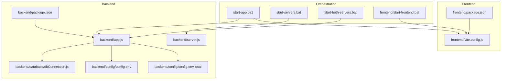
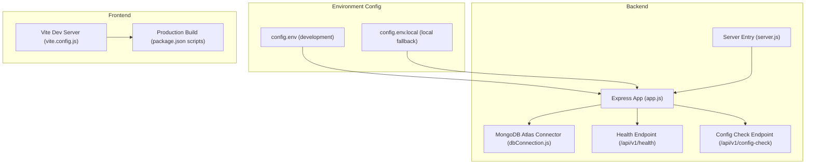
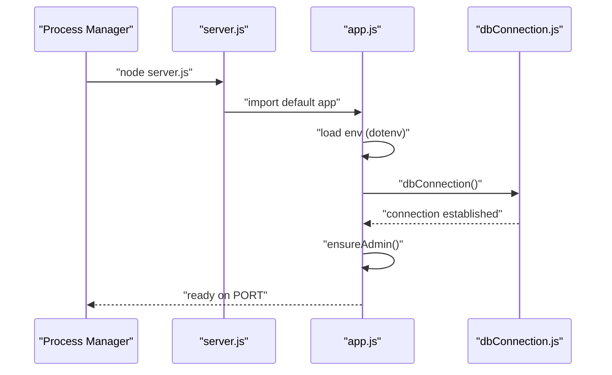
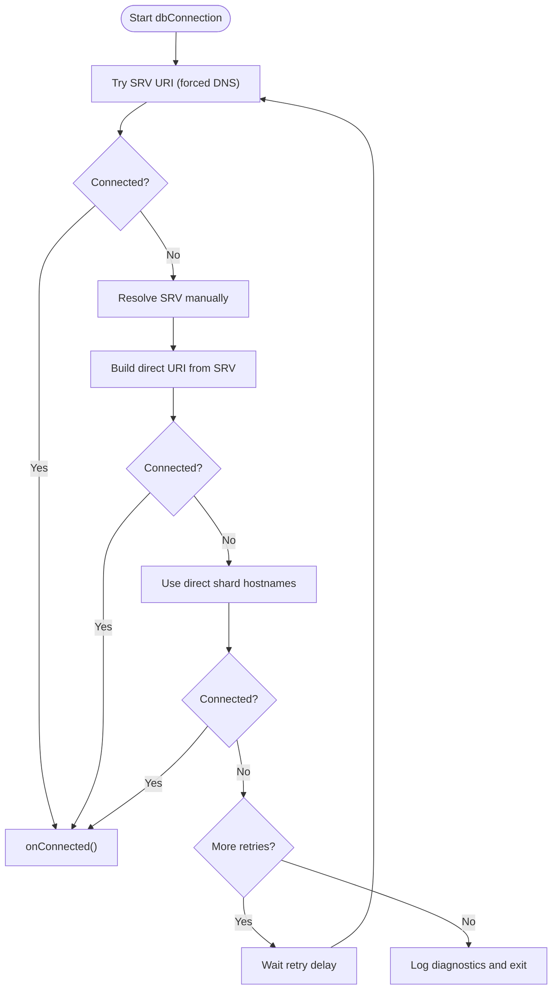
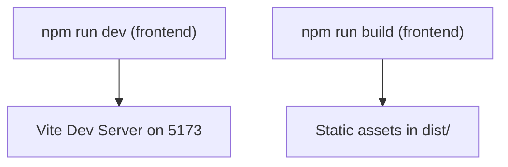
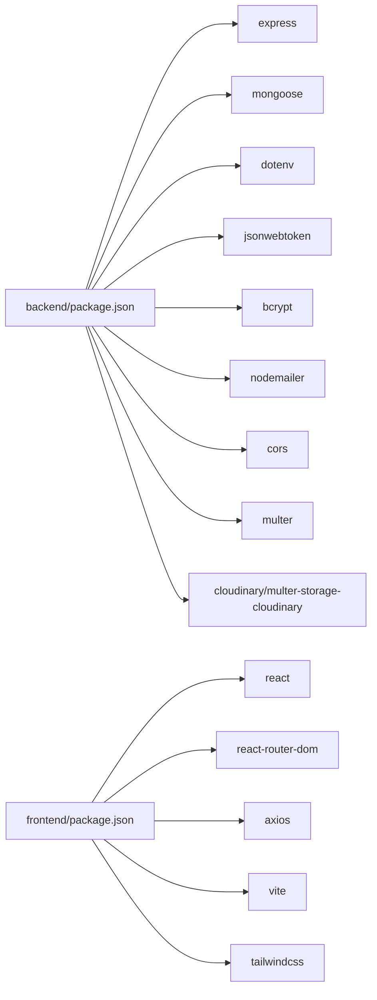

# Deployment Procedures

<cite>
**Referenced Files in This Document**
- [backend/package.json](file://backend/package.json)
- [frontend/package.json](file://frontend/package.json)
- [backend/app.js](file://backend/app.js)
- [backend/server.js](file://backend/server.js)
- [backend/database/dbConnection.js](file://backend/database/dbConnection.js)
- [backend/config/config.env](file://backend/config/config.env)
- [backend/config/config.env.local](file://backend/config/config.env.local)
- [frontend/vite.config.js](file://frontend/vite.config.js)
- [start-app.ps1](file://start-app.ps1)
- [start-both-servers.bat](file://start-both-servers.bat)
- [start-servers.bat](file://start-servers.bat)
- [frontend/start-frontend.bat](file://frontend/start-frontend.bat)
</cite>

## Table of Contents
1. [Introduction](#introduction)
2. [Project Structure](#project-structure)
3. [Core Components](#core-components)
4. [Architecture Overview](#architecture-overview)
5. [Detailed Component Analysis](#detailed-component-analysis)
6. [Dependency Analysis](#dependency-analysis)
7. [Performance Considerations](#performance-considerations)
8. [Troubleshooting Guide](#troubleshooting-guide)
9. [Conclusion](#conclusion)
10. [Appendices](#appendices)

## Introduction
This document provides end-to-end deployment procedures for the MERN Stack Event Management Platform. It covers production builds for frontend and backend, environment configuration management, database deployment strategies using MongoDB Atlas, server deployment and port configuration, reverse proxy setup, deployment checklists, rollback procedures, post-deployment verification, environment-specific configurations, secrets management, monitoring setup, and step-by-step deployment guides for development, staging, and production environments.

## Project Structure
The platform consists of:
- Backend: Express.js server with environment-driven configuration, MongoDB Atlas connectivity, and health endpoints.
- Frontend: React application built with Vite, configured for development and production builds.
- Scripts: PowerShell and batch scripts to orchestrate local development and server startup.

**Diagram sources**
- [frontend/package.json:1-37](file://frontend/package.json#L1-L37)
- [frontend/vite.config.js:1-12](file://frontend/vite.config.js#L1-L12)
- [backend/package.json:1-30](file://backend/package.json#L1-L30)
- [backend/app.js:1-91](file://backend/app.js#L1-L91)
- [backend/server.js:1-6](file://backend/server.js#L1-L6)
- [backend/database/dbConnection.js:1-112](file://backend/database/dbConnection.js#L1-L112)
- [backend/config/config.env:1-42](file://backend/config/config.env#L1-L42)
- [backend/config/config.env.local:1-49](file://backend/config/config.env.local#L1-L49)
- [start-app.ps1:1-119](file://start-app.ps1#L1-L119)
- [start-servers.bat:1-24](file://start-servers.bat#L1-L24)
- [start-both-servers.bat:1-23](file://start-both-servers.bat#L1-L23)
- [frontend/start-frontend.bat:1-7](file://frontend/start-frontend.bat#L1-L7)

**Section sources**
- [frontend/package.json:1-37](file://frontend/package.json#L1-L37)
- [backend/package.json:1-30](file://backend/package.json#L1-L30)
- [backend/app.js:1-91](file://backend/app.js#L1-L91)
- [backend/server.js:1-6](file://backend/server.js#L1-L6)
- [backend/database/dbConnection.js:1-112](file://backend/database/dbConnection.js#L1-L112)
- [backend/config/config.env:1-42](file://backend/config/config.env#L1-L42)
- [backend/config/config.env.local:1-49](file://backend/config/config.env.local#L1-L49)
- [frontend/vite.config.js:1-12](file://frontend/vite.config.js#L1-L12)
- [start-app.ps1:1-119](file://start-app.ps1#L1-L119)
- [start-servers.bat:1-24](file://start-servers.bat#L1-L24)
- [start-both-servers.bat:1-23](file://start-both-servers.bat#L1-L23)
- [frontend/start-frontend.bat:1-7](file://frontend/start-frontend.bat#L1-L7)

## Core Components
- Backend server
  - Starts on port 5000 by default, configurable via environment variable.
  - Loads environment variables from a dedicated config file.
  - Initializes database connection and admin user during startup.
  - Exposes health and configuration check endpoints.
- Database connection
  - Attempts multiple connection strategies to MongoDB Atlas with retry logic and DNS overrides.
  - Provides detailed failure diagnostics and exit behavior in production.
- Frontend build and dev server
  - Production build uses Vite with defined scripts.
  - Development server runs on port 5173 and binds to host for external access.

Key configuration locations:
- Backend environment variables: [backend/config/config.env:1-42](file://backend/config/config.env#L1-L42), [backend/config/config.env.local:1-49](file://backend/config/config.env.local#L1-L49)
- Backend startup and routing: [backend/app.js:1-91](file://backend/app.js#L1-L91), [backend/server.js:1-6](file://backend/server.js#L1-L6)
- Database connection logic: [backend/database/dbConnection.js:1-112](file://backend/database/dbConnection.js#L1-L112)
- Frontend build and dev server: [frontend/package.json:1-37](file://frontend/package.json#L1-L37), [frontend/vite.config.js:1-12](file://frontend/vite.config.js#L1-L12)

**Section sources**
- [backend/server.js:1-6](file://backend/server.js#L1-L6)
- [backend/app.js:1-91](file://backend/app.js#L1-L91)
- [backend/database/dbConnection.js:1-112](file://backend/database/dbConnection.js#L1-L112)
- [backend/config/config.env:1-42](file://backend/config/config.env#L1-L42)
- [backend/config/config.env.local:1-49](file://backend/config/config.env.local#L1-L49)
- [frontend/package.json:1-37](file://frontend/package.json#L1-L37)
- [frontend/vite.config.js:1-12](file://frontend/vite.config.js#L1-L12)

## Architecture Overview
The deployment architecture separates frontend and backend with environment-driven configuration and robust database connectivity.

**Diagram sources**
- [backend/config/config.env:1-42](file://backend/config/config.env#L1-L42)
- [backend/config/config.env.local:1-49](file://backend/config/config.env.local#L1-L49)
- [backend/app.js:1-91](file://backend/app.js#L1-L91)
- [backend/server.js:1-6](file://backend/server.js#L1-L6)
- [backend/database/dbConnection.js:1-112](file://backend/database/dbConnection.js#L1-L112)
- [frontend/vite.config.js:1-12](file://frontend/vite.config.js#L1-L12)
- [frontend/package.json:1-37](file://frontend/package.json#L1-L37)

## Detailed Component Analysis

### Backend Production Build and Startup
- Build command: see [backend/package.json:7-10](file://backend/package.json#L7-L10).
- Start command: see [backend/package.json](file://backend/package.json#L8).
- Environment loading: [backend/app.js](file://backend/app.js#L22).
- Port binding: [backend/server.js](file://backend/server.js#L2).
- Health endpoint: [backend/app.js:49-51](file://backend/app.js#L49-L51).
- Configuration check endpoint: [backend/app.js:53-62](file://backend/app.js#L53-L62).
- Database initialization and admin creation: [backend/app.js:64-88](file://backend/app.js#L64-L88).

**Diagram sources**
- [backend/server.js:1-6](file://backend/server.js#L1-L6)
- [backend/app.js:1-91](file://backend/app.js#L1-L91)
- [backend/database/dbConnection.js:1-112](file://backend/database/dbConnection.js#L1-L112)

**Section sources**
- [backend/package.json:7-10](file://backend/package.json#L7-L10)
- [backend/server.js:1-6](file://backend/server.js#L1-L6)
- [backend/app.js:22-88](file://backend/app.js#L22-L88)
- [backend/database/dbConnection.js:19-94](file://backend/database/dbConnection.js#L19-L94)

### Database Deployment Strategies and MongoDB Atlas Setup
- Connection strategies:
  - SRV URI with forced DNS resolution.
  - Manual SRV record resolution followed by direct URI.
  - Direct shard hostnames with replica set configuration.
- Retry logic and timeouts: [backend/database/dbConnection.js:19-94](file://backend/database/dbConnection.js#L19-L94).
- Atlas connectivity diagnostics and exit behavior: [backend/database/dbConnection.js:86-94](file://backend/database/dbConnection.js#L86-L94).
- Environment variables controlling retries and DNS: [backend/config/config.env:13-15](file://backend/config/config.env#L13-L15), [backend/config/config.env.local:20-22](file://backend/config/config.env.local#L20-L22).

**Diagram sources**
- [backend/database/dbConnection.js:19-94](file://backend/database/dbConnection.js#L19-L94)

**Section sources**
- [backend/database/dbConnection.js:19-94](file://backend/database/dbConnection.js#L19-L94)
- [backend/config/config.env:13-15](file://backend/config/config.env#L13-L15)
- [backend/config/config.env.local:20-22](file://backend/config/config.env.local#L20-L22)

### Frontend Production Build and Dev Server
- Production build script: [frontend/package.json](file://frontend/package.json#L8).
- Development server port and host: [frontend/vite.config.js:7-10](file://frontend/vite.config.js#L7-L10).
- Frontend startup scripts: [frontend/start-frontend.bat:1-7](file://frontend/start-frontend.bat#L1-L7).

**Diagram sources**
- [frontend/package.json:6-11](file://frontend/package.json#L6-L11)
- [frontend/vite.config.js:7-10](file://frontend/vite.config.js#L7-L10)
- [frontend/start-frontend.bat:1-7](file://frontend/start-frontend.bat#L1-L7)

**Section sources**
- [frontend/package.json:6-11](file://frontend/package.json#L6-L11)
- [frontend/vite.config.js:7-10](file://frontend/vite.config.js#L7-L10)
- [frontend/start-frontend.bat:1-7](file://frontend/start-frontend.bat#L1-L7)

### Environment Configuration Management
- Development environment variables: [backend/config/config.env:1-42](file://backend/config/config.env#L1-L42).
- Local fallback and alternative URIs: [backend/config/config.env.local:1-49](file://backend/config/config.env.local#L1-L49).
- Environment loading in app: [backend/app.js](file://backend/app.js#L22).
- Frontend dev server URL: [backend/config/config.env](file://backend/config/config.env#L21).

Best practices:
- Keep secrets out of version control; override via OS environment or secure secret manager.
- Use separate config files per environment and validate presence at startup.

**Section sources**
- [backend/config/config.env:1-42](file://backend/config/config.env#L1-L42)
- [backend/config/config.env.local:1-49](file://backend/config/config.env.local#L1-L49)
- [backend/app.js](file://backend/app.js#L22)

### Server Deployment Procedures, Ports, and Reverse Proxy
- Backend port: default 5000; configurable via environment variable. See [backend/server.js](file://backend/server.js#L2).
- Frontend dev server port: 5173; production build serves static assets. See [frontend/vite.config.js:7-10](file://frontend/vite.config.js#L7-L10).
- Reverse proxy setup:
  - Route frontend static assets to a CDN or web server.
  - Proxy API requests from frontend domain to backend domain/port.
  - Configure CORS origin to match frontend URL. See [backend/app.js:24-30](file://backend/app.js#L24-L30).
- Health checks:
  - Use GET endpoint for readiness/liveness probes. See [backend/app.js:49-51](file://backend/app.js#L49-L51).

**Section sources**
- [backend/server.js](file://backend/server.js#L2)
- [frontend/vite.config.js:7-10](file://frontend/vite.config.js#L7-L10)
- [backend/app.js:24-30](file://backend/app.js#L24-L30)
- [backend/app.js:49-51](file://backend/app.js#L49-L51)

### Deployment Automation Scripts
- Local development orchestration: [start-app.ps1:1-119](file://start-app.ps1#L1-L119).
- Batch scripts to start servers: [start-servers.bat:1-24](file://start-servers.bat#L1-L24), [start-both-servers.bat:1-23](file://start-both-servers.bat#L1-L23).
- Frontend dev server startup: [frontend/start-frontend.bat:1-7](file://frontend/start-frontend.bat#L1-L7).

Recommendations:
- Replace hardcoded paths with environment variables.
- Add error handling and logging for production deployments.

**Section sources**
- [start-app.ps1:1-119](file://start-app.ps1#L1-L119)
- [start-servers.bat:1-24](file://start-servers.bat#L1-L24)
- [start-both-servers.bat:1-23](file://start-both-servers.bat#L1-L23)
- [frontend/start-frontend.bat:1-7](file://frontend/start-frontend.bat#L1-L7)

## Dependency Analysis
Runtime dependencies and their roles:
- Backend: Express, Mongoose, dotenv, bcrypt, jsonwebtoken, cors, nodemailer, validator, multer/cloudinary integrations.
- Frontend: React, React Router, Axios, TailwindCSS, Vite, ESLint toolchain.

**Diagram sources**
- [backend/package.json:13-28](file://backend/package.json#L13-L28)
- [frontend/package.json:12-35](file://frontend/package.json#L12-L35)

**Section sources**
- [backend/package.json:13-28](file://backend/package.json#L13-L28)
- [frontend/package.json:12-35](file://frontend/package.json#L12-L35)

## Performance Considerations
- Database connection tuning:
  - Adjust pool size, timeouts, and retry parameters in [backend/database/dbConnection.js:29-37](file://backend/database/dbConnection.js#L29-L37).
- CORS and request payload sizes:
  - Ensure origin matches deployed frontend URL and configure appropriate payload limits in [backend/app.js:24-33](file://backend/app.js#L24-L33).
- Frontend build optimization:
  - Enable minification and chunk splitting via Vite defaults in [frontend/package.json](file://frontend/package.json#L8).

[No sources needed since this section provides general guidance]

## Troubleshooting Guide
- Database connectivity failures:
  - Review Atlas network access, credentials, and DNS resolution. See diagnostics in [backend/database/dbConnection.js:86-94](file://backend/database/dbConnection.js#L86-L94).
- CORS errors:
  - Verify FRONTEND_URL matches the deployed origin in [backend/config/config.env](file://backend/config/config.env#L21).
- Health probe failures:
  - Confirm GET endpoint availability at [backend/app.js:49-51](file://backend/app.js#L49-L51).
- Environment loading issues:
  - Ensure dotenv loads the intended config file in [backend/app.js](file://backend/app.js#L22).

**Section sources**
- [backend/database/dbConnection.js:86-94](file://backend/database/dbConnection.js#L86-L94)
- [backend/config/config.env](file://backend/config/config.env#L21)
- [backend/app.js:22-51](file://backend/app.js#L22-L51)

## Conclusion
This guide outlines a repeatable deployment pipeline for the MERN Stack Event Management Platform. By leveraging environment-driven configuration, robust database connection strategies, and clear separation between frontend and backend, teams can deploy consistently across development, staging, and production environments while maintaining observability and reliability.

[No sources needed since this section summarizes without analyzing specific files]

## Appendices

### Deployment Checklist
- Backend
  - Build artifacts ready: [backend/package.json](file://backend/package.json#L8)
  - Environment variables set (PORT, MONGO_URI, JWT_SECRET, FRONTEND_URL): [backend/config/config.env:1-42](file://backend/config/config.env#L1-L42)
  - Database connectivity verified: [backend/database/dbConnection.js:19-94](file://backend/database/dbConnection.js#L19-L94)
  - Health endpoint responds: [backend/app.js:49-51](file://backend/app.js#L49-L51)
- Frontend
  - Production build generated: [frontend/package.json](file://frontend/package.json#L8)
  - Static assets served via CDN/web server
  - Reverse proxy configured to backend API
- Infrastructure
  - Load balancer/CDN configured for frontend
  - Backend behind firewall and TLS termination
  - Monitoring and alerting enabled

[No sources needed since this section provides general guidance]

### Rollback Procedures
- Backend
  - Revert to previous container/image/tag.
  - Restore last known-good environment variables.
  - Validate health endpoint and database connectivity.
- Frontend
  - Serve previous build from CDN or web server.
  - Invalidate cache if applicable.
- Orchestration
  - Use blue/green or canary deployments to minimize downtime.

[No sources needed since this section provides general guidance]

### Post-Deployment Verification
- Functional tests
  - API health: [backend/app.js:49-51](file://backend/app.js#L49-L51)
  - Authentication and protected routes
  - Booking and payment workflows
- Observability
  - Backend logs and metrics
  - Frontend performance monitoring
  - Database query performance

[No sources needed since this section provides general guidance]

### Step-by-Step Deployment Guides

#### Development Environment
- Prepare environment
  - Copy [backend/config/config.env:1-42](file://backend/config/config.env#L1-L42) to runtime location.
  - Ensure frontend dev server URL matches [backend/config/config.env](file://backend/config/config.env#L21).
- Start backend
  - Use dev script: [backend/package.json](file://backend/package.json#L9)
  - Confirm startup logs and admin initialization in [backend/app.js:64-88](file://backend/app.js#L64-L88).
- Start frontend
  - Use dev script: [frontend/package.json](file://frontend/package.json#L7)
  - Confirm dev server on port 5173 via [frontend/vite.config.js:7-10](file://frontend/vite.config.js#L7-L10).

**Section sources**
- [backend/config/config.env:1-42](file://backend/config/config.env#L1-L42)
- [backend/package.json](file://backend/package.json#L9)
- [backend/app.js:64-88](file://backend/app.js#L64-L88)
- [frontend/package.json](file://frontend/package.json#L7)
- [frontend/vite.config.js:7-10](file://frontend/vite.config.js#L7-L10)

#### Staging Environment
- Prepare environment
  - Set production-like environment variables: [backend/config/config.env:1-42](file://backend/config/config.env#L1-L42).
  - Point MONGO_URI to Atlas: [backend/config/config.env](file://backend/config/config.env#L6).
- Build and serve
  - Build frontend: [frontend/package.json](file://frontend/package.json#L8).
  - Serve backend with production start: [backend/package.json](file://backend/package.json#L8).
- Networking
  - Configure reverse proxy to forward API requests to backend port 5000: [backend/server.js](file://backend/server.js#L2).
  - Set CORS origin to staging frontend URL: [backend/app.js:24-30](file://backend/app.js#L24-L30).

**Section sources**
- [backend/config/config.env:1-42](file://backend/config/config.env#L1-L42)
- [frontend/package.json](file://frontend/package.json#L8)
- [backend/package.json](file://backend/package.json#L8)
- [backend/server.js](file://backend/server.js#L2)
- [backend/app.js:24-30](file://backend/app.js#L24-L30)

#### Production Environment
- Prepare environment
  - Use [backend/config/config.env:1-42](file://backend/config/config.env#L1-L42) with production values.
  - Store secrets externally (e.g., secret manager) and export to process environment.
- Build and deploy
  - Build frontend: [frontend/package.json](file://frontend/package.json#L8).
  - Build backend: [backend/package.json](file://backend/package.json#L8).
- Infrastructure
  - Frontend: serve static assets via CDN or web server.
  - Backend: run behind load balancer/proxy on port 5000: [backend/server.js](file://backend/server.js#L2).
  - Database: connect to MongoDB Atlas using [backend/database/dbConnection.js:19-94](file://backend/database/dbConnection.js#L19-L94).
- Monitoring
  - Enable health checks at [backend/app.js:49-51](file://backend/app.js#L49-L51).
  - Set up alerts for DB connection failures and backend errors.

**Section sources**
- [backend/config/config.env:1-42](file://backend/config/config.env#L1-L42)
- [frontend/package.json](file://frontend/package.json#L8)
- [backend/package.json](file://backend/package.json#L8)
- [backend/server.js](file://backend/server.js#L2)
- [backend/database/dbConnection.js:19-94](file://backend/database/dbConnection.js#L19-L94)
- [backend/app.js:49-51](file://backend/app.js#L49-L51)

### Secrets Management
- Store sensitive keys (JWT_SECRET, MONGO_URI, Cloudinary, SMTP) outside the repository.
- Use OS environment variables or secret managers (e.g., Vault, AWS Secrets Manager).
- Validate critical environment variables at startup and fail fast in production.

[No sources needed since this section provides general guidance]

### Monitoring Setup
- Backend
  - Health endpoint: [backend/app.js:49-51](file://backend/app.js#L49-L51)
  - Database connection events: [backend/database/dbConnection.js:107-110](file://backend/database/dbConnection.js#L107-L110)
- Frontend
  - Monitor asset delivery and error reporting
- Infrastructure
  - Set up load balancer and CDN health checks
  - Log aggregation and alerting for both layers

[No sources needed since this section provides general guidance]