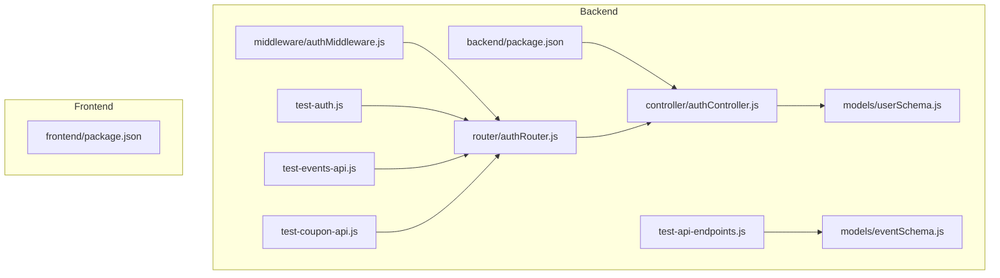
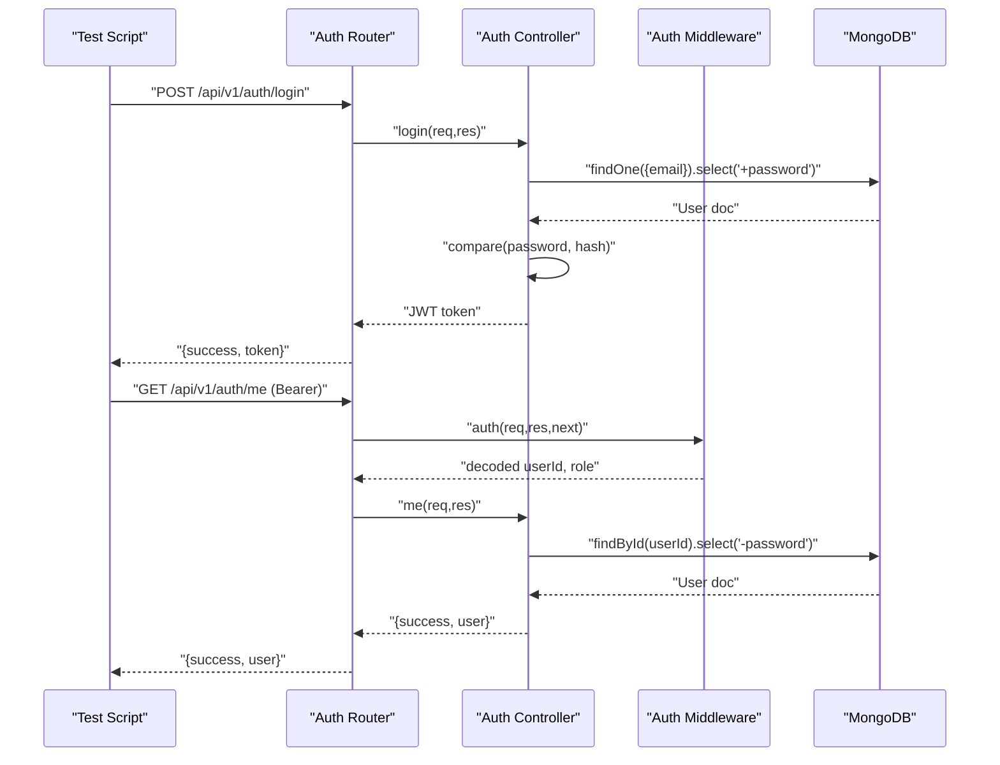
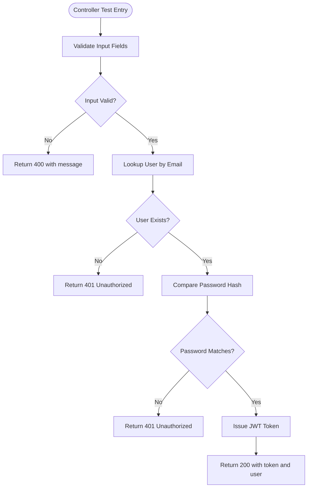
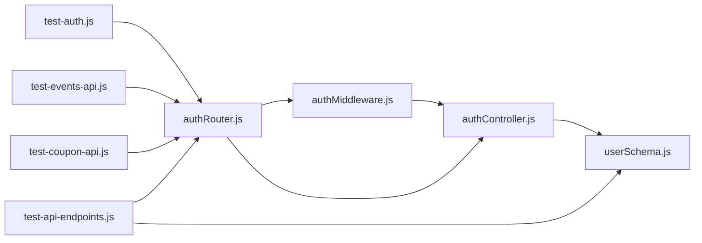

# Testing Strategies

<cite>
**Referenced Files in This Document**
- [backend/package.json](file://backend/package.json)
- [frontend/package.json](file://frontend/package.json)
- [backend/test-api-endpoints.js](file://backend/test-api-endpoints.js)
- [backend/test-auth.js](file://backend/test-auth.js)
- [backend/test-booking.js](file://backend/test-booking.js)
- [backend/test-events-api.js](file://backend/test-events-api.js)
- [backend/test-coupon-api.js](file://backend/test-coupon-api.js)
- [backend/controller/authController.js](file://backend/controller/authController.js)
- [backend/middleware/authMiddleware.js](file://backend/middleware/authMiddleware.js)
- [backend/models/userSchema.js](file://backend/models/userSchema.js)
- [backend/models/eventSchema.js](file://backend/models/eventSchema.js)
- [backend/router/authRouter.js](file://backend/router/authRouter.js)
</cite>

## Table of Contents
1. [Introduction](#introduction)
2. [Project Structure](#project-structure)
3. [Core Components](#core-components)
4. [Architecture Overview](#architecture-overview)
5. [Detailed Component Analysis](#detailed-component-analysis)
6. [Dependency Analysis](#dependency-analysis)
7. [Performance Considerations](#performance-considerations)
8. [Troubleshooting Guide](#troubleshooting-guide)
9. [Conclusion](#conclusion)
10. [Appendices](#appendices)

## Introduction
This document defines a comprehensive testing strategy for the MERN Stack Event Management Platform. It covers unit testing approaches for backend controllers and models, integration testing methods for API endpoints, and frontend testing strategies for React components. It also documents testing script execution, test data management, automated testing workflows, best practices, mocking strategies, coverage requirements, and debugging procedures. The guidance includes practical steps for running individual tests, batch test suites, and debugging failures, with a focus on authentication, booking workflows, event management, and user interactions.

## Project Structure
The repository is organized into two primary areas:
- Backend: Express-based server with controllers, models, routers, middleware, and test scripts.
- Frontend: React application with components, pages, context providers, and utilities.

Key testing-related artifacts:
- Backend test scripts under the repository root (e.g., test-auth.js, test-events-api.js, test-coupon-api.js, test-api-endpoints.js).
- Backend package.json defines development dependencies and scripts.
- Frontend package.json defines development dependencies and scripts.

**Diagram sources**
- [backend/controller/authController.js:1-120](file://backend/controller/authController.js#L1-L120)
- [backend/middleware/authMiddleware.js:1-17](file://backend/middleware/authMiddleware.js#L1-L17)
- [backend/models/userSchema.js:1-55](file://backend/models/userSchema.js#L1-L55)
- [backend/models/eventSchema.js:1-23](file://backend/models/eventSchema.js#L1-L23)
- [backend/router/authRouter.js:1-12](file://backend/router/authRouter.js#L1-L12)
- [backend/test-auth.js:1-59](file://backend/test-auth.js#L1-L59)
- [backend/test-events-api.js:1-55](file://backend/test-events-api.js#L1-L55)
- [backend/test-coupon-api.js:1-70](file://backend/test-coupon-api.js#L1-L70)
- [backend/test-api-endpoints.js:1-107](file://backend/test-api-endpoints.js#L1-L107)
- [backend/package.json:1-30](file://backend/package.json#L1-L30)
- [frontend/package.json:1-37](file://frontend/package.json#L1-L37)

**Section sources**
- [backend/package.json:1-30](file://backend/package.json#L1-L30)
- [frontend/package.json:1-37](file://frontend/package.json#L1-L37)

## Core Components
This section outlines the core components relevant to testing:
- Authentication controller and middleware: responsible for JWT-based authentication and protected routes.
- User and Event models: define data structures validated by tests.
- Auth router: exposes endpoints for registration, login, and profile retrieval.
- Test scripts: demonstrate integration-style tests against live endpoints and database operations.

Key responsibilities for testing:
- Unit tests for controllers: validate input handling, error responses, and JWT generation.
- Model tests: validate schema constraints and field validations.
- Integration tests: validate end-to-end flows using test scripts and mocked tokens.
- Frontend tests: validate React components, context providers, and API interactions.

**Section sources**
- [backend/controller/authController.js:1-120](file://backend/controller/authController.js#L1-L120)
- [backend/middleware/authMiddleware.js:1-17](file://backend/middleware/authMiddleware.js#L1-L17)
- [backend/models/userSchema.js:1-55](file://backend/models/userSchema.js#L1-L55)
- [backend/models/eventSchema.js:1-23](file://backend/models/eventSchema.js#L1-L23)
- [backend/router/authRouter.js:1-12](file://backend/router/authRouter.js#L1-L12)

## Architecture Overview
The testing architecture leverages:
- Backend test scripts for integration-style verification of endpoints and data persistence.
- Controllers and middleware for unit testing focused on logic and error handling.
- Models for validation testing and schema compliance checks.
- Frontend testing via React testing libraries and component-level assertions.

**Diagram sources**
- [backend/router/authRouter.js:1-12](file://backend/router/authRouter.js#L1-L12)
- [backend/controller/authController.js:54-119](file://backend/controller/authController.js#L54-L119)
- [backend/middleware/authMiddleware.js:3-16](file://backend/middleware/authMiddleware.js#L3-L16)

## Detailed Component Analysis

### Authentication Controller Testing
Unit testing approach:
- Mock JWT secret and bcrypt hashing to isolate controller logic.
- Test input validation paths (missing fields, invalid email/password).
- Test user lookup and password comparison outcomes.
- Verify token issuance and response shape.

Integration testing approach:
- Use test-auth.js to validate end-to-end login and protected route access.
- Validate bearer token propagation and protected endpoint responses.

Best practices:
- Separate concerns: keep controller tests independent of middleware.
- Use deterministic JWT tokens for predictable assertions.
- Assert HTTP status codes and response payload structure.

**Diagram sources**
- [backend/controller/authController.js:11-107](file://backend/controller/authController.js#L11-L107)

**Section sources**
- [backend/controller/authController.js:1-120](file://backend/controller/authController.js#L1-L120)
- [backend/test-auth.js:1-59](file://backend/test-auth.js#L1-L59)

### Authentication Middleware Testing
Unit testing approach:
- Validate token extraction from Authorization header.
- Test JWT verification failure and missing token scenarios.
- Ensure req.user is populated on success.

Integration testing approach:
- Use test-auth.js to validate protected route access with a valid token.

Best practices:
- Mock jwt.verify to simulate success/failure conditions.
- Assert 401 responses for malformed or missing tokens.

**Section sources**
- [backend/middleware/authMiddleware.js:1-17](file://backend/middleware/authMiddleware.js#L1-L17)
- [backend/test-auth.js:1-59](file://backend/test-auth.js#L1-L59)

### User Model Testing
Unit testing approach:
- Validate schema constraints: required fields, unique email, enum roles, password length.
- Test model creation and field defaults.

Integration testing approach:
- Use test-booking.js to verify user presence and roles in the database.

Best practices:
- Seed test users for integration tests.
- Assert schema-level validation errors for invalid inputs.

**Section sources**
- [backend/models/userSchema.js:1-55](file://backend/models/userSchema.js#L1-L55)
- [backend/test-booking.js:1-44](file://backend/test-booking.js#L1-L44)

### Event Model Testing
Unit testing approach:
- Validate schema fields: title, description, category, price, rating bounds, images array, createdBy reference.
- Test model creation and default timestamps.

Integration testing approach:
- Use test-api-endpoints.js to create and verify events in the database.

Best practices:
- Use realistic ticket types and totals for ticketed events.
- Assert event fields and references after creation.

**Section sources**
- [backend/models/eventSchema.js:1-23](file://backend/models/eventSchema.js#L1-L23)
- [backend/test-api-endpoints.js:1-107](file://backend/test-api-endpoints.js#L1-L107)

### API Endpoint Testing Strategies
Integration testing approach:
- Use test-events-api.js to validate GET /events responses and event attributes.
- Use test-coupon-api.js to validate coupon availability, validation, and application flows.
- Use test-auth.js to validate login and protected resource access.

Best practices:
- Centralize base URLs and headers in constants.
- Validate response shapes and status codes.
- Use pre-seeded test data and clean up after tests.

**Section sources**
- [backend/test-events-api.js:1-55](file://backend/test-events-api.js#L1-L55)
- [backend/test-coupon-api.js:1-70](file://backend/test-coupon-api.js#L1-L70)
- [backend/test-auth.js:1-59](file://backend/test-auth.js#L1-L59)

### Frontend Testing Strategies
Recommended approach:
- Use React Testing Library for component tests focusing on user interactions, context consumption, and API calls.
- Mock Axios for network requests to isolate component logic.
- Test context providers (AuthProvider, AuthContext) for state updates and side effects.
- Validate routing guards (PrivateRoute, RoleRoute) behavior with mocked auth state.

Best practices:
- Keep tests fast by avoiding real network calls.
- Snapshot test stable UI where appropriate.
- Focus on user-centric assertions rather than implementation details.

[No sources needed since this section provides general guidance]

### Test Data Management
Current patterns:
- Test scripts connect to MongoDB and perform CRUD operations for validation.
- Some scripts rely on seeded users and events; others create temporary records and clean up.

Recommendations:
- Maintain a dedicated test database or collection prefix for isolation.
- Use factories or builders to generate consistent test fixtures.
- Implement deterministic seeding and cleanup routines.

**Section sources**
- [backend/test-api-endpoints.js:1-107](file://backend/test-api-endpoints.js#L1-L107)
- [backend/test-booking.js:1-44](file://backend/test-booking.js#L1-L44)

### Automated Testing Workflows
Current scripts:
- Backend test scripts are executed individually from the repository root.
- Frontend package.json does not define test scripts; testing is not configured in the frontend package.

Recommendations:
- Add test scripts to frontend package.json (e.g., test, test:watch).
- Integrate backend test scripts into CI with environment variables for database and JWT secrets.
- Use separate environments for local and CI runs.

**Section sources**
- [backend/package.json:7-10](file://backend/package.json#L7-L10)
- [frontend/package.json:6-11](file://frontend/package.json#L6-L11)

### Mocking Strategies
Recommended patterns:
- Backend:
  - Mock bcrypt.hash and compare for controller tests.
  - Mock jwt.verify to simulate token validation outcomes.
  - Stub mongoose operations (find, create, delete) for model and controller tests.
- Frontend:
  - Mock Axios interceptors and endpoints.
  - Use React Testing Library’s renderWithProviders for context-dependent components.

[No sources needed since this section provides general guidance]

### Test Coverage Requirements
Recommended targets:
- Controllers: >= 90% branch and function coverage.
- Models: Schema validation covered by unit tests.
- Integration: End-to-end flows for auth, booking, and coupon APIs.
- Frontend: Components and context providers covered by unit tests.

[No sources needed since this section provides general guidance]

## Dependency Analysis
Testing dependencies and relationships:
- Auth controller depends on User model and JWT/bcrypt utilities.
- Auth router depends on auth middleware and exports controller methods.
- Test scripts depend on Express routes and MongoDB connectivity.

**Diagram sources**
- [backend/controller/authController.js:1-120](file://backend/controller/authController.js#L1-L120)
- [backend/middleware/authMiddleware.js:1-17](file://backend/middleware/authMiddleware.js#L1-L17)
- [backend/models/userSchema.js:1-55](file://backend/models/userSchema.js#L1-L55)
- [backend/router/authRouter.js:1-12](file://backend/router/authRouter.js#L1-L12)
- [backend/test-auth.js:1-59](file://backend/test-auth.js#L1-L59)
- [backend/test-events-api.js:1-55](file://backend/test-events-api.js#L1-L55)
- [backend/test-coupon-api.js:1-70](file://backend/test-coupon-api.js#L1-L70)
- [backend/test-api-endpoints.js:1-107](file://backend/test-api-endpoints.js#L1-L107)

**Section sources**
- [backend/controller/authController.js:1-120](file://backend/controller/authController.js#L1-L120)
- [backend/middleware/authMiddleware.js:1-17](file://backend/middleware/authMiddleware.js#L1-L17)
- [backend/router/authRouter.js:1-12](file://backend/router/authRouter.js#L1-L12)
- [backend/test-auth.js:1-59](file://backend/test-auth.js#L1-L59)
- [backend/test-events-api.js:1-55](file://backend/test-events-api.js#L1-L55)
- [backend/test-coupon-api.js:1-70](file://backend/test-coupon-api.js#L1-L70)
- [backend/test-api-endpoints.js:1-107](file://backend/test-api-endpoints.js#L1-L107)

## Performance Considerations
- Prefer unit tests over integration tests for speed; use mocks to avoid database/network overhead.
- Batch database operations in integration tests and minimize round trips.
- Use connection pooling and short-lived connections for test databases.
- Avoid heavy computations in tests; cache expensive fixtures.

[No sources needed since this section provides general guidance]

## Troubleshooting Guide
Common issues and resolutions:
- Authentication failures:
  - Verify JWT secret and token validity in tests.
  - Ensure Authorization header format matches expectations.
- Database connectivity:
  - Confirm MONGO_URI and environment configuration.
  - Check that test users and events exist before running integration tests.
- API response mismatches:
  - Validate request payloads and headers.
  - Assert response shapes and status codes explicitly.

**Section sources**
- [backend/test-auth.js:1-59](file://backend/test-auth.js#L1-L59)
- [backend/test-events-api.js:1-55](file://backend/test-events-api.js#L1-L55)
- [backend/test-coupon-api.js:1-70](file://backend/test-coupon-api.js#L1-L70)
- [backend/test-api-endpoints.js:1-107](file://backend/test-api-endpoints.js#L1-L107)

## Conclusion
The platform currently relies on lightweight integration-style scripts for backend validation and lacks formal unit and frontend testing frameworks. To mature the testing strategy:
- Add unit tests for controllers and models with mocking.
- Implement frontend tests with React Testing Library and Axios mocks.
- Standardize test scripts and integrate them into CI with isolated test databases.
- Define coverage targets and enforce them in pull requests.

[No sources needed since this section summarizes without analyzing specific files]

## Appendices

### Running Individual Tests and Suites
- Backend:
  - Run a single test script from the backend root (e.g., node test-auth.js).
  - Ensure environment variables are loaded and MongoDB is reachable.
- Frontend:
  - Add test scripts to frontend package.json and run via npm/yarn.
  - Configure Vite for testing if needed.

**Section sources**
- [backend/test-auth.js:1-59](file://backend/test-auth.js#L1-L59)
- [backend/package.json:7-10](file://backend/package.json#L7-L10)
- [frontend/package.json:6-11](file://frontend/package.json#L6-L11)

### Writing Effective Tests for Key Workflows
- Authentication:
  - Test registration with valid/invalid inputs and duplicate emails.
  - Test login with correct/incorrect credentials and missing fields.
  - Test protected route access with valid/invalid tokens.
- Booking:
  - Validate event existence and ticket availability.
  - Test booking creation with proper user permissions.
- Event Management:
  - Validate event creation, updates, and deletions.
  - Assert schema constraints and defaults.
- User Interactions:
  - Test coupon application and validation flows.
  - Validate API pagination and filtering.

[No sources needed since this section provides general guidance]