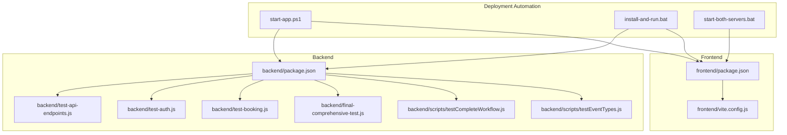
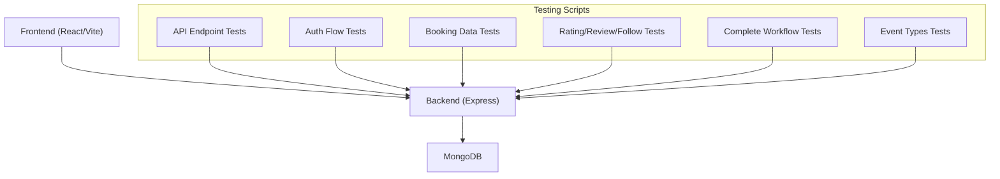
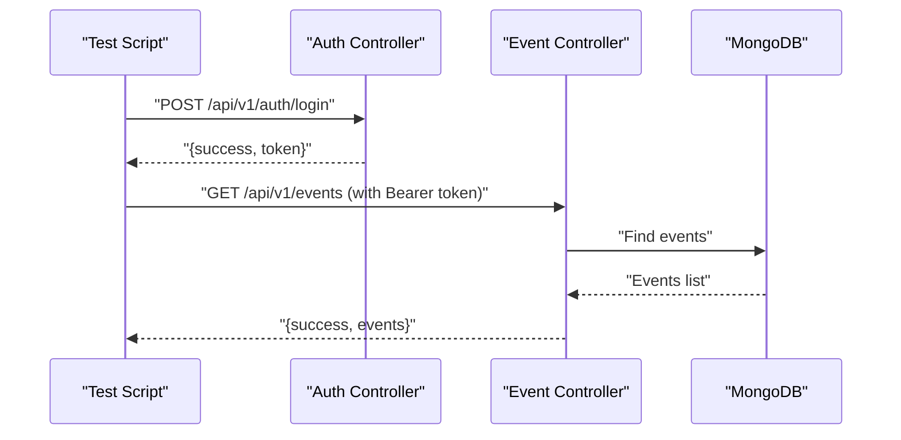
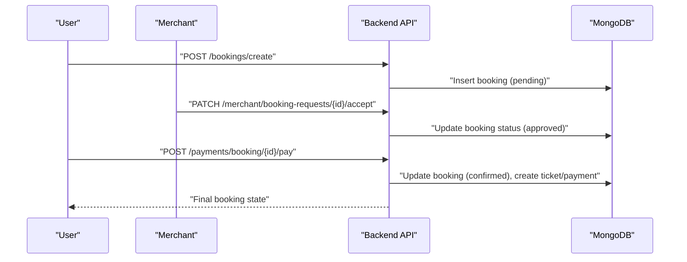
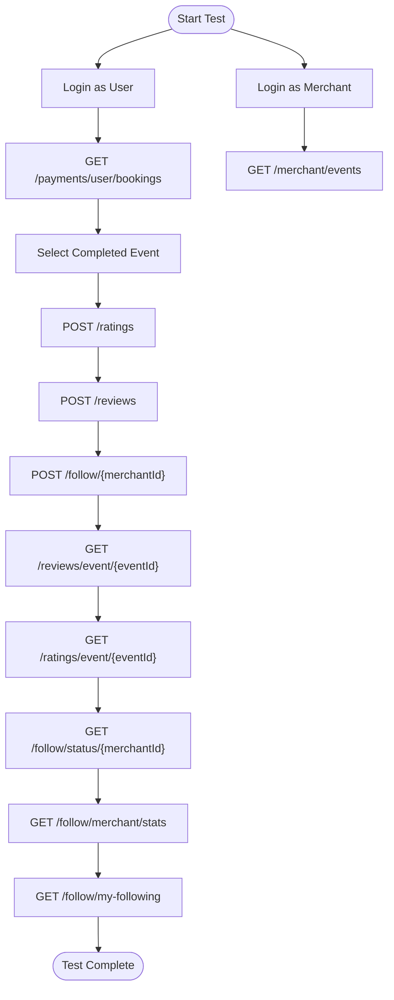
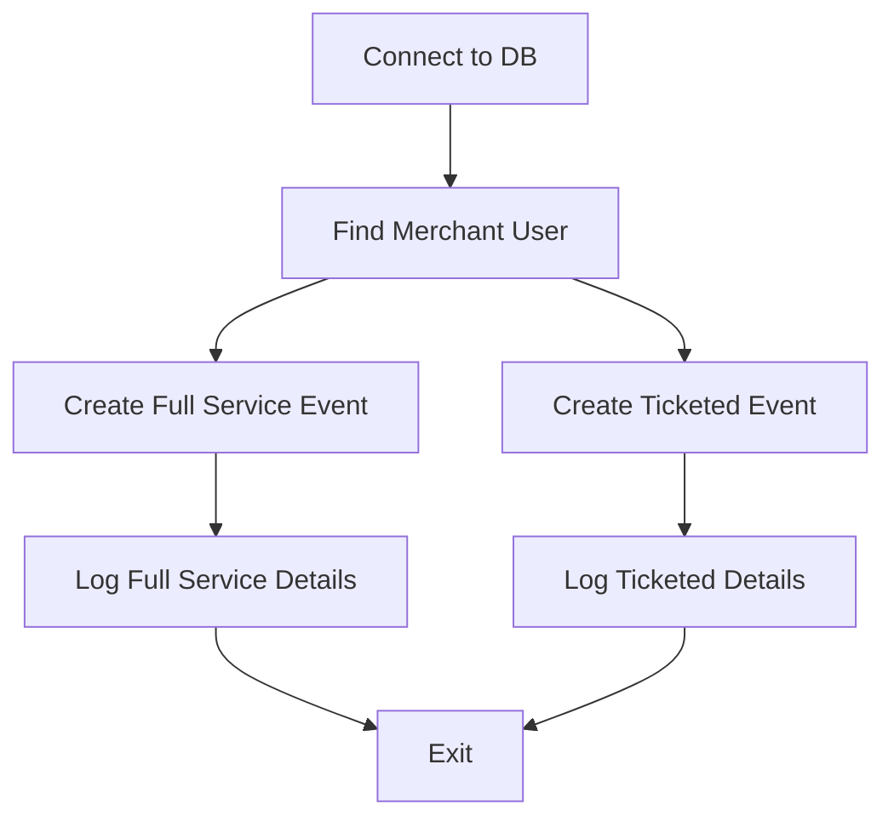
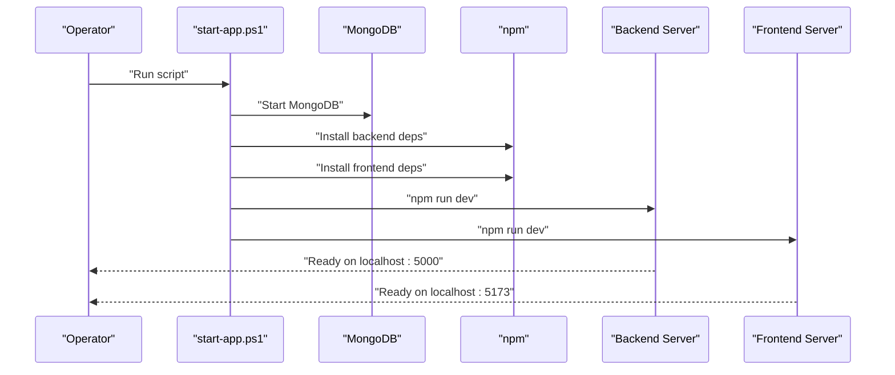
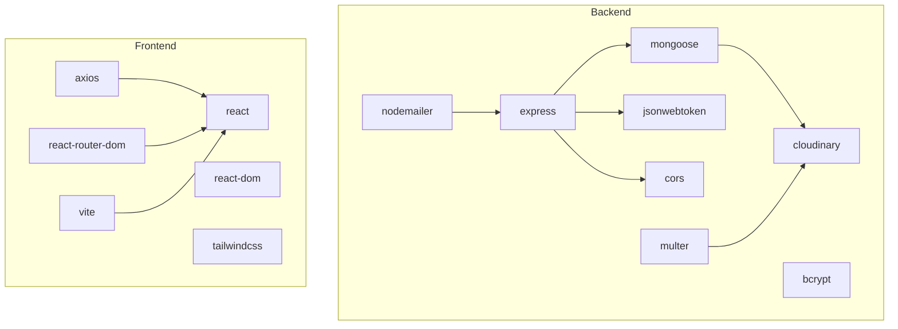

# Testing and Deployment

<cite>
**Referenced Files in This Document**
- [backend/package.json](file://backend/package.json)
- [frontend/package.json](file://frontend/package.json)
- [backend/test-api-endpoints.js](file://backend/test-api-endpoints.js)
- [backend/test-auth.js](file://backend/test-auth.js)
- [backend/test-booking.js](file://backend/test-booking.js)
- [backend/final-comprehensive-test.js](file://backend/final-comprehensive-test.js)
- [backend/scripts/testCompleteWorkflow.js](file://backend/scripts/testCompleteWorkflow.js)
- [backend/scripts/testEventTypes.js](file://backend/scripts/testEventTypes.js)
- [start-app.ps1](file://start-app.ps1)
- [install-and-run.bat](file://install-and-run.bat)
- [start-both-servers.bat](file://start-both-servers.bat)
- [frontend/vite.config.js](file://frontend/vite.config.js)
</cite>

## Table of Contents
1. [Introduction](#introduction)
2. [Project Structure](#project-structure)
3. [Core Components](#core-components)
4. [Architecture Overview](#architecture-overview)
5. [Detailed Component Analysis](#detailed-component-analysis)
6. [Dependency Analysis](#dependency-analysis)
7. [Performance Considerations](#performance-considerations)
8. [Troubleshooting Guide](#troubleshooting-guide)
9. [Conclusion](#conclusion)
10. [Appendices](#appendices)

## Introduction
This document provides comprehensive testing and deployment guidance for the MERN Stack Event Management Platform. It covers unit testing approaches, integration testing methods, API testing procedures, and frontend testing strategies. It also documents deployment strategies, environment configuration, build optimization, production deployment considerations, testing scripts, continuous integration setup, and quality assurance processes. Finally, it outlines deployment automation, monitoring setup, and maintenance procedures.

## Project Structure
The project follows a classic MERN stack layout:
- Backend: Node.js/Express with MongoDB, organized into controllers, routers, models, middleware, services, and utility modules.
- Frontend: React application configured with Vite and Tailwind CSS.
- Scripts and tests: Dedicated Node.js scripts under backend for targeted API and workflow testing.

**Diagram sources**
- [backend/package.json:1-30](file://backend/package.json#L1-L30)
- [frontend/package.json:1-37](file://frontend/package.json#L1-L37)
- [backend/test-api-endpoints.js:1-107](file://backend/test-api-endpoints.js#L1-L107)
- [backend/test-auth.js:1-59](file://backend/test-auth.js#L1-L59)
- [backend/test-booking.js:1-44](file://backend/test-booking.js#L1-L44)
- [backend/final-comprehensive-test.js:1-219](file://backend/final-comprehensive-test.js#L1-L219)
- [backend/scripts/testCompleteWorkflow.js:1-170](file://backend/scripts/testCompleteWorkflow.js#L1-L170)
- [backend/scripts/testEventTypes.js:1-115](file://backend/scripts/testEventTypes.js#L1-L115)
- [start-app.ps1:1-119](file://start-app.ps1#L1-L119)
- [install-and-run.bat:1-123](file://install-and-run.bat#L1-L123)
- [start-both-servers.bat:1-23](file://start-both-servers.bat#L1-L23)
- [frontend/vite.config.js:1-12](file://frontend/vite.config.js#L1-L12)

**Section sources**
- [backend/package.json:1-30](file://backend/package.json#L1-L30)
- [frontend/package.json:1-37](file://frontend/package.json#L1-L37)
- [start-app.ps1:1-119](file://start-app.ps1#L1-L119)
- [install-and-run.bat:1-123](file://install-and-run.bat#L1-L123)
- [start-both-servers.bat:1-23](file://start-both-servers.bat#L1-L23)
- [frontend/vite.config.js:1-12](file://frontend/vite.config.js#L1-L12)

## Core Components
- Backend testing scripts:
  - API endpoint validation and model persistence checks.
  - Authentication flow and protected route access tests.
  - Booking system data exploration and state verification.
  - Comprehensive rating, review, and follow system validation.
  - Complete booking workflow end-to-end validation.
  - Event type-specific schema and data creation tests.
- Frontend testing and development:
  - Vite configuration for local development server and port exposure.
  - React-based UI testing strategies (see Detailed Component Analysis).
- Deployment automation:
  - PowerShell and batch scripts to orchestrate environment setup, dependency installation, and server startup.

Key testing scripts and their purposes:
- [backend/test-api-endpoints.js:1-107](file://backend/test-api-endpoints.js#L1-L107): Validates event creation API and database persistence.
- [backend/test-auth.js:1-59](file://backend/test-auth.js#L1-L59): Exercises login and protected resource access.
- [backend/test-booking.js:1-44](file://backend/test-booking.js#L1-L44): Inspects user, event, and booking collections.
- [backend/final-comprehensive-test.js:1-219](file://backend/final-comprehensive-test.js#L1-L219): End-to-end validation of rating, review, and follow systems.
- [backend/scripts/testCompleteWorkflow.js:1-170](file://backend/scripts/testCompleteWorkflow.js#L1-L170): Full booking lifecycle from creation to confirmation.
- [backend/scripts/testEventTypes.js:1-115](file://backend/scripts/testEventTypes.js#L1-L115): Event type schema validation and data seeding.

**Section sources**
- [backend/test-api-endpoints.js:1-107](file://backend/test-api-endpoints.js#L1-L107)
- [backend/test-auth.js:1-59](file://backend/test-auth.js#L1-L59)
- [backend/test-booking.js:1-44](file://backend/test-booking.js#L1-L44)
- [backend/final-comprehensive-test.js:1-219](file://backend/final-comprehensive-test.js#L1-L219)
- [backend/scripts/testCompleteWorkflow.js:1-170](file://backend/scripts/testCompleteWorkflow.js#L1-L170)
- [backend/scripts/testEventTypes.js:1-115](file://backend/scripts/testEventTypes.js#L1-L115)

## Architecture Overview
The platform comprises:
- Frontend (React/Vite) serving the UI and interacting with backend APIs.
- Backend (Node/Express) exposing REST endpoints, enforcing authentication/authorization, and managing data via Mongoose.
- MongoDB for persistence.
- Scripts orchestrating local environment setup and API testing.

**Diagram sources**
- [frontend/vite.config.js:1-12](file://frontend/vite.config.js#L1-L12)
- [backend/test-api-endpoints.js:1-107](file://backend/test-api-endpoints.js#L1-L107)
- [backend/test-auth.js:1-59](file://backend/test-auth.js#L1-L59)
- [backend/test-booking.js:1-44](file://backend/test-booking.js#L1-L44)
- [backend/final-comprehensive-test.js:1-219](file://backend/final-comprehensive-test.js#L1-L219)
- [backend/scripts/testCompleteWorkflow.js:1-170](file://backend/scripts/testCompleteWorkflow.js#L1-L170)
- [backend/scripts/testEventTypes.js:1-115](file://backend/scripts/testEventTypes.js#L1-L115)

## Detailed Component Analysis

### Backend API Testing Strategies
- Unit-level validation:
  - Use dedicated scripts to connect to the database and validate model creation and persistence.
  - Example: [backend/test-api-endpoints.js:1-107](file://backend/test-api-endpoints.js#L1-L107) validates event creation and verifies database records.
- Integration-level validation:
  - Exercise authentication and protected routes to ensure middleware enforcement.
  - Example: [backend/test-auth.js:1-59](file://backend/test-auth.js#L1-L59) performs login and accesses protected endpoints.
- Data exploration:
  - Inspect collections for users, events, and bookings to confirm data availability and structure.
  - Example: [backend/test-booking.js:1-44](file://backend/test-booking.js#L1-L44).

**Diagram sources**
- [backend/test-auth.js:1-59](file://backend/test-auth.js#L1-L59)

**Section sources**
- [backend/test-api-endpoints.js:1-107](file://backend/test-api-endpoints.js#L1-L107)
- [backend/test-auth.js:1-59](file://backend/test-auth.js#L1-L59)
- [backend/test-booking.js:1-44](file://backend/test-booking.js#L1-L44)

### End-to-End Booking Workflow Testing
- Objective: Validate the complete lifecycle: book → accept → pay → confirm.
- Approach: Compose sequential HTTP requests simulating user and merchant roles.
- Key steps:
  - Login as user and merchant.
  - Retrieve an event for booking.
  - Create a booking request.
  - Merchant accepts the booking.
  - User processes payment.
  - Verify final booking state.

**Diagram sources**
- [backend/scripts/testCompleteWorkflow.js:1-170](file://backend/scripts/testCompleteWorkflow.js#L1-L170)

**Section sources**
- [backend/scripts/testCompleteWorkflow.js:1-170](file://backend/scripts/testCompleteWorkflow.js#L1-L170)

### Rating, Review, and Follow System Testing
- Objective: Validate CRUD operations and retrieval endpoints for ratings, reviews, and follow relationships.
- Approach: Authenticate as user and merchant, select a completed booking, and exercise endpoints for rating, reviewing, following, and retrieving related data.

**Diagram sources**
- [backend/final-comprehensive-test.js:1-219](file://backend/final-comprehensive-test.js#L1-L219)

**Section sources**
- [backend/final-comprehensive-test.js:1-219](file://backend/final-comprehensive-test.js#L1-L219)

### Event Types Schema Validation
- Objective: Ensure schema differences between full-service and ticketed events are correctly handled.
- Approach: Create and persist both event types and log structural differences.

**Diagram sources**
- [backend/scripts/testEventTypes.js:1-115](file://backend/scripts/testEventTypes.js#L1-L115)

**Section sources**
- [backend/scripts/testEventTypes.js:1-115](file://backend/scripts/testEventTypes.js#L1-L115)

### Frontend Testing Strategies
- Local development:
  - Vite runs on port 5173 and exposes the host for network access.
  - Reference: [frontend/vite.config.js:1-12](file://frontend/vite.config.js#L1-L12).
- UI testing approaches:
  - Manual smoke tests on key pages (login, register, browse events, dashboard).
  - Component-level tests using React Testing Library or Jest with React Testing Library for isolated component units.
  - End-to-end tests using Playwright or Cypress targeting real backend endpoints.
- Environment configuration:
  - Ensure environment variables are loaded consistently for both backend and frontend during testing.
  - Use .env files and CI secrets for credentials and service URLs.

**Section sources**
- [frontend/vite.config.js:1-12](file://frontend/vite.config.js#L1-L12)

### Deployment Automation and Environment Setup
- PowerShell automation:
  - Orchestrates MongoDB startup, dependency installation, and server launches.
  - References: [start-app.ps1:1-119](file://start-app.ps1#L1-L119).
- Batch automation:
  - Installs dependencies and starts backend/frontend servers.
  - References: [install-and-run.bat:1-123](file://install-and-run.bat#L1-L123).
- Dual-server startup:
  - Starts backend on port 5000 and frontend on port 5173.
  - References: [start-both-servers.bat:1-23](file://start-both-servers.bat#L1-L23).

**Diagram sources**
- [start-app.ps1:1-119](file://start-app.ps1#L1-L119)

**Section sources**
- [start-app.ps1:1-119](file://start-app.ps1#L1-L119)
- [install-and-run.bat:1-123](file://install-and-run.bat#L1-L123)
- [start-both-servers.bat:1-23](file://start-both-servers.bat#L1-L23)

## Dependency Analysis
- Backend dependencies include Express, Mongoose, bcrypt, JWT, Multer, Cloudinary, Nodemailer, and CORS.
- Frontend dependencies include React, React Router, Axios, Tailwind CSS, and Vite toolchain.
- Scripts rely on Node.js modules and external services (MongoDB, Cloudinary).

**Diagram sources**
- [backend/package.json:13-28](file://backend/package.json#L13-L28)
- [frontend/package.json:12-35](file://frontend/package.json#L12-L35)

**Section sources**
- [backend/package.json:1-30](file://backend/package.json#L1-L30)
- [frontend/package.json:1-37](file://frontend/package.json#L1-L37)

## Performance Considerations
- Database indexing:
  - Add indexes on frequently queried fields (e.g., user email, event category, booking status).
- API pagination:
  - Implement pagination for listing endpoints to reduce payload sizes.
- Caching:
  - Use Redis for caching static event lists and user sessions.
- CDN:
  - Serve images via Cloudinary or CDN to reduce origin load.
- Build optimization:
  - Enable minification and tree-shaking in Vite for production builds.
  - Split vendor and application bundles.

## Troubleshooting Guide
- MongoDB connectivity:
  - Ensure MongoDB is running locally or Atlas is reachable; scripts handle local startup and dependency installation.
  - References: [start-app.ps1:22-76](file://start-app.ps1#L22-L76), [install-and-run.bat:74-99](file://install-and-run.bat#L74-L99).
- Port conflicts:
  - The dual-server script kills processes on port 5173 before starting the frontend.
  - Reference: [start-both-servers.bat:11-15](file://start-both-servers.bat#L11-L15).
- CORS issues:
  - Validate CORS configuration in backend middleware and ensure frontend origin matches.
  - Reference: [backend/test-auth.js:1-59](file://backend/test-auth.js#L1-L59) for endpoint validation.
- Authentication failures:
  - Confirm environment variables and JWT secret configuration.
  - Reference: [backend/test-auth.js:1-59](file://backend/test-auth.js#L1-L59).

**Section sources**
- [start-app.ps1:22-76](file://start-app.ps1#L22-L76)
- [install-and-run.bat:74-99](file://install-and-run.bat#L74-L99)
- [start-both-servers.bat:11-15](file://start-both-servers.bat#L11-L15)
- [backend/test-auth.js:1-59](file://backend/test-auth.js#L1-L59)

## Conclusion
The MERN Event Management Platform includes robust backend testing scripts covering API validation, authentication, booking workflows, and system-wide rating/review/follow features. Deployment automation simplifies environment setup and server orchestration. To enhance reliability for production, integrate automated unit and E2E tests, establish CI/CD pipelines, implement monitoring and alerting, and apply performance optimizations.

## Appendices

### Testing Scripts Inventory
- API endpoint tests: [backend/test-api-endpoints.js:1-107](file://backend/test-api-endpoints.js#L1-L107)
- Authentication tests: [backend/test-auth.js:1-59](file://backend/test-auth.js#L1-L59)
- Booking data inspection: [backend/test-booking.js:1-44](file://backend/test-booking.js#L1-L44)
- Comprehensive rating/review/follow tests: [backend/final-comprehensive-test.js:1-219](file://backend/final-comprehensive-test.js#L1-L219)
- Complete booking workflow: [backend/scripts/testCompleteWorkflow.js:1-170](file://backend/scripts/testCompleteWorkflow.js#L1-L170)
- Event types validation: [backend/scripts/testEventTypes.js:1-115](file://backend/scripts/testEventTypes.js#L1-L115)

### Continuous Integration Setup (Recommended)
- CI triggers: On pull requests and pushes to main branch.
- Jobs:
  - Linting: ESLint for frontend and backend.
  - Unit tests: Jest/React Testing Library for frontend; Node-based tests for backend.
  - Integration tests: Run against a test database container.
  - E2E tests: Playwright/Cypress against a staging backend.
  - Security scans: Snyk/Bandit for dependencies.
- Artifacts: Upload coverage reports and test logs.

### Production Deployment Considerations
- Containerization:
  - Dockerize backend and frontend; orchestrate with Docker Compose.
- Secrets management:
  - Store environment variables in a secrets manager.
- Health checks:
  - Implement readiness/liveness probes for backend and frontend.
- Monitoring:
  - Use Prometheus/Grafana for metrics and ELK stack for logs.
- Rollback strategy:
  - Maintain tagged releases and blue/green deployments.