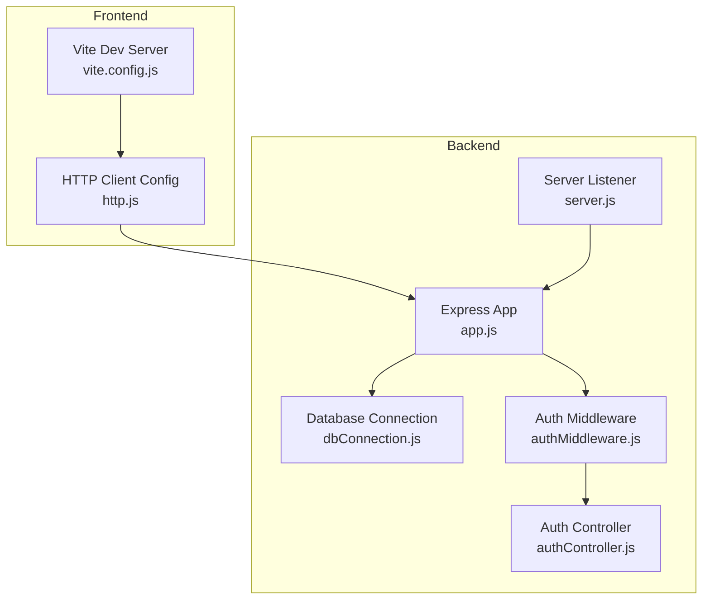
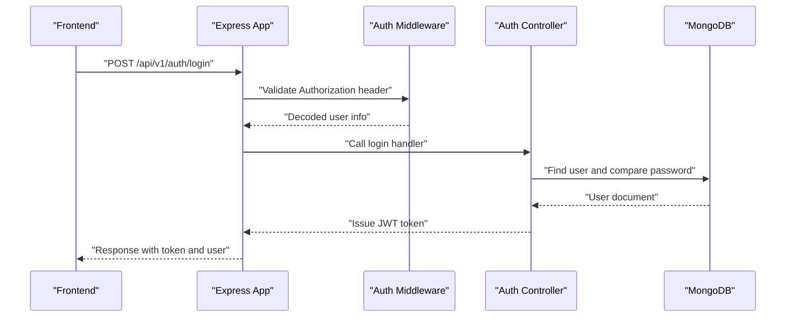
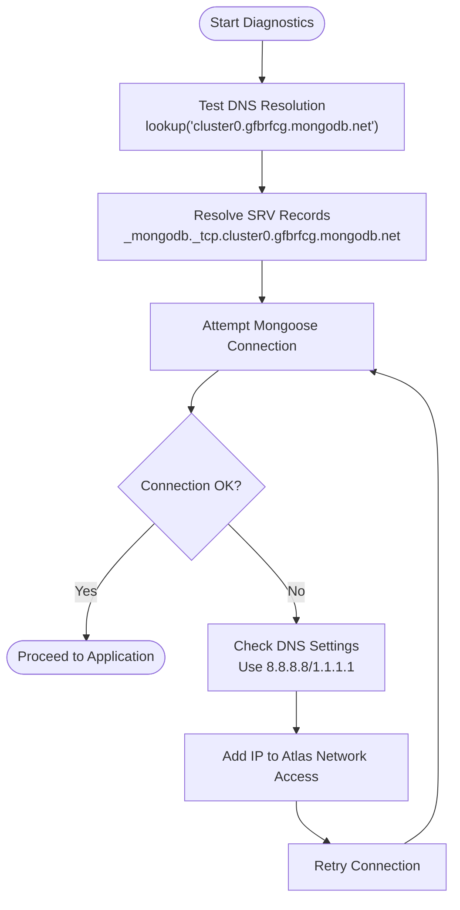
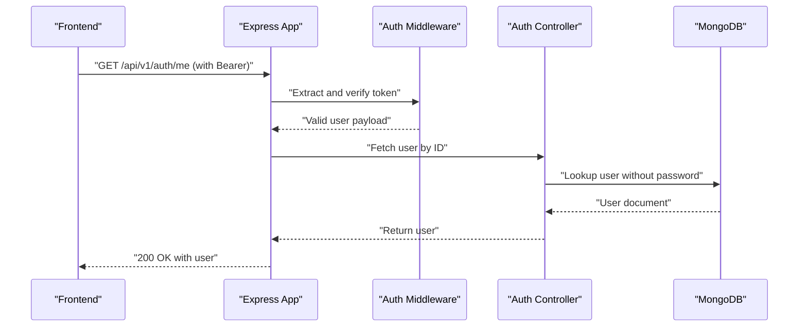
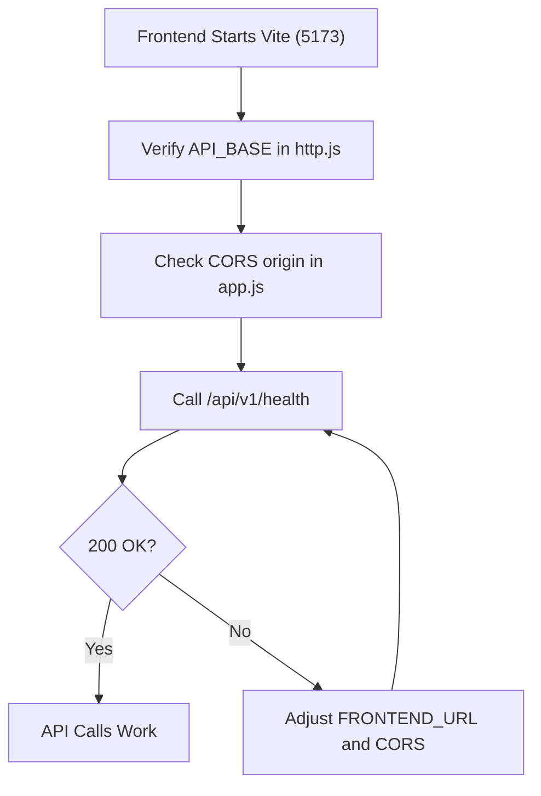
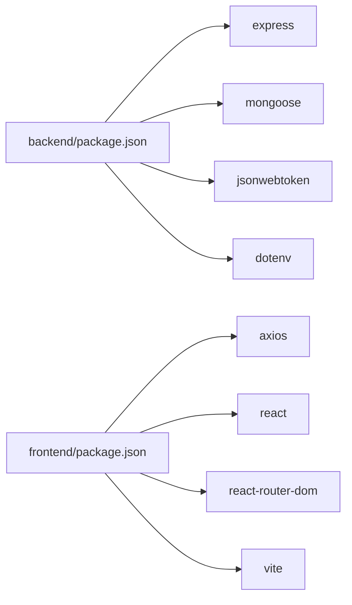

# Troubleshooting and FAQ

<cite>
**Referenced Files in This Document**
- [dbConnection.js](file://backend/database/dbConnection.js)
- [app.js](file://backend/app.js)
- [server.js](file://backend/server.js)
- [DATABASE_TROUBLESHOOTING.md](file://backend/DATABASE_TROUBLESHOOTING.md)
- [MONGODB_ATLAS_SETUP_GUIDE.md](file://backend/MONGODB_ATLAS_SETUP_GUIDE.md)
- [FIX_MONGODB_ATLAS_IP.md](file://backend/FIX_MONGODB_ATLAS_IP.md)
- [LOGIN_CREDENTIALS.md](file://backend/LOGIN_CREDENTIALS.md)
- [authMiddleware.js](file://backend/middleware/authMiddleware.js)
- [authController.js](file://backend/controller/authController.js)
- [http.js](file://frontend/src/lib/http.js)
- [vite.config.js](file://frontend/vite.config.js)
- [package.json](file://backend/package.json)
- [package.json](file://frontend/package.json)
- [test-db-connection.js](file://backend/test-db-connection.js)
</cite>

## Table of Contents
1. [Introduction](#introduction)
2. [Project Structure](#project-structure)
3. [Core Components](#core-components)
4. [Architecture Overview](#architecture-overview)
5. [Detailed Component Analysis](#detailed-component-analysis)
6. [Dependency Analysis](#dependency-analysis)
7. [Performance Considerations](#performance-considerations)
8. [Troubleshooting Guide](#troubleshooting-guide)
9. [FAQ](#faq)
10. [Conclusion](#conclusion)

## Introduction
This document provides comprehensive troubleshooting and FAQ guidance for the MERN Stack Event Management Platform. It focuses on diagnosing and resolving database connection issues, authentication problems, frontend port configuration, and API integration challenges. It also includes debugging procedures, error diagnosis strategies, and step-by-step resolution guides for typical development and production issues.

## Project Structure
The platform consists of:
- Backend: Express server, Mongoose database connection, routers, controllers, middleware, and utilities.
- Frontend: React SPA using Vite, with Axios-based HTTP client and routing.
- Shared concerns: Environment variables, CORS configuration, and health endpoints.

**Diagram sources**
- [app.js:1-91](file://backend/app.js#L1-L91)
- [server.js:1-6](file://backend/server.js#L1-L6)
- [dbConnection.js:1-112](file://backend/database/dbConnection.js#L1-L112)
- [authMiddleware.js:1-17](file://backend/middleware/authMiddleware.js#L1-L17)
- [authController.js:1-120](file://backend/controller/authController.js#L1-L120)
- [http.js:1-5](file://frontend/src/lib/http.js#L1-L5)
- [vite.config.js:1-12](file://frontend/vite.config.js#L1-L12)

**Section sources**
- [app.js:1-91](file://backend/app.js#L1-L91)
- [server.js:1-6](file://backend/server.js#L1-L6)
- [dbConnection.js:1-112](file://backend/database/dbConnection.js#L1-L112)
- [http.js:1-5](file://frontend/src/lib/http.js#L1-L5)
- [vite.config.js:1-12](file://frontend/vite.config.js#L1-L12)

## Core Components
- Database connection module with robust retry logic, DNS override, and multiple fallback strategies.
- Express application with CORS configuration, route registration, and health endpoints.
- Authentication middleware validating JWT tokens and protected routes.
- Authentication controller managing registration, login, and user info retrieval.
- Frontend HTTP client pointing to the backend API base URL and attaching bearer tokens.
- Vite configuration exposing the frontend on port 5173 with host binding.

Key implementation references:
- Database connection and DNS override: [dbConnection.js:1-112](file://backend/database/dbConnection.js#L1-L112)
- Application initialization and route registration: [app.js:1-91](file://backend/app.js#L1-L91)
- Server port configuration: [server.js:1-6](file://backend/server.js#L1-L6)
- Auth middleware token verification: [authMiddleware.js:1-17](file://backend/middleware/authMiddleware.js#L1-L17)
- Auth controller login flow: [authController.js:54-107](file://backend/controller/authController.js#L54-L107)
- Frontend API base URL and auth headers: [http.js:1-5](file://frontend/src/lib/http.js#L1-L5)
- Frontend dev server port: [vite.config.js:7-10](file://frontend/vite.config.js#L7-L10)

**Section sources**
- [dbConnection.js:1-112](file://backend/database/dbConnection.js#L1-L112)
- [app.js:1-91](file://backend/app.js#L1-L91)
- [server.js:1-6](file://backend/server.js#L1-L6)
- [authMiddleware.js:1-17](file://backend/middleware/authMiddleware.js#L1-L17)
- [authController.js:54-107](file://backend/controller/authController.js#L54-L107)
- [http.js:1-5](file://frontend/src/lib/http.js#L1-L5)
- [vite.config.js:7-10](file://frontend/vite.config.js#L7-L10)

## Architecture Overview
The system follows a classic MERN stack pattern with explicit separation of concerns:
- Frontend (React/Vite) communicates with the backend via HTTP requests.
- Backend (Express) exposes REST endpoints and manages database connectivity.
- Authentication relies on JWT tokens validated by middleware.
- Database connectivity is handled by Mongoose with multiple fallback strategies.

**Diagram sources**
- [authMiddleware.js:1-17](file://backend/middleware/authMiddleware.js#L1-L17)
- [authController.js:54-107](file://backend/controller/authController.js#L54-L107)
- [app.js:1-91](file://backend/app.js#L1-L91)

## Detailed Component Analysis

### Database Connectivity Troubleshooting
Common symptoms:
- DNS resolution failures for Atlas SRV records.
- Authentication errors due to incorrect credentials.
- Network access errors caused by IP not whitelisted.

Recommended diagnostics:
- Use the built-in diagnostic script to test DNS and connection.
- Review the enhanced connection module’s retry and fallback strategies.
- Validate Atlas network access and credentials.

**Diagram sources**
- [test-db-connection.js:12-46](file://backend/test-db-connection.js#L12-L46)
- [dbConnection.js:19-94](file://backend/database/dbConnection.js#L19-L94)

**Section sources**
- [DATABASE_TROUBLESHOOTING.md:1-137](file://backend/DATABASE_TROUBLESHOOTING.md#L1-L137)
- [MONGODB_ATLAS_SETUP_GUIDE.md:1-148](file://backend/MONGODB_ATLAS_SETUP_GUIDE.md#L1-L148)
- [FIX_MONGODB_ATLAS_IP.md:1-72](file://backend/FIX_MONGODB_ATLAS_IP.md#L1-L72)
- [test-db-connection.js:1-135](file://backend/test-db-connection.js#L1-L135)
- [dbConnection.js:1-112](file://backend/database/dbConnection.js#L1-L112)

### Authentication Troubleshooting
Common symptoms:
- Unauthorized responses due to missing or invalid tokens.
- Login failures with “invalid email or password”.
- Registration conflicts indicating existing user.

Resolution steps:
- Verify JWT secret and token issuance.
- Confirm user credentials and password hashing.
- Ensure protected routes use the auth middleware.

**Diagram sources**
- [authMiddleware.js:1-17](file://backend/middleware/authMiddleware.js#L1-L17)
- [authController.js:109-119](file://backend/controller/authController.js#L109-L119)
- [app.js:1-91](file://backend/app.js#L1-L91)

**Section sources**
- [authMiddleware.js:1-17](file://backend/middleware/authMiddleware.js#L1-L17)
- [authController.js:54-107](file://backend/controller/authController.js#L54-L107)
- [LOGIN_CREDENTIALS.md:1-304](file://backend/LOGIN_CREDENTIALS.md#L1-L304)

### Frontend Port and API Base URL Configuration
Common symptoms:
- Frontend cannot reach backend at localhost:5173.
- API calls fail due to mismatched base URLs or CORS issues.

Resolution steps:
- Confirm Vite dev server runs on port 5173 with host enabled.
- Ensure the frontend HTTP client points to the backend API base URL.
- Verify CORS allows the frontend origin.

**Diagram sources**
- [http.js:1-5](file://frontend/src/lib/http.js#L1-L5)
- [vite.config.js:7-10](file://frontend/vite.config.js#L7-L10)
- [app.js:24-30](file://backend/app.js#L24-L30)

**Section sources**
- [http.js:1-5](file://frontend/src/lib/http.js#L1-L5)
- [vite.config.js:1-12](file://frontend/vite.config.js#L1-L12)
- [app.js:24-30](file://backend/app.js#L24-L30)

### API Integration Challenges
Common symptoms:
- 401 Unauthorized on protected endpoints.
- CORS preflight or actual request failures.
- Unexpected JSON parsing or content-type issues.

Resolution steps:
- Attach Bearer token in Authorization header.
- Ensure Content-Type is application/json for POST/PUT.
- Confirm route handlers are registered under the correct base path.

**Section sources**
- [authMiddleware.js:1-17](file://backend/middleware/authMiddleware.js#L1-L17)
- [app.js:35-47](file://backend/app.js#L35-L47)
- [http.js:1-5](file://frontend/src/lib/http.js#L1-L5)

## Dependency Analysis
High-level dependencies:
- Backend depends on Express, Mongoose, JWT, and environment configuration.
- Frontend depends on Axios and React, with Vite for development.

**Diagram sources**
- [package.json:13-28](file://backend/package.json#L13-L28)
- [package.json:12-35](file://frontend/package.json#L12-L35)

**Section sources**
- [package.json:1-30](file://backend/package.json#L1-L30)
- [package.json:1-37](file://frontend/package.json#L1-L37)

## Performance Considerations
- Connection pooling and timeouts: Tune Mongoose options for production environments.
- DNS overrides: Keep forced DNS servers for environments with restrictive resolvers.
- CORS configuration: Limit origins and methods to reduce overhead.
- Token expiration: Balance security and UX by adjusting JWT expiry.

[No sources needed since this section provides general guidance]

## Troubleshooting Guide

### Database Connection Problems
Symptoms:
- DNS resolution errors for Atlas SRV records.
- Authentication failures.
- Network access blocked by IP whitelist.

Steps:
- Run the diagnostic script to test DNS and connection.
- Adjust DNS settings to use public resolvers.
- Whitelist your IP in Atlas Network Access.
- Validate credentials and cluster status.

**Section sources**
- [test-db-connection.js:1-135](file://backend/test-db-connection.js#L1-L135)
- [DATABASE_TROUBLESHOOTING.md:1-137](file://backend/DATABASE_TROUBLESHOOTING.md#L1-L137)
- [FIX_MONGODB_ATLAS_IP.md:1-72](file://backend/FIX_MONGODB_ATLAS_IP.md#L1-L72)
- [dbConnection.js:1-112](file://backend/database/dbConnection.js#L1-L112)

### Authentication Troubleshooting
Symptoms:
- Unauthorized responses.
- Login failures with invalid credentials.
- Registration conflicts.

Steps:
- Verify JWT secret and token issuance.
- Confirm user credentials and password hashing.
- Ensure protected routes use the auth middleware.

**Section sources**
- [authMiddleware.js:1-17](file://backend/middleware/authMiddleware.js#L1-L17)
- [authController.js:54-107](file://backend/controller/authController.js#L54-L107)
- [LOGIN_CREDENTIALS.md:1-304](file://backend/LOGIN_CREDENTIALS.md#L1-L304)

### Frontend Port and API Base URL Configuration
Symptoms:
- Cannot reach backend from frontend.
- CORS errors or blocked requests.

Steps:
- Confirm Vite dev server runs on port 5173 with host enabled.
- Ensure API base URL matches backend port and protocol.
- Verify CORS origin includes the frontend URL.

**Section sources**
- [vite.config.js:1-12](file://frontend/vite.config.js#L1-L12)
- [http.js:1-5](file://frontend/src/lib/http.js#L1-L5)
- [app.js:24-30](file://backend/app.js#L24-L30)

### API Integration Challenges
Symptoms:
- 401 Unauthorized on protected endpoints.
- CORS preflight or actual request failures.

Steps:
- Attach Bearer token in Authorization header.
- Ensure Content-Type is application/json for JSON payloads.
- Confirm route handlers are registered under the correct base path.

**Section sources**
- [authMiddleware.js:1-17](file://backend/middleware/authMiddleware.js#L1-L17)
- [app.js:35-47](file://backend/app.js#L35-L47)
- [http.js:1-5](file://frontend/src/lib/http.js#L1-L5)

### Debugging Procedures and Error Diagnosis
- Backend initialization logs indicate database connection and admin setup status.
- Health endpoint confirms server readiness.
- Auth controller logs provide visibility into login and registration flows.
- Use the diagnostic script to isolate DNS and connection issues.

**Section sources**
- [app.js:64-85](file://backend/app.js#L64-L85)
- [app.js:49-51](file://backend/app.js#L49-L51)
- [authController.js:54-107](file://backend/controller/authController.js#L54-L107)
- [test-db-connection.js:115-135](file://backend/test-db-connection.js#L115-L135)

## FAQ

Q1: How do I connect to MongoDB Atlas?
- Ensure your IP is whitelisted and credentials are correct.
- Use the provided diagnostic script to test DNS and connection.
- Follow the Atlas setup guide for migration steps.

**Section sources**
- [FIX_MONGODB_ATLAS_IP.md:1-72](file://backend/FIX_MONGODB_ATLAS_IP.md#L1-L72)
- [MONGODB_ATLAS_SETUP_GUIDE.md:1-148](file://backend/MONGODB_ATLAS_SETUP_GUIDE.md#L1-L148)
- [test-db-connection.js:1-135](file://backend/test-db-connection.js#L1-L135)

Q2: Why am I getting unauthorized errors?
- Check that the Authorization header includes a valid Bearer token.
- Verify the JWT secret and token expiration.
- Ensure protected routes use the auth middleware.

**Section sources**
- [authMiddleware.js:1-17](file://backend/middleware/authMiddleware.js#L1-L17)
- [authController.js:54-107](file://backend/controller/authController.js#L54-L107)

Q3: The frontend cannot reach the backend on port 5173.
- Confirm Vite dev server runs on port 5173 with host enabled.
- Ensure the frontend API base URL matches the backend port.
- Verify CORS origin includes the frontend URL.

**Section sources**
- [vite.config.js:1-12](file://frontend/vite.config.js#L1-L12)
- [http.js:1-5](file://frontend/src/lib/http.js#L1-L5)
- [app.js:24-30](file://backend/app.js#L24-L30)

Q4: How do I test the database connection?
- Use the diagnostic script to test DNS resolution and connection.
- Review logs for DNS/network/authentication issues.
- Validate environment variables and connection options.

**Section sources**
- [test-db-connection.js:1-135](file://backend/test-db-connection.js#L1-L135)

Q5: What are the default login credentials?
- Refer to the login credentials guide for admin, merchant, and user accounts.
- Use the provided test accounts to verify authentication.

**Section sources**
- [LOGIN_CREDENTIALS.md:1-304](file://backend/LOGIN_CREDENTIALS.md#L1-L304)

Q6: How do I enable CORS for development?
- Configure CORS to allow the frontend origin and credentials.
- Ensure methods and headers match frontend requests.

**Section sources**
- [app.js:24-30](file://backend/app.js#L24-L30)

Q7: How do I verify the server is healthy?
- Call the health endpoint to confirm server readiness.

**Section sources**
- [app.js:49-51](file://backend/app.js#L49-L51)

Q8: How do I check environment variables?
- Load environment variables from the config file and verify required keys.

**Section sources**
- [app.js:22](file://backend/app.js#L22)

Q9: How do I restart the backend server?
- Use the provided scripts or commands to start/stop the server.

**Section sources**
- [package.json:7-10](file://backend/package.json#L7-L10)

Q10: How do I start the frontend server?
- Use the frontend scripts to run the Vite development server.

**Section sources**
- [package.json:6-11](file://frontend/package.json#L6-L11)

## Conclusion
This guide consolidates practical troubleshooting steps for database connectivity, authentication, frontend-backend integration, and common operational issues. Use the diagnostic tools, follow the step-by-step resolutions, and consult the referenced sections for precise implementation details.