# Booking Management

<cite>
**Referenced Files in This Document**
- [bookingController.js](file://backend/controller/bookingController.js)
- [bookingSchema.js](file://backend/models/bookingSchema.js)
- [bookingRouter.js](file://backend/router/bookingRouter.js)
- [eventBookingController.js](file://backend/controller/eventBookingController.js)
- [eventBookingRouter.js](file://backend/router/eventBookingRouter.js)
- [eventSchema.js](file://backend/models/eventSchema.js)
- [BookingModal.jsx](file://frontend/src/components/BookingModal.jsx)
- [EventBookingModal.jsx](file://frontend/src/components/EventBookingModal.jsx)
- [TicketSelectionModal.jsx](file://frontend/src/components/TicketSelectionModal.jsx)
- [ServiceBookingModal.jsx](file://frontend/src/components/ServiceBookingModal.jsx)
- [PaymentModal.jsx](file://frontend/src/components/PaymentModal.jsx)
- [BookingTable.jsx](file://frontend/src/components/user/BookingTable.jsx)
- [UserMyEvents.jsx](file://frontend/src/pages/dashboards/UserMyEvents.jsx)
- [AdminBookings.jsx](file://frontend/src/pages/dashboards/AdminBookings.jsx)
- [CouponInput.jsx](file://frontend/src/components/CouponInput.jsx)
- [ticketGenerator.js](file://frontend/src/utils/ticketGenerator.js)
- [paymentController.js](file://backend/controller/paymentController.js)
- [paymentDistributionService.js](file://backend/services/paymentDistributionService.js)
</cite>

## Table of Contents
1. [Introduction](#introduction)
2. [Project Structure](#project-structure)
3. [Core Components](#core-components)
4. [Architecture Overview](#architecture-overview)
5. [Detailed Component Analysis](#detailed-component-analysis)
6. [Dependency Analysis](#dependency-analysis)
7. [Performance Considerations](#performance-considerations)
8. [Troubleshooting Guide](#troubleshooting-guide)
9. [Conclusion](#conclusion)
10. [Appendices](#appendices)

## Introduction
This document describes the user booking management system, covering booking history interfaces, status tracking, modification capabilities, modal-based booking forms, service selection, and ticket management. It explains the booking lifecycle, cancellation procedures, and refund processes, and provides examples of creation, modification, and management workflows with error handling and validation patterns.

## Project Structure
The booking system spans backend controllers, routers, and models for core and event-based bookings, plus frontend modals and pages for user and admin interactions. Key areas:
- Backend: booking CRUD, event-based routing, coupon integration, payment/refund orchestration
- Frontend: modal-driven booking UX, booking lists, status badges, coupon application, ticket generation

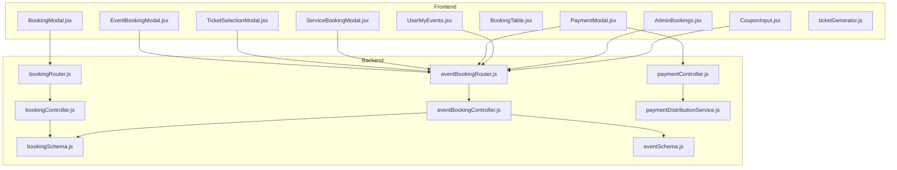

**Diagram sources**
- [bookingController.js:1-233](file://backend/controller/bookingController.js#L1-L233)
- [eventBookingController.js:1-800](file://backend/controller/eventBookingController.js#L1-L800)
- [bookingRouter.js:1-26](file://backend/router/bookingRouter.js#L1-L26)
- [eventBookingRouter.js:1-47](file://backend/router/eventBookingRouter.js#L1-L47)
- [bookingSchema.js:1-53](file://backend/models/bookingSchema.js#L1-L53)
- [eventSchema.js:1-35](file://backend/models/eventSchema.js#L1-L35)
- [BookingModal.jsx:1-317](file://frontend/src/components/BookingModal.jsx#L1-L317)
- [EventBookingModal.jsx:1-276](file://frontend/src/components/EventBookingModal.jsx#L1-L276)
- [TicketSelectionModal.jsx:1-448](file://frontend/src/components/TicketSelectionModal.jsx#L1-L448)
- [ServiceBookingModal.jsx:1-440](file://frontend/src/components/ServiceBookingModal.jsx#L1-L440)
- [PaymentModal.jsx:1-206](file://frontend/src/components/PaymentModal.jsx#L1-L206)
- [BookingTable.jsx:1-59](file://frontend/src/components/user/BookingTable.jsx#L1-L59)
- [UserMyEvents.jsx:1-259](file://frontend/src/pages/dashboards/UserMyEvents.jsx#L1-L259)
- [AdminBookings.jsx:1-297](file://frontend/src/pages/dashboards/AdminBookings.jsx#L1-L297)
- [CouponInput.jsx:1-166](file://frontend/src/components/CouponInput.jsx#L1-L166)
- [ticketGenerator.js:1-161](file://frontend/src/utils/ticketGenerator.js#L1-L161)
- [paymentController.js:237-278](file://backend/controller/paymentController.js#L237-L278)
- [paymentDistributionService.js:163-201](file://backend/services/paymentDistributionService.js#L163-L201)

**Section sources**
- [bookingController.js:1-233](file://backend/controller/bookingController.js#L1-L233)
- [eventBookingController.js:1-800](file://backend/controller/eventBookingController.js#L1-L800)
- [bookingRouter.js:1-26](file://backend/router/bookingRouter.js#L1-L26)
- [eventBookingRouter.js:1-47](file://backend/router/eventBookingRouter.js#L1-L47)

## Core Components
- Backend booking model defines fields for user, service/event, pricing, dates, guests, and status.
- Controllers implement create, fetch, cancel, and admin status updates for basic bookings.
- Event-based booking controller handles full-service and ticketed workflows, routing, approvals, and payment linkage.
- Frontend modals encapsulate booking UX: service booking, event booking, ticket selection, and payment.
- Admin and user dashboards present booking tables with status indicators and actions.

Key backend data model highlights:
- Fields include user reference, service identifiers and metadata, pricing, booking and event dates, notes, guest count, and status enum.
- Event model supports two event types: full-service and ticketed, with ticket type arrays and availability.

**Section sources**
- [bookingSchema.js:1-53](file://backend/models/bookingSchema.js#L1-L53)
- [eventSchema.js:1-35](file://backend/models/eventSchema.js#L1-L35)
- [bookingController.js:1-233](file://backend/controller/bookingController.js#L1-L233)
- [eventBookingController.js:1-800](file://backend/controller/eventBookingController.js#L1-L800)

## Architecture Overview
The system separates concerns across backend APIs and frontend modals:
- Users initiate bookings via modals; backend validates inputs, enforces uniqueness, calculates totals, and persists records.
- Event-based flows route to specialized handlers for full-service (merchant approval) and ticketed (immediate confirmation pending payment).
- Coupons are validated and applied before booking creation; payment completion finalizes ticketed bookings.
- Admins manage statuses and view consolidated reports; users track personal bookings and receive notifications.

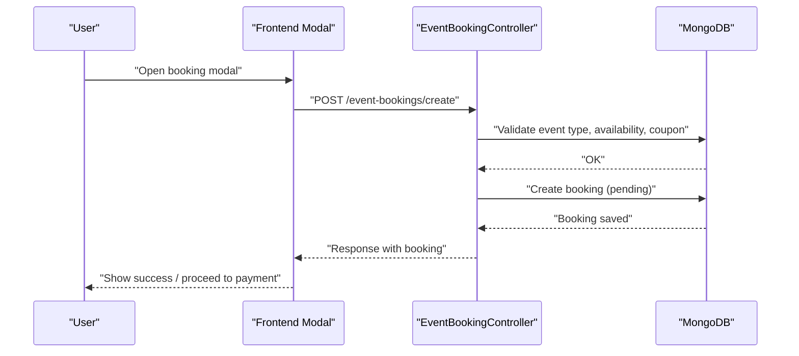

**Diagram sources**
- [EventBookingModal.jsx:40-67](file://frontend/src/components/EventBookingModal.jsx#L40-L67)
- [TicketSelectionModal.jsx:150-210](file://frontend/src/components/TicketSelectionModal.jsx#L150-L210)
- [ServiceBookingModal.jsx:134-190](file://frontend/src/components/ServiceBookingModal.jsx#L134-L190)
- [eventBookingController.js:7-73](file://backend/controller/eventBookingController.js#L7-L73)

**Section sources**
- [EventBookingModal.jsx:1-276](file://frontend/src/components/EventBookingModal.jsx#L1-L276)
- [TicketSelectionModal.jsx:1-448](file://frontend/src/components/TicketSelectionModal.jsx#L1-L448)
- [ServiceBookingModal.jsx:1-440](file://frontend/src/components/ServiceBookingModal.jsx#L1-L440)
- [eventBookingController.js:1-800](file://backend/controller/eventBookingController.js#L1-L800)

## Detailed Component Analysis

### Booking Model and Lifecycle
- Lifecycle statuses: pending, confirmed, cancelled, completed.
- Unique constraint prevents overlapping active bookings for the same service/user.
- Pricing computed from unit price and guest count; coupons adjust final amounts.

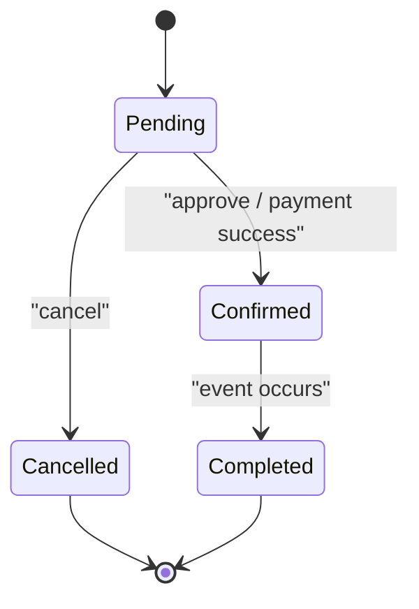

**Diagram sources**
- [bookingSchema.js:36-40](file://backend/models/bookingSchema.js#L36-L40)
- [bookingController.js:124-171](file://backend/controller/bookingController.js#L124-L171)

**Section sources**
- [bookingSchema.js:1-53](file://backend/models/bookingSchema.js#L1-L53)
- [bookingController.js:1-233](file://backend/controller/bookingController.js#L1-L233)

### Basic Booking API
- Create booking with service details, event date, guest count, notes.
- Fetch user bookings and single booking by ID.
- Cancel booking with validations (already cancelled, completed).
- Admin endpoints to fetch all bookings and update status.

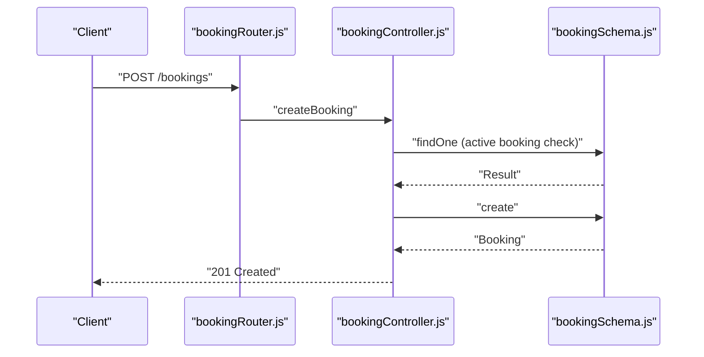

**Diagram sources**
- [bookingRouter.js:15-19](file://backend/router/bookingRouter.js#L15-L19)
- [bookingController.js:4-70](file://backend/controller/bookingController.js#L4-L70)
- [bookingSchema.js:1-53](file://backend/models/bookingSchema.js#L1-L53)

**Section sources**
- [bookingRouter.js:1-26](file://backend/router/bookingRouter.js#L1-L26)
- [bookingController.js:1-233](file://backend/controller/bookingController.js#L1-L233)

### Event-Based Booking Workflows
- Routing by event type: full-service requires merchant approval; ticketed confirms immediately with pending payment.
- Coupon validation and application prior to booking creation.
- Ticket availability checks and updates for ticketed events.
- Notifications for merchant and user on state changes.

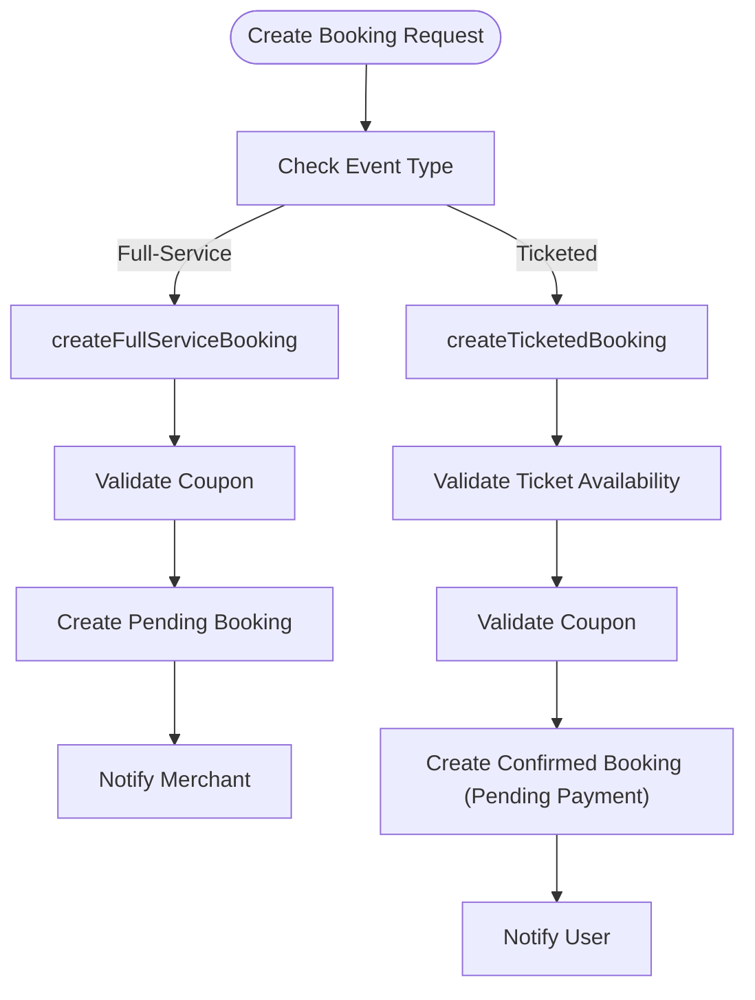

**Diagram sources**
- [eventBookingController.js:7-73](file://backend/controller/eventBookingController.js#L7-L73)
- [eventBookingController.js:321-589](file://backend/controller/eventBookingController.js#L321-L589)

**Section sources**
- [eventBookingController.js:1-800](file://backend/controller/eventBookingController.js#L1-L800)

### Modal-Based Booking Forms
- ServiceBookingModal: collects service date, guest count, notes; integrates coupon offers.
- EventBookingModal: handles full-service vs ticketed forms; manages coupon application and totals.
- TicketSelectionModal: loads ticket types, applies coupons, and posts to create endpoint.
- PaymentModal: selects payment method and finalizes ticketed booking creation.

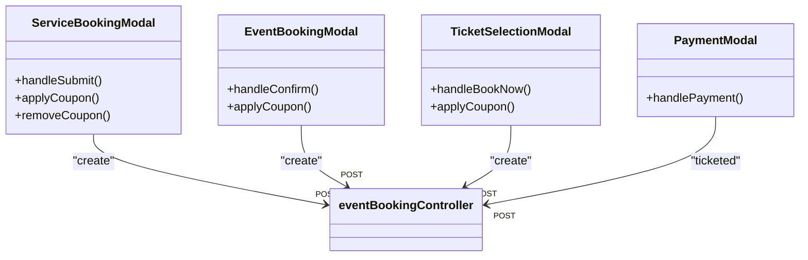

**Diagram sources**
- [ServiceBookingModal.jsx:134-190](file://frontend/src/components/ServiceBookingModal.jsx#L134-L190)
- [EventBookingModal.jsx:40-67](file://frontend/src/components/EventBookingModal.jsx#L40-L67)
- [TicketSelectionModal.jsx:150-210](file://frontend/src/components/TicketSelectionModal.jsx#L150-L210)
- [PaymentModal.jsx:21-62](file://frontend/src/components/PaymentModal.jsx#L21-L62)
- [eventBookingController.js:7-73](file://backend/controller/eventBookingController.js#L7-L73)

**Section sources**
- [ServiceBookingModal.jsx:1-440](file://frontend/src/components/ServiceBookingModal.jsx#L1-L440)
- [EventBookingModal.jsx:1-276](file://frontend/src/components/EventBookingModal.jsx#L1-L276)
- [TicketSelectionModal.jsx:1-448](file://frontend/src/components/TicketSelectionModal.jsx#L1-L448)
- [PaymentModal.jsx:1-206](file://frontend/src/components/PaymentModal.jsx#L1-L206)

### Booking History Interfaces
- UserMyEvents page aggregates registrations/bookings, filters by tabs (all/upcoming/past), and displays status badges and icons.
- BookingTable component renders a compact table with event name, date, location, status badge, and view action.

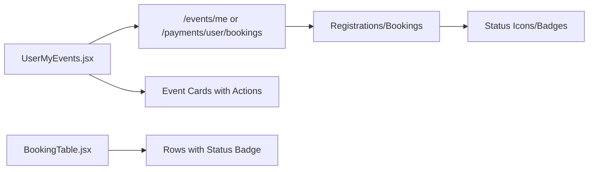

**Diagram sources**
- [UserMyEvents.jsx:10-259](file://frontend/src/pages/dashboards/UserMyEvents.jsx#L10-L259)
- [BookingTable.jsx:10-59](file://frontend/src/components/user/BookingTable.jsx#L10-L59)

**Section sources**
- [UserMyEvents.jsx:1-259](file://frontend/src/pages/dashboards/UserMyEvents.jsx#L1-L259)
- [BookingTable.jsx:1-59](file://frontend/src/components/user/BookingTable.jsx#L1-L59)

### Admin Booking Management
- AdminBookings page loads all bookings, filters by status, and allows updating booking status via PUT.
- Displays stats (pending, confirmed, completed, paid) and revenue metrics.

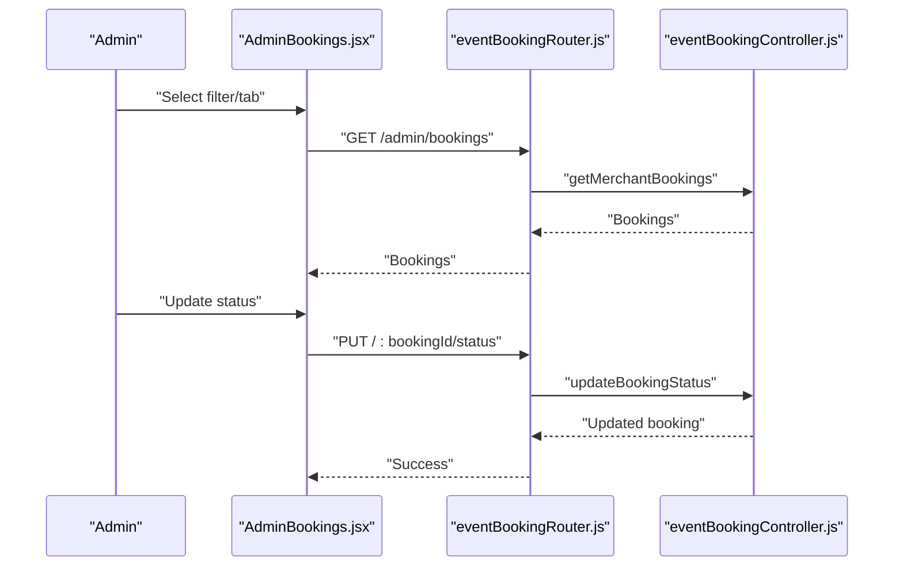

**Diagram sources**
- [AdminBookings.jsx:16-58](file://frontend/src/pages/dashboards/AdminBookings.jsx#L16-L58)
- [eventBookingRouter.js:38-45](file://backend/router/eventBookingRouter.js#L38-L45)
- [eventBookingController.js:763-793](file://backend/controller/eventBookingController.js#L763-L793)

**Section sources**
- [AdminBookings.jsx:1-297](file://frontend/src/pages/dashboards/AdminBookings.jsx#L1-L297)
- [eventBookingRouter.js:1-47](file://backend/router/eventBookingRouter.js#L1-L47)

### Ticket Management
- Ticketed events generate unique ticket and payment IDs upon successful booking.
- Ticket PDF generation utility produces printable tickets with event details and QR placeholder.

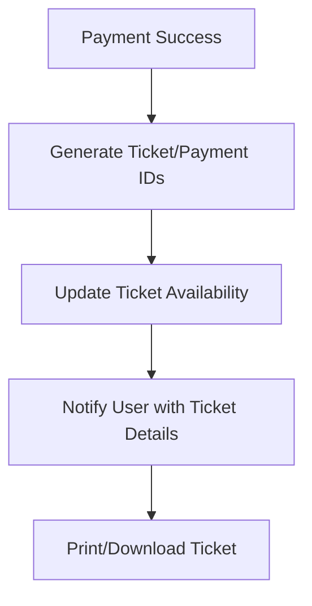

**Diagram sources**
- [eventBookingController.js:476-589](file://backend/controller/eventBookingController.js#L476-L589)
- [ticketGenerator.js:2-161](file://frontend/src/utils/ticketGenerator.js#L2-L161)

**Section sources**
- [eventBookingController.js:321-589](file://backend/controller/eventBookingController.js#L321-L589)
- [ticketGenerator.js:1-161](file://frontend/src/utils/ticketGenerator.js#L1-L161)

### Cancellation and Refund Procedures
- Users can cancel pending/confirmed bookings; completed or already-cancelled bookings are rejected.
- Refund processing validates payment status, performs refund, updates payment and booking statuses, and notifies users.

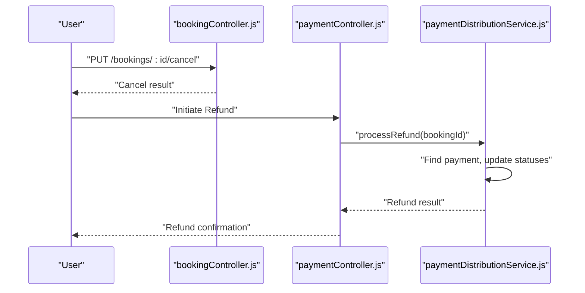

**Diagram sources**
- [bookingController.js:124-171](file://backend/controller/bookingController.js#L124-L171)
- [paymentController.js:237-278](file://backend/controller/paymentController.js#L237-L278)
- [paymentDistributionService.js:163-201](file://backend/services/paymentDistributionService.js#L163-L201)

**Section sources**
- [bookingController.js:124-171](file://backend/controller/bookingController.js#L124-L171)
- [paymentController.js:237-278](file://backend/controller/paymentController.js#L237-L278)
- [paymentDistributionService.js:163-201](file://backend/services/paymentDistributionService.js#L163-L201)

### Examples and Workflows

#### Example: Service Booking with Coupon
- User opens ServiceBookingModal, selects date/guests, applies coupon, submits.
- Backend validates coupon, creates pending booking, notifies merchant.

**Section sources**
- [ServiceBookingModal.jsx:134-190](file://frontend/src/components/ServiceBookingModal.jsx#L134-L190)
- [eventBookingController.js:75-319](file://backend/controller/eventBookingController.js#L75-L319)

#### Example: Ticketed Event Purchase
- User opens EventBookingModal or TicketSelectionModal, selects ticket type/quantity, applies coupon, proceeds to PaymentModal, then creates ticketed booking.

**Section sources**
- [EventBookingModal.jsx:40-67](file://frontend/src/components/EventBookingModal.jsx#L40-L67)
- [TicketSelectionModal.jsx:150-210](file://frontend/src/components/TicketSelectionModal.jsx#L150-L210)
- [PaymentModal.jsx:21-62](file://frontend/src/components/PaymentModal.jsx#L21-L62)
- [eventBookingController.js:321-589](file://backend/controller/eventBookingController.js#L321-L589)

#### Example: Admin Status Update
- Admin filters bookings, selects “Confirmed,” invokes update endpoint, receives updated booking list.

**Section sources**
- [AdminBookings.jsx:36-58](file://frontend/src/pages/dashboards/AdminBookings.jsx#L36-L58)
- [eventBookingRouter.js:41-45](file://backend/router/eventBookingRouter.js#L41-L45)
- [eventBookingController.js:763-793](file://backend/controller/eventBookingController.js#L763-L793)

## Dependency Analysis
- Frontend modals depend on backend routes for booking creation, coupon validation, and ticket retrieval.
- Backend controllers depend on models and services for persistence and payment distribution.
- Admin dashboard depends on merchant-specific endpoints for booking management.

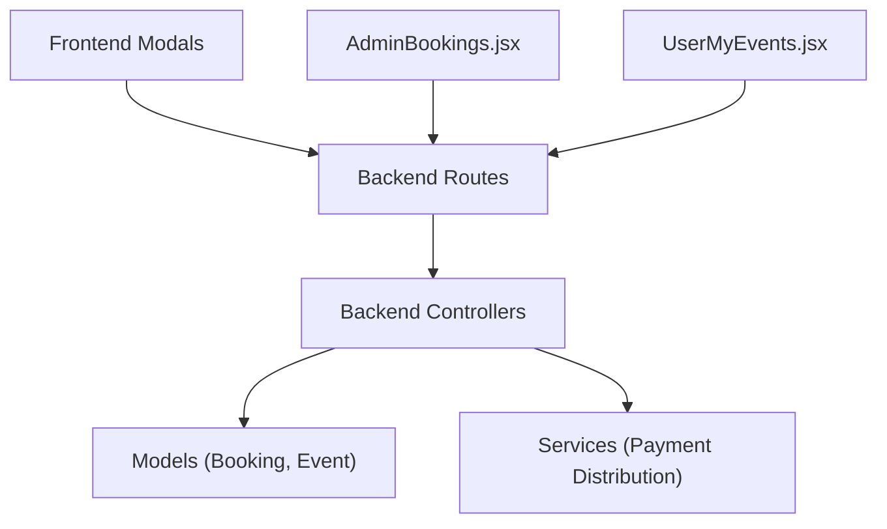

**Diagram sources**
- [bookingRouter.js:1-26](file://backend/router/bookingRouter.js#L1-L26)
- [eventBookingRouter.js:1-47](file://backend/router/eventBookingRouter.js#L1-L47)
- [bookingController.js:1-233](file://backend/controller/bookingController.js#L1-L233)
- [eventBookingController.js:1-800](file://backend/controller/eventBookingController.js#L1-L800)
- [bookingSchema.js:1-53](file://backend/models/bookingSchema.js#L1-L53)
- [eventSchema.js:1-35](file://backend/models/eventSchema.js#L1-L35)
- [paymentDistributionService.js:163-201](file://backend/services/paymentDistributionService.js#L163-L201)

**Section sources**
- [bookingRouter.js:1-26](file://backend/router/bookingRouter.js#L1-L26)
- [eventBookingRouter.js:1-47](file://backend/router/eventBookingRouter.js#L1-L47)
- [bookingController.js:1-233](file://backend/controller/bookingController.js#L1-L233)
- [eventBookingController.js:1-800](file://backend/controller/eventBookingController.js#L1-L800)

## Performance Considerations
- Minimize repeated coupon validations by caching available offers in modals.
- Batch admin queries and paginate booking lists to reduce payload sizes.
- Use selective field projections in database queries to avoid unnecessary data transfer.
- Debounce user inputs for guest counts and coupon code entries to reduce network calls.

## Troubleshooting Guide
Common issues and resolutions:
- Duplicate active booking: Ensure uniqueness checks prevent concurrent pending/confirmed bookings for the same service/user.
- Invalid coupon errors: Validate coupon eligibility (usage limits, expiry, min spend) before applying.
- Ticket availability errors: Display available quantities and disable invalid selections.
- Payment failures: Confirm payment method compatibility and retry logic; notify users of partial failures.
- Status transitions: Enforce state machine rules (cannot cancel completed, cannot approve non-pending).

**Section sources**
- [bookingController.js:26-38](file://backend/controller/bookingController.js#L26-L38)
- [eventBookingController.js:377-391](file://backend/controller/eventBookingController.js#L377-L391)
- [CouponInput.jsx:19-54](file://frontend/src/components/CouponInput.jsx#L19-L54)

## Conclusion
The booking management system provides robust, modal-driven workflows for both service and ticketed events, with clear status tracking, coupon integration, and admin oversight. The architecture cleanly separates concerns between frontend UX and backend orchestration, enabling scalable enhancements for refunds, notifications, and reporting.

## Appendices

### API Definitions

- Create Basic Booking
  - Method: POST
  - Path: /bookings
  - Auth: Required
  - Body fields: serviceId, serviceTitle, serviceCategory, servicePrice, eventDate, notes, guestCount
  - Responses: 201 Created, 400 Bad Request, 409 Conflict, 500 Internal Server Error

- Get User Bookings
  - Method: GET
  - Path: /bookings/my-bookings
  - Auth: Required
  - Responses: 200 OK, 500 Internal Server Error

- Cancel Booking
  - Method: PUT
  - Path: /bookings/:id/cancel
  - Auth: Required
  - Responses: 200 OK, 404 Not Found, 400 Bad Request, 500 Internal Server Error

- Create Event Booking (Generic)
  - Method: POST
  - Path: /event-bookings/create
  - Auth: Required
  - Body fields: eventId, quantity (ticketed), or serviceDate, guestCount (full-service), couponCode
  - Responses: 201 Created, 400 Bad Request, 404 Not Found, 500 Internal Server Error

- Create Ticketed Booking
  - Method: POST
  - Path: /event-bookings/ticketed
  - Auth: Required
  - Body fields: eventId, ticketType, quantity, paymentMethod, couponCode
  - Responses: 201 Created, 400 Bad Request, 500 Internal Server Error

- Approve/Reject Full-Service Booking (Merchant)
  - Method: PUT
  - Path: /event-bookings/:bookingId/approve | /reject
  - Auth: Merchant Required
  - Responses: 200 OK, 400/403/404 Bad Request/Forbidden/Not Found, 500 Internal Server Error

- Admin Update Booking Status
  - Method: PUT
  - Path: /event-bookings/:id/status
  - Auth: Admin Required
  - Body fields: status
  - Responses: 200 OK, 400 Bad Request, 404 Not Found, 500 Internal Server Error

**Section sources**
- [bookingRouter.js:15-23](file://backend/router/bookingRouter.js#L15-L23)
- [eventBookingRouter.js:26-45](file://backend/router/eventBookingRouter.js#L26-L45)
- [bookingController.js:4-233](file://backend/controller/bookingController.js#L4-L233)
- [eventBookingController.js:7-73](file://backend/controller/eventBookingController.js#L7-L73)