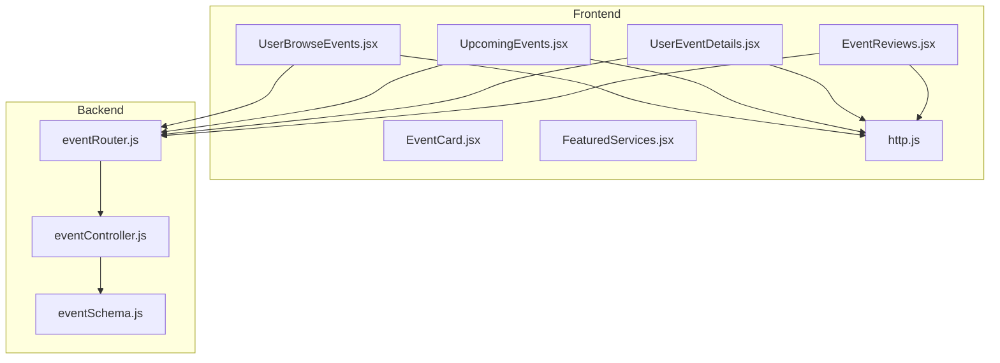
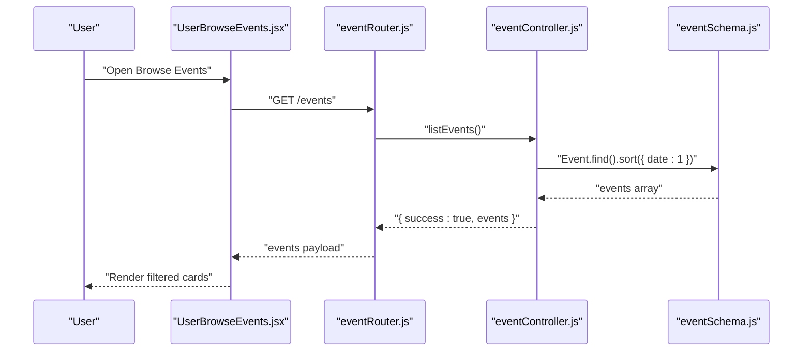
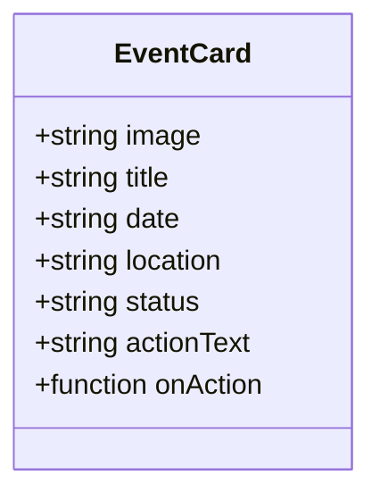
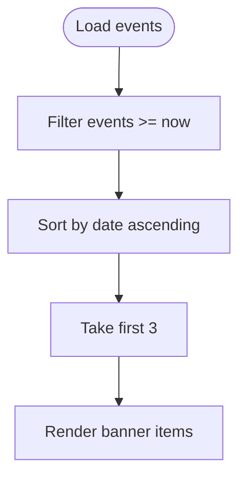
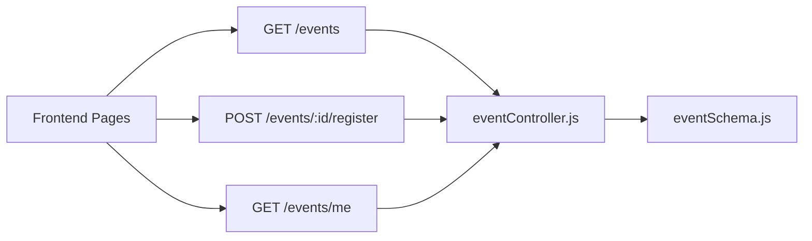
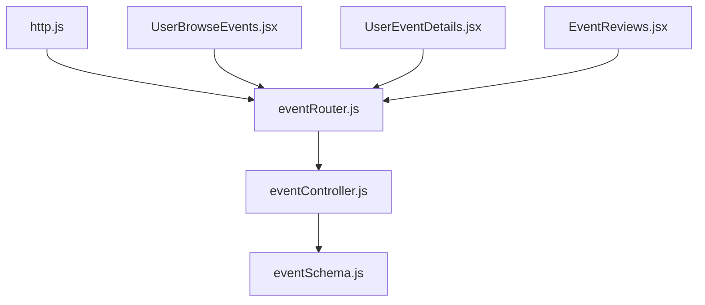

# Event Browsing and Search

<cite>
**Referenced Files in This Document**
- [UserBrowseEvents.jsx](file://frontend/src/pages/dashboards/UserBrowseEvents.jsx)
- [EventCard.jsx](file://frontend/src/components/user/EventCard.jsx)
- [UpcomingEvents.jsx](file://frontend/src/components/home/UpcomingEvents.jsx)
- [FeaturedServices.jsx](file://frontend/src/components/home/FeaturedServices.jsx)
- [UserEventDetails.jsx](file://frontend/src/pages/dashboards/UserEventDetails.jsx)
- [eventController.js](file://backend/controller/eventController.js)
- [eventSchema.js](file://backend/models/eventSchema.js)
- [eventRouter.js](file://backend/router/eventRouter.js)
- [http.js](file://frontend/src/lib/http.js)
- [EventReviews.jsx](file://frontend/src/components/EventReviews.jsx)
</cite>

## Table of Contents
1. [Introduction](#introduction)
2. [Project Structure](#project-structure)
3. [Core Components](#core-components)
4. [Architecture Overview](#architecture-overview)
5. [Detailed Component Analysis](#detailed-component-analysis)
6. [Dependency Analysis](#dependency-analysis)
7. [Performance Considerations](#performance-considerations)
8. [Troubleshooting Guide](#troubleshooting-guide)
9. [Conclusion](#conclusion)

## Introduction
This document explains the event browsing and search experience for users. It covers how events are discovered, filtered, sorted, and presented; how the EventCard component renders event details; how the Upcoming Events section highlights future events; and how the Featured Services section complements the event discovery journey. It also documents the search algorithm, filter criteria, result presentation, user interaction patterns, and performance considerations such as local caching and pagination.

## Project Structure
The event browsing feature spans frontend pages and components, and backend controllers and models. The frontend uses React with Axios for API calls, while the backend exposes REST endpoints for listing events and managing registrations.



**Diagram sources**
- [UserBrowseEvents.jsx](file://frontend/src/pages/dashboards/UserBrowseEvents.jsx)
- [EventCard.jsx](file://frontend/src/components/user/EventCard.jsx)
- [UpcomingEvents.jsx](file://frontend/src/components/home/UpcomingEvents.jsx)
- [FeaturedServices.jsx](file://frontend/src/components/home/FeaturedServices.jsx)
- [UserEventDetails.jsx](file://frontend/src/pages/dashboards/UserEventDetails.jsx)
- [EventReviews.jsx](file://frontend/src/components/EventReviews.jsx)
- [http.js](file://frontend/src/lib/http.js)
- [eventRouter.js](file://backend/router/eventRouter.js)
- [eventController.js](file://backend/controller/eventController.js)
- [eventSchema.js](file://backend/models/eventSchema.js)

**Section sources**
- [UserBrowseEvents.jsx](file://frontend/src/pages/dashboards/UserBrowseEvents.jsx)
- [eventRouter.js](file://backend/router/eventRouter.js)
- [eventController.js](file://backend/controller/eventController.js)
- [eventSchema.js](file://backend/models/eventSchema.js)

## Core Components
- Event browsing page: Implements search, category filter, date filter, and result rendering.
- Event card: Reusable component for event tiles with status badges and actions.
- Upcoming events: Displays the next few future events.
- Featured services: Complementary service showcase to drive engagement.
- Event details: Full-screen view with booking and save controls.
- Reviews: Paginated reviews for an event.

Key capabilities:
- Local filtering and search across title, description, and location.
- Category and date range filters.
- Local storage for saved events.
- Backend endpoint to list events and sort by date ascending.
- Image fallback logic based on category or title keywords.

**Section sources**
- [UserBrowseEvents.jsx](file://frontend/src/pages/dashboards/UserBrowseEvents.jsx)
- [EventCard.jsx](file://frontend/src/components/user/EventCard.jsx)
- [UpcomingEvents.jsx](file://frontend/src/components/home/UpcomingEvents.jsx)
- [FeaturedServices.jsx](file://frontend/src/components/home/FeaturedServices.jsx)
- [UserEventDetails.jsx](file://frontend/src/pages/dashboards/UserEventDetails.jsx)
- [EventReviews.jsx](file://frontend/src/components/EventReviews.jsx)
- [eventController.js](file://backend/controller/eventController.js)

## Architecture Overview
The browsing flow connects the frontend UI to backend endpoints via authenticated HTTP requests.



**Diagram sources**
- [UserBrowseEvents.jsx](file://frontend/src/pages/dashboards/UserBrowseEvents.jsx)
- [eventRouter.js](file://backend/router/eventRouter.js)
- [eventController.js](file://backend/controller/eventController.js)
- [eventSchema.js](file://backend/models/eventSchema.js)

## Detailed Component Analysis

### Event Discovery Interface and Search Filters
- Search: Case-insensitive substring match across title, description, and location.
- Category filter: Dropdown with predefined categories including “all”.
- Date filter: Options for “any date”, “today”, “this week”, “this month”.
- Sorting: Backend sorts events by date ascending; frontend does not override this order.
- Infinite scrolling: Not implemented in the current browse page.

Filtering logic and UI wiring are implemented in the browse page.

**Section sources**
- [UserBrowseEvents.jsx](file://frontend/src/pages/dashboards/UserBrowseEvents.jsx)

### EventCard Component
- Purpose: Render a single event tile with image, title, formatted date, location, status badge, and action button.
- Status mapping: Converts status strings to color classes for visual indication.
- Props: image, title, date, location, status, actionText, onAction.
- Interaction: Calls onAction when the user clicks the action button.



**Diagram sources**
- [EventCard.jsx](file://frontend/src/components/user/EventCard.jsx)

**Section sources**
- [EventCard.jsx](file://frontend/src/components/user/EventCard.jsx)

### Featured Services Display
- Purpose: Showcase a grid of service categories with icons and descriptions.
- Behavior: Static content rendered as part of the homepage layout.
- UX: Hover effects and responsive grid layout.

**Section sources**
- [FeaturedServices.jsx](file://frontend/src/components/home/FeaturedServices.jsx)

### Upcoming Events Section
- Purpose: Highlight the next three upcoming events.
- Logic: Filters events with dates greater than or equal to now, sorts by date ascending, and takes the first three.
- Rendering: Displays images, titles, dates, locations, and a link to browse events.



**Diagram sources**
- [UpcomingEvents.jsx](file://frontend/src/components/home/UpcomingEvents.jsx)

**Section sources**
- [UpcomingEvents.jsx](file://frontend/src/components/home/UpcomingEvents.jsx)

### Event Details Page and Registration
- Purpose: Present detailed information, images, features, and registration controls.
- Data retrieval: Fetches all events and finds the selected event client-side.
- Registration: Posts to the backend registration endpoint for the selected event.
- Save event: Toggle saved state with a toast notification.
- Reviews: Loads paginated reviews with a fixed limit per page.

```mermaid
sequenceDiagram
participant User as "User"
participant Details as "UserEventDetails.jsx"
participant API as "eventRouter.js"
participant Ctrl as "eventController.js"
User->>Details : "Open event details"
Details->>API : "GET /events"
API-->>Details : "events payload"
User->>Details : "Click Register"
Details->>API : "POST /events/ : id/register"
API->>Ctrl : "registerForEvent()"
Ctrl-->>API : "{ success : true }"
API-->>Details : "registration result"
Details-->>User : "Show success and update state"
```

**Diagram sources**
- [UserEventDetails.jsx](file://frontend/src/pages/dashboards/UserEventDetails.jsx)
- [eventRouter.js](file://backend/router/eventRouter.js)
- [eventController.js](file://backend/controller/eventController.js)

**Section sources**
- [UserEventDetails.jsx](file://frontend/src/pages/dashboards/UserEventDetails.jsx)
- [EventReviews.jsx](file://frontend/src/components/EventReviews.jsx)

### Backend Event Listing and Registration
- Endpoint: GET /events lists all events sorted by date ascending.
- Registration: POST /events/:id/register creates a registration record for the authenticated user.
- My registrations: GET /events/me returns the user’s event registrations with populated event data.



**Diagram sources**
- [eventRouter.js](file://backend/router/eventRouter.js)
- [eventController.js](file://backend/controller/eventController.js)
- [eventSchema.js](file://backend/models/eventSchema.js)

**Section sources**
- [eventController.js](file://backend/controller/eventController.js)
- [eventRouter.js](file://backend/router/eventRouter.js)
- [eventSchema.js](file://backend/models/eventSchema.js)

## Dependency Analysis
- Frontend depends on backend endpoints for listing and registering events.
- Authentication is enforced via a Bearer token header.
- The browse page performs client-side filtering and rendering; backend sorting ensures chronological order.
- Reviews are paginated on the backend and fetched independently.



**Diagram sources**
- [http.js](file://frontend/src/lib/http.js)
- [eventRouter.js](file://backend/router/eventRouter.js)
- [eventController.js](file://backend/controller/eventController.js)
- [eventSchema.js](file://backend/models/eventSchema.js)
- [UserBrowseEvents.jsx](file://frontend/src/pages/dashboards/UserBrowseEvents.jsx)
- [UserEventDetails.jsx](file://frontend/src/pages/dashboards/UserEventDetails.jsx)
- [EventReviews.jsx](file://frontend/src/components/EventReviews.jsx)

**Section sources**
- [http.js](file://frontend/src/lib/http.js)
- [eventRouter.js](file://backend/router/eventRouter.js)
- [eventController.js](file://backend/controller/eventController.js)
- [eventSchema.js](file://backend/models/eventSchema.js)
- [UserBrowseEvents.jsx](file://frontend/src/pages/dashboards/UserBrowseEvents.jsx)
- [UserEventDetails.jsx](file://frontend/src/pages/dashboards/UserEventDetails.jsx)
- [EventReviews.jsx](file://frontend/src/components/EventReviews.jsx)

## Performance Considerations
- Client-side filtering: Efficient for small to moderate datasets; consider server-side filtering for large collections.
- Local storage caching: Saved events are cached locally to avoid repeated network calls.
- Pagination: Reviews are paginated to reduce payload sizes.
- Sorting: Backend sorts by date ascending; frontend does not re-sort.
- Image fallbacks: Reduce 404s by providing fallback images based on category or title keywords.
- No infinite scroll: Current implementation uses static grids; consider virtualized lists or pagination for scalability.

[No sources needed since this section provides general guidance]

## Troubleshooting Guide
- API errors: Network failures or server errors during event listing or registration will surface as toast notifications.
- Event not found: Navigates back to the browse page with a user-friendly message.
- Registration conflicts: Duplicate registration attempts are handled gracefully with a conflict message.
- Reviews loading: Loading spinners and empty states improve perceived performance and UX.

**Section sources**
- [UserBrowseEvents.jsx](file://frontend/src/pages/dashboards/UserBrowseEvents.jsx)
- [UserEventDetails.jsx](file://frontend/src/pages/dashboards/UserEventDetails.jsx)
- [EventReviews.jsx](file://frontend/src/components/EventReviews.jsx)

## Conclusion
The event browsing and search feature combines a clean UI with straightforward client-side filtering and robust backend support. Users can search, filter, and discover events efficiently, with complementary sections for upcoming events and featured services. Future enhancements could include server-side filtering, infinite scroll, and improved sorting controls to scale with larger datasets.