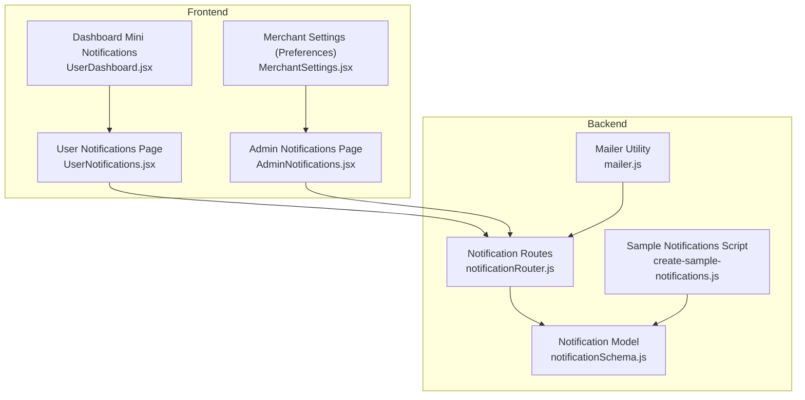
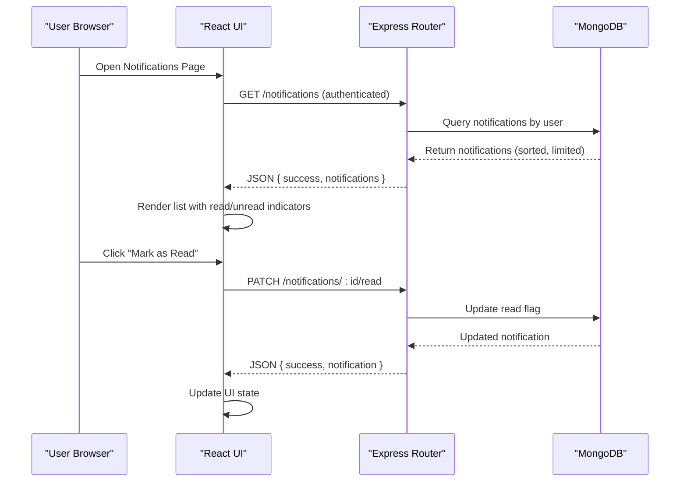
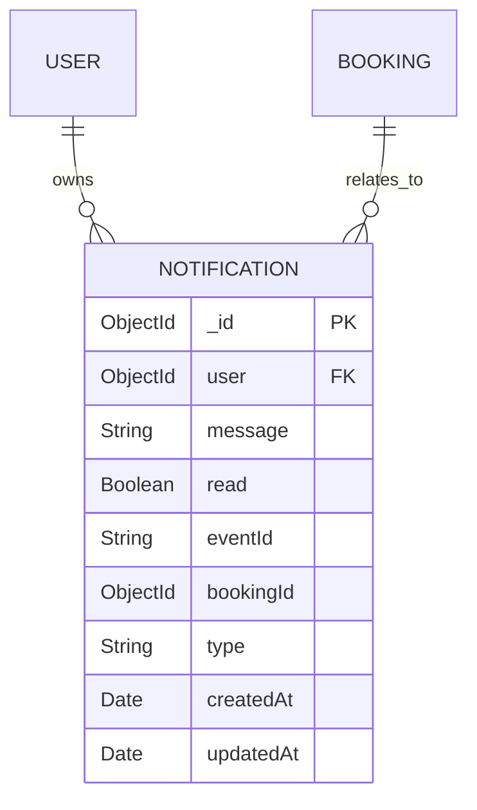
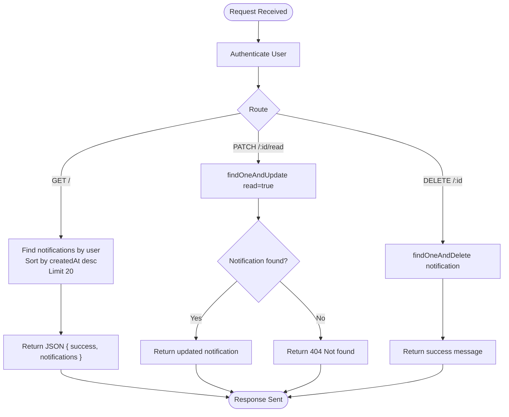
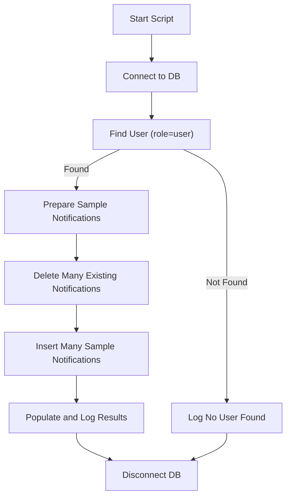
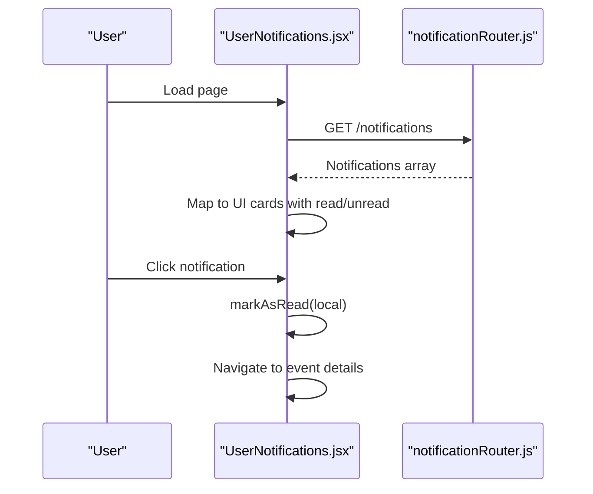
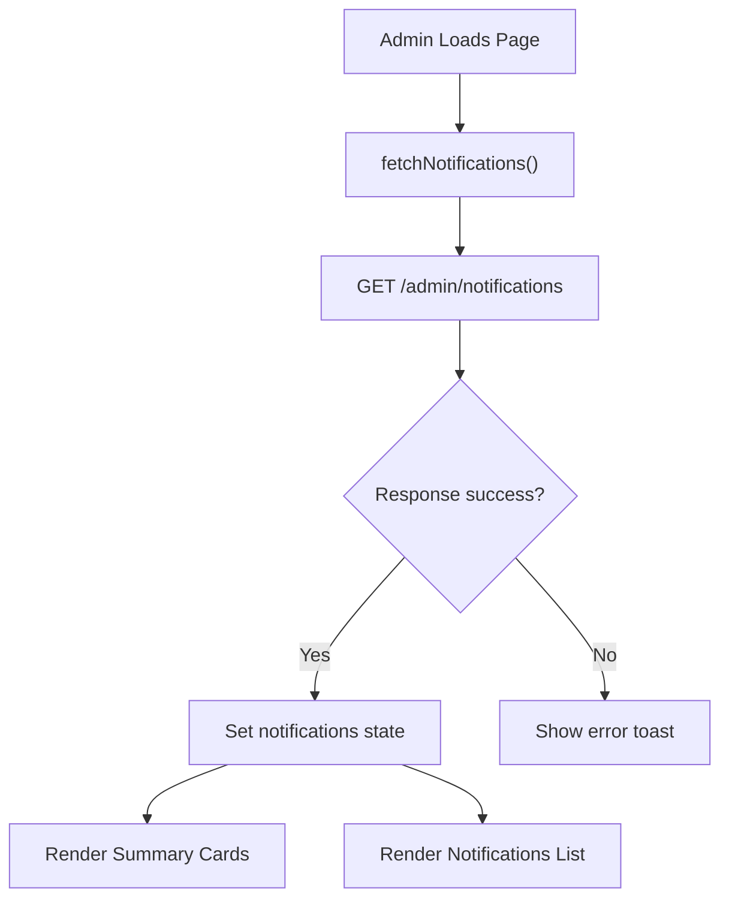
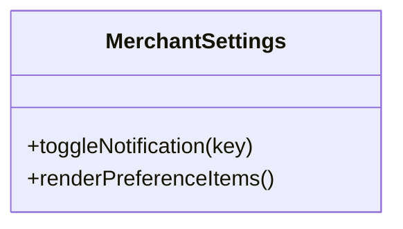
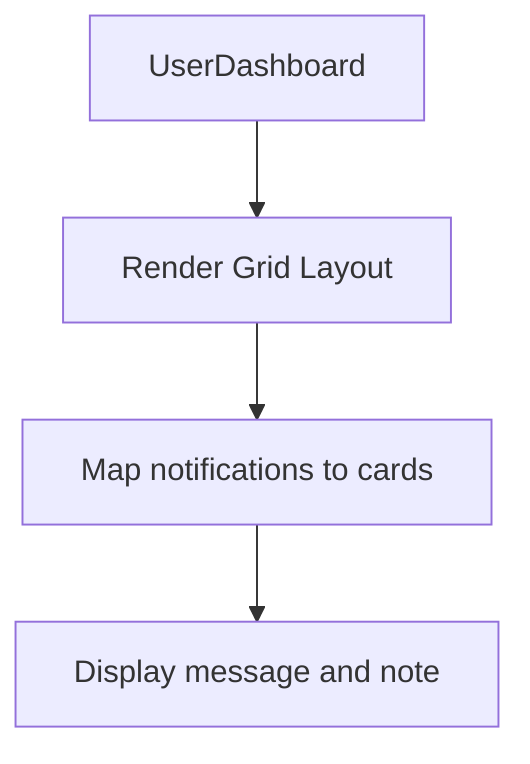
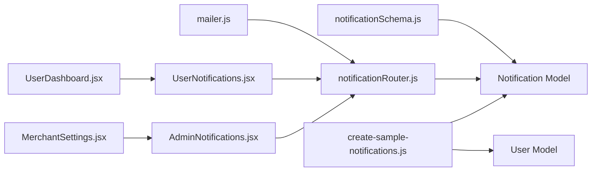

# Notifications System

<cite>
**Referenced Files in This Document**
- [notificationSchema.js](file://backend/models/notificationSchema.js)
- [notificationRouter.js](file://backend/router/notificationRouter.js)
- [create-sample-notifications.js](file://backend/create-sample-notifications.js)
- [mailer.js](file://backend/util/mailer.js)
- [UserNotifications.jsx](file://frontend/src/pages/dashboards/UserNotifications.jsx)
- [AdminNotifications.jsx](file://frontend/src/pages/dashboards/AdminNotifications.jsx)
- [MerchantSettings.jsx](file://frontend/src/pages/dashboards/MerchantSettings.jsx)
- [UserDashboard.jsx](file://frontend/src/pages/dashboards/UserDashboard.jsx)
</cite>

## Table of Contents
1. [Introduction](#introduction)
2. [Project Structure](#project-structure)
3. [Core Components](#core-components)
4. [Architecture Overview](#architecture-overview)
5. [Detailed Component Analysis](#detailed-component-analysis)
6. [Dependency Analysis](#dependency-analysis)
7. [Performance Considerations](#performance-considerations)
8. [Troubleshooting Guide](#troubleshooting-guide)
9. [Conclusion](#conclusion)

## Introduction
This document provides comprehensive documentation for the user notifications system in the MERN stack event management project. It covers notification display mechanisms, notification types, user preferences, layout management, filtering, status indicators, read/unread tracking, notification history, delivery methods, and scheduling. It also includes examples of rendering, user interaction patterns, and management workflows.

## Project Structure
The notifications system spans both backend and frontend components:
- Backend: Defines the notification model, routes, and utilities for generating sample notifications and sending emails.
- Frontend: Implements user and admin notification dashboards, including rendering, interaction, and basic preferences.

**Diagram sources**
- [notificationSchema.js:1-36](file://backend/models/notificationSchema.js#L1-L36)
- [notificationRouter.js:1-45](file://backend/router/notificationRouter.js#L1-L45)
- [create-sample-notifications.js:1-73](file://backend/create-sample-notifications.js#L1-L73)
- [mailer.js:1-41](file://backend/util/mailer.js#L1-L41)
- [UserNotifications.jsx:1-155](file://frontend/src/pages/dashboards/UserNotifications.jsx#L1-L155)
- [AdminNotifications.jsx:1-217](file://frontend/src/pages/dashboards/AdminNotifications.jsx#L1-L217)
- [MerchantSettings.jsx:134-188](file://frontend/src/pages/dashboards/MerchantSettings.jsx#L134-L188)
- [UserDashboard.jsx:224-248](file://frontend/src/pages/dashboards/UserDashboard.jsx#L224-L248)

**Section sources**
- [notificationSchema.js:1-36](file://backend/models/notificationSchema.js#L1-L36)
- [notificationRouter.js:1-45](file://backend/router/notificationRouter.js#L1-L45)
- [UserNotifications.jsx:1-155](file://frontend/src/pages/dashboards/UserNotifications.jsx#L1-L155)
- [AdminNotifications.jsx:1-217](file://frontend/src/pages/dashboards/AdminNotifications.jsx#L1-L217)
- [MerchantSettings.jsx:134-188](file://frontend/src/pages/dashboards/MerchantSettings.jsx#L134-L188)
- [UserDashboard.jsx:224-248](file://frontend/src/pages/dashboards/UserDashboard.jsx#L224-L248)

## Core Components
- Notification Model: Defines the schema for storing user-specific notifications with fields for message content, read status, optional event/booking associations, and type classification.
- Notification Routes: Provides endpoints for fetching a user's notifications, marking a notification as read, and deleting a notification.
- Sample Notifications Script: Generates sample notifications for demonstration and testing.
- Frontend Pages:
  - UserNotifications: Renders upcoming event notifications and system messages with read/unread indicators and navigation.
  - AdminNotifications: Displays administrative notifications with type badges, icons, and summary metrics.
  - MerchantSettings: Contains toggleable notification preferences for merchants.
  - UserDashboard: Shows a compact grid of mini notifications on the user dashboard.

**Section sources**
- [notificationSchema.js:3-33](file://backend/models/notificationSchema.js#L3-L33)
- [notificationRouter.js:7-42](file://backend/router/notificationRouter.js#L7-L42)
- [create-sample-notifications.js:21-49](file://backend/create-sample-notifications.js#L21-L49)
- [UserNotifications.jsx:10-155](file://frontend/src/pages/dashboards/UserNotifications.jsx#L10-L155)
- [AdminNotifications.jsx:9-217](file://frontend/src/pages/dashboards/AdminNotifications.jsx#L9-L217)
- [MerchantSettings.jsx:134-188](file://frontend/src/pages/dashboards/MerchantSettings.jsx#L134-L188)
- [UserDashboard.jsx:224-248](file://frontend/src/pages/dashboards/UserDashboard.jsx#L224-L248)

## Architecture Overview
The notifications system follows a client-server pattern:
- Backend stores notifications in MongoDB using the Notification model.
- Frontend pages fetch notifications via authenticated routes and render them with React components.
- Administrative notifications are fetched from a dedicated admin endpoint.
- Email delivery is supported via a mailer utility for broader communication.

**Diagram sources**
- [notificationRouter.js:7-42](file://backend/router/notificationRouter.js#L7-L42)
- [UserNotifications.jsx:81-85](file://frontend/src/pages/dashboards/UserNotifications.jsx#L81-L85)

**Section sources**
- [notificationRouter.js:7-42](file://backend/router/notificationRouter.js#L7-L42)
- [UserNotifications.jsx:81-85](file://frontend/src/pages/dashboards/UserNotifications.jsx#L81-L85)

## Detailed Component Analysis

### Backend: Notification Model
- Purpose: Define the structure and constraints for notifications stored in MongoDB.
- Key Fields:
  - user: ObjectId referencing the User collection (required).
  - message: String containing the notification text (required).
  - read: Boolean indicating read/unread state (default false).
  - eventId: Optional string identifier for associated events.
  - bookingId: Optional reference to a Booking document.
  - type: Enumerated field with values "booking", "payment", "general" (default "general").
  - Timestamps: createdAt and updatedAt managed automatically.

**Diagram sources**
- [notificationSchema.js:3-33](file://backend/models/notificationSchema.js#L3-L33)

**Section sources**
- [notificationSchema.js:3-33](file://backend/models/notificationSchema.js#L3-L33)

### Backend: Notification Routes
- GET "/": Returns the latest notifications for the authenticated user, sorted by creation time and limited to a small number.
- PATCH "/:id/read": Marks a specific notification as read for the authenticated user.
- DELETE "/:id": Deletes a notification owned by the authenticated user.

**Diagram sources**
- [notificationRouter.js:7-42](file://backend/router/notificationRouter.js#L7-L42)

**Section sources**
- [notificationRouter.js:7-42](file://backend/router/notificationRouter.js#L7-L42)

### Backend: Sample Notifications Script
- Purpose: Populate the database with sample notifications for development and testing.
- Behavior:
  - Connects to MongoDB.
  - Finds a user with role "user".
  - Creates multiple sample notifications with different types.
  - Clears existing notifications and inserts new ones.
  - Logs created notifications.

**Diagram sources**
- [create-sample-notifications.js:8-73](file://backend/create-sample-notifications.js#L8-L73)

**Section sources**
- [create-sample-notifications.js:8-73](file://backend/create-sample-notifications.js#L8-L73)

### Frontend: User Notifications Page
- Purpose: Display upcoming event notifications and system messages for the logged-in user.
- Features:
  - Fetches registrations and generates notifications for upcoming events.
  - Adds a welcome system notification.
  - Renders notifications with:
    - Type-specific icons and color accents.
    - Formatted dates ("Today", "Tomorrow", relative days).
    - Read/unread indicator.
    - Navigation to event details on click.
  - Local state management for loading, notifications, and read status.

**Diagram sources**
- [UserNotifications.jsx:17-59](file://frontend/src/pages/dashboards/UserNotifications.jsx#L17-L59)
- [UserNotifications.jsx:81-85](file://frontend/src/pages/dashboards/UserNotifications.jsx#L81-L85)
- [notificationRouter.js:7-17](file://backend/router/notificationRouter.js#L7-L17)

**Section sources**
- [UserNotifications.jsx:17-59](file://frontend/src/pages/dashboards/UserNotifications.jsx#L17-L59)
- [UserNotifications.jsx:61-85](file://frontend/src/pages/dashboards/UserNotifications.jsx#L61-L85)
- [UserNotifications.jsx:112-149](file://frontend/src/pages/dashboards/UserNotifications.jsx#L112-L149)

### Frontend: Admin Notifications Page
- Purpose: Present administrative notifications with summaries and detailed lists.
- Features:
  - Fetches notifications from an admin endpoint.
  - Displays summary cards for different notification categories.
  - Renders notifications with:
    - Type-specific icons and colored badges.
    - Formatted timestamps.
    - Optional user and event metadata.
    - Unread indicators.

**Diagram sources**
- [AdminNotifications.jsx:18-35](file://frontend/src/pages/dashboards/AdminNotifications.jsx#L18-L35)
- [AdminNotifications.jsx:86-141](file://frontend/src/pages/dashboards/AdminNotifications.jsx#L86-L141)
- [AdminNotifications.jsx:160-210](file://frontend/src/pages/dashboards/AdminNotifications.jsx#L160-L210)

**Section sources**
- [AdminNotifications.jsx:18-35](file://frontend/src/pages/dashboards/AdminNotifications.jsx#L18-L35)
- [AdminNotifications.jsx:86-141](file://frontend/src/pages/dashboards/AdminNotifications.jsx#L86-L141)
- [AdminNotifications.jsx:160-210](file://frontend/src/pages/dashboards/AdminNotifications.jsx#L160-L210)

### Frontend: Merchant Settings (Preferences)
- Purpose: Allow merchants to manage notification preferences (e.g., email, booking alerts, payment alerts, marketing emails).
- Features:
  - Toggle switches for various preference categories.
  - Visual feedback for enabled/disabled states.

**Diagram sources**
- [MerchantSettings.jsx:134-188](file://frontend/src/pages/dashboards/MerchantSettings.jsx#L134-L188)

**Section sources**
- [MerchantSettings.jsx:134-188](file://frontend/src/pages/dashboards/MerchantSettings.jsx#L134-L188)

### Frontend: Dashboard Mini Notifications
- Purpose: Show a compact grid of mini notifications on the user dashboard.
- Features:
  - Grid layout with two columns.
  - Simple card layout with bell icon and message text.

**Diagram sources**
- [UserDashboard.jsx:224-248](file://frontend/src/pages/dashboards/UserDashboard.jsx#L224-L248)

**Section sources**
- [UserDashboard.jsx:224-248](file://frontend/src/pages/dashboards/UserDashboard.jsx#L224-L248)

## Dependency Analysis
- Backend dependencies:
  - notificationSchema.js depends on mongoose for schema definition.
  - notificationRouter.js depends on the Notification model and auth middleware.
  - create-sample-notifications.js depends on the Notification and User models and dotenv for configuration.
  - mailer.js provides email transport abstraction and fallback logging.
- Frontend dependencies:
  - UserNotifications.jsx depends on axios, react-router, icons, toast, and layout components.
  - AdminNotifications.jsx depends on axios, icons, and layout components.
  - MerchantSettings.jsx depends on icons and UI toggles.
  - UserDashboard.jsx integrates mini notifications into the dashboard layout.

**Diagram sources**
- [notificationSchema.js:1-36](file://backend/models/notificationSchema.js#L1-L36)
- [notificationRouter.js:1-45](file://backend/router/notificationRouter.js#L1-L45)
- [create-sample-notifications.js:1-73](file://backend/create-sample-notifications.js#L1-L73)
- [mailer.js:1-41](file://backend/util/mailer.js#L1-L41)
- [UserNotifications.jsx:1-155](file://frontend/src/pages/dashboards/UserNotifications.jsx#L1-L155)
- [AdminNotifications.jsx:1-217](file://frontend/src/pages/dashboards/AdminNotifications.jsx#L1-L217)
- [MerchantSettings.jsx:134-188](file://frontend/src/pages/dashboards/MerchantSettings.jsx#L134-L188)
- [UserDashboard.jsx:224-248](file://frontend/src/pages/dashboards/UserDashboard.jsx#L224-L248)

**Section sources**
- [notificationSchema.js:1-36](file://backend/models/notificationSchema.js#L1-L36)
- [notificationRouter.js:1-45](file://backend/router/notificationRouter.js#L1-L45)
- [create-sample-notifications.js:1-73](file://backend/create-sample-notifications.js#L1-L73)
- [mailer.js:1-41](file://backend/util/mailer.js#L1-L41)
- [UserNotifications.jsx:1-155](file://frontend/src/pages/dashboards/UserNotifications.jsx#L1-L155)
- [AdminNotifications.jsx:1-217](file://frontend/src/pages/dashboards/AdminNotifications.jsx#L1-L217)
- [MerchantSettings.jsx:134-188](file://frontend/src/pages/dashboards/MerchantSettings.jsx#L134-L188)
- [UserDashboard.jsx:224-248](file://frontend/src/pages/dashboards/UserDashboard.jsx#L224-L248)

## Performance Considerations
- Query Limits: The backend limits returned notifications to reduce payload size and improve responsiveness.
- Sorting: Notifications are sorted by creation time to show the most recent first.
- Client-side Rendering: The frontend renders notifications efficiently using React state and minimal re-renders.
- Email Delivery: The mailer utility supports both real SMTP transport and a fallback logger to avoid blocking UI during development.

[No sources needed since this section provides general guidance]

## Troubleshooting Guide
- Authentication Issues:
  - Ensure the user is authenticated before accessing notification routes.
  - Verify that the auth middleware is applied to notification routes.
- Empty or Missing Notifications:
  - Confirm that sample notifications exist or that the user has generated notifications.
  - Check the database connection and environment variables.
- Read/Unread State:
  - On the user page, read state is updated locally upon click; ensure the backend PATCH route is reachable.
- Admin Notifications Endpoint:
  - The admin page expects a specific endpoint; verify that the backend exposes the required route and returns success.

**Section sources**
- [notificationRouter.js:3-4](file://backend/router/notificationRouter.js#L3-L4)
- [create-sample-notifications.js:14-19](file://backend/create-sample-notifications.js#L14-L19)
- [UserNotifications.jsx:81-85](file://frontend/src/pages/dashboards/UserNotifications.jsx#L81-L85)
- [AdminNotifications.jsx:18-35](file://frontend/src/pages/dashboards/AdminNotifications.jsx#L18-L35)

## Conclusion
The notifications system provides a robust foundation for displaying user and administrative notifications, managing read/unread status, and integrating with user preferences. The backend model and routes define a clear contract for storing and retrieving notifications, while the frontend pages deliver an intuitive user experience with type-aware rendering and interactive controls. Extending the system to support scheduling and advanced filtering would further enhance its capabilities.