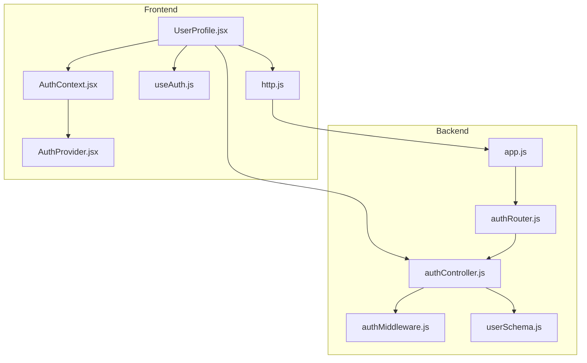
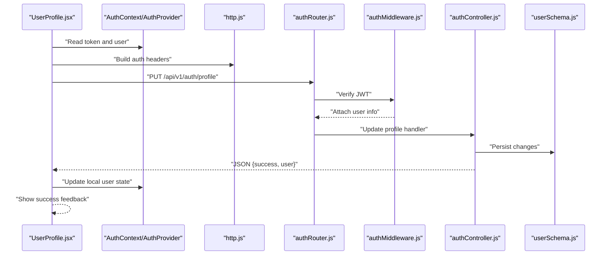
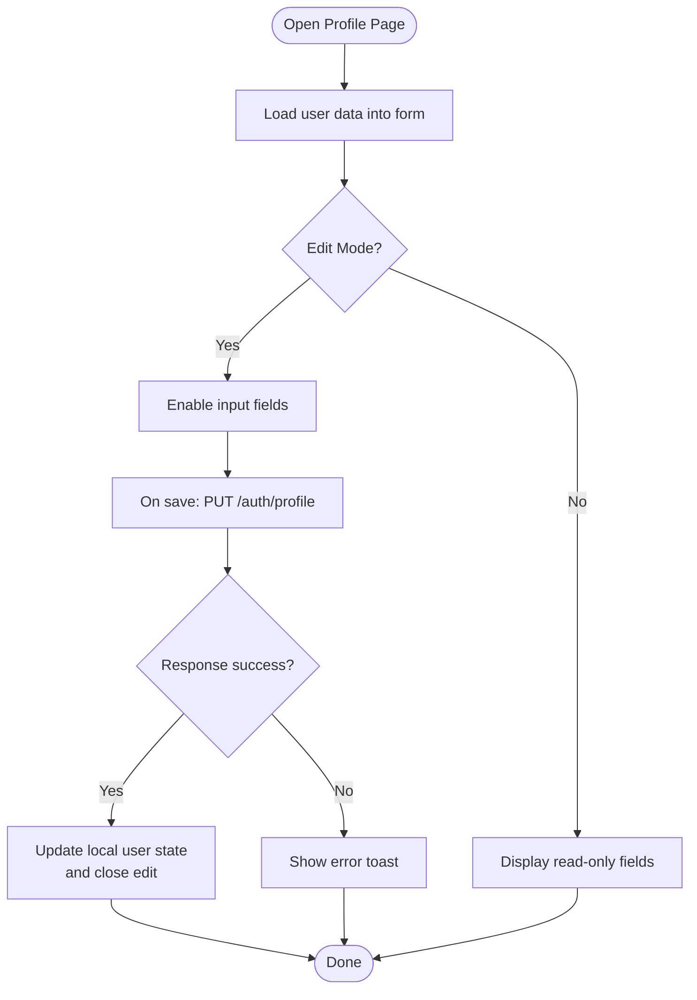
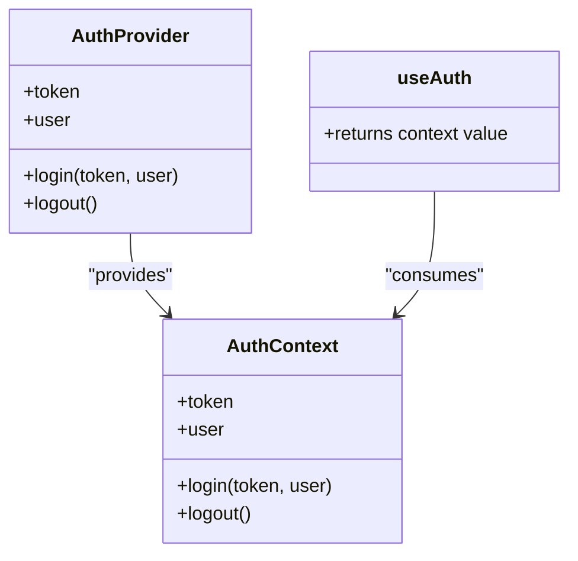
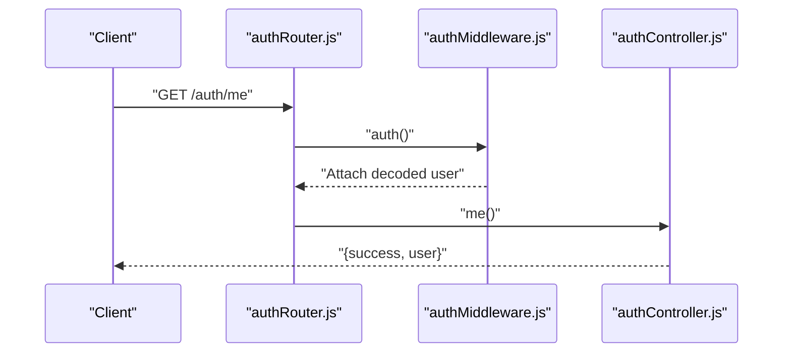
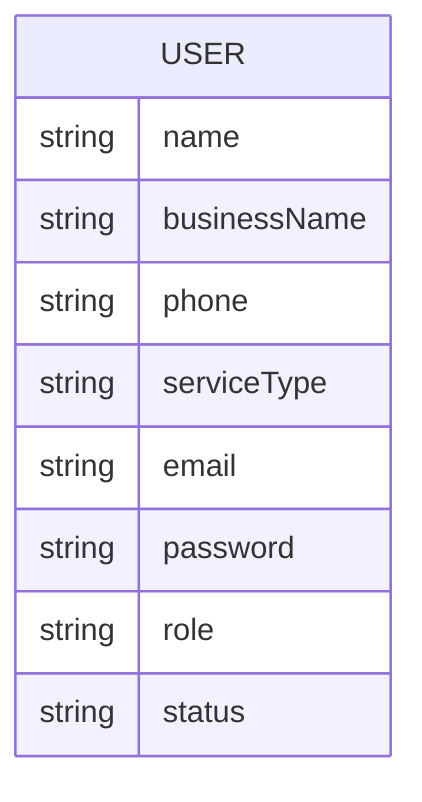
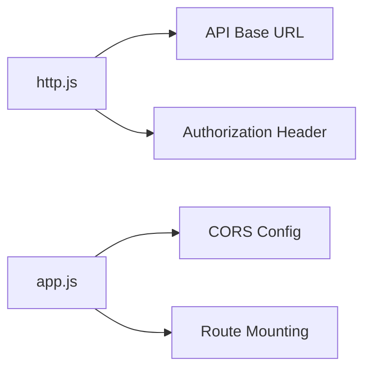
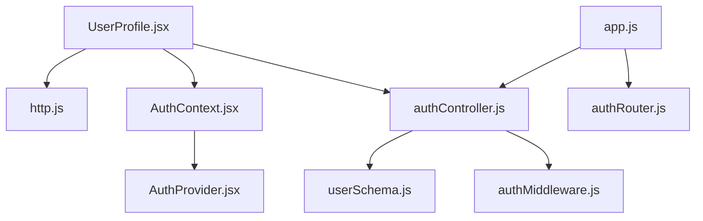

# Profile Management

<cite>
**Referenced Files in This Document**
- [userSchema.js](file://backend/models/userSchema.js)
- [authController.js](file://backend/controller/authController.js)
- [authRouter.js](file://backend/router/authRouter.js)
- [authMiddleware.js](file://backend/middleware/authMiddleware.js)
- [UserProfile.jsx](file://frontend/src/pages/dashboards/UserProfile.jsx)
- [AuthContext.jsx](file://frontend/src/context/AuthContext.jsx)
- [AuthProvider.jsx](file://frontend/src/context/AuthProvider.jsx)
- [useAuth.js](file://frontend/src/context/useAuth.js)
- [http.js](file://frontend/src/lib/http.js)
- [app.js](file://backend/app.js)
</cite>

## Table of Contents
1. [Introduction](#introduction)
2. [Project Structure](#project-structure)
3. [Core Components](#core-components)
4. [Architecture Overview](#architecture-overview)
5. [Detailed Component Analysis](#detailed-component-analysis)
6. [Dependency Analysis](#dependency-analysis)
7. [Performance Considerations](#performance-considerations)
8. [Troubleshooting Guide](#troubleshooting-guide)
9. [Conclusion](#conclusion)

## Introduction
This document explains the user profile management system, focusing on profile editing, personal information management, and account settings. It documents form validation, input handling, and data persistence, along with authentication-related profile features, password management, and security settings. It also covers profile picture upload, contact information management, and preference settings, with examples of profile update workflows, validation error handling, and user data security practices.

## Project Structure
The profile management system spans the frontend React application and the backend Express server:
- Frontend: A dedicated user dashboard page renders and updates profile fields, integrates with authentication context, and sends requests to the backend.
- Backend: Authentication routes expose protected endpoints, enforce JWT-based authorization, and manage user data retrieval and updates.

**Diagram sources**
- [UserProfile.jsx:1-268](file://frontend/src/pages/dashboards/UserProfile.jsx#L1-L268)
- [AuthContext.jsx:1-3](file://frontend/src/context/AuthContext.jsx#L1-L3)
- [AuthProvider.jsx:1-38](file://frontend/src/context/AuthProvider.jsx#L1-L38)
- [useAuth.js:1-6](file://frontend/src/context/useAuth.js#L1-L6)
- [http.js:1-5](file://frontend/src/lib/http.js#L1-L5)
- [app.js:1-91](file://backend/app.js#L1-L91)
- [authRouter.js:1-12](file://backend/router/authRouter.js#L1-L12)
- [authMiddleware.js:1-17](file://backend/middleware/authMiddleware.js#L1-L17)
- [authController.js:1-120](file://backend/controller/authController.js#L1-L120)
- [userSchema.js:1-55](file://backend/models/userSchema.js#L1-L55)

**Section sources**
- [UserProfile.jsx:1-268](file://frontend/src/pages/dashboards/UserProfile.jsx#L1-L268)
- [authRouter.js:1-12](file://backend/router/authRouter.js#L1-L12)
- [authController.js:1-120](file://backend/controller/authController.js#L1-L120)
- [authMiddleware.js:1-17](file://backend/middleware/authMiddleware.js#L1-L17)
- [userSchema.js:1-55](file://backend/models/userSchema.js#L1-L55)
- [http.js:1-5](file://frontend/src/lib/http.js#L1-L5)
- [app.js:1-91](file://backend/app.js#L1-L91)

## Core Components
- Frontend profile page: Manages form state, handles edits, validates inputs, and persists changes via HTTP requests.
- Authentication context: Stores and synchronizes the logged-in user session across the app.
- Backend authentication router and controller: Expose endpoints for retrieving and updating user data, enforcing JWT-based authorization.
- User model: Defines the schema for user data stored in the database, including personal and account attributes.

Key responsibilities:
- Profile editing: Capture user input, validate, and submit updates.
- Personal information management: Store and render name, email, phone, address, and bio.
- Account settings: Provide mechanisms for password updates and notification preferences.
- Security: Enforce JWT-based authentication and protect endpoints.

**Section sources**
- [UserProfile.jsx:1-268](file://frontend/src/pages/dashboards/UserProfile.jsx#L1-L268)
- [AuthContext.jsx:1-3](file://frontend/src/context/AuthContext.jsx#L1-L3)
- [AuthProvider.jsx:1-38](file://frontend/src/context/AuthProvider.jsx#L1-L38)
- [useAuth.js:1-6](file://frontend/src/context/useAuth.js#L1-L6)
- [authRouter.js:1-12](file://backend/router/authRouter.js#L1-L12)
- [authController.js:1-120](file://backend/controller/authController.js#L1-L120)
- [userSchema.js:1-55](file://backend/models/userSchema.js#L1-L55)

## Architecture Overview
The profile update workflow connects the frontend UI to the backend API and database through JWT-protected endpoints.

**Diagram sources**
- [UserProfile.jsx:38-62](file://frontend/src/pages/dashboards/UserProfile.jsx#L38-L62)
- [http.js:1-5](file://frontend/src/lib/http.js#L1-L5)
- [authRouter.js:7-9](file://backend/router/authRouter.js#L7-L9)
- [authMiddleware.js:3-16](file://backend/middleware/authMiddleware.js#L3-L16)
- [authController.js:109-119](file://backend/controller/authController.js#L109-L119)
- [userSchema.js:1-55](file://backend/models/userSchema.js#L1-L55)

## Detailed Component Analysis

### Frontend: User Profile Page
- State management: Tracks editing mode, loading state, and form data for name, email, phone, address, and bio.
- Input handling: Updates form state on change and disables fields when not in edit mode.
- Submission: Sends a PUT request to the backend with authentication headers and merges updated data into the local user state upon success.
- Feedback: Uses toast notifications for success and error messages.

**Diagram sources**
- [UserProfile.jsx:13-73](file://frontend/src/pages/dashboards/UserProfile.jsx#L13-L73)

**Section sources**
- [UserProfile.jsx:1-268](file://frontend/src/pages/dashboards/UserProfile.jsx#L1-L268)

### Authentication Context and Session
- Persists token and user data in local storage.
- Provides login and logout functions to synchronize state and storage.
- Supplies current token and user to consuming components.

**Diagram sources**
- [AuthProvider.jsx:1-38](file://frontend/src/context/AuthProvider.jsx#L1-L38)
- [AuthContext.jsx:1-3](file://frontend/src/context/AuthContext.jsx#L1-L3)
- [useAuth.js:1-6](file://frontend/src/context/useAuth.js#L1-L6)

**Section sources**
- [AuthProvider.jsx:1-38](file://frontend/src/context/AuthProvider.jsx#L1-L38)
- [AuthContext.jsx:1-3](file://frontend/src/context/AuthContext.jsx#L1-L3)
- [useAuth.js:1-6](file://frontend/src/context/useAuth.js#L1-L6)

### Backend: Authentication Router and Middleware
- Routes: Exposes POST /auth/register, POST /auth/login, and GET /auth/me.
- Middleware: Validates JWT from Authorization header; rejects missing or invalid tokens.
- Protected endpoints: Require a valid bearer token to access.

**Diagram sources**
- [authRouter.js:7-9](file://backend/router/authRouter.js#L7-L9)
- [authMiddleware.js:3-16](file://backend/middleware/authMiddleware.js#L3-L16)
- [authController.js:109-119](file://backend/controller/authController.js#L109-L119)

**Section sources**
- [authRouter.js:1-12](file://backend/router/authRouter.js#L1-L12)
- [authMiddleware.js:1-17](file://backend/middleware/authMiddleware.js#L1-L17)
- [authController.js:1-120](file://backend/controller/authController.js#L1-L120)

### Backend: User Model
- Schema fields include name, businessName, phone, serviceType, email, password, role, and status.
- Validation rules: Required fields, minimum lengths, unique email, and enum roles/status.
- Security note: Passwords are stored hashed; the schema excludes password from queries by default.

**Diagram sources**
- [userSchema.js:4-54](file://backend/models/userSchema.js#L4-L54)

**Section sources**
- [userSchema.js:1-55](file://backend/models/userSchema.js#L1-L55)

### HTTP Utilities and App Bootstrap
- Base URL and auth headers: Centralized constants for API base and Authorization header construction.
- App bootstrap: Registers routers and enables CORS for the configured frontend origin.

**Diagram sources**
- [http.js:1-5](file://frontend/src/lib/http.js#L1-L5)
- [app.js:24-47](file://backend/app.js#L24-L47)

**Section sources**
- [http.js:1-5](file://frontend/src/lib/http.js#L1-L5)
- [app.js:1-91](file://backend/app.js#L1-L91)

## Dependency Analysis
- Frontend depends on:
  - Authentication context for token and user state.
  - HTTP utilities for API base and headers.
  - Backend endpoints for profile updates.
- Backend depends on:
  - Router for route exposure.
  - Middleware for JWT verification.
  - Model for data persistence.

**Diagram sources**
- [UserProfile.jsx:1-268](file://frontend/src/pages/dashboards/UserProfile.jsx#L1-L268)
- [http.js:1-5](file://frontend/src/lib/http.js#L1-L5)
- [AuthContext.jsx:1-3](file://frontend/src/context/AuthContext.jsx#L1-L3)
- [AuthProvider.jsx:1-38](file://frontend/src/context/AuthProvider.jsx#L1-L38)
- [authController.js:1-120](file://backend/controller/authController.js#L1-L120)
- [userSchema.js:1-55](file://backend/models/userSchema.js#L1-L55)
- [authMiddleware.js:1-17](file://backend/middleware/authMiddleware.js#L1-L17)
- [app.js:1-91](file://backend/app.js#L1-L91)
- [authRouter.js:1-12](file://backend/router/authRouter.js#L1-L12)

**Section sources**
- [UserProfile.jsx:1-268](file://frontend/src/pages/dashboards/UserProfile.jsx#L1-L268)
- [authController.js:1-120](file://backend/controller/authController.js#L1-L120)
- [userSchema.js:1-55](file://backend/models/userSchema.js#L1-L55)
- [authMiddleware.js:1-17](file://backend/middleware/authMiddleware.js#L1-L17)
- [authRouter.js:1-12](file://backend/router/authRouter.js#L1-L12)
- [app.js:1-91](file://backend/app.js#L1-L91)

## Performance Considerations
- Minimize unnecessary re-renders: Keep form state granular and avoid excessive re-computation.
- Debounce network requests: Consider debouncing frequent updates if extending to real-time saving.
- Optimize image uploads: For profile pictures, use client-side compression and lazy loading to reduce bandwidth.
- Database writes: Batch updates when adding more fields to avoid redundant writes.

## Troubleshooting Guide
Common issues and resolutions:
- Unauthorized access: Ensure the Authorization header is present and valid; verify JWT secret and expiration.
- Validation errors: Confirm frontend form values meet backend constraints (e.g., required fields, minimum length).
- Persistence failures: Check database connectivity and model field definitions.
- CORS errors: Verify frontend origin matches backend CORS configuration.

Operational checks:
- Health endpoint: Use the health check to confirm backend availability.
- Configuration check: Verify Cloudinary configuration keys if integrating image uploads.

**Section sources**
- [authMiddleware.js:3-16](file://backend/middleware/authMiddleware.js#L3-L16)
- [authController.js:17-30](file://backend/controller/authController.js#L17-L30)
- [app.js:49-62](file://backend/app.js#L49-L62)

## Conclusion
The profile management system combines a clean frontend UI with robust backend authentication and data persistence. It supports editing personal information, enforcing validation, and maintaining secure sessions. Extending the system to include password updates, notification preferences, and profile picture uploads requires minimal additions while preserving the existing architecture and security model.