# Social and Interaction Features

<cite>
**Referenced Files in This Document**
- [followSchema.js](file://backend/models/followSchema.js)
- [ratingSchema.js](file://backend/models/ratingSchema.js)
- [reviewSchema.js](file://backend/models/reviewSchema.js)
- [messageSchema.js](file://backend/models/messageSchema.js)
- [followController.js](file://backend/controller/followController.js)
- [ratingController.js](file://backend/controller/ratingController.js)
- [reviewController.js](file://backend/controller/reviewController.js)
- [messageController.js](file://backend/controller/messageController.js)
- [followRouter.js](file://backend/router/followRouter.js)
- [ratingRouter.js](file://backend/router/ratingRouter.js)
- [reviewRouter.js](file://backend/router/reviewRouter.js)
- [messageRouter.js](file://backend/router/messageRouter.js)
- [FollowButton.jsx](file://frontend/src/components/FollowButton.jsx)
- [FollowMerchantButton.jsx](file://frontend/src/components/FollowMerchantButton.jsx)
- [StarRating.jsx](file://frontend/src/components/StarRating.jsx)
- [EventReviews.jsx](file://frontend/src/components/EventReviews.jsx)
- [UserBrowseEvents.jsx](file://frontend/src/pages/dashboards/UserBrowseEvents.jsx)
</cite>

## Table of Contents
1. [Introduction](#introduction)
2. [System Architecture](#system-architecture)
3. [Follow System](#follow-system)
4. [Rating and Review System](#rating-and-review-system)
5. [Messaging System](#messaging-system)
6. [Frontend Components](#frontend-components)
7. [API Endpoints](#api-endpoints)
8. [Data Models](#data-models)
9. [Security and Validation](#security-and-validation)
10. [Performance Considerations](#performance-considerations)
11. [Troubleshooting Guide](#troubleshooting-guide)
12. [Conclusion](#conclusion)

## Introduction

This document provides comprehensive documentation for the social and interaction features of the MERN Stack Event Management System. The platform enables users to engage with merchants through following mechanisms, rate and review events they've attended, and communicate via a contact messaging system. These features foster community engagement, build trust through social proof, and facilitate meaningful interactions between users and service providers.

The social features are built using MongoDB for data persistence, Express.js for backend APIs, React for the frontend interface, and Node.js for server-side logic. The system emphasizes user authentication, data validation, and real-time feedback through notifications and UI updates.

## System Architecture

The social and interaction features follow a layered architecture pattern with clear separation of concerns:

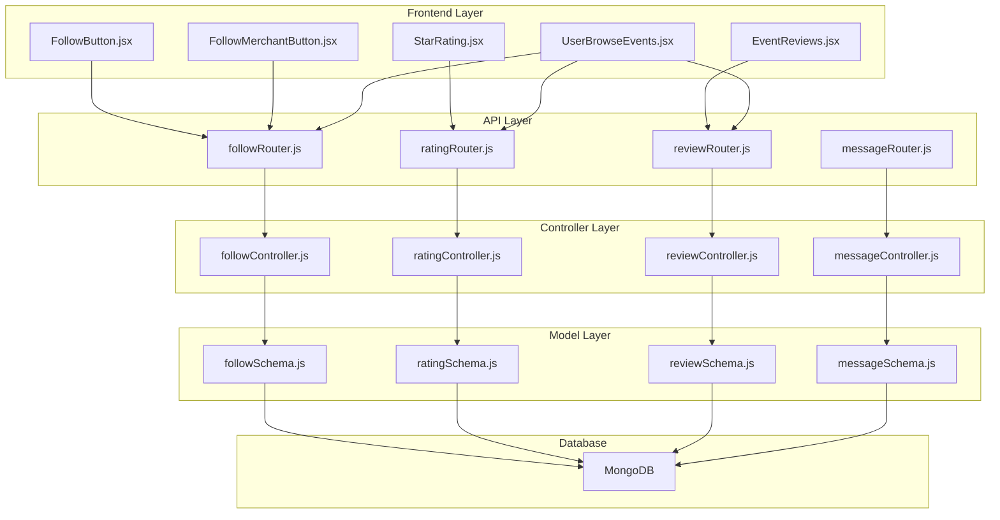

**Diagram sources**
- [followRouter.js:1-26](file://backend/router/followRouter.js#L1-L26)
- [ratingRouter.js:1-16](file://backend/router/ratingRouter.js#L1-L16)
- [reviewRouter.js:1-19](file://backend/router/reviewRouter.js#L1-L19)
- [messageRouter.js:1-9](file://backend/router/messageRouter.js#L1-L9)

## Follow System

The follow system enables users to follow merchants, building relationships and receiving notifications about merchant activities.

### Core Functionality

The follow system provides four primary operations:

1. **Follow a Merchant**: Users can subscribe to receive updates from merchants
2. **Unfollow a Merchant**: Users can unsubscribe from merchant updates
3. **Check Follow Status**: Verify if a user is currently following a specific merchant
4. **Manage Followers**: Merchants can view their follower list

### Implementation Details

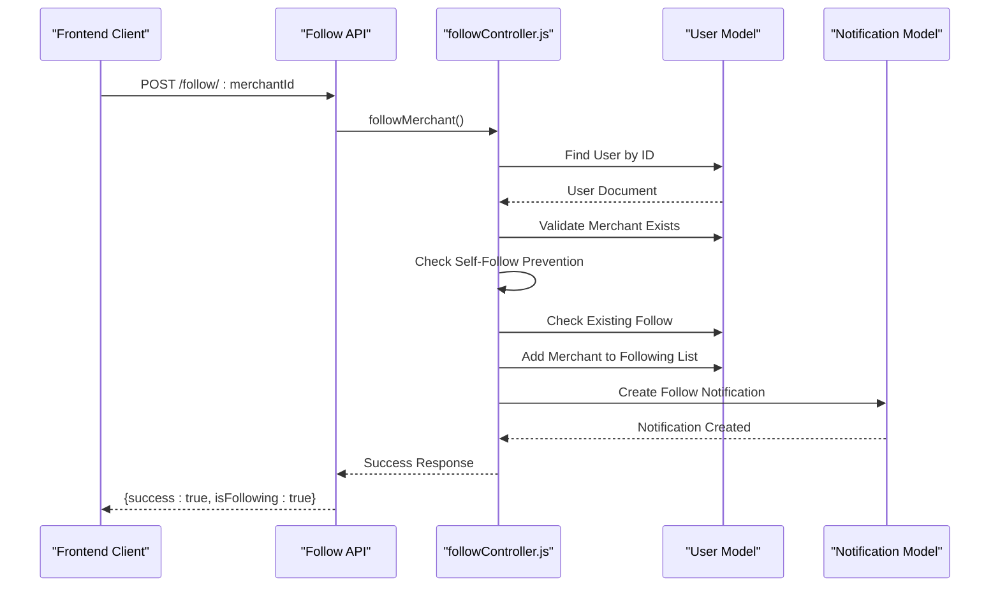

**Diagram sources**
- [followController.js:5-86](file://backend/controller/followController.js#L5-L86)
- [followRouter.js:14-15](file://backend/router/followRouter.js#L14-L15)

### Business Logic Flow

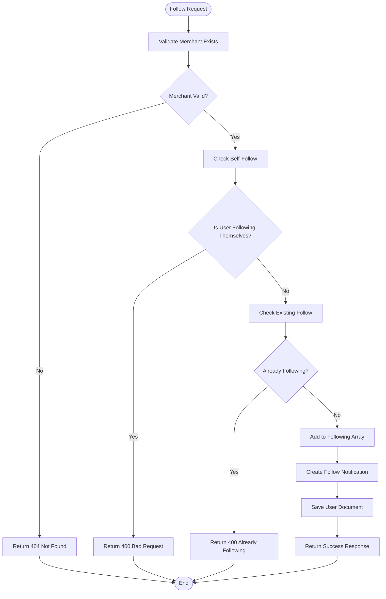

**Diagram sources**
- [followController.js:14-86](file://backend/controller/followController.js#L14-L86)

**Section sources**
- [followController.js:1-234](file://backend/controller/followController.js#L1-L234)
- [followSchema.js:1-22](file://backend/models/followSchema.js#L1-L22)

## Rating and Review System

The rating and review system allows users to evaluate events they've attended, providing valuable feedback for both merchants and other users.

### Dual Evaluation System

The platform implements a two-tier evaluation system:

1. **Star Ratings**: Quantitative numerical ratings (1-5 stars)
2. **Written Reviews**: Qualitative textual feedback with optional star ratings

### Rating Workflow

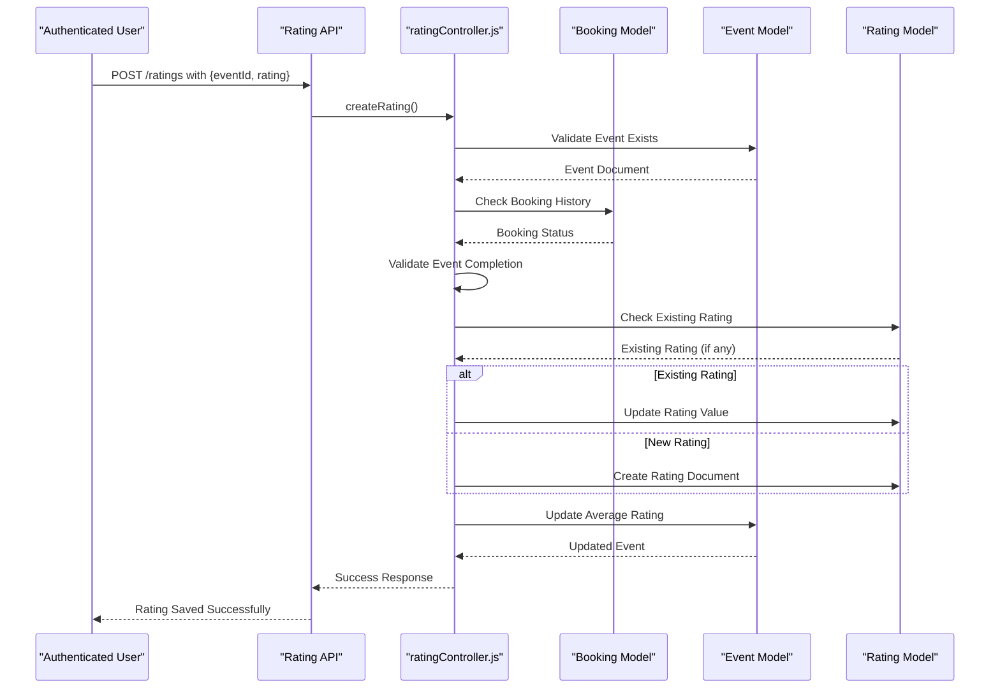

**Diagram sources**
- [ratingController.js:6-89](file://backend/controller/ratingController.js#L6-L89)

### Review Management

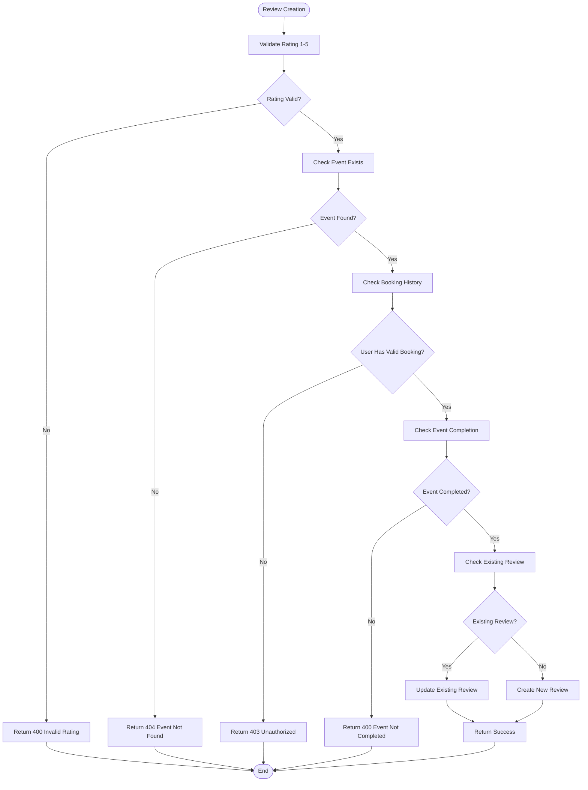

**Diagram sources**
- [reviewController.js:6-92](file://backend/controller/reviewController.js#L6-L92)

**Section sources**
- [ratingController.js:1-161](file://backend/controller/ratingController.js#L1-L161)
- [reviewController.js:1-195](file://backend/controller/reviewController.js#L1-L195)
- [ratingSchema.js:1-28](file://backend/models/ratingSchema.js#L1-L28)
- [reviewSchema.js:1-17](file://backend/models/reviewSchema.js#L1-L17)

## Messaging System

The messaging system provides a contact form for users to send inquiries to administrators or support teams.

### Message Validation

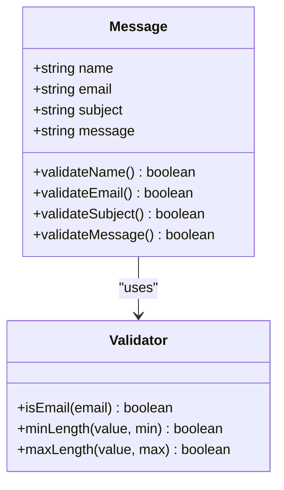

**Diagram sources**
- [messageSchema.js:1-28](file://backend/models/messageSchema.js#L1-L28)

### Message Flow

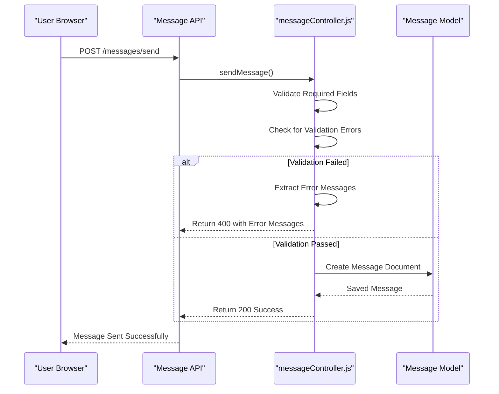

**Diagram sources**
- [messageController.js:3-44](file://backend/controller/messageController.js#L3-L44)

**Section sources**
- [messageController.js:1-44](file://backend/controller/messageController.js#L1-L44)
- [messageSchema.js:1-28](file://backend/models/messageSchema.js#L1-L28)

## Frontend Components

The frontend implements intuitive user interfaces for all social features, ensuring seamless user experiences.

### Follow Button Component

The FollowButton component provides a responsive interface for following/unfollowing merchants with real-time status updates.

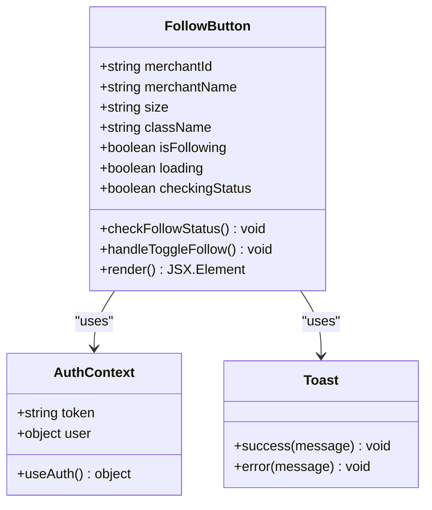

**Diagram sources**
- [FollowButton.jsx:9-121](file://frontend/src/components/FollowButton.jsx#L9-L121)

### Star Rating Component

The StarRating component offers an interactive rating interface supporting both display and input modes.

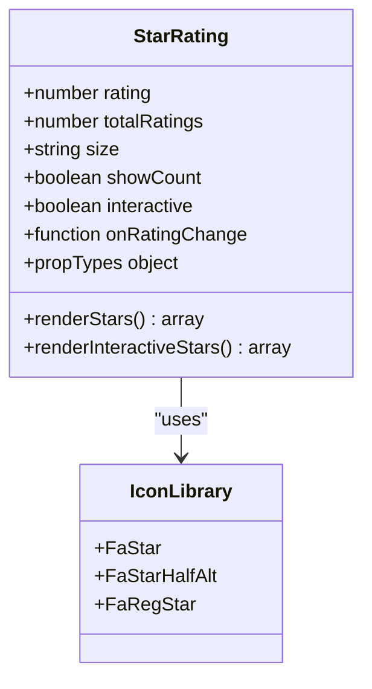

**Diagram sources**
- [StarRating.jsx:4-102](file://frontend/src/components/StarRating.jsx#L4-L102)

### Event Reviews Component

The EventReviews component displays paginated reviews with user avatars and formatted dates.

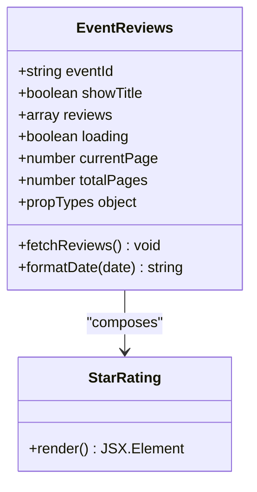

**Diagram sources**
- [EventReviews.jsx:7-145](file://frontend/src/components/EventReviews.jsx#L7-L145)

**Section sources**
- [FollowButton.jsx:1-121](file://frontend/src/components/FollowButton.jsx#L1-L121)
- [FollowMerchantButton.jsx:1-117](file://frontend/src/components/FollowMerchantButton.jsx#L1-L117)
- [StarRating.jsx:1-102](file://frontend/src/components/StarRating.jsx#L1-L102)
- [EventReviews.jsx:1-145](file://frontend/src/components/EventReviews.jsx#L1-L145)
- [UserBrowseEvents.jsx:1-483](file://frontend/src/pages/dashboards/UserBrowseEvents.jsx#L1-L483)

## API Endpoints

The social features expose RESTful APIs with proper authentication and authorization.

### Follow API Endpoints

| Method | Endpoint | Description | Authentication |
|--------|----------|-------------|----------------|
| POST | `/api/follow/follow/:merchantId` | Follow a merchant | Required |
| DELETE | `/api/follow/unfollow/:merchantId` | Unfollow a merchant | Required |
| GET | `/api/follow/status/:merchantId` | Check follow status | Required |
| GET | `/api/follow/following` | Get user's following merchants | Required |
| GET | `/api/follow/followers` | Get merchant's followers | Required |

### Rating API Endpoints

| Method | Endpoint | Description | Authentication |
|--------|----------|-------------|----------------|
| POST | `/api/ratings` | Create or update rating | Required |
| GET | `/api/ratings/event/:eventId` | Get event ratings | Optional |
| GET | `/api/ratings/my-ratings` | Get user's ratings | Required |

### Review API Endpoints

| Method | Endpoint | Description | Authentication |
|--------|----------|-------------|----------------|
| POST | `/api/reviews` | Create or update review | Required |
| GET | `/api/reviews/event/:eventId` | Get event reviews | Optional |
| GET | `/api/reviews/my-reviews` | Get user's reviews | Required |
| DELETE | `/api/reviews/:reviewId` | Delete review | Required |
| GET | `/api/reviews/latest` | Get latest reviews | Optional |

### Message API Endpoints

| Method | Endpoint | Description | Authentication |
|--------|----------|-------------|----------------|
| POST | `/api/messages/send` | Send contact message | Optional |

**Section sources**
- [followRouter.js:1-26](file://backend/router/followRouter.js#L1-L26)
- [ratingRouter.js:1-16](file://backend/router/ratingRouter.js#L1-L16)
- [reviewRouter.js:1-19](file://backend/router/reviewRouter.js#L1-L19)
- [messageRouter.js:1-9](file://backend/router/messageRouter.js#L1-L9)

## Data Models

The social features utilize MongoDB schemas with appropriate indexing and validation.

### Follow Schema

The follow relationship model ensures referential integrity and prevents duplicate follow relationships.

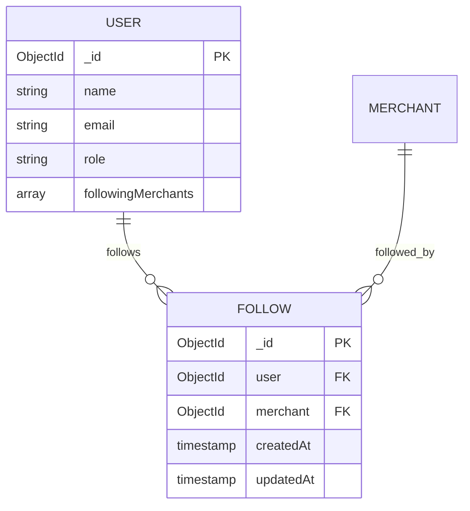

**Diagram sources**
- [followSchema.js:3-22](file://backend/models/followSchema.js#L3-L22)

### Rating Schema

The rating model enforces uniqueness per user-event pair and maintains rating boundaries.

```mermaid
erDiagram
USER ||--o{ RATING : "rates"
EVENT ||--o{ RATING : "rated_by"
RATING {
ObjectId _id PK
ObjectId user FK
ObjectId event FK
number rating
timestamp createdAt
timestamp updatedAt
}
INDEX { "user,event" unique: true }
```

**Diagram sources**
- [ratingSchema.js:3-28](file://backend/models/ratingSchema.js#L3-L28)

### Review Schema

The review model extends ratings with optional textual feedback and maintains similar uniqueness constraints.

```mermaid
erDiagram
USER ||--o{ REVIEW : "writes"
EVENT ||--o{ REVIEW : "reviewed"
REVIEW {
ObjectId _id PK
ObjectId user FK
ObjectId event FK
number rating
string reviewText
timestamp createdAt
timestamp updatedAt
}
INDEX { "user,event" unique: true }
```

**Diagram sources**
- [reviewSchema.js:3-17](file://backend/models/reviewSchema.js#L3-L17)

**Section sources**
- [followSchema.js:1-22](file://backend/models/followSchema.js#L1-L22)
- [ratingSchema.js:1-28](file://backend/models/ratingSchema.js#L1-L28)
- [reviewSchema.js:1-17](file://backend/models/reviewSchema.js#L1-L17)

## Security and Validation

The system implements comprehensive security measures and input validation.

### Authentication Middleware

All social endpoints require authentication through JWT tokens. The auth middleware validates tokens and attaches user context to requests.

### Input Validation

Each endpoint implements robust validation:

- **Follow System**: Merchant existence checks, self-follow prevention, duplicate prevention
- **Rating System**: Event completion verification, booking validation, rating range enforcement
- **Review System**: Similar validations as ratings plus text content sanitization
- **Message System**: Comprehensive field validation with custom error messages

### Authorization Patterns

- **Resource Ownership**: Users can only modify their own reviews and ratings
- **Role-Based Access**: Follow functionality is restricted to users (not merchants)
- **Permission Checks**: Event completion verification prevents premature ratings

**Section sources**
- [followController.js:14-86](file://backend/controller/followController.js#L14-L86)
- [ratingController.js:12-50](file://backend/controller/ratingController.js#L12-L50)
- [reviewController.js:12-50](file://backend/controller/reviewController.js#L12-L50)
- [messageController.js:6-42](file://backend/controller/messageController.js#L6-L42)

## Performance Considerations

The social features are optimized for performance and scalability:

### Database Indexing

- Unique compound indexes on `(user, merchant)` for follow relationships
- Unique compound indexes on `(user, event)` for ratings and reviews
- Proper indexing on timestamps for sorting and pagination

### Query Optimization

- Population queries limit fields to reduce payload size
- Pagination implementation for review lists
- Efficient aggregation for event rating calculations

### Frontend Optimizations

- Lazy loading for image-heavy components
- Debounced search functionality
- Local storage caching for user preferences
- Optimistic UI updates for immediate feedback

### Caching Strategies

- Client-side caching for follow status
- CDN optimization for static assets
- Database query result caching for frequently accessed data

## Troubleshooting Guide

### Common Issues and Solutions

#### Follow System Issues

**Problem**: Cannot follow a merchant
**Solution**: Verify user is not following themselves and merchant exists

**Problem**: Follow status not updating
**Solution**: Check authentication token validity and network connectivity

#### Rating System Issues

**Problem**: Cannot rate an event
**Solution**: Ensure user has valid booking and event has completed

**Problem**: Average rating calculation errors
**Solution**: Verify rating data consistency and handle division by zero

#### Review System Issues

**Problem**: Review deletion fails
**Solution**: Confirm user owns the review and has proper permissions

**Problem**: Pagination issues
**Solution**: Check limit and page parameters, verify total count calculation

#### Frontend Issues

**Problem**: Button state inconsistencies
**Solution**: Implement proper loading states and error handling

**Problem**: Real-time updates not appearing
**Solution**: Verify WebSocket connections and cache invalidation

**Section sources**
- [followController.js:79-85](file://backend/controller/followController.js#L79-L85)
- [ratingController.js:82-88](file://backend/controller/ratingController.js#L82-L88)
- [reviewController.js:173-179](file://backend/controller/reviewController.js#L173-L179)

## Conclusion

The social and interaction features of the Event Management System provide a comprehensive foundation for community building and user engagement. The implementation demonstrates strong architectural principles with clear separation of concerns, robust validation, and thoughtful user experience design.

Key strengths include:

- **Modular Design**: Clean separation between models, controllers, and routes
- **Security Focus**: Comprehensive authentication and authorization mechanisms
- **User Experience**: Intuitive interfaces with real-time feedback
- **Scalability**: Optimized queries and efficient data modeling
- **Maintainability**: Well-structured code with clear documentation

The system successfully balances functionality with performance, providing users with meaningful ways to engage with the platform while maintaining data integrity and system reliability. Future enhancements could include real-time notifications, advanced analytics, and expanded social features such as user profiles and activity feeds.