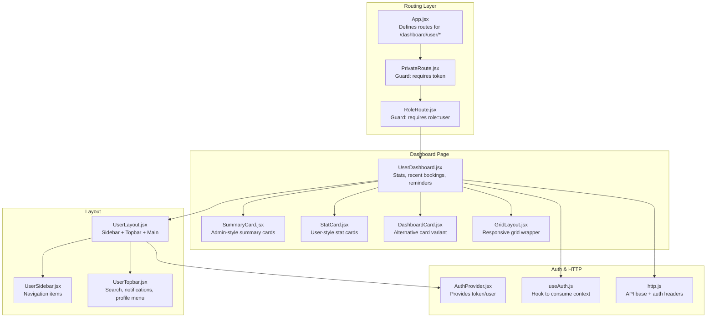
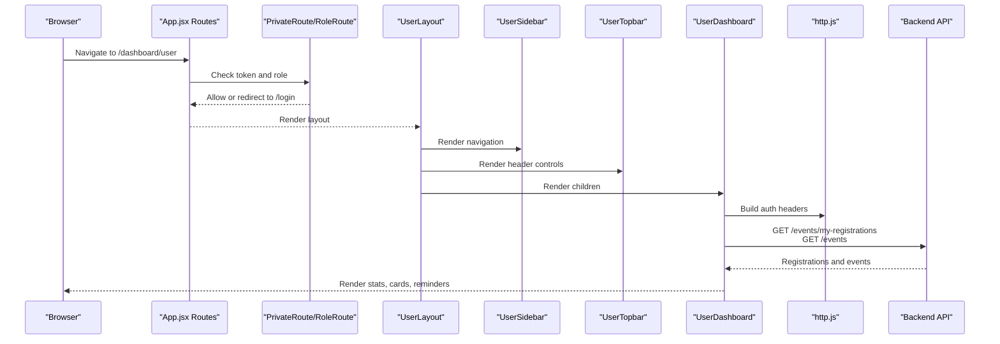
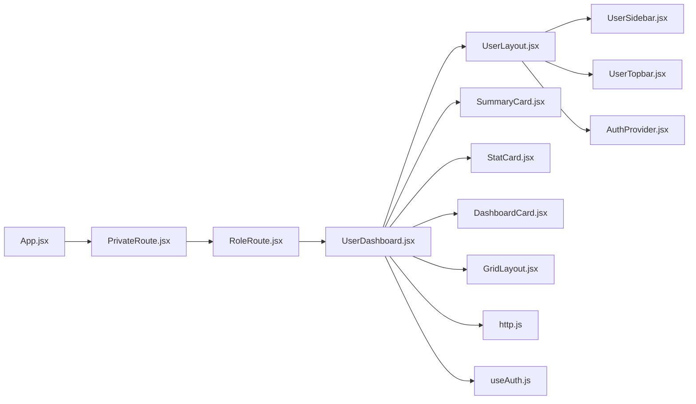
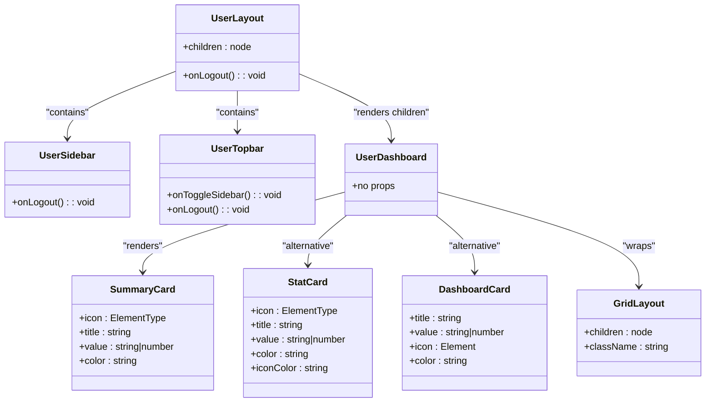

# User Dashboard

<cite>
**Referenced Files in This Document**
- [UserDashboard.jsx](file://frontend/src/pages/dashboards/UserDashboard.jsx)
- [UserLayout.jsx](file://frontend/src/components/user/UserLayout.jsx)
- [UserSidebar.jsx](file://frontend/src/components/user/UserSidebar.jsx)
- [UserTopbar.jsx](file://frontend/src/components/user/UserTopbar.jsx)
- [StatCard.jsx](file://frontend/src/components/user/StatCard.jsx)
- [DashboardCard.jsx](file://frontend/src/components/DashboardCard.jsx)
- [SummaryCard.jsx](file://frontend/src/components/admin/SummaryCard.jsx)
- [GridLayout.jsx](file://frontend/src/components/common/GridLayout.jsx)
- [http.js](file://frontend/src/lib/http.js)
- [App.jsx](file://frontend/src/App.jsx)
- [PrivateRoute.jsx](file://frontend/src/components/PrivateRoute.jsx)
- [RoleRoute.jsx](file://frontend/src/components/RoleRoute.jsx)
- [AuthProvider.jsx](file://frontend/src/context/AuthProvider.jsx)
- [useAuth.js](file://frontend/src/context/useAuth.js)
</cite>

## Table of Contents
1. [Introduction](#introduction)
2. [Project Structure](#project-structure)
3. [Core Components](#core-components)
4. [Architecture Overview](#architecture-overview)
5. [Detailed Component Analysis](#detailed-component-analysis)
6. [Dependency Analysis](#dependency-analysis)
7. [Performance Considerations](#performance-considerations)
8. [Troubleshooting Guide](#troubleshooting-guide)
9. [Conclusion](#conclusion)
10. [Appendices](#appendices)

## Introduction
This document describes the User Dashboard system, focusing on the layout architecture, sidebar navigation, topbar components, and statistical cards. It explains how dashboard cards are rendered, how layout management works, and how responsive design is implemented. It also documents user statistics display, recent activity tracking, and quick-access features, including component hierarchy, prop requirements, styling patterns, customization examples, and user-specific content rendering.

## Project Structure
The User Dashboard is implemented as a page component that composes reusable layout and UI building blocks. Routing ensures only authenticated users with the correct role can access the dashboard.

**Diagram sources**
- [App.jsx:76-127](file://frontend/src/App.jsx#L76-L127)
- [PrivateRoute.jsx:5-9](file://frontend/src/components/PrivateRoute.jsx#L5-L9)
- [RoleRoute.jsx:5-9](file://frontend/src/components/RoleRoute.jsx#L5-L9)
- [UserLayout.jsx:7-23](file://frontend/src/components/user/UserLayout.jsx#L7-L23)
- [UserSidebar.jsx:29-54](file://frontend/src/components/user/UserSidebar.jsx#L29-L54)
- [UserTopbar.jsx:9-77](file://frontend/src/components/user/UserTopbar.jsx#L9-L77)
- [UserDashboard.jsx:11-245](file://frontend/src/pages/dashboards/UserDashboard.jsx#L11-L245)
- [SummaryCard.jsx:1-25](file://frontend/src/components/admin/SummaryCard.jsx#L1-L25)
- [StatCard.jsx:1-28](file://frontend/src/components/user/StatCard.jsx#L1-L28)
- [DashboardCard.jsx:1-25](file://frontend/src/components/DashboardCard.jsx#L1-L25)
- [GridLayout.jsx:1-18](file://frontend/src/components/common/GridLayout.jsx#L1-L18)
- [AuthProvider.jsx:5-32](file://frontend/src/context/AuthProvider.jsx#L5-L32)
- [useAuth.js:1-6](file://frontend/src/context/useAuth.js#L1-L6)
- [http.js:1-5](file://frontend/src/lib/http.js#L1-L5)

**Section sources**
- [App.jsx:76-127](file://frontend/src/App.jsx#L76-L127)
- [UserLayout.jsx:7-23](file://frontend/src/components/user/UserLayout.jsx#L7-L23)
- [UserSidebar.jsx:29-54](file://frontend/src/components/user/UserSidebar.jsx#L29-L54)
- [UserTopbar.jsx:9-77](file://frontend/src/components/user/UserTopbar.jsx#L9-L77)
- [UserDashboard.jsx:11-245](file://frontend/src/pages/dashboards/UserDashboard.jsx#L11-L245)

## Core Components
- UserDashboard: Orchestrates data loading, computes stats, renders summary cards, recent bookings, and notifications.
- UserLayout: Provides the container with fixed sidebar and sticky topbar, and passes logout handler.
- UserSidebar: Navigation drawer with icons and labels, highlighting active route.
- UserTopbar: Search bar, notifications bell, and user dropdown menu.
- SummaryCard: Admin-styled summary card used for stats.
- StatCard: User-styled stat card variant.
- DashboardCard: Alternative card variant with larger typography and icon circle.
- GridLayout: Utility grid wrapper for responsive column layouts.
- Auth and HTTP: Authentication provider, hooks, and HTTP helpers for protected requests.

Key responsibilities and props:
- UserDashboard: Loads user registrations and events, generates notifications, computes stats, and renders UI sections.
- UserLayout: Accepts children; exposes onLogout callback.
- UserSidebar: Accepts onLogout callback; renders navigation items.
- UserTopbar: Accepts onToggleSidebar and onLogout callbacks.
- SummaryCard: Requires icon, title, value; optional color.
- StatCard: Requires icon, title, value; optional color/iconColor.
- DashboardCard: Requires title, value, icon, color.
- GridLayout: Accepts children and optional className.

**Section sources**
- [UserDashboard.jsx:11-245](file://frontend/src/pages/dashboards/UserDashboard.jsx#L11-L245)
- [UserLayout.jsx:7-27](file://frontend/src/components/user/UserLayout.jsx#L7-L27)
- [UserSidebar.jsx:29-59](file://frontend/src/components/user/UserSidebar.jsx#L29-L59)
- [UserTopbar.jsx:9-85](file://frontend/src/components/user/UserTopbar.jsx#L9-L85)
- [SummaryCard.jsx:1-25](file://frontend/src/components/admin/SummaryCard.jsx#L1-L25)
- [StatCard.jsx:1-28](file://frontend/src/components/user/StatCard.jsx#L1-L28)
- [DashboardCard.jsx:1-25](file://frontend/src/components/DashboardCard.jsx#L1-L25)
- [GridLayout.jsx:1-18](file://frontend/src/components/common/GridLayout.jsx#L1-L18)

## Architecture Overview
The dashboard follows a layered architecture:
- Routing layer enforces authentication and role checks.
- Layout layer provides consistent sidebar and topbar.
- Page layer handles data fetching, computation, and rendering.
- UI components encapsulate presentation and interactivity.

**Diagram sources**
- [App.jsx:76-127](file://frontend/src/App.jsx#L76-L127)
- [PrivateRoute.jsx:5-9](file://frontend/src/components/PrivateRoute.jsx#L5-L9)
- [RoleRoute.jsx:5-9](file://frontend/src/components/RoleRoute.jsx#L5-L9)
- [UserLayout.jsx:7-23](file://frontend/src/components/user/UserLayout.jsx#L7-L23)
- [UserSidebar.jsx:29-54](file://frontend/src/components/user/UserSidebar.jsx#L29-L54)
- [UserTopbar.jsx:9-77](file://frontend/src/components/user/UserTopbar.jsx#L9-L77)
- [UserDashboard.jsx:27-50](file://frontend/src/pages/dashboards/UserDashboard.jsx#L27-L50)
- [http.js:1-5](file://frontend/src/lib/http.js#L1-L5)

## Detailed Component Analysis

### UserDashboard
Responsibilities:
- Fetch user registrations and events via authenticated endpoints.
- Compute statistics (bookings, upcoming, saved, notifications).
- Render summary cards, recent bookings, and upcoming reminders.
- Provide quick navigation to browse events and view all bookings.

Data and rendering highlights:
- Uses Promise.all to fetch registrations and events concurrently.
- Generates notifications from upcoming registrations.
- Computes status badges for event cards based on date comparison.
- Renders event cards with category-based fallback images or explicit image.
- Uses grid layouts for responsive card rows.

Prop requirements:
- None (consumes auth context and navigates internally).

Styling patterns:
- Grid-based layouts for cards with consistent gaps and column counts.
- Tailwind utilities for spacing, shadows, borders, and hover effects.
- Status badges and gradient overlays on event images.

Customization examples:
- Replace SummaryCard with StatCard or DashboardCard by swapping imports and adjusting props.
- Adjust gridTemplateColumns to change number of columns per breakpoint.
- Modify notification generation logic to include filters or different triggers.

**Section sources**
- [UserDashboard.jsx:11-245](file://frontend/src/pages/dashboards/UserDashboard.jsx#L11-L245)
- [http.js:1-5](file://frontend/src/lib/http.js#L1-L5)

### UserLayout
Responsibilities:
- Fixed sidebar and sticky topbar container.
- Passes logout handler to child components.

Props:
- children: node (required).

Behavior:
- Calls logout and navigates to /login when triggered.

**Section sources**
- [UserLayout.jsx:7-27](file://frontend/src/components/user/UserLayout.jsx#L7-L27)

### UserSidebar
Responsibilities:
- Navigation drawer with links to dashboard sections.
- Active link highlighting using NavLink.
- Logout button bound to parent’s onLogout.

Props:
- onLogout: func (optional).

Navigation items:
- Dashboard, Browse Events, My Bookings, Saved Events, Notifications, My Profile, Back to Home.

**Section sources**
- [UserSidebar.jsx:29-59](file://frontend/src/components/user/UserSidebar.jsx#L29-L59)

### UserTopbar
Responsibilities:
- Brand header, mobile hamburger toggle, desktop search input.
- Notification bell and user dropdown menu with profile and logout actions.

Props:
- onToggleSidebar: func (optional)
- onLogout: func (optional)

**Section sources**
- [UserTopbar.jsx:9-85](file://frontend/src/components/user/UserTopbar.jsx#L9-L85)

### SummaryCard (Admin)
Responsibilities:
- Displays a title, value, and icon with a colored badge.
- Hover scaling effect on the icon container.

Props:
- icon: element type (required)
- title: string (required)
- value: string | number (required)
- color: string (optional, default bg-blue-600)

**Section sources**
- [SummaryCard.jsx:1-25](file://frontend/src/components/admin/SummaryCard.jsx#L1-L25)

### StatCard (User)
Responsibilities:
- Compact stat card with icon in a colored circle and value below title.

Props:
- icon: element type (required)
- title: string (required)
- value: string | number (required)
- color: string (optional, default bg-blue-50)
- iconColor: string (optional, default text-blue-600)

**Section sources**
- [StatCard.jsx:1-28](file://frontend/src/components/user/StatCard.jsx#L1-L28)

### DashboardCard
Responsibilities:
- Larger card with prominent value and icon circle.

Props:
- title: string (required)
- value: string | number (required)
- icon: element (required)
- color: string (required)

**Section sources**
- [DashboardCard.jsx:1-25](file://frontend/src/components/DashboardCard.jsx#L1-L25)

### GridLayout
Responsibilities:
- Wraps children in a responsive grid with configurable columns and gap.

Props:
- children: node (required)
- className: string (optional)

**Section sources**
- [GridLayout.jsx:1-18](file://frontend/src/components/common/GridLayout.jsx#L1-L18)

### Authentication and HTTP
- AuthProvider stores token and user in state and local storage.
- useAuth exposes token and user to components.
- http.js provides API base URL and a helper to build Authorization headers.
- PrivateRoute redirects unauthenticated users to /login.
- RoleRoute restricts access to users with role=user.

**Section sources**
- [AuthProvider.jsx:5-32](file://frontend/src/context/AuthProvider.jsx#L5-L32)
- [useAuth.js:1-6](file://frontend/src/context/useAuth.js#L1-L6)
- [http.js:1-5](file://frontend/src/lib/http.js#L1-L5)
- [PrivateRoute.jsx:5-9](file://frontend/src/components/PrivateRoute.jsx#L5-L9)
- [RoleRoute.jsx:5-9](file://frontend/src/components/RoleRoute.jsx#L5-L9)

## Dependency Analysis
The dashboard page depends on layout, UI components, and shared utilities. The routing layer enforces authentication and role checks before rendering the page.

**Diagram sources**
- [App.jsx:76-127](file://frontend/src/App.jsx#L76-L127)
- [PrivateRoute.jsx:5-9](file://frontend/src/components/PrivateRoute.jsx#L5-L9)
- [RoleRoute.jsx:5-9](file://frontend/src/components/RoleRoute.jsx#L5-L9)
- [UserDashboard.jsx:11-245](file://frontend/src/pages/dashboards/UserDashboard.jsx#L11-L245)
- [UserLayout.jsx:7-23](file://frontend/src/components/user/UserLayout.jsx#L7-L23)
- [UserSidebar.jsx:29-54](file://frontend/src/components/user/UserSidebar.jsx#L29-L54)
- [UserTopbar.jsx:9-77](file://frontend/src/components/user/UserTopbar.jsx#L9-L77)
- [SummaryCard.jsx:1-25](file://frontend/src/components/admin/SummaryCard.jsx#L1-L25)
- [StatCard.jsx:1-28](file://frontend/src/components/user/StatCard.jsx#L1-L28)
- [DashboardCard.jsx:1-25](file://frontend/src/components/DashboardCard.jsx#L1-L25)
- [GridLayout.jsx:1-18](file://frontend/src/components/common/GridLayout.jsx#L1-L18)
- [http.js:1-5](file://frontend/src/lib/http.js#L1-L5)
- [AuthProvider.jsx:5-32](file://frontend/src/context/AuthProvider.jsx#L5-L32)
- [useAuth.js:1-6](file://frontend/src/context/useAuth.js#L1-L6)

**Section sources**
- [App.jsx:76-127](file://frontend/src/App.jsx#L76-L127)
- [UserDashboard.jsx:11-245](file://frontend/src/pages/dashboards/UserDashboard.jsx#L11-L245)

## Performance Considerations
- Concurrent data fetching: The dashboard uses concurrent requests for registrations and events to reduce total load time.
- Local storage caching: Saved events are loaded from localStorage to avoid unnecessary network calls.
- Minimal re-renders: useCallback is used for data loaders to prevent unnecessary recalculations.
- Responsive grids: Tailwind’s responsive utilities ensure efficient rendering across breakpoints.

[No sources needed since this section provides general guidance]

## Troubleshooting Guide
Common issues and resolutions:
- Unauthorized access: Ensure PrivateRoute and RoleRoute guards are present in the route configuration.
- Missing authentication state: Verify AuthProvider initializes token and user from localStorage.
- Network errors: Confirm API base URL and Authorization headers are correctly applied.
- Empty states: Recent bookings card displays a friendly message when no bookings are found.

**Section sources**
- [App.jsx:76-127](file://frontend/src/App.jsx#L76-L127)
- [AuthProvider.jsx:5-32](file://frontend/src/context/AuthProvider.jsx#L5-L32)
- [http.js:1-5](file://frontend/src/lib/http.js#L1-L5)
- [UserDashboard.jsx:117-127](file://frontend/src/pages/dashboards/UserDashboard.jsx#L117-L127)

## Conclusion
The User Dashboard integrates a clean layout with robust navigation and topbar components, and presents user-centric data through summary cards and recent activity. Its modular design supports easy customization, responsive layouts, and secure access via authentication and role guards.

[No sources needed since this section summarizes without analyzing specific files]

## Appendices

### Component Hierarchy and Props Summary

**Diagram sources**
- [UserLayout.jsx:7-27](file://frontend/src/components/user/UserLayout.jsx#L7-L27)
- [UserSidebar.jsx:29-59](file://frontend/src/components/user/UserSidebar.jsx#L29-L59)
- [UserTopbar.jsx:9-85](file://frontend/src/components/user/UserTopbar.jsx#L9-L85)
- [UserDashboard.jsx:11-245](file://frontend/src/pages/dashboards/UserDashboard.jsx#L11-L245)
- [SummaryCard.jsx:1-25](file://frontend/src/components/admin/SummaryCard.jsx#L1-L25)
- [StatCard.jsx:1-28](file://frontend/src/components/user/StatCard.jsx#L1-L28)
- [DashboardCard.jsx:1-25](file://frontend/src/components/DashboardCard.jsx#L1-L25)
- [GridLayout.jsx:1-18](file://frontend/src/components/common/GridLayout.jsx#L1-L18)

### Example: Replacing SummaryCard with StatCard
- Replace import of SummaryCard with StatCard in UserDashboard.
- Adjust props to match StatCard signature (icon, title, value, optional colors).
- Keep grid layout unchanged; StatCard is designed for compact presentation.

**Section sources**
- [UserDashboard.jsx:98-103](file://frontend/src/pages/dashboards/UserDashboard.jsx#L98-L103)
- [StatCard.jsx:1-28](file://frontend/src/components/user/StatCard.jsx#L1-L28)

### Example: Using DashboardCard Instead of SummaryCard
- Import DashboardCard and render similarly to SummaryCard.
- Use color classes for the icon circle and adjust typography sizes accordingly.

**Section sources**
- [DashboardCard.jsx:1-25](file://frontend/src/components/DashboardCard.jsx#L1-L25)
- [UserDashboard.jsx:98-103](file://frontend/src/pages/dashboards/UserDashboard.jsx#L98-L103)

### Example: Responsive Grid Adjustment
- Modify grid classes in UserDashboard or wrap sections with GridLayout for consistent responsive behavior.

**Section sources**
- [UserDashboard.jsx:98-103](file://frontend/src/pages/dashboards/UserDashboard.jsx#L98-L103)
- [GridLayout.jsx:1-18](file://frontend/src/components/common/GridLayout.jsx#L1-L18)