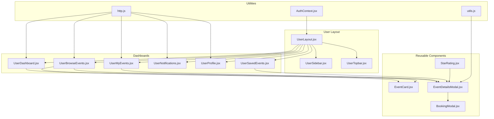
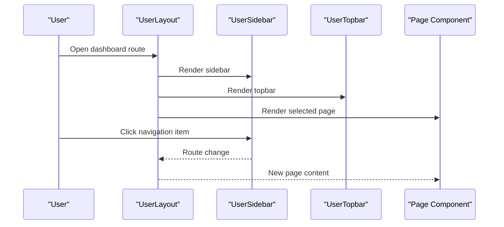
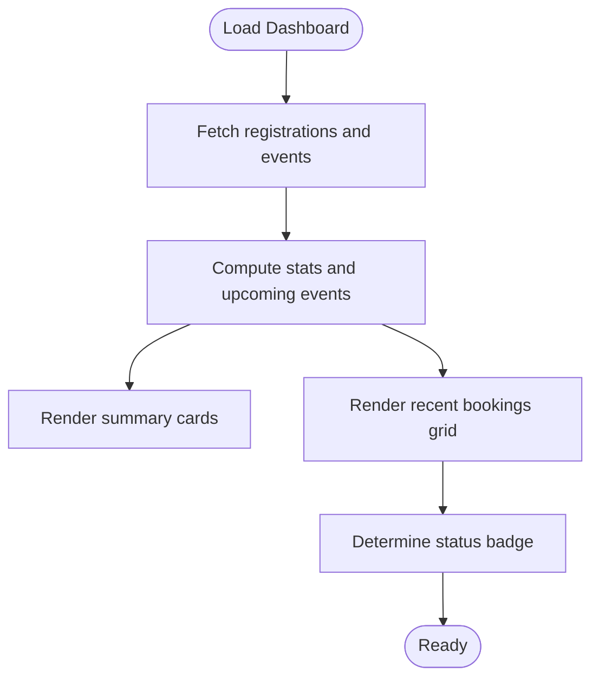
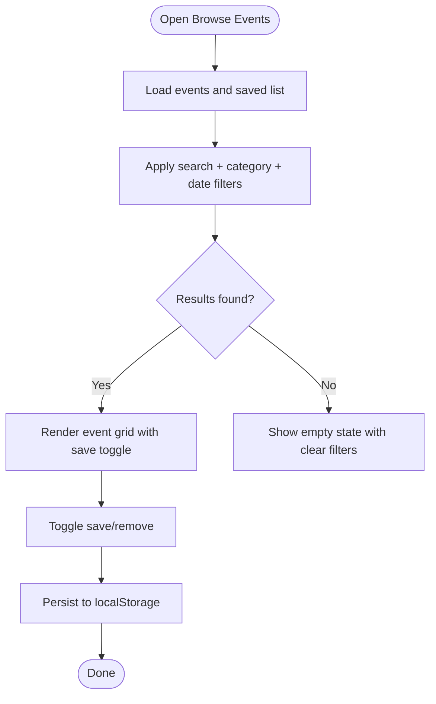
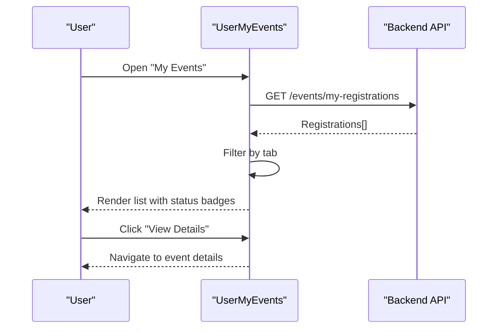
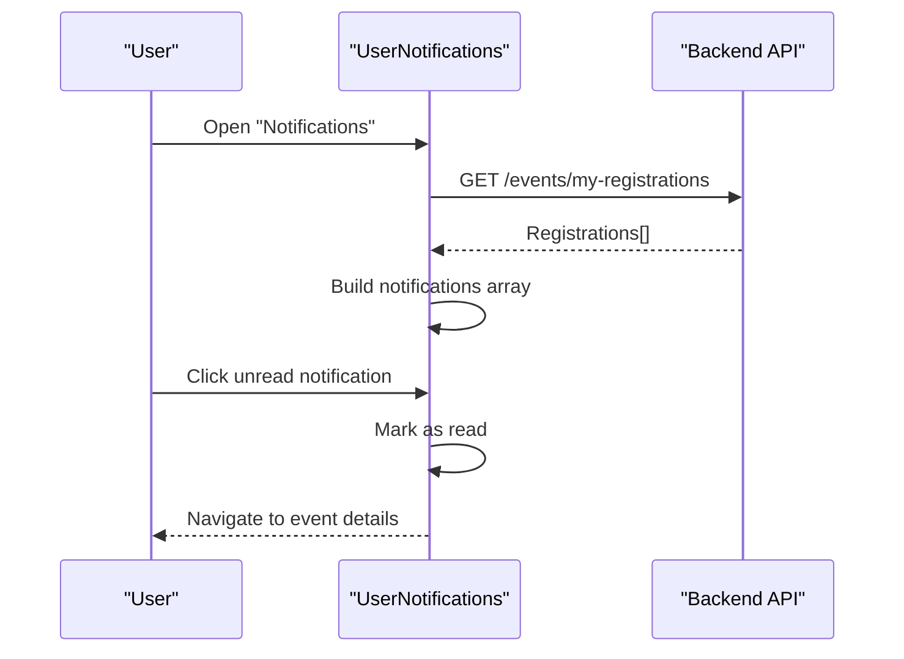
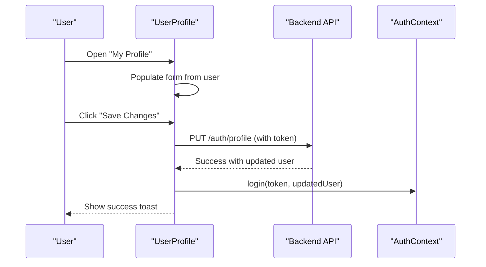
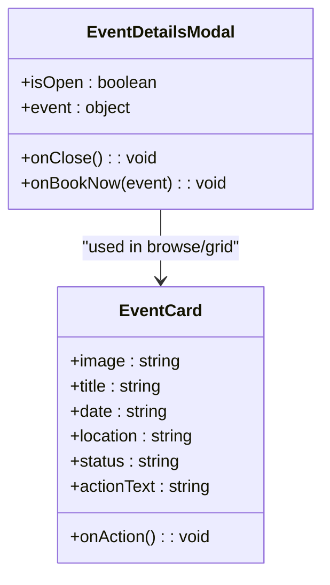
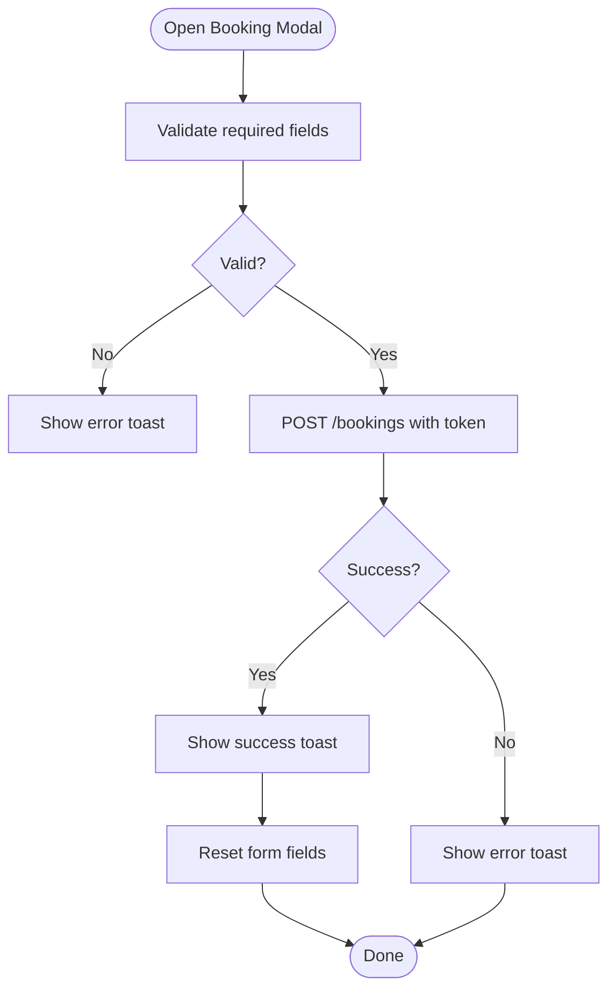
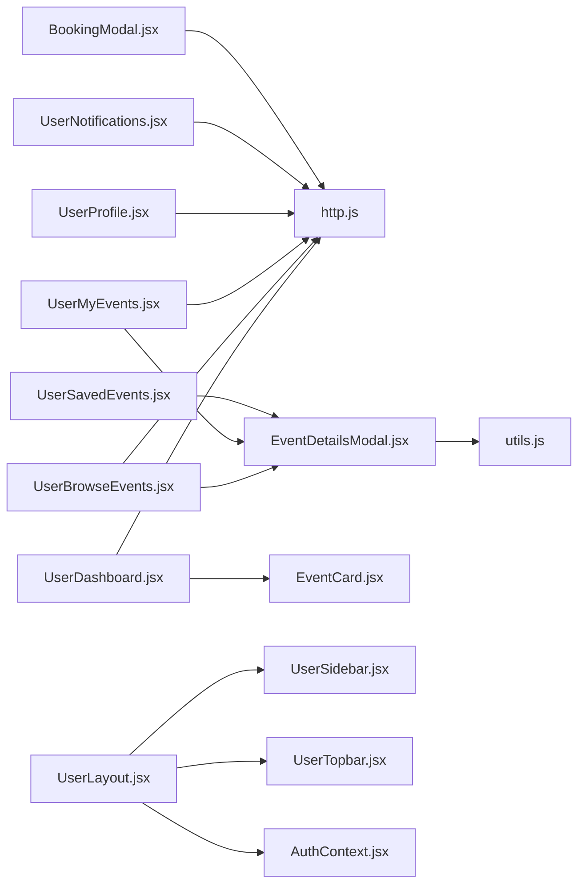

# User Features

<cite>
**Referenced Files in This Document**
- [UserDashboard.jsx](file://frontend/src/pages/dashboards/UserDashboard.jsx)
- [UserBrowseEvents.jsx](file://frontend/src/pages/dashboards/UserBrowseEvents.jsx)
- [UserMyEvents.jsx](file://frontend/src/pages/dashboards/UserMyEvents.jsx)
- [UserNotifications.jsx](file://frontend/src/pages/dashboards/UserNotifications.jsx)
- [UserProfile.jsx](file://frontend/src/pages/dashboards/UserProfile.jsx)
- [UserSavedEvents.jsx](file://frontend/src/pages/dashboards/UserSavedEvents.jsx)
- [UserLayout.jsx](file://frontend/src/components/user/UserLayout.jsx)
- [UserSidebar.jsx](file://frontend/src/components/user/UserSidebar.jsx)
- [UserTopbar.jsx](file://frontend/src/components/user/UserTopbar.jsx)
- [EventCard.jsx](file://frontend/src/components/user/EventCard.jsx)
- [EventDetailsModal.jsx](file://frontend/src/components/EventDetailsModal.jsx)
- [BookingModal.jsx](file://frontend/src/components/BookingModal.jsx)
- [StarRating.jsx](file://frontend/src/components/StarRating.jsx)
- [http.js](file://frontend/src/lib/http.js)
- [utils.js](file://frontend/src/lib/utils.js)
- [AuthContext.jsx](file://frontend/src/context/AuthContext.jsx)
</cite>

## Table of Contents
1. [Introduction](#introduction)
2. [Project Structure](#project-structure)
3. [Core Components](#core-components)
4. [Architecture Overview](#architecture-overview)
5. [Detailed Component Analysis](#detailed-component-analysis)
6. [Dependency Analysis](#dependency-analysis)
7. [Performance Considerations](#performance-considerations)
8. [Accessibility and UX Best Practices](#accessibility-and-ux-best-practices)
9. [Troubleshooting Guide](#troubleshooting-guide)
10. [Conclusion](#conclusion)
11. [Appendices](#appendices)

## Introduction
This document describes the user-facing features of the Event Management Platform’s dashboard UI. It covers the user dashboard, event browsing and search, personal booking management, profile editing, and the notification system. It also documents reusable user-specific components such as event cards, event details modals, booking forms, and rating systems. The guide explains user workflows, form validation behavior, interaction patterns, accessibility considerations, responsive design, and practical examples of common tasks.

## Project Structure
The user dashboard is organized around a shared layout with a sidebar and topbar, and page-level dashboards for browsing, bookings, notifications, profile, and saved events. Reusable components support event presentation, modals, and ratings.

**Diagram sources**
- [UserLayout.jsx:1-30](file://frontend/src/components/user/UserLayout.jsx#L1-L30)
- [UserSidebar.jsx:1-62](file://frontend/src/components/user/UserSidebar.jsx#L1-L62)
- [UserTopbar.jsx:1-85](file://frontend/src/components/user/UserTopbar.jsx#L1-L85)
- [UserDashboard.jsx:1-249](file://frontend/src/pages/dashboards/UserDashboard.jsx#L1-L249)
- [UserBrowseEvents.jsx:1-379](file://frontend/src/pages/dashboards/UserBrowseEvents.jsx#L1-L379)
- [UserMyEvents.jsx:1-242](file://frontend/src/pages/dashboards/UserMyEvents.jsx#L1-L242)
- [UserNotifications.jsx:1-155](file://frontend/src/pages/dashboards/UserNotifications.jsx#L1-L155)
- [UserProfile.jsx:1-268](file://frontend/src/pages/dashboards/UserProfile.jsx#L1-L268)
- [UserSavedEvents.jsx:1-146](file://frontend/src/pages/dashboards/UserSavedEvents.jsx#L1-L146)
- [EventCard.jsx:1-45](file://frontend/src/components/user/EventCard.jsx#L1-L45)
- [EventDetailsModal.jsx:1-158](file://frontend/src/components/EventDetailsModal.jsx#L1-L158)
- [BookingModal.jsx:1-317](file://frontend/src/components/BookingModal.jsx#L1-L317)
- [StarRating.jsx:1-102](file://frontend/src/components/StarRating.jsx#L1-L102)
- [http.js:1-5](file://frontend/src/lib/http.js#L1-L5)
- [utils.js:1-26](file://frontend/src/lib/utils.js#L1-L26)
- [AuthContext.jsx:1-3](file://frontend/src/context/AuthContext.jsx#L1-L3)

**Section sources**
- [UserLayout.jsx:1-30](file://frontend/src/components/user/UserLayout.jsx#L1-L30)
- [UserSidebar.jsx:1-62](file://frontend/src/components/user/UserSidebar.jsx#L1-L62)
- [UserTopbar.jsx:1-85](file://frontend/src/components/user/UserTopbar.jsx#L1-L85)
- [UserDashboard.jsx:1-249](file://frontend/src/pages/dashboards/UserDashboard.jsx#L1-L249)
- [UserBrowseEvents.jsx:1-379](file://frontend/src/pages/dashboards/UserBrowseEvents.jsx#L1-L379)
- [UserMyEvents.jsx:1-242](file://frontend/src/pages/dashboards/UserMyEvents.jsx#L1-L242)
- [UserNotifications.jsx:1-155](file://frontend/src/pages/dashboards/UserNotifications.jsx#L1-L155)
- [UserProfile.jsx:1-268](file://frontend/src/pages/dashboards/UserProfile.jsx#L1-L268)
- [UserSavedEvents.jsx:1-146](file://frontend/src/pages/dashboards/UserSavedEvents.jsx#L1-L146)
- [EventCard.jsx:1-45](file://frontend/src/components/user/EventCard.jsx#L1-L45)
- [EventDetailsModal.jsx:1-158](file://frontend/src/components/EventDetailsModal.jsx#L1-L158)
- [BookingModal.jsx:1-317](file://frontend/src/components/BookingModal.jsx#L1-L317)
- [StarRating.jsx:1-102](file://frontend/src/components/StarRating.jsx#L1-L102)
- [http.js:1-5](file://frontend/src/lib/http.js#L1-L5)
- [utils.js:1-26](file://frontend/src/lib/utils.js#L1-L26)
- [AuthContext.jsx:1-3](file://frontend/src/context/AuthContext.jsx#L1-L3)

## Core Components
- UserLayout: Provides the shared layout with sidebar and topbar, handles logout redirection.
- UserSidebar: Navigation menu linking to all user dashboards.
- UserTopbar: Top navigation bar with branding, search, notifications, and user dropdown.
- EventCard: Lightweight card for displaying event metadata and actions.
- EventDetailsModal: Rich modal for event details, gallery, features, organizer, and booking.
- BookingModal: Form for booking services with validation and totals.
- StarRating: Read-only or interactive star rating component.

**Section sources**
- [UserLayout.jsx:1-30](file://frontend/src/components/user/UserLayout.jsx#L1-L30)
- [UserSidebar.jsx:1-62](file://frontend/src/components/user/UserSidebar.jsx#L1-L62)
- [UserTopbar.jsx:1-85](file://frontend/src/components/user/UserTopbar.jsx#L1-L85)
- [EventCard.jsx:1-45](file://frontend/src/components/user/EventCard.jsx#L1-L45)
- [EventDetailsModal.jsx:1-158](file://frontend/src/components/EventDetailsModal.jsx#L1-L158)
- [BookingModal.jsx:1-317](file://frontend/src/components/BookingModal.jsx#L1-L317)
- [StarRating.jsx:1-102](file://frontend/src/components/StarRating.jsx#L1-L102)

## Architecture Overview
The user dashboards are rendered inside a layout that injects a persistent sidebar and topbar. Navigation is handled via React Router links. HTTP communication uses a shared base URL and bearer token headers. Utilities compute event status and provide helper functions.

**Diagram sources**
- [UserLayout.jsx:1-30](file://frontend/src/components/user/UserLayout.jsx#L1-L30)
- [UserSidebar.jsx:1-62](file://frontend/src/components/user/UserSidebar.jsx#L1-L62)
- [UserTopbar.jsx:1-85](file://frontend/src/components/user/UserTopbar.jsx#L1-L85)

**Section sources**
- [UserLayout.jsx:1-30](file://frontend/src/components/user/UserLayout.jsx#L1-L30)
- [UserSidebar.jsx:1-62](file://frontend/src/components/user/UserSidebar.jsx#L1-L62)
- [UserTopbar.jsx:1-85](file://frontend/src/components/user/UserTopbar.jsx#L1-L85)
- [http.js:1-5](file://frontend/src/lib/http.js#L1-L5)

## Detailed Component Analysis

### User Dashboard
The dashboard presents summary cards, recent bookings, and upcoming reminders. It loads user registrations and events, computes stats, and renders a grid of event cards with status badges.

Key behaviors:
- Loads data concurrently for registrations and events.
- Generates notifications for upcoming events.
- Renders summary cards and recent bookings grid.
- Uses a helper to compute status badges based on event dates.

**Diagram sources**
- [UserDashboard.jsx:27-88](file://frontend/src/pages/dashboards/UserDashboard.jsx#L27-L88)

**Section sources**
- [UserDashboard.jsx:1-249](file://frontend/src/pages/dashboards/UserDashboard.jsx#L1-L249)

### Event Browsing and Search
Users can browse events, apply filters (category, date range), and search by title, description, or location. Saved events are stored locally.

Key behaviors:
- Fetches events and sets initial filtered list.
- Applies search term, category, and date filters.
- Supports toggling save/unsave with local storage persistence.
- Displays loading state and empty results with clear filters option.

**Diagram sources**
- [UserBrowseEvents.jsx:24-119](file://frontend/src/pages/dashboards/UserBrowseEvents.jsx#L24-L119)

**Section sources**
- [UserBrowseEvents.jsx:1-379](file://frontend/src/pages/dashboards/UserBrowseEvents.jsx#L1-L379)

### Personal Booking Management
The “My Events” page lists all user registrations with tabs for all, upcoming, and past. It shows event images, dates, locations, statuses, and allows viewing details.

Key behaviors:
- Fetches registrations and computes counts.
- Filters by tab selection.
- Determines status icons/colors and formats dates.
- Navigates to event details on button click.

**Diagram sources**
- [UserMyEvents.jsx:21-87](file://frontend/src/pages/dashboards/UserMyEvents.jsx#L21-L87)

**Section sources**
- [UserMyEvents.jsx:1-242](file://frontend/src/pages/dashboards/UserMyEvents.jsx#L1-L242)

### Notification System
The notifications page aggregates upcoming event reminders and displays system messages. Users can click notifications to navigate to related events.

Key behaviors:
- Loads registrations and generates upcoming event notifications.
- Formats relative dates (Today, Tomorrow, In X days).
- Marks notifications as read on click and navigates to event details.

**Diagram sources**
- [UserNotifications.jsx:21-85](file://frontend/src/pages/dashboards/UserNotifications.jsx#L21-L85)

**Section sources**
- [UserNotifications.jsx:1-155](file://frontend/src/pages/dashboards/UserNotifications.jsx#L1-L155)

### Profile Editing
The profile page supports editing personal information, with real-time updates to the local user context after successful save.

Key behaviors:
- Initializes form from current user data.
- Submits PUT to update profile with bearer token.
- Updates local auth context and shows success/error feedback.

**Diagram sources**
- [UserProfile.jsx:38-62](file://frontend/src/pages/dashboards/UserProfile.jsx#L38-L62)
- [http.js:1-5](file://frontend/src/lib/http.js#L1-L5)
- [AuthContext.jsx:1-3](file://frontend/src/context/AuthContext.jsx#L1-L3)

**Section sources**
- [UserProfile.jsx:1-268](file://frontend/src/pages/dashboards/UserProfile.jsx#L1-L268)
- [http.js:1-5](file://frontend/src/lib/http.js#L1-L5)
- [AuthContext.jsx:1-3](file://frontend/src/context/AuthContext.jsx#L1-L3)

### Saved Events
The saved events page reads from local storage and allows removing items or navigating to book now.

Key behaviors:
- Loads saved events from localStorage on mount.
- Removes items and updates storage.
- Renders cards with category badges and action buttons.

**Section sources**
- [UserSavedEvents.jsx:1-146](file://frontend/src/pages/dashboards/UserSavedEvents.jsx#L1-L146)

### Event Cards and Details
Event cards present image, title, date, location, and action. The event details modal shows a gallery, features, organizer info, and a booking action.

Key behaviors:
- EventCard props include image, title, date, location, status, and action handler.
- EventDetailsModal computes status via utility, renders gallery and features, and disables booking for past/sold-out events.

**Diagram sources**
- [EventCard.jsx:1-45](file://frontend/src/components/user/EventCard.jsx#L1-L45)
- [EventDetailsModal.jsx:1-158](file://frontend/src/components/EventDetailsModal.jsx#L1-L158)

**Section sources**
- [EventCard.jsx:1-45](file://frontend/src/components/user/EventCard.jsx#L1-L45)
- [EventDetailsModal.jsx:1-158](file://frontend/src/components/EventDetailsModal.jsx#L1-L158)
- [utils.js:1-26](file://frontend/src/lib/utils.js#L1-L26)

### Booking Forms
The booking modal validates required fields, calculates total price, and posts to the backend with bearer token.

Key behaviors:
- Validates presence of event date.
- Enforces minimum guest count and date constraints.
- Computes total price and shows breakdown.
- Handles success/error feedback and resets form on success.

**Diagram sources**
- [BookingModal.jsx:17-61](file://frontend/src/components/BookingModal.jsx#L17-L61)

**Section sources**
- [BookingModal.jsx:1-317](file://frontend/src/components/BookingModal.jsx#L1-L317)
- [http.js:1-5](file://frontend/src/lib/http.js#L1-L5)

### Rating Systems
The star rating component supports read-only display and interactive selection. It renders full, half, and empty stars and optionally shows rating count.

Key behaviors:
- Renders stars based on fractional rating.
- Supports interactive mode with callbacks.
- Allows configurable sizes and optional total count display.

**Section sources**
- [StarRating.jsx:1-102](file://frontend/src/components/StarRating.jsx#L1-L102)

## Dependency Analysis
- Pages depend on the layout and share HTTP utilities for authenticated requests.
- EventDetailsModal depends on a utility to compute event status.
- BookingModal depends on HTTP utilities and auth context for tokens.
- Local storage is used for saved events in browse and saved pages.

**Diagram sources**
- [UserDashboard.jsx:1-249](file://frontend/src/pages/dashboards/UserDashboard.jsx#L1-L249)
- [UserBrowseEvents.jsx:1-379](file://frontend/src/pages/dashboards/UserBrowseEvents.jsx#L1-L379)
- [UserMyEvents.jsx:1-242](file://frontend/src/pages/dashboards/UserMyEvents.jsx#L1-L242)
- [UserNotifications.jsx:1-155](file://frontend/src/pages/dashboards/UserNotifications.jsx#L1-L155)
- [UserProfile.jsx:1-268](file://frontend/src/pages/dashboards/UserProfile.jsx#L1-L268)
- [UserSavedEvents.jsx:1-146](file://frontend/src/pages/dashboards/UserSavedEvents.jsx#L1-L146)
- [EventDetailsModal.jsx:1-158](file://frontend/src/components/EventDetailsModal.jsx#L1-L158)
- [EventCard.jsx:1-45](file://frontend/src/components/user/EventCard.jsx#L1-L45)
- [UserLayout.jsx:1-30](file://frontend/src/components/user/UserLayout.jsx#L1-L30)
- [UserSidebar.jsx:1-62](file://frontend/src/components/user/UserSidebar.jsx#L1-L62)
- [UserTopbar.jsx:1-85](file://frontend/src/components/user/UserTopbar.jsx#L1-L85)
- [http.js:1-5](file://frontend/src/lib/http.js#L1-L5)
- [utils.js:1-26](file://frontend/src/lib/utils.js#L1-L26)
- [AuthContext.jsx:1-3](file://frontend/src/context/AuthContext.jsx#L1-L3)

**Section sources**
- [http.js:1-5](file://frontend/src/lib/http.js#L1-L5)
- [utils.js:1-26](file://frontend/src/lib/utils.js#L1-L26)
- [AuthContext.jsx:1-3](file://frontend/src/context/AuthContext.jsx#L1-L3)

## Performance Considerations
- Batch API calls: The dashboard fetches registrations and events concurrently to reduce load time.
- Local caching: Saved events are persisted in localStorage to avoid repeated network requests.
- Minimal re-renders: Filtering and status computations are performed in memory; keep lists reasonably sized to maintain responsiveness.
- Modal rendering: Modals are conditionally rendered and unmount when closed to minimize DOM overhead.

[No sources needed since this section provides general guidance]

## Accessibility and UX Best Practices
- Keyboard navigation: Ensure focus order is logical and visible focus indicators are present in modals and forms.
- Screen reader support: Use semantic HTML and aria attributes where appropriate (e.g., roles for modals).
- Color contrast: Maintain sufficient contrast for status badges and interactive elements.
- Responsive breakpoints: The UI uses responsive grids and flex layouts; verify touch-friendly sizing for mobile.
- Feedback: Toast notifications and loading states improve perceived performance and usability.
- Clear affordances: Buttons and interactive elements should clearly indicate state (enabled/disabled).

[No sources needed since this section provides general guidance]

## Troubleshooting Guide
Common issues and resolutions:
- Authentication errors: Ensure the auth token is present and valid; verify bearer header usage in HTTP utilities.
- Network failures: Check API base URL and CORS configuration; confirm backend availability.
- Empty results: After applying filters, use the “Clear Filters” option to reset search and filters.
- Booking failures: Confirm required fields are filled and the event is not in a past/sold-out state.
- Local storage: If saved events disappear, verify browser storage permissions and clearing behavior.

**Section sources**
- [http.js:1-5](file://frontend/src/lib/http.js#L1-L5)
- [UserBrowseEvents.jsx:69-74](file://frontend/src/pages/dashboards/UserBrowseEvents.jsx#L69-L74)
- [BookingModal.jsx:55-61](file://frontend/src/components/BookingModal.jsx#L55-L61)
- [EventDetailsModal.jsx:133-138](file://frontend/src/components/EventDetailsModal.jsx#L133-L138)

## Conclusion
The user dashboard provides a cohesive, responsive experience for discovering, managing, and organizing events. With integrated browsing, filtering, notifications, profile editing, and booking flows, users can efficiently manage their event lifecycle. Reusable components and shared utilities ensure consistency and maintainability across the interface.

[No sources needed since this section summarizes without analyzing specific files]

## Appendices

### Common User Tasks and Patterns
- Browse and save events: Use the search box and filters; toggle save on event cards; revisit saved events later.
- Book an event: Open event details, review status, and use the booking action to open the booking modal; fill required fields and submit.
- Manage bookings: View upcoming/past events, see status badges, and navigate to event details for updates.
- Receive reminders: Check notifications for upcoming events and click to view details.
- Update profile: Open profile, edit fields, and save changes; the UI reflects updates immediately.

[No sources needed since this section provides general guidance]