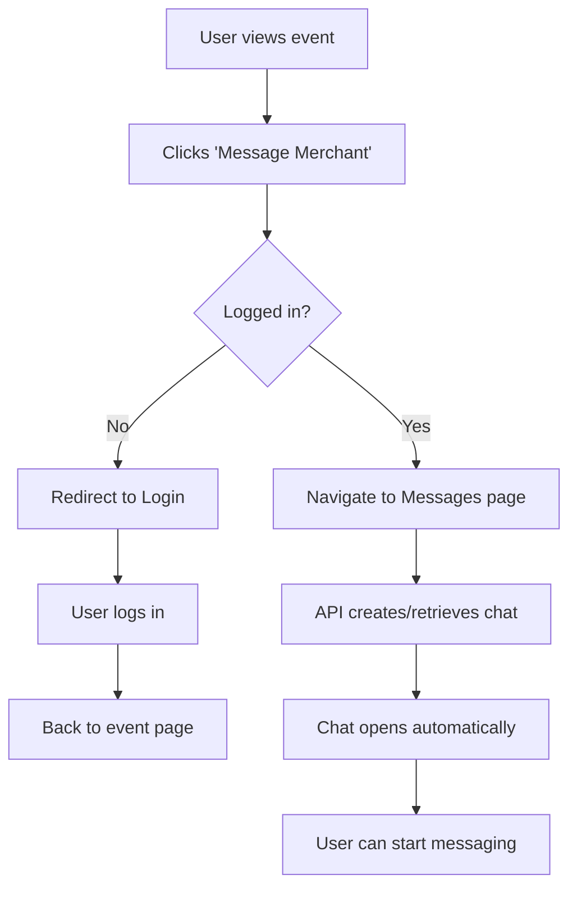

# Message Merchant Feature - Quick Start Guide

## 🎯 What's New?

Users can now directly message event merchants from the event details page!

## 📍 Where to Find It?

### Event Details Page
When viewing any event, you'll see a new button below "Book Now":

```
┌─────────────────────────────────┐
│   Event Details Modal           │
│                                 │
│  [Event Images]                 │
│                                 │
│  Price per person: ₹500         │
│                                 │
│  ┌─────────────────────────┐   │
│  │      Book Now           │   │
│  └─────────────────────────┘   │
│                                 │
│  ┌─────────────────────────┐   │
│  │  💬 Message Merchant    │   │ ← NEW!
│  └─────────────────────────┘   │
└─────────────────────────────────┘
```

## 🔄 User Flow

### For Users Who Want to Message a Merchant



### Step-by-Step Experience

1. **Browse Events**
   - User explores events on the platform
   - Finds an interesting event

2. **View Event Details**
   - Clicks on event to see full details
   - Sees organizer information

3. **Initiate Chat**
   - Clicks "💬 Message Merchant" button
   - System checks if user is logged in

4. **Authentication Check**
   - ✅ If logged in → Proceeds to chat
   - ❌ If not logged in → Redirects to login page

5. **Chat Opens**
   - Automatically creates new chat (if first time)
   - Or opens existing conversation
   - User can immediately start typing

6. **Real-time Conversation**
   - Merchant receives message instantly via Socket.IO
   - Merchant replies
   - User gets notification
   - Conversation continues in real-time

## 🎨 UI Components

### User Messages Dashboard

```
┌──────────────────────────────────────────────────────┐
│  Messages                                            │
├──────────────┬───────────────────────────────────────┤
│ Search...    │                                       │
│              │  Chat Header                          │
│ ┌──────────┐ │  [Merchant Profile Pic]               │
│ │ 👤 John  │ │  John Doe                             │
│ │ Hi! Is   │ │  john@example.com                     │
│ │ the...   │ │                                       │
│ └──────────┘ │ ──────────────────────────────────── │
│              │                                       │
│ ┌──────────┐ │  [Message History]                    │
│ │ 👤 Sarah │ │  You: Hi! Is this event still         │
│ │ Yes, we  │ │        available?                     │
│ └──────────┘ │                                       │
│              │  Merchant: Yes! We have seats         │
│ ┌──────────┐ │            left. Book now!            │
│ │ 👤 Mike  │ │                                       │
│ │ Great    │ │ ┌──────────────────────────────┐     │
│ │ event!   │ │ │ Type a message...     [Send] │     │
│ └──────────┘ │ └──────────────────────────────┘     │
│              │                                       │
└──────────────┴───────────────────────────────────────┘
```

### Features

#### Left Panel - Chat List
- 🔍 **Search**: Filter chats by merchant name
- 📋 **Chat Items**: Shows all merchants you've chatted with
- 🔔 **Unread Badge**: Red dot shows unread message count
- 📱 **Responsive**: Collapses on mobile when chat is open

#### Right Panel - Conversation
- 💬 **Message Bubbles**: Different colors for sent/received
- ⏰ **Timestamps**: Shows when each message was sent
- 📝 **Input Box**: Type your message here
- 🚀 **Send Button**: Click to send or press Enter
- 📜 **Auto-scroll**: Automatically scrolls to latest message

## 🔧 Technical Implementation

### Backend API

```javascript
// Create or retrieve chat
POST /api/v1/message/find-or-create
Body: { merchantId: "123" }
Response: { chatId: "user_merchant", exists: false }

// Send message
POST /api/v1/message/send
Body: { receiverId: "123", content: "Hello" }
Response: { message: {...}, chatId: "..." }

// Get all chats
GET /api/v1/message/chats
Response: { chats: [...], count: 5 }

// Get messages
GET /api/v1/message/messages/:chatId
Response: { messages: [...], count: 10 }
```

### Frontend Routes

```javascript
// User messages page
/dashboard/user/messages

// With query params for starting new chat
/dashboard/user/messages?merchantId=123&merchantName=John
```

### Socket.IO Events

```javascript
// Join chat room
socket.emit('joinChat', chatId)

// Leave chat room
socket.emit('leaveChat', chatId)

// Receive new message
socket.on('newMessage', (message) => {
  // Update UI with new message
})

// Typing indicator
socket.emit('typing', { chatId, userId })
socket.on('userTyping', (data) => {
  // Show "typing..." indicator
})
```

## 📱 Mobile Responsive

The chat interface is fully responsive:

### Desktop View
- Split screen: Chat list (left) + Conversation (right)

### Mobile View
- Shows chat list first
- Tap chat → Full screen conversation
- Back arrow to return to chat list

## 🔒 Security

- ✅ Authentication required (JWT token)
- ✅ Users can only see their own chats
- ✅ Message content validation
- ✅ Rate limiting on API calls
- ✅ Soft delete (messages hidden, not deleted)

## 🎯 Use Cases

### When to Message a Merchant

1. **Event Details Inquiry**
   - Ask about event specifics
   - Clarify timing or location
   - Request special arrangements

2. **Group Booking Questions**
   - Inquire about group discounts
   - Ask about availability for large groups

3. **Special Requirements**
   - Accessibility needs
   - Dietary restrictions
   - Parking information

4. **Customization Requests**
   - Special occasions (birthdays, anniversaries)
   - Photography requests
   - VIP arrangements

## 🚀 Quick Test Steps

### Test as a User

1. Login as a user
2. Browse to any event
3. Click "Message Merchant"
4. You should be taken to Messages page
5. Chat should be created with the merchant
6. Send a test message
7. See it appear in the chat

### Test as a Merchant

1. Login as a merchant
2. Go to Dashboard → Messages
3. You should see the user's message
4. Click on the chat
5. Reply to the user
6. Both parties see messages in real-time

## 🐛 Troubleshooting

### Common Issues

**Issue**: Button doesn't appear
- **Solution**: Clear browser cache and refresh

**Issue**: "Merchant information not available"
- **Solution**: Check that event has valid createdBy data

**Issue**: Redirected but chat doesn't open
- **Solution**: Check browser console for errors, verify token is valid

**Issue**: Messages don't appear in real-time
- **Solution**: Check Socket.IO connection, verify backend is running

## 📊 Analytics & Monitoring

Track these metrics:
- Number of chats initiated per day
- Average response time by merchants
- User engagement with messaging feature
- Conversion rate from chat to booking

## 🎉 Success Criteria

✅ User can click "Message Merchant" from event page
✅ Login redirect works correctly
✅ Chat is automatically created
✅ Messages send successfully
✅ Real-time updates work via Socket.IO
✅ Chat history persists
✅ Mobile responsive design works
✅ Both user and merchant can see messages

## 📝 Next Steps

After testing, consider adding:
- Email notifications for new messages
- Push notifications
- File/image sharing in chat
- Voice messages
- Message reactions (emoji)
- Read receipts
- Online status indicators

---

**Status**: ✅ IMPLEMENTATION COMPLETE
**Version**: 1.0
**Last Updated**: March 26, 2026
